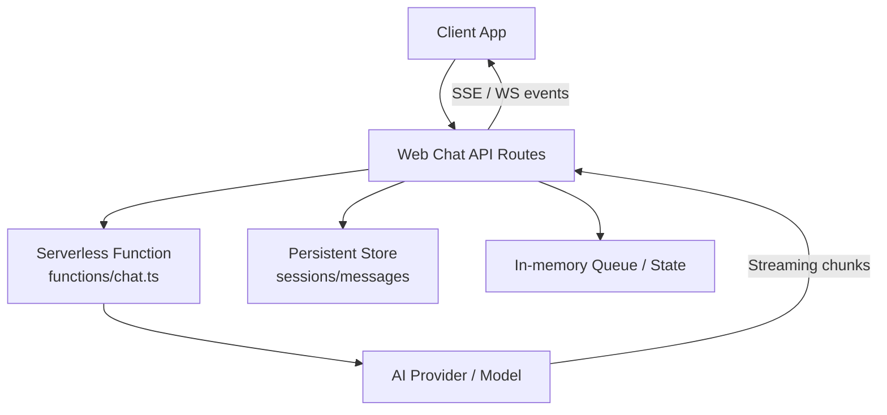
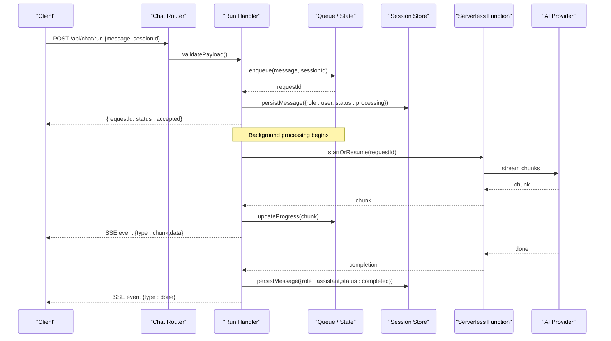
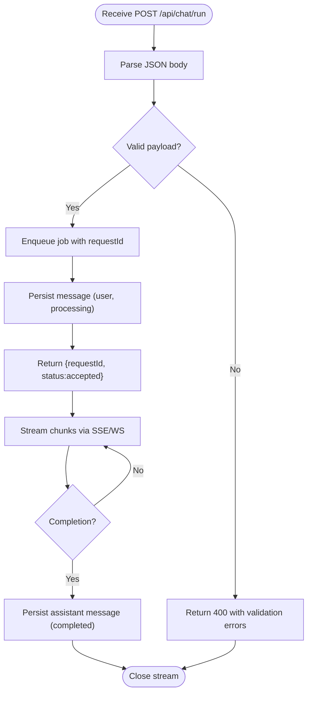
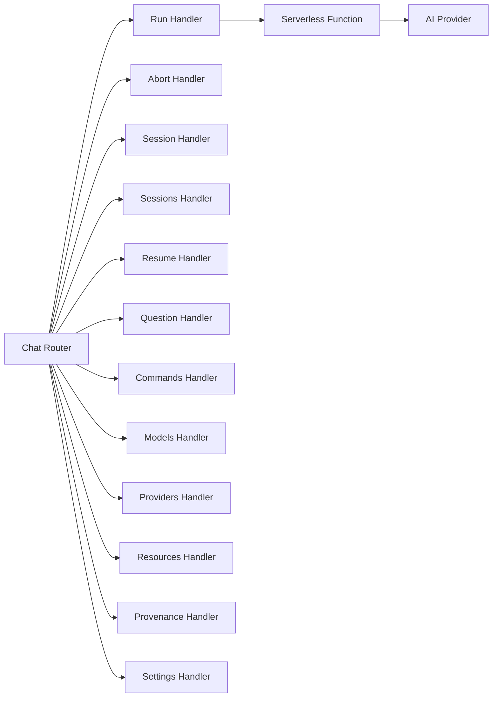

# Message Processing & Streaming

<cite>
**Referenced Files in This Document**
- [chat.ts](file://functions/chat.ts)
- [run.ts](file://apps/web/src/routes/api/chat/run.ts)
- [abort.ts](file://apps/web/src/routes/api/chat/abort.ts)
- [session.ts](file://apps/web/src/routes/api/chat/session.ts)
- [sessions.ts](file://apps/web/src/routes/api/chat/sessions.ts)
- [resume.ts](file://apps/web/src/routes/api/chat/resume.ts)
- [question.ts](file://apps/web/src/routes/api/chat/question.ts)
- [commands.ts](file://apps/web/src/routes/api/chat/commands.ts)
- [models.ts](file://apps/web/src/routes/api/chat/models.ts)
- [providers.ts](file://apps/web/src/routes/api/chat/providers.ts)
- [resources.ts](file://apps/web/src/routes/api/chat/resources.ts)
- [provenance.ts](file://apps/web/src/routes/api/chat/provenance.ts)
- [settings.ts](file://apps/web/src/routes/api/chat/settings.ts)
- [chat.ts](file://apps/web/src/routes/api/chat.ts)
- [index.md](file://docs/wiki/apps/web/chat-api.md)
- [pi-integration.md](file://docs/wiki/apps/web/pi-integration.md)
- [architecture.md](file://docs/architecture.md)
</cite>

## Table of Contents

1. Introduction
2. Project Structure
3. Core Components
4. Architecture Overview
5. Detailed Component Analysis
6. Dependency Analysis
7. Performance Considerations
8. Troubleshooting Guide
9. Conclusion

## Introduction

This document explains Fleet Pi’s message processing system with a focus on how chat messages are parsed, validated, and processed through the AI pipeline. It covers streaming response handling, real-time updates, message state management, queuing, error recovery, and progress tracking. The goal is to make the end-to-end flow accessible to both technical and non-technical readers while providing concrete references to source files for deeper investigation.

## Project Structure

Fleet Pi organizes chat-related functionality across:

- A serverless function entry point for chat requests
- Web API routes that handle session lifecycle, message submission, streaming responses, and auxiliary operations (models, providers, settings, resources, provenance)
- Documentation describing the chat API and PI integration

[No sources needed since this diagram shows conceptual workflow, not actual code structure]

## Core Components

- Chat API Router: Central route aggregation for chat endpoints.
- Run Endpoint: Accepts new messages, validates input, enqueues processing, and returns an initial response handle or stream.
- Abort Endpoint: Cancels ongoing processing for a given request or session.
- Session Management: Creates, resumes, and persists sessions; tracks message history and state.
- Models and Providers: Enumerates available models and provider configurations used by the AI pipeline.
- Resources and Provenance: Tracks artifacts and lineage for generated content.
- Settings: Manages runtime configuration affecting message processing behavior.
- Serverless Function: Orchestrates long-running or external calls and bridges to the web API.

Key responsibilities:

- Parsing and validating incoming messages and payloads
- Enqueuing work items for background processing
- Streaming incremental results back to clients
- Managing message states (pending, processing, completed, failed)
- Handling errors and retries with progress updates

**Section sources**

- [chat.ts](file://apps/web/src/routes/api/chat.ts)
- [run.ts](file://apps/web/src/routes/api/chat/run.ts)
- [abort.ts](file://apps/web/src/routes/api/chat/abort.ts)
- [session.ts](file://apps/web/src/routes/api/chat/session.ts)
- [sessions.ts](file://apps/web/src/routes/api/chat/sessions.ts)
- [resume.ts](file://apps/web/src/routes/api/chat/resume.ts)
- [question.ts](file://apps/web/src/routes/api/chat/question.ts)
- [commands.ts](file://apps/web/src/routes/api/chat/commands.ts)
- [models.ts](file://apps/web/src/routes/api/chat/models.ts)
- [providers.ts](file://apps/web/src/routes/api/chat/providers.ts)
- [resources.ts](file://apps/web/src/routes/api/chat/resources.ts)
- [provenance.ts](file://apps/web/src/routes/api/chat/provenance.ts)
- [settings.ts](file://apps/web/src/routes/api/chat/settings.ts)
- [chat.ts](file://functions/chat.ts)

## Architecture Overview

The message processing architecture follows a request-driven pattern with optional background execution and streaming:

**Diagram sources**

- [chat.ts](file://apps/web/src/routes/api/chat.ts)
- [run.ts](file://apps/web/src/routes/api/chat/run.ts)
- [abort.ts](file://apps/web/src/routes/api/chat/abort.ts)
- [session.ts](file://apps/web/src/routes/api/chat/session.ts)
- [sessions.ts](file://apps/web/src/routes/api/chat/sessions.ts)
- [resume.ts](file://apps/web/src/routes/api/chat/resume.ts)
- [question.ts](file://apps/web/src/routes/api/chat/question.ts)
- [commands.ts](file://apps/web/src/routes/api/chat/commands.ts)
- [models.ts](file://apps/web/src/routes/api/chat/models.ts)
- [providers.ts](file://apps/web/src/routes/api/chat/providers.ts)
- [resources.ts](file://apps/web/src/routes/api/chat/resources.ts)
- [provenance.ts](file://apps/web/src/routes/api/chat/provenance.ts)
- [settings.ts](file://apps/web/src/routes/api/chat/settings.ts)
- [chat.ts](file://functions/chat.ts)

## Detailed Component Analysis

### Chat Router and Entry Points

Responsibilities:

- Aggregates chat endpoints under a common prefix
- Provides middleware for authentication, rate limiting, and logging
- Delegates to specific handlers for run, abort, session, and metadata operations

Implementation highlights:

- Route registration and path mapping
- Shared validation and error formatting
- Consistent response envelope for streaming and non-streaming endpoints

**Section sources**

- [chat.ts](file://apps/web/src/routes/api/chat.ts)

### Run Endpoint: Message Submission and Streaming

Responsibilities:

- Parses and validates incoming message payloads
- Assigns a unique request ID and enqueues processing
- Persists initial message state and returns accepted status
- Streams incremental chunks and completion events to the client

Processing logic:

- Input validation schema enforcement
- Request deduplication and idempotency checks
- Queue dispatch with priority and retry policies
- Progress tracking via SSE or WebSocket events
- Error propagation with structured error objects

**Diagram sources**

- [run.ts](file://apps/web/src/routes/api/chat/run.ts)

**Section sources**

- [run.ts](file://apps/web/src/routes/api/chat/run.ts)

### Abort Endpoint: Cancellation Flow

Responsibilities:

- Cancels active processing for a given request or session
- Updates message state to aborted
- Ensures cleanup of resources and queue entries

Cancellation semantics:

- Idempotent abort calls
- Graceful shutdown of streaming connections
- Notification to clients about abortion

**Section sources**

- [abort.ts](file://apps/web/src/routes/api/chat/abort.ts)

### Session Management: Create, Resume, and Persistence

Responsibilities:

- Create new sessions with default settings
- Resume existing sessions with prior context
- Persist session metadata and message history
- Provide session retrieval and listing endpoints

State management:

- Session lifecycle states (active, paused, closed)
- Message ordering and versioning
- Snapshotting for efficient resume

**Section sources**

- [session.ts](file://apps/web/src/routes/api/chat/session.ts)
- [sessions.ts](file://apps/web/src/routes/api/chat/sessions.ts)
- [resume.ts](file://apps/web/src/routes/api/chat/resume.ts)

### Question and Commands: Specialized Message Types

Responsibilities:

- Handle specialized message types such as questions and commands
- Apply type-specific parsing and validation
- Route to appropriate processors or tools

Examples:

- Question messages may include multiple-choice options or structured prompts
- Command messages trigger tool invocations or workflow steps

**Section sources**

- [question.ts](file://apps/web/src/routes/api/chat/question.ts)
- [commands.ts](file://apps/web/src/routes/api/chat/commands.ts)

### Models and Providers: AI Pipeline Configuration

Responsibilities:

- Discover and list available models
- Configure provider-specific parameters
- Select optimal model based on user preferences and constraints

Configuration aspects:

- Model capabilities and limits
- Provider credentials and endpoints
- Fallback strategies and routing rules

**Section sources**

- [models.ts](file://apps/web/src/routes/api/chat/models.ts)
- [providers.ts](file://apps/web/src/routes/api/chat/providers.ts)

### Resources and Provenance: Artifact Tracking

Responsibilities:

- Track generated artifacts and their relationships
- Maintain provenance metadata for auditability
- Link messages to resources and external outputs

Tracking features:

- Resource IDs and URIs
- Versioning and change history
- Access controls and visibility

**Section sources**

- [resources.ts](file://apps/web/src/routes/api/chat/resources.ts)
- [provenance.ts](file://apps/web/src/routes/api/chat/provenance.ts)

### Settings: Runtime Configuration

Responsibilities:

- Manage global and per-session settings
- Influence message processing behavior (e.g., temperature, max tokens)
- Persist user preferences and defaults

Settings scope:

- Application-level defaults
- Session overrides
- Feature flags and toggles

**Section sources**

- [settings.ts](file://apps/web/src/routes/api/chat/settings.ts)

### Serverless Function: Orchestration Bridge

Responsibilities:

- Coordinate long-running tasks and external calls
- Bridge between web API and AI providers
- Manage concurrency and resource allocation

Integration points:

- Event-driven triggers
- Retry and timeout policies
- Logging and observability hooks

**Section sources**

- [chat.ts](file://functions/chat.ts)

## Dependency Analysis

The chat subsystem exhibits clear separation of concerns:

- Router delegates to specialized handlers
- Handlers depend on session storage, queue/state, and AI providers
- Serverless function acts as an orchestrator for external interactions

**Diagram sources**

- [chat.ts](file://apps/web/src/routes/api/chat.ts)
- [run.ts](file://apps/web/src/routes/api/chat/run.ts)
- [abort.ts](file://apps/web/src/routes/api/chat/abort.ts)
- [session.ts](file://apps/web/src/routes/api/chat/session.ts)
- [sessions.ts](file://apps/web/src/routes/api/chat/sessions.ts)
- [resume.ts](file://apps/web/src/routes/api/chat/resume.ts)
- [question.ts](file://apps/web/src/routes/api/chat/question.ts)
- [commands.ts](file://apps/web/src/routes/api/chat/commands.ts)
- [models.ts](file://apps/web/src/routes/api/chat/models.ts)
- [providers.ts](file://apps/web/src/routes/api/chat/providers.ts)
- [resources.ts](file://apps/web/src/routes/api/chat/resources.ts)
- [provenance.ts](file://apps/web/src/routes/api/chat/provenance.ts)
- [settings.ts](file://apps/web/src/routes/api/chat/settings.ts)
- [chat.ts](file://functions/chat.ts)

**Section sources**

- [chat.ts](file://apps/web/src/routes/api/chat.ts)

## Performance Considerations

- Streaming efficiency: Minimize payload size and batch chunks where appropriate
- Concurrency control: Limit parallel jobs per session and globally
- Backpressure: Implement queue depth limits and adaptive throttling
- Caching: Cache model metadata and provider configurations
- Database optimization: Use efficient indexes for session and message queries
- Observability: Add metrics for latency, throughput, and error rates

[No sources needed since this section provides general guidance]

## Troubleshooting Guide

Common issues and resolutions:

- Validation failures: Check payload schema and required fields
- Queue saturation: Monitor queue depth and scale workers
- Streaming interruptions: Implement reconnection logic and partial state recovery
- Provider errors: Use fallback models and retry with exponential backoff
- Session inconsistencies: Verify persistence transactions and snapshot integrity

Error handling patterns:

- Structured error responses with codes and messages
- Graceful degradation when dependencies fail
- Audit logs for debugging and compliance

**Section sources**

- [run.ts](file://apps/web/src/routes/api/chat/run.ts)
- [abort.ts](file://apps/web/src/routes/api/chat/abort.ts)
- [session.ts](file://apps/web/src/routes/api/chat/session.ts)

## Conclusion

Fleet Pi’s message processing system combines robust validation, efficient queuing, and responsive streaming to deliver a seamless AI-powered chat experience. By separating concerns across routers, handlers, and orchestration layers, the system remains maintainable and scalable. Proper error handling, progress tracking, and resource management ensure reliability under varying loads and conditions.

[No sources needed since this section summarizes without analyzing specific files]

## Appendices

### API Reference Summary

- Chat API documentation outlines endpoints, request/response formats, and streaming protocols
- PI integration details describe how the system interacts with external AI services

**Section sources**

- [index.md](file://docs/wiki/apps/web/chat-api.md)
- [pi-integration.md](file://docs/wiki/apps/web/pi-integration.md)
- [architecture.md](file://docs/architecture.md)
