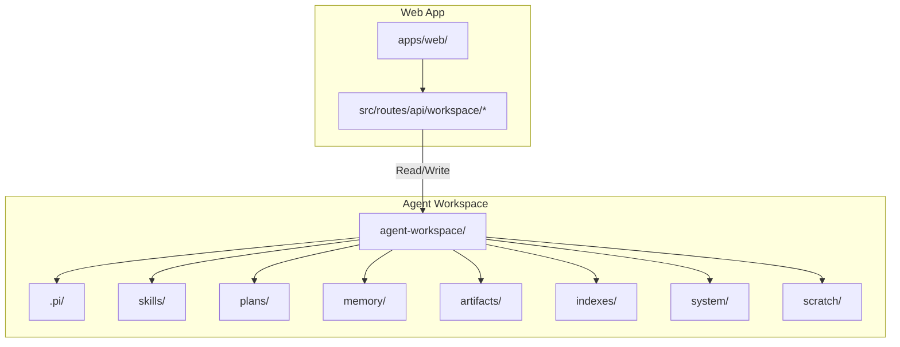
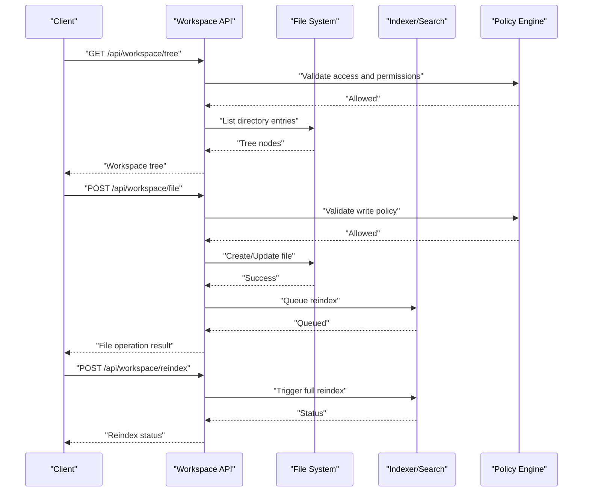
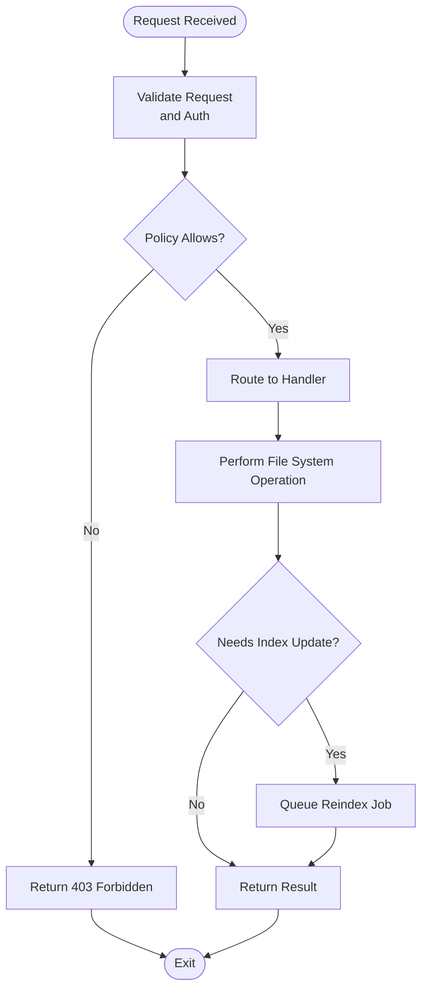
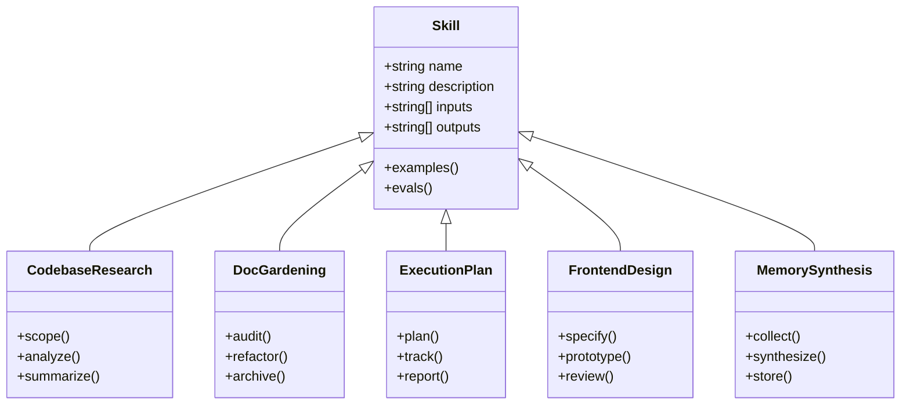
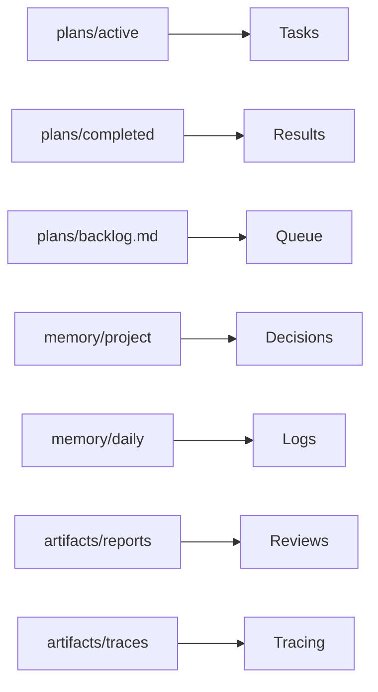
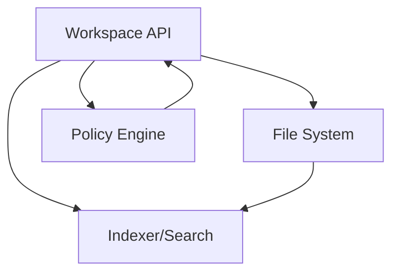
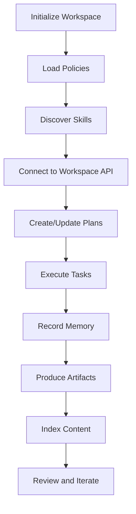

# Agent Workspace

<cite>
**Referenced Files in This Document**
- [agent-workspace/README.md](file://agent-workspace/README.md)
- [agent-workspace/AGENTS.md](file://agent-workspace/AGENTS.md)
- [agent-workspace/ARCHITECTURE.md](file://agent-workspace/ARCHITECTURE.md)
- [agent-workspace/manifest.json](file://agent-workspace/manifest.json)
- [agent-workspace/system/workspace-policy.md](file://agent-workspace/system/workspace-policy.md)
- [agent-workspace/system/tool-policy.md](file://agent-workspace/system/tool-policy.md)
- [agent-workspace/system/behavior.md](file://agent-workspace/system/behavior.md)
- [agent-workspace/skills/codebase-research/SKILL.md](file://agent-workspace/skills/codebase-research/SKILL.md)
- [agent-workspace/skills/doc-gardening/SKILL.md](file://agent-workspace/skills/doc-gardening/SKILL.md)
- [agent-workspace/skills/execution-plan/SKILL.md](file://agent-workspace/skills/execution-plan/SKILL.md)
- [agent-workspace/skills/frontend-design/SKILL.md](file://agent-workspace/skills/frontend-design/SKILL.md)
- [agent-workspace/skills/memory-synthesis/SKILL.md](file://agent-workspace/skills/memory-synthesis/SKILL.md)
- [agent-workspace/.pi/settings.json](file://agent-workspace/.pi/settings.json)
- [apps/web/src/routes/api/workspace/file.ts](file://apps/web/src/routes/api/workspace/file.ts)
- [apps/web/src/routes/api/workspace/item.ts](file://apps/web/src/routes/api/workspace/item.ts)
- [apps/web/src/routes/api/workspace/items.ts](file://apps/web/src/routes/api/workspace/items.ts)
- [apps/web/src/routes/api/workspace/tree.ts](file://apps/web/src/routes/api/workspace/tree.ts)
- [apps/web/src/routes/api/workspace/search.ts](file://apps/web/src/routes/api/workspace/search.ts)
- [apps/web/src/routes/api/workspace/reindex.ts](file://apps/web/src/routes/api/workspace/reindex.ts)
- [apps/web/src/routes/api/workspace/health.ts](file://apps/web/src/routes/api/workspace/health.ts)
- [docs/features/agent-workspace.md](file://docs/features/agent-workspace.md)
- [docs/adaptive-workspace.md](file://docs/adaptive-workspace.md)
- [docs/architecture.md](file://docs/architecture.md)
- [docs/wiki/features/agent-workspace.md](file://docs/wiki/features/agent-workspace.md)
</cite>

## Table of Contents

1. [Introduction](#introduction)
2. [Project Structure](#project-structure)
3. [Core Components](#core-components)
4. [Architecture Overview](#architecture-overview)
5. [Detailed Component Analysis](#detailed-component-analysis)
6. [Dependency Analysis](#dependency-analysis)
7. [Performance Considerations](#performance-considerations)
8. [Troubleshooting Guide](#troubleshooting-guide)
9. [Conclusion](#conclusion)
10. [Appendices](#appendices)

## Introduction

This document explains the Agent Workspace feature: how agents operate within isolated workspaces, manage files and directories, execute commands, and interact with external tools. It covers workspace architecture, file system integration, skill management, collaborative development capabilities, configuration options, templates, installation patterns, and customization strategies. It also includes examples of common operations, debugging techniques, and performance optimization guidance.

## Project Structure

The Agent Workspace is a dedicated directory that encapsulates an agent’s state, skills, plans, memory, artifacts, and policies. The repository provides both a reference workspace under agent-workspace and API endpoints to interact with it from the web application.

Key areas:

- agent-workspace: Canonical workspace for an agent instance, including skills, plans, memory, artifacts, indexes, and system policies.
- apps/web/src/routes/api/workspace: REST endpoints for file and item operations, tree traversal, search, reindexing, and health checks.
- docs and docs/wiki: Feature documentation and architectural context.

**Diagram sources**

- [agent-workspace/README.md](file://agent-workspace/README.md)
- [apps/web/src/routes/api/workspace/file.ts](file://apps/web/src/routes/api/workspace/file.ts)
- [apps/web/src/routes/api/workspace/item.ts](file://apps/web/src/routes/api/workspace/item.ts)
- [apps/web/src/routes/api/workspace/items.ts](file://apps/web/src/routes/api/workspace/items.ts)
- [apps/web/src/routes/api/workspace/tree.ts](file://apps/web/src/routes/api/workspace/tree.ts)
- [apps/web/src/routes/api/workspace/search.ts](file://apps/web/src/routes/api/workspace/search.ts)
- [apps/web/src/routes/api/workspace/reindex.ts](file://apps/web/src/routes/api/workspace/reindex.ts)
- [apps/web/src/routes/api/workspace/health.ts](file://apps/web/src/routes/api/workspace/health.ts)

**Section sources**

- [agent-workspace/README.md](file://agent-workspace/README.md)
- [docs/features/agent-workspace.md](file://docs/features/agent-workspace.md)
- [docs/wiki/features/agent-workspace.md](file://docs/wiki/features/agent-workspace.md)

## Core Components

- Workspace manifest and identity: manifest.json defines metadata and versioning for the workspace.
- System policies: behavior.md, tool-policy.md, workspace-policy.md define constraints and allowed actions for agents.
- Skills: SKILL.md files under skills/ describe reusable capabilities (e.g., codebase research, doc gardening).
- Plans: structured markdown under plans/ tracks active, completed, and abandoned tasks.
- Memory: project, daily, research, and summaries directories store contextual knowledge.
- Artifacts: datasets, diagrams, reports, traces for outputs and evaluations.
- Indexes: search index data for fast retrieval.
- .pi: local configuration and optional packages/prompts/skills.

These components together form a self-contained environment where agents can plan, learn, and produce artifacts while adhering to policy constraints.

**Section sources**

- [agent-workspace/manifest.json](file://agent-workspace/manifest.json)
- [agent-workspace/system/behavior.md](file://agent-workspace/system/behavior.md)
- [agent-workspace/system/tool-policy.md](file://agent-workspace/system/tool-policy.md)
- [agent-workspace/system/workspace-policy.md](file://agent-workspace/system/workspace-policy.md)
- [agent-workspace/skills/codebase-research/SKILL.md](file://agent-workspace/skills/codebase-research/SKILL.md)
- [agent-workspace/skills/doc-gardening/SKILL.md](file://agent-workspace/skills/doc-gardening/SKILL.md)
- [agent-workspace/skills/execution-plan/SKILL.md](file://agent-workspace/skills/execution-plan/SKILL.md)
- [agent-workspace/skills/frontend-design/SKILL.md](file://agent-workspace/skills/frontend-design/SKILL.md)
- [agent-workspace/skills/memory-synthesis/SKILL.md](file://agent-workspace/skills/memory-synthesis/SKILL.md)
- [agent-workspace/.pi/settings.json](file://agent-workspace/.pi/settings.json)

## Architecture Overview

The Agent Workspace integrates with the web app via a set of REST endpoints. Agents read/write workspace content through these endpoints, which enforce policies and coordinate indexing and search.

**Diagram sources**

- [apps/web/src/routes/api/workspace/tree.ts](file://apps/web/src/routes/api/workspace/tree.ts)
- [apps/web/src/routes/api/workspace/file.ts](file://apps/web/src/routes/api/workspace/file.ts)
- [apps/web/src/routes/api/workspace/reindex.ts](file://apps/web/src/routes/api/workspace/reindex.ts)
- [agent-workspace/system/workspace-policy.md](file://agent-workspace/system/workspace-policy.md)

## Detailed Component Analysis

### Workspace File System Integration

Agents interact with the workspace via the following endpoints:

- Tree listing: GET /api/workspace/tree
- File CRUD: POST/PUT/DELETE /api/workspace/file
- Item operations: POST/PUT/DELETE /api/workspace/item
- Bulk items: POST /api/workspace/items
- Search: GET /api/workspace/search
- Reindex: POST /api/workspace/reindex
- Health: GET /api/workspace/health

These endpoints implement validation against workspace policies, perform file system operations, and trigger indexing updates.

**Diagram sources**

- [apps/web/src/routes/api/workspace/file.ts](file://apps/web/src/routes/api/workspace/file.ts)
- [apps/web/src/routes/api/workspace/item.ts](file://apps/web/src/routes/api/workspace/item.ts)
- [apps/web/src/routes/api/workspace/items.ts](file://apps/web/src/routes/api/workspace/items.ts)
- [apps/web/src/routes/api/workspace/tree.ts](file://apps/web/src/routes/api/workspace/tree.ts)
- [apps/web/src/routes/api/workspace/search.ts](file://apps/web/src/routes/api/workspace/search.ts)
- [apps/web/src/routes/api/workspace/reindex.ts](file://apps/web/src/routes/api/workspace/reindex.ts)
- [agent-workspace/system/workspace-policy.md](file://agent-workspace/system/workspace-policy.md)

**Section sources**

- [apps/web/src/routes/api/workspace/file.ts](file://apps/web/src/routes/api/workspace/file.ts)
- [apps/web/src/routes/api/workspace/item.ts](file://apps/web/src/routes/api/workspace/item.ts)
- [apps/web/src/routes/api/workspace/items.ts](file://apps/web/src/routes/api/workspace/items.ts)
- [apps/web/src/routes/api/workspace/tree.ts](file://apps/web/src/routes/api/workspace/tree.ts)
- [apps/web/src/routes/api/workspace/search.ts](file://apps/web/src/routes/api/workspace/search.ts)
- [apps/web/src/routes/api/workspace/reindex.ts](file://apps/web/src/routes/api/workspace/reindex.ts)
- [apps/web/src/routes/api/workspace/health.ts](file://apps/web/src/routes/api/workspace/health.ts)

### Skill Management

Skills are modular capabilities defined by SKILL.md files under agent-workspace/skills. Each skill typically includes:

- Purpose and scope
- Inputs and outputs
- Usage examples
- Evaluation criteria (optional)

Common skills include codebase research, doc gardening, execution planning, frontend design, and memory synthesis.

**Diagram sources**

- [agent-workspace/skills/codebase-research/SKILL.md](file://agent-workspace/skills/codebase-research/SKILL.md)
- [agent-workspace/skills/doc-gardening/SKILL.md](file://agent-workspace/skills/doc-gardening/SKILL.md)
- [agent-workspace/skills/execution-plan/SKILL.md](file://agent-workspace/skills/execution-plan/SKILL.md)
- [agent-workspace/skills/frontend-design/SKILL.md](file://agent-workspace/skills/frontend-design/SKILL.md)
- [agent-workspace/skills/memory-synthesis/SKILL.md](file://agent-workspace/skills/memory-synthesis/SKILL.md)

**Section sources**

- [agent-workspace/skills/codebase-research/SKILL.md](file://agent-workspace/skills/codebase-research/SKILL.md)
- [agent-workspace/skills/doc-gardening/SKILL.md](file://agent-workspace/skills/doc-gardening/SKILL.md)
- [agent-workspace/skills/execution-plan/SKILL.md](file://agent-workspace/skills/execution-plan/SKILL.md)
- [agent-workspace/skills/frontend-design/SKILL.md](file://agent-workspace/skills/frontend-design/SKILL.md)
- [agent-workspace/skills/memory-synthesis/SKILL.md](file://agent-workspace/skills/memory-synthesis/SKILL.md)

### Collaborative Development Capabilities

- Plans directory organizes active, completed, and abandoned tasks, enabling shared visibility and progress tracking.
- Memory directories capture decisions, known issues, preferences, and research notes for team alignment.
- Artifacts centralize datasets, diagrams, reports, and traces for reproducibility and review.
- Policies ensure consistent behavior across collaborators and environments.

**Diagram sources**

- [agent-workspace/plans/active](file://agent-workspace/plans/active)
- [agent-workspace/plans/completed](file://agent-workspace/plans/completed)
- [agent-workspace/plans/backlog.md](file://agent-workspace/plans/backlog.md)
- [agent-workspace/memory/project](file://agent-workspace/memory/project)
- [agent-workspace/memory/daily](file://agent-workspace/memory/daily)
- [agent-workspace/artifacts/reports](file://agent-workspace/artifacts/reports)
- [agent-workspace/artifacts/traces](file://agent-workspace/artifacts/traces)

**Section sources**

- [agent-workspace/plans](file://agent-workspace/plans)
- [agent-workspace/memory](file://agent-workspace/memory)
- [agent-workspace/artifacts](file://agent-workspace/artifacts)

### Configuration Options and Templates

- .pi/settings.json: Local workspace settings for agent behavior and integrations.
- manifest.json: Workspace metadata and versioning.
- AGENTS.md and ARCHITECTURE.md: High-level instructions and architectural context for agents operating in the workspace.

Templates and customization patterns:

- Create new skills by adding a folder under skills/ with a SKILL.md describing purpose, inputs, outputs, and examples.
- Extend memory by adding structured markdown files under memory/project or memory/daily.
- Customize policies by editing system/*.md files to constrain tool usage and workspace interactions.

**Section sources**

- [agent-workspace/.pi/settings.json](file://agent-workspace/.pi/settings.json)
- [agent-workspace/manifest.json](file://agent-workspace/manifest.json)
- [agent-workspace/AGENTS.md](file://agent-workspace/AGENTS.md)
- [agent-workspace/ARCHITECTURE.md](file://agent-workspace/ARCHITECTURE.md)

### Command Execution and External Tool Interaction

- tool-policy.md defines allowed tools and constraints for agents.
- behavior.md outlines general agent behavior and interaction patterns.
- Workspace policy enforces boundaries on file and directory operations.

Agents should:

- Check policy before invoking external tools.
- Log actions and outcomes in memory or artifacts for traceability.
- Use the workspace API endpoints for all file operations to maintain consistency and indexing.

**Section sources**

- [agent-workspace/system/tool-policy.md](file://agent-workspace/system/tool-policy.md)
- [agent-workspace/system/behavior.md](file://agent-workspace/system/behavior.md)
- [agent-workspace/system/workspace-policy.md](file://agent-workspace/system/workspace-policy.md)

## Dependency Analysis

The workspace feature depends on:

- Web API endpoints for safe and policy-compliant file operations.
- File system for persistent storage of workspace contents.
- Indexer/search for fast retrieval and discovery.
- Policy engine to enforce constraints on operations.

**Diagram sources**

- [apps/web/src/routes/api/workspace/file.ts](file://apps/web/src/routes/api/workspace/file.ts)
- [apps/web/src/routes/api/workspace/search.ts](file://apps/web/src/routes/api/workspace/search.ts)
- [apps/web/src/routes/api/workspace/reindex.ts](file://apps/web/src/routes/api/workspace/reindex.ts)
- [agent-workspace/system/workspace-policy.md](file://agent-workspace/system/workspace-policy.md)

**Section sources**

- [apps/web/src/routes/api/workspace/file.ts](file://apps/web/src/routes/api/workspace/file.ts)
- [apps/web/src/routes/api/workspace/search.ts](file://apps/web/src/routes/api/workspace/search.ts)
- [apps/web/src/routes/api/workspace/reindex.ts](file://apps/web/src/routes/api/workspace/reindex.ts)
- [agent-workspace/system/workspace-policy.md](file://agent-workspace/system/workspace-policy.md)

## Performance Considerations

- Prefer batch operations via /api/workspace/items when updating multiple files to reduce round-trips.
- Trigger reindex only when necessary; use targeted updates if supported by the indexer.
- Cache frequently accessed workspace trees at the client layer to minimize repeated requests.
- Keep memory and artifacts organized to avoid large directory scans during tree operations.
- Monitor health endpoint to detect bottlenecks or failures in workspace services.

[No sources needed since this section provides general guidance]

## Troubleshooting Guide

Common issues and resolutions:

- Permission denied: Verify workspace-policy.md and tool-policy.md constraints; ensure the agent has appropriate roles.
- Stale search results: Run POST /api/workspace/reindex to refresh the index after bulk changes.
- Slow tree responses: Reduce depth or filter paths; consider precomputing summaries in memory/project.
- Missing artifacts: Check artifacts directories and ensure proper naming conventions for discoverability.
- Health check failures: Inspect health endpoint responses and logs for underlying service errors.

Useful endpoints:

- GET /api/workspace/health: Service health status.
- POST /api/workspace/reindex: Trigger reindexing.
- GET /api/workspace/search: Validate search results post-update.

**Section sources**

- [apps/web/src/routes/api/workspace/health.ts](file://apps/web/src/routes/api/workspace/health.ts)
- [apps/web/src/routes/api/workspace/reindex.ts](file://apps/web/src/routes/api/workspace/reindex.ts)
- [apps/web/src/routes/api/workspace/search.ts](file://apps/web/src/routes/api/workspace/search.ts)
- [agent-workspace/system/workspace-policy.md](file://agent-workspace/system/workspace-policy.md)
- [agent-workspace/system/tool-policy.md](file://agent-workspace/system/tool-policy.md)

## Conclusion

The Agent Workspace provides a robust, policy-driven environment for agents to collaborate, plan, and produce artifacts. Through well-defined APIs, structured directories, and modular skills, agents can operate safely and efficiently. Adhering to policies, organizing content consistently, and leveraging indexing and search enables scalable and maintainable workflows.

[No sources needed since this section summarizes without analyzing specific files]

## Appendices

### Common Workspace Operations

- List workspace tree: GET /api/workspace/tree
- Create or update a file: POST/PUT /api/workspace/file
- Delete a file: DELETE /api/workspace/file
- Perform item operations: POST/PUT/DELETE /api/workspace/item
- Batch operations: POST /api/workspace/items
- Search workspace content: GET /api/workspace/search
- Reindex workspace: POST /api/workspace/reindex
- Check health: GET /api/workspace/health

**Section sources**

- [apps/web/src/routes/api/workspace/tree.ts](file://apps/web/src/routes/api/workspace/tree.ts)
- [apps/web/src/routes/api/workspace/file.ts](file://apps/web/src/routes/api/workspace/file.ts)
- [apps/web/src/routes/api/workspace/item.ts](file://apps/web/src/routes/api/workspace/item.ts)
- [apps/web/src/routes/api/workspace/items.ts](file://apps/web/src/routes/api/workspace/items.ts)
- [apps/web/src/routes/api/workspace/search.ts](file://apps/web/src/routes/api/workspace/search.ts)
- [apps/web/src/routes/api/workspace/reindex.ts](file://apps/web/src/routes/api/workspace/reindex.ts)
- [apps/web/src/routes/api/workspace/health.ts](file://apps/web/src/routes/api/workspace/health.ts)

### Conceptual Overview

[No sources needed since this diagram shows conceptual workflow, not actual code structure]
