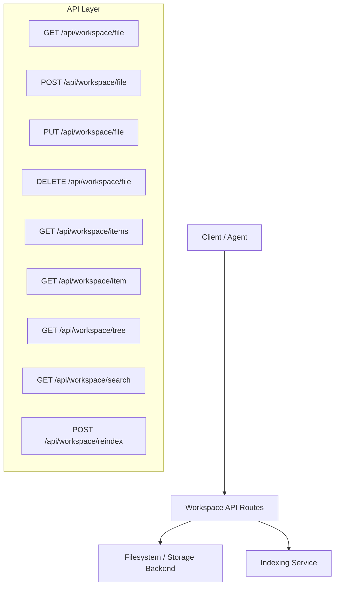
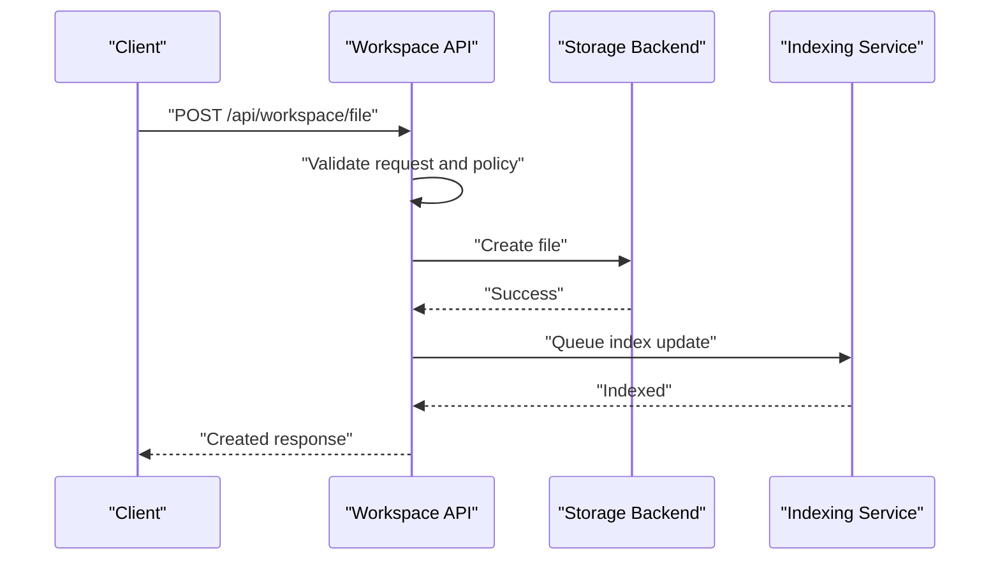
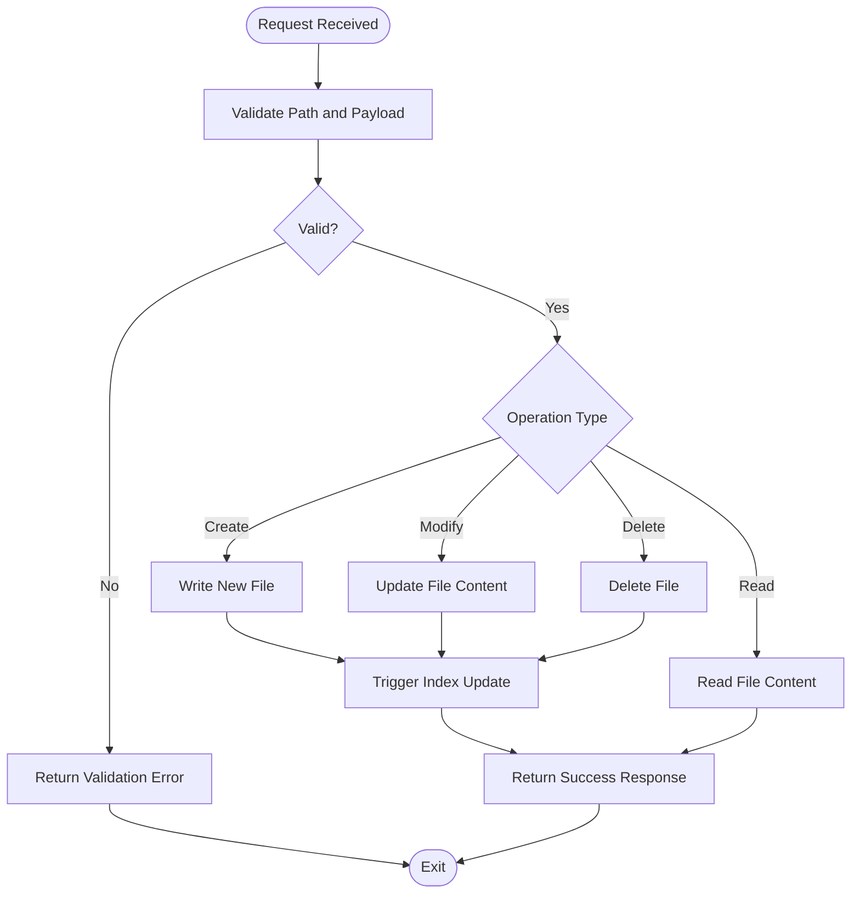
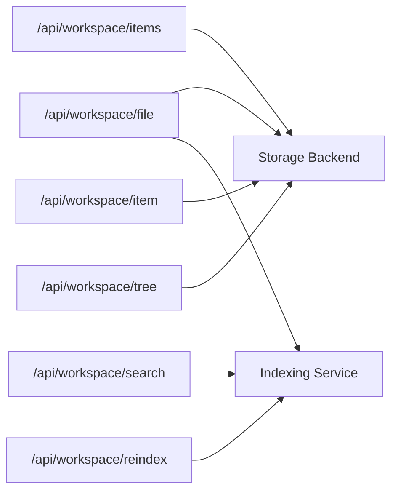

# File Management System

<cite>
**Referenced Files in This Document**
- [file.ts](file://apps/web/src/routes/api/workspace/file.ts)
- [items.ts](file://apps/web/src/routes/api/workspace/items.ts)
- [item.ts](file://apps/web/src/routes/api/workspace/item.ts)
- [tree.ts](file://apps/web/src/routes/api/workspace/tree.ts)
- [search.ts](file://apps/web/src/routes/api/workspace/search.ts)
- [reindex.ts](file://apps/web/src/routes/api/workspace/reindex.ts)
- [workspace-policy.md](file://agent-workspace/system/workspace-policy.md)
- [tool-policy.md](file://agent-workspace/system/tool-policy.md)
- [architecture.md](file://docs/overview/architecture.md)
- [agent-workspace.md](file://docs/agent-workspace.md)
</cite>

## Table of Contents

1. [Introduction](#introduction)
2. [Project Structure](#project-structure)
3. [Core Components](#core-components)
4. [Architecture Overview](#architecture-overview)
5. [Detailed Component Analysis](#detailed-component-analysis)
6. [Dependency Analysis](#dependency-analysis)
7. [Performance Considerations](#performance-considerations)
8. [Troubleshooting Guide](#troubleshooting-guide)
9. [Conclusion](#conclusion)
10. [Appendices](#appendices)

## Introduction

This document explains the file management system within agent workspaces, focusing on how files are created, read, modified, deleted, and synchronized. It covers directory conventions, permissions and access control, common operations, batch processing, watching capabilities, conflict resolution, versioning strategies, backup procedures, and guidance for large files, binary data, and special file types. It also documents the API endpoints exposed by the workspace module and their usage patterns.

## Project Structure

The workspace file management is implemented as a set of API routes under the web application’s workspace namespace. These endpoints provide CRUD-like operations, tree traversal, search, and reindexing utilities that agents and clients use to manage files inside an agent workspace.

**Diagram sources**

- [file.ts](file://apps/web/src/routes/api/workspace/file.ts)
- [items.ts](file://apps/web/src/routes/api/workspace/items.ts)
- [item.ts](file://apps/web/src/routes/api/workspace/item.ts)
- [tree.ts](file://apps/web/src/routes/api/workspace/tree.ts)
- [search.ts](file://apps/web/src/routes/api/workspace/search.ts)
- [reindex.ts](file://apps/web/src/routes/api/workspace/reindex.ts)

**Section sources**

- [file.ts](file://apps/web/src/routes/api/workspace/file.ts)
- [items.ts](file://apps/web/src/routes/api/workspace/items.ts)
- [item.ts](file://apps/web/src/routes/api/workspace/item.ts)
- [tree.ts](file://apps/web/src/routes/api/workspace/tree.ts)
- [search.ts](file://apps/web/src/routes/api/workspace/search.ts)
- [reindex.ts](file://apps/web/src/routes/api/workspace/reindex.ts)

## Core Components

- File endpoint: Provides create, read, update, and delete operations for individual files.
- Items endpoint: Lists items (files and directories) with filtering and pagination options.
- Item endpoint: Retrieves metadata or content for a specific item.
- Tree endpoint: Returns a hierarchical view of the workspace filesystem.
- Search endpoint: Searches across workspace contents using text-based queries.
- Reindex endpoint: Triggers indexing or refreshes search indexes for changed paths.

These components collectively enable full lifecycle management of files within agent workspaces.

**Section sources**

- [file.ts](file://apps/web/src/routes/api/workspace/file.ts)
- [items.ts](file://apps/web/src/routes/api/workspace/items.ts)
- [item.ts](file://apps/web/src/routes/api/workspace/item.ts)
- [tree.ts](file://apps/web/src/routes/api/workspace/tree.ts)
- [search.ts](file://apps/web/src/routes/api/workspace/search.ts)
- [reindex.ts](file://apps/web/src/routes/api/workspace/reindex.ts)

## Architecture Overview

The workspace file management follows a layered architecture:

- API layer exposes REST endpoints for file operations.
- Business logic validates inputs, enforces policies, and coordinates operations.
- Storage layer interacts with the underlying filesystem or storage backend.
- Indexing service maintains searchable indices for fast query responses.

**Diagram sources**

- [file.ts](file://apps/web/src/routes/api/workspace/file.ts)
- [reindex.ts](file://apps/web/src/routes/api/workspace/reindex.ts)

**Section sources**

- [architecture.md](file://docs/overview/architecture.md)
- [agent-workspace.md](file://docs/agent-workspace.md)

## Detailed Component Analysis

### File Endpoint (/api/workspace/file)

- Purpose: Create, read, modify, and delete files within the workspace.
- Typical operations:
  - Create: POST with payload containing path and content.
  - Read: GET with path parameter; supports optional format flags.
  - Modify: PUT/PATCH with path and updated content.
  - Delete: DELETE with path parameter.
- Behavior:
  - Validates path safety and permissions.
  - Enforces size limits and content type checks where applicable.
  - Updates indexes after write operations.
  - Returns standardized success/error responses.

**Diagram sources**

- [file.ts](file://apps/web/src/routes/api/workspace/file.ts)

**Section sources**

- [file.ts](file://apps/web/src/routes/api/workspace/file.ts)

### Items Endpoint (/api/workspace/items)

- Purpose: List files and directories with filters such as prefix, depth, and inclusion/exclusion patterns.
- Features:
  - Pagination support for large directories.
  - Sorting by name, size, or modification time.
  - Optional metadata fields like permissions and type.

**Section sources**

- [items.ts](file://apps/web/src/routes/api/workspace/items.ts)

### Item Endpoint (/api/workspace/item)

- Purpose: Retrieve detailed information about a single item (file or directory).
- Capabilities:
  - Fetch metadata (size, timestamps, permissions).
  - Optionally return content for text files with encoding hints.
  - Handle binary files safely with appropriate headers.

**Section sources**

- [item.ts](file://apps/web/src/routes/api/workspace/item.ts)

### Tree Endpoint (/api/workspace/tree)

- Purpose: Provide a hierarchical representation of the workspace structure.
- Use cases:
  - UI navigation trees.
  - Batch operations over subtrees.
  - Snapshotting workspace state.

**Section sources**

- [tree.ts](file://apps/web/src/routes/api/workspace/tree.ts)

### Search Endpoint (/api/workspace/search)

- Purpose: Perform text-based searches across workspace contents.
- Features:
  - Query parsing and tokenization.
  - Result ranking and highlighting.
  - Filters by path patterns and file types.

**Section sources**

- [search.ts](file://apps/web/src/routes/api/workspace/search.ts)

### Reindex Endpoint (/api/workspace/reindex)

- Purpose: Trigger or refresh indexing for specified paths or entire workspace.
- Behavior:
  - Queues background jobs for large updates.
  - Supports incremental reindexing.
  - Reports progress and completion status.

**Section sources**

- [reindex.ts](file://apps/web/src/routes/api/workspace/reindex.ts)

## Dependency Analysis

The workspace API endpoints depend on:

- Storage backend for file I/O.
- Indexing service for search functionality.
- Policy enforcement modules for access control and validation.

**Diagram sources**

- [file.ts](file://apps/web/src/routes/api/workspace/file.ts)
- [items.ts](file://apps/web/src/routes/api/workspace/items.ts)
- [item.ts](file://apps/web/src/routes/api/workspace/item.ts)
- [tree.ts](file://apps/web/src/routes/api/workspace/tree.ts)
- [search.ts](file://apps/web/src/routes/api/workspace/search.ts)
- [reindex.ts](file://apps/web/src/routes/api/workspace/reindex.ts)

**Section sources**

- [file.ts](file://apps/web/src/routes/api/workspace/file.ts)
- [items.ts](file://apps/web/src/routes/api/workspace/items.ts)
- [item.ts](file://apps/web/src/routes/api/workspace/item.ts)
- [tree.ts](file://apps/web/src/routes/api/workspace/tree.ts)
- [search.ts](file://apps/web/src/routes/api/workspace/search.ts)
- [reindex.ts](file://apps/web/src/routes/api/workspace/reindex.ts)

## Performance Considerations

- Large files: Stream uploads/downloads to avoid memory pressure.
- Binary data: Use appropriate content types and chunked transfers.
- Directory listings: Implement pagination and depth limits.
- Search performance: Maintain up-to-date indexes and use efficient query patterns.
- Concurrency: Handle concurrent writes with locking or versioning to prevent conflicts.

[No sources needed since this section provides general guidance]

## Troubleshooting Guide

Common issues and resolutions:

- Permission errors: Verify user roles and workspace policies.
- Index inconsistencies: Run reindex operation to rebuild search indexes.
- Slow responses: Check for large payloads or deep directory traversals.
- Conflict errors: Implement retry logic with backoff for concurrent modifications.

**Section sources**

- [workspace-policy.md](file://agent-workspace/system/workspace-policy.md)
- [tool-policy.md](file://agent-workspace/system/tool-policy.md)

## Conclusion

The workspace file management system provides a comprehensive set of APIs for managing files within agent workspaces. By following the documented patterns and best practices, developers can implement robust file operations, handle edge cases effectively, and maintain high performance even with large datasets.

[No sources needed since this section summarizes without analyzing specific files]

## Appendices

### Directory Structure Conventions

- Organize files by feature or domain within the workspace.
- Use consistent naming conventions for files and directories.
- Separate configuration, code, assets, and documentation into logical folders.

### File Permissions and Access Control

- Enforce role-based access control at the API level.
- Validate file paths to prevent unauthorized access.
- Log all file operations for audit purposes.

### Conflict Resolution and Versioning

- Implement optimistic locking with version numbers.
- Provide merge strategies for concurrent edits.
- Maintain change history for critical files.

### Backup Procedures

- Schedule regular backups of workspace contents.
- Store backups in secure, offsite locations.
- Test restoration procedures periodically.

### Handling Special File Types

- Text files: Support various encodings and line endings.
- Binary files: Use base64 encoding for API responses when necessary.
- Configuration files: Validate schema before saving.

### API Usage Patterns

- Use idempotent operations where possible.
- Implement proper error handling and retries.
- Monitor API usage and performance metrics.

[No sources needed since this section provides general guidance]
