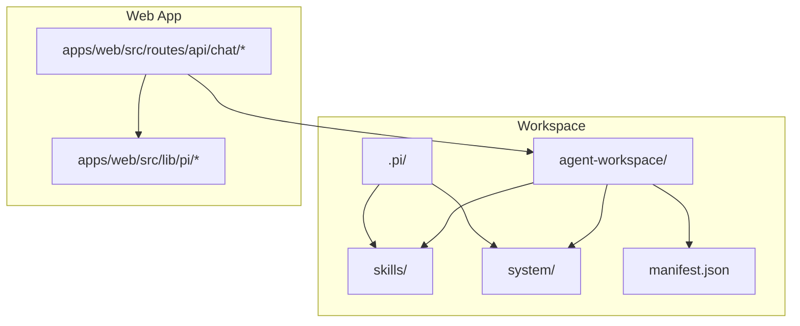
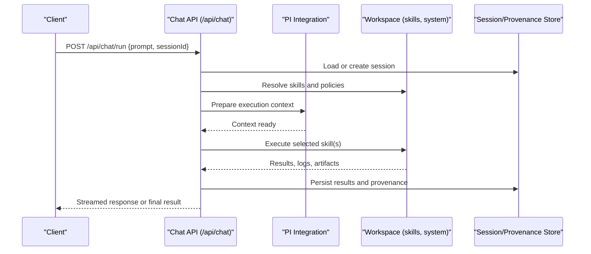
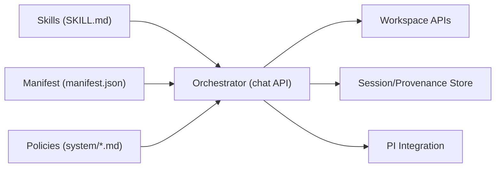

# Skill Management & Execution

<cite>
**Referenced Files in This Document**
- [README.md](file://README.md)
- [AGENTS.md](file://AGENTS.md)
- [WORKSPACE.md](file://WORKSPACE.md)
- [.pi/settings.json](file://.pi/settings.json)
- [agent-workspace/manifest.json](file://agent-workspace/manifest.json)
- [agent-workspace/skills/codebase-research/SKILL.md](file://agent-workspace/skills/codebase-research/SKILL.md)
- [agent-workspace/skills/doc-gardening/SKILL.md](file://agent-workspace/skills/doc-gardening/SKILL.md)
- [agent-workspace/skills/execution-plan/SKILL.md](file://agent-workspace/skills/execution-plan/SKILL.md)
- [agent-workspace/skills/frontend-design/SKILL.md](file://agent-workspace/skills/frontend-design/SKILL.md)
- [agent-workspace/skills/memory-synthesis/SKILL.md](file://agent-workspace/skills/memory-synthesis/SKILL.md)
- [agent-workspace/.pi/skills/index.md](file://agent-workspace/.pi/skills/index.md)
- [agent-workspace/.pi/packages/index.md](file://agent-workspace/.pi/packages/index.md)
- [agent-workspace/.pi/prompts/index.md](file://agent-workspace/.pi/prompts/index.md)
- [agent-workspace/system/behavior.md](file://agent-workspace/system/behavior.md)
- [agent-workspace/system/constraints.md](file://agent-workspace/system/constraints.md)
- [agent-workspace/system/tool-policy.md](file://agent-workspace/system/tool-policy.md)
- [agent-workspace/system/workspace-policy.md](file://agent-workspace/system/workspace-policy.md)
- [apps/web/src/lib/pi/index.ts](file://apps/web/src/lib/pi/index.ts)
- [apps/web/src/routes/api/chat/run.ts](file://apps/web/src/routes/api/chat/run.ts)
- [apps/web/src/routes/api/chat/commands.ts](file://apps/web/src/routes/api/chat/commands.ts)
- [apps/web/src/routes/api/chat/session.ts](file://apps/web/src/routes/api/chat/session.ts)
- [apps/web/src/routes/api/chat/resume.ts](file://apps/web/src/routes/api/chat/resume.ts)
- [apps/web/src/routes/api/chat/abort.ts](file://apps/web/src/routes/api/chat/abort.ts)
- [apps/web/src/routes/api/chat/models.ts](file://apps/web/src/routes/api/chat/models.ts)
- [apps/web/src/routes/api/chat/providers.ts](file://apps/web/src/routes/api/chat/providers.ts)
- [apps/web/src/routes/api/chat/resources.ts](file://apps/web/src/routes/api/chat/resources.ts)
- [apps/web/src/routes/api/chat/question.ts](file://apps/web/src/routes/api/chat/question.ts)
- [apps/web/src/routes/api/chat/provenance.ts](file://apps/web/src/routes/api/chat/provenance.ts)
- [apps/web/src/routes/api/chat/new.ts](file://apps/web/src/routes/api/chat/new.ts)
- [apps/web/src/routes/api/chat/sessions.ts](file://apps/web/src/routes/api/chat/sessions.ts)
- [apps/web/src/routes/api/chat/settings.ts](file://apps/web/src/routes/api/chat/settings.ts)
- [apps/web/src/routes/api/workspace/file.ts](file://apps/web/src/routes/api/workspace/file.ts)
- [apps/web/src/routes/api/workspace/items.ts](file://apps/web/src/routes/api/workspace/items.ts)
- [apps/web/src/routes/api/workspace/tree.ts](file://apps/web/src/routes/api/workspace/tree.ts)
- [apps/web/src/routes/api/workspace/search.ts](file://apps/web/src/routes/api/workspace/search.ts)
- [apps/web/src/routes/api/workspace/reindex.ts](file://apps/web/src/routes/api/workspace/reindex.ts)
- [apps/web/src/routes/api/workspace/health.ts](file://apps/web/src/routes/api/workspace/health.ts)
- [apps/web/src/routes/api/workspace/item.ts](file://apps/web/src/routes/api/workspace/item.ts)
</cite>

## Table of Contents

1. [Introduction](#introduction)
2. [Project Structure](#project-structure)
3. [Core Components](#core-components)
4. [Architecture Overview](#architecture-overview)
5. [Detailed Component Analysis](#detailed-component-analysis)
6. [Dependency Analysis](#dependency-analysis)
7. [Performance Considerations](#performance-considerations)
8. [Troubleshooting Guide](#troubleshooting-guide)
9. [Conclusion](#conclusion)
10. [Appendices](#appendices)

## Introduction

This document explains the skill management and execution system as implemented across the repository’s agent workspaces and web application. It covers how skills are defined, installed, configured, composed, and executed within isolated workspaces. It also documents metadata conventions, execution context, communication protocols between the UI and backend, security and sandboxing considerations, and performance optimization techniques. The goal is to make it easy for contributors to create, manage, and troubleshoot skills effectively.

## Project Structure

Skills are primarily defined as Markdown-based artifacts under workspace-specific directories and are orchestrated by the web application’s chat API routes. The root-level configuration and workspace manifests provide global and per-workspace settings that influence skill discovery and behavior.

**Diagram sources**

- [agent-workspace/manifest.json](file://agent-workspace/manifest.json)
- [agent-workspace/skills/codebase-research/SKILL.md](file://agent-workspace/skills/codebase-research/SKILL.md)
- [agent-workspace/system/behavior.md](file://agent-workspace/system/behavior.md)
- [apps/web/src/routes/api/chat/run.ts](file://apps/web/src/routes/api/chat/run.ts)
- [apps/web/src/lib/pi/index.ts](file://apps/web/src/lib/pi/index.ts)

**Section sources**

- [README.md](file://README.md)
- [WORKSPACE.md](file://WORKSPACE.md)
- [agent-workspace/manifest.json](file://agent-workspace/manifest.json)
- [agent-workspace/skills/codebase-research/SKILL.md](file://agent-workspace/skills/codebase-research/SKILL.md)
- [agent-workspace/system/behavior.md](file://agent-workspace/system/behavior.md)

## Core Components

- Skill definitions: Markdown files (SKILL.md) describing purpose, inputs, outputs, constraints, and examples.
- Workspace manifest: JSON file defining workspace-level metadata and references to packages, prompts, and skills.
- System policies: Markdown files specifying behavioral constraints, tool usage policies, and workspace rules.
- Web API endpoints: Chat-related routes that orchestrate skill execution, session state, and resource access.
- PI integration layer: Library code that bridges the UI with workspace resources and runtime behaviors.

Key responsibilities:

- Define skills declaratively via SKILL.md.
- Configure workspace behavior via .pi/settings.json and manifest.json.
- Enforce policies through system/*.md files.
- Execute skills via chat API endpoints with proper session and provenance tracking.

**Section sources**

- [agent-workspace/skills/codebase-research/SKILL.md](file://agent-workspace/skills/codebase-research/SKILL.md)
- [agent-workspace/skills/doc-gardening/SKILL.md](file://agent-workspace/skills/doc-gardening/SKILL.md)
- [agent-workspace/skills/execution-plan/SKILL.md](file://agent-workspace/skills/execution-plan/SKILL.md)
- [agent-workspace/skills/frontend-design/SKILL.md](file://agent-workspace/skills/frontend-design/SKILL.md)
- [agent-workspace/skills/memory-synthesis/SKILL.md](file://agent-workspace/skills/memory-synthesis/SKILL.md)
- [agent-workspace/manifest.json](file://agent-workspace/manifest.json)
- [agent-workspace/system/behavior.md](file://agent-workspace/system/behavior.md)
- [agent-workspace/system/constraints.md](file://agent-workspace/system/constraints.md)
- [agent-workspace/system/tool-policy.md](file://agent-workspace/system/tool-policy.md)
- [agent-workspace/system/workspace-policy.md](file://agent-workspace/system/workspace-policy.md)
- [apps/web/src/routes/api/chat/run.ts](file://apps/web/src/routes/api/chat/run.ts)
- [apps/web/src/lib/pi/index.ts](file://apps/web/src/lib/pi/index.ts)

## Architecture Overview

The system follows a layered architecture:

- UI layer: Web app routes expose chat endpoints for initiating and managing skill executions.
- Orchestration layer: Chat API routes coordinate sessions, commands, models, providers, and resources.
- Workspace layer: Skills and system policies define capabilities and constraints.
- Data layer: Manifests and settings configure environment and dependencies.

**Diagram sources**

- [apps/web/src/routes/api/chat/run.ts](file://apps/web/src/routes/api/chat/run.ts)
- [apps/web/src/routes/api/chat/session.ts](file://apps/web/src/routes/api/chat/session.ts)
- [apps/web/src/routes/api/chat/provenance.ts](file://apps/web/src/routes/api/chat/provenance.ts)
- [agent-workspace/manifest.json](file://agent-workspace/manifest.json)
- [agent-workspace/system/tool-policy.md](file://agent-workspace/system/tool-policy.md)

## Detailed Component Analysis

### Skill Definition Format (SKILL.md)

Each skill is defined by a Markdown file that describes:

- Purpose and scope
- Inputs and expected parameters
- Outputs and artifacts produced
- Constraints and safety rules
- Examples and usage patterns
- Dependencies on tools or external services

Best practices:

- Keep descriptions concise and actionable.
- Explicitly list required permissions and tool usage.
- Provide clear input validation expectations.
- Include example scenarios to guide composition.

**Section sources**

- [agent-workspace/skills/codebase-research/SKILL.md](file://agent-workspace/skills/codebase-research/SKILL.md)
- [agent-workspace/skills/doc-gardening/SKILL.md](file://agent-workspace/skills/doc-gardening/SKILL.md)
- [agent-workspace/skills/execution-plan/SKILL.md](file://agent-workspace/skills/execution-plan/SKILL.md)
- [agent-workspace/skills/frontend-design/SKILL.md](file://agent-workspace/skills/frontend-design/SKILL.md)
- [agent-workspace/skills/memory-synthesis/SKILL.md](file://agent-workspace/skills/memory-synthesis/SKILL.md)

### Workspace Manifest and Settings

- manifest.json: Declares workspace identity, referenced packages, prompts, and skills.
- .pi/settings.json: Configures environment variables, feature flags, and runtime options.

Guidelines:

- Centralize dependency declarations in manifest.json.
- Use .pi/settings.json for environment-specific configurations.
- Avoid hardcoding secrets; prefer secure injection mechanisms.

**Section sources**

- [agent-workspace/manifest.json](file://agent-workspace/manifest.json)
- [.pi/settings.json](file://.pi/settings.json)

### System Policies and Constraints

System policies enforce safe and predictable behavior:

- behavior.md: Defines agent behavior patterns and decision-making guidelines.
- constraints.md: Lists hard constraints such as resource limits and allowed operations.
- tool-policy.md: Specifies which tools can be used and under what conditions.
- workspace-policy.md: Outlines workspace-level rules including file access and execution boundaries.

Implementation notes:

- Policies should be explicit and machine-readable where possible.
- Enforce constraints at the orchestration layer before invoking skills.

**Section sources**

- [agent-workspace/system/behavior.md](file://agent-workspace/system/behavior.md)
- [agent-workspace/system/constraints.md](file://agent-workspace/system/constraints.md)
- [agent-workspace/system/tool-policy.md](file://agent-workspace/system/tool-policy.md)
- [agent-workspace/system/workspace-policy.md](file://agent-workspace/system/workspace-policy.md)

### Chat API Endpoints and Execution Flow

The chat API orchestrates skill execution:

- run.ts: Initiates skill runs, manages streaming responses, and persists outcomes.
- session.ts: Manages session lifecycle and state persistence.
- resume.ts: Resumes interrupted runs with consistent state.
- abort.ts: Cancels ongoing runs and cleans up resources.
- models.ts, providers.ts: Manage model selection and provider configuration.
- resources.ts: Provides access to workspace resources during execution.
- question.ts: Handles interactive questioning flows within skill execution.
- provenance.ts: Tracks provenance metadata for auditability.
- new.ts, sessions.ts, settings.ts: Support session creation, listing, and configuration.

Execution flow highlights:

- Validate request payload and session context.
- Resolve applicable skills based on prompt and policies.
- Prepare execution context using PI integration.
- Execute skills with resource isolation and policy enforcement.
- Stream partial results and persist final outcomes.

**Section sources**

- [apps/web/src/routes/api/chat/run.ts](file://apps/web/src/routes/api/chat/run.ts)
- [apps/web/src/routes/api/chat/session.ts](file://apps/web/src/routes/api/chat/session.ts)
- [apps/web/src/routes/api/chat/resume.ts](file://apps/web/src/routes/api/chat/resume.ts)
- [apps/web/src/routes/api/chat/abort.ts](file://apps/web/src/routes/api/chat/abort.ts)
- [apps/web/src/routes/api/chat/models.ts](file://apps/web/src/routes/api/chat/models.ts)
- [apps/web/src/routes/api/chat/providers.ts](file://apps/web/src/routes/api/chat/providers.ts)
- [apps/web/src/routes/api/chat/resources.ts](file://apps/web/src/routes/api/chat/resources.ts)
- [apps/web/src/routes/api/chat/question.ts](file://apps/web/src/routes/api/chat/question.ts)
- [apps/web/src/routes/api/chat/provenance.ts](file://apps/web/src/routes/api/chat/provenance.ts)
- [apps/web/src/routes/api/chat/new.ts](file://apps/web/src/routes/api/chat/new.ts)
- [apps/web/src/routes/api/chat/sessions.ts](file://apps/web/src/routes/api/chat/sessions.ts)
- [apps/web/src/routes/api/chat/settings.ts](file://apps/web/src/routes/api/chat/settings.ts)

### Workspace Resource Access

Workspace APIs provide controlled access to files, items, trees, search, reindex, and health checks:

- file.ts: Read/write operations on workspace files.
- items.ts, item.ts: CRUD operations for workspace items.
- tree.ts: Hierarchical traversal of workspace structure.
- search.ts: Full-text search across workspace content.
- reindex.ts: Rebuild indexes after changes.
- health.ts: Health checks for workspace readiness.

Security considerations:

- Enforce least privilege for file and item operations.
- Validate paths and prevent directory traversal.
- Rate-limit search and reindex operations.

**Section sources**

- [apps/web/src/routes/api/workspace/file.ts](file://apps/web/src/routes/api/workspace/file.ts)
- [apps/web/src/routes/api/workspace/items.ts](file://apps/web/src/routes/api/workspace/items.ts)
- [apps/web/src/routes/api/workspace/item.ts](file://apps/web/src/routes/api/workspace/item.ts)
- [apps/web/src/routes/api/workspace/tree.ts](file://apps/web/src/routes/api/workspace/tree.ts)
- [apps/web/src/routes/api/workspace/search.ts](file://apps/web/src/routes/api/workspace/search.ts)
- [apps/web/src/routes/api/workspace/reindex.ts](file://apps/web/src/routes/api/workspace/reindex.ts)
- [apps/web/src/routes/api/workspace/health.ts](file://apps/web/src/routes/api/workspace/health.ts)

### PI Integration Layer

The PI library abstracts workspace interactions and provides utilities for:

- Loading skills and policies.
- Managing execution contexts.
- Handling resource access and isolation.
- Streaming results and errors.

Usage patterns:

- Initialize PI client with workspace path and settings.
- Resolve skills from workspace directories.
- Execute skills with validated inputs and enforced policies.
- Capture logs, artifacts, and provenance data.

**Section sources**

- [apps/web/src/lib/pi/index.ts](file://apps/web/src/lib/pi/index.ts)

## Dependency Analysis

Skill execution depends on several components:

- Skill definitions (SKILL.md) specify functional requirements.
- Workspace manifest defines package and prompt dependencies.
- System policies constrain tool usage and resource access.
- Chat API routes orchestrate execution and state management.
- Workspace APIs provide data access and indexing.

**Diagram sources**

- [agent-workspace/skills/codebase-research/SKILL.md](file://agent-workspace/skills/codebase-research/SKILL.md)
- [agent-workspace/manifest.json](file://agent-workspace/manifest.json)
- [agent-workspace/system/tool-policy.md](file://agent-workspace/system/tool-policy.md)
- [apps/web/src/routes/api/chat/run.ts](file://apps/web/src/routes/api/chat/run.ts)
- [apps/web/src/routes/api/workspace/file.ts](file://apps/web/src/routes/api/workspace/file.ts)
- [apps/web/src/lib/pi/index.ts](file://apps/web/src/lib/pi/index.ts)

**Section sources**

- [agent-workspace/manifest.json](file://agent-workspace/manifest.json)
- [apps/web/src/routes/api/chat/run.ts](file://apps/web/src/routes/api/chat/run.ts)
- [apps/web/src/routes/api/workspace/file.ts](file://apps/web/src/routes/api/workspace/file.ts)
- [apps/web/src/lib/pi/index.ts](file://apps/web/src/lib/pi/index.ts)

## Performance Considerations

- Prefer incremental updates to indexes rather than full reindexing.
- Cache frequently accessed workspace metadata.
- Stream large outputs to reduce memory pressure.
- Limit concurrent skill executions per workspace.
- Profile long-running tasks and implement timeouts.
- Use efficient search strategies with prebuilt indexes.

[No sources needed since this section provides general guidance]

## Troubleshooting Guide

Common issues and resolutions:

- Skill not found: Verify SKILL.md exists in the correct workspace directory and is properly referenced in manifest.json.
- Policy violation: Check system policies for tool restrictions and adjust skill definitions accordingly.
- Session state loss: Ensure session persistence is enabled and storage is accessible.
- Resource access denied: Validate workspace permissions and path sanitization.
- Slow execution: Investigate index rebuild frequency and optimize search queries.

Debugging steps:

- Inspect chat API logs for error messages and stack traces.
- Review provenance data to trace execution paths.
- Validate workspace health endpoint status.
- Test skill definitions with minimal inputs to isolate issues.

**Section sources**

- [apps/web/src/routes/api/chat/run.ts](file://apps/web/src/routes/api/chat/run.ts)
- [apps/web/src/routes/api/chat/provenance.ts](file://apps/web/src/routes/api/chat/provenance.ts)
- [apps/web/src/routes/api/workspace/health.ts](file://apps/web/src/routes/api/workspace/health.ts)

## Conclusion

The skill management and execution system combines declarative skill definitions, policy-driven constraints, and robust API orchestration to deliver safe, scalable, and maintainable agent workflows. By following the documented patterns for skill authoring, workspace configuration, and API usage, contributors can build reliable skills that integrate seamlessly with the workspace ecosystem.

[No sources needed since this section summarizes without analyzing specific files]

## Appendices

### Creating Custom Skills

Steps:

1. Create a new directory under agent-workspace/skills/<skill-name>.
2. Add SKILL.md with purpose, inputs, outputs, constraints, and examples.
3. Reference the skill in manifest.json if needed.
4. Test via chat API endpoints with sample prompts.
5. Iterate based on feedback and provenance data.

**Section sources**

- [agent-workspace/skills/codebase-research/SKILL.md](file://agent-workspace/skills/codebase-research/SKILL.md)
- [agent-workspace/manifest.json](file://agent-workspace/manifest.json)
- [apps/web/src/routes/api/chat/run.ts](file://apps/web/src/routes/api/chat/run.ts)

### Skill Composition Patterns

Patterns:

- Sequential composition: Chain multiple skills where output of one feeds into another.
- Parallel composition: Execute independent skills concurrently with result aggregation.
- Conditional composition: Select skills based on input criteria or policy decisions.
- Fallback composition: Implement fallback skills when primary execution fails.

**Section sources**

- [agent-workspace/skills/execution-plan/SKILL.md](file://agent-workspace/skills/execution-plan/SKILL.md)
- [apps/web/src/routes/api/chat/run.ts](file://apps/web/src/routes/api/chat/run.ts)

### Best Practices for Skill Development

- Write clear, concise SKILL.md documentation.
- Validate inputs rigorously and handle edge cases.
- Respect system policies and avoid unauthorized tool usage.
- Design skills to be composable and reusable.
- Monitor performance and optimize resource usage.
- Include comprehensive examples and test cases.

**Section sources**

- [agent-workspace/system/tool-policy.md](file://agent-workspace/system/tool-policy.md)
- [agent-workspace/system/constraints.md](file://agent-workspace/system/constraints.md)
- [agent-workspace/skills/codebase-research/SKILL.md](file://agent-workspace/skills/codebase-research/SKILL.md)
