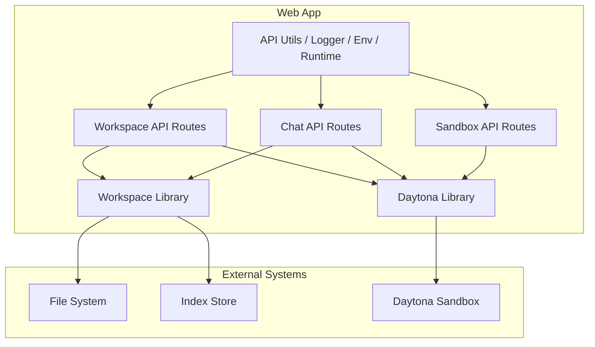
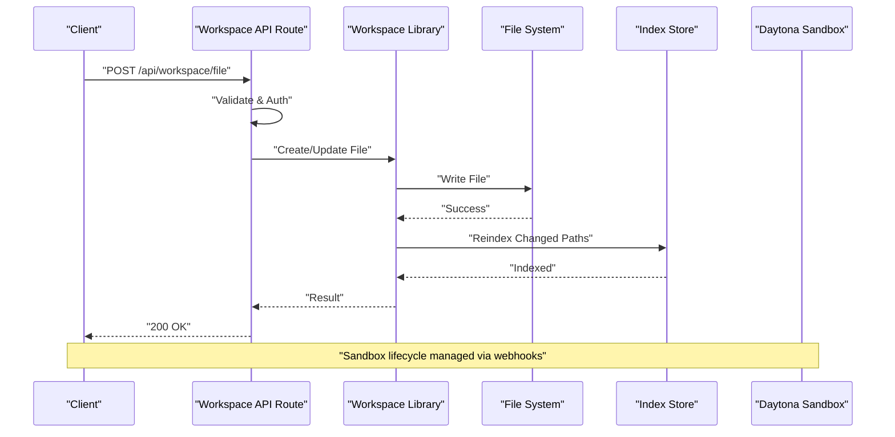
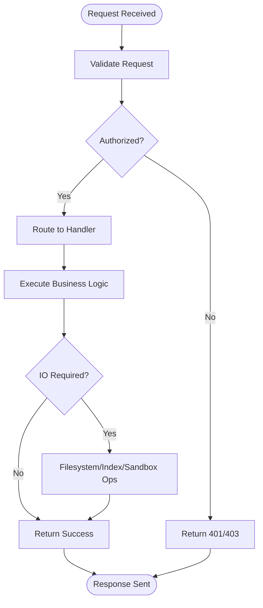
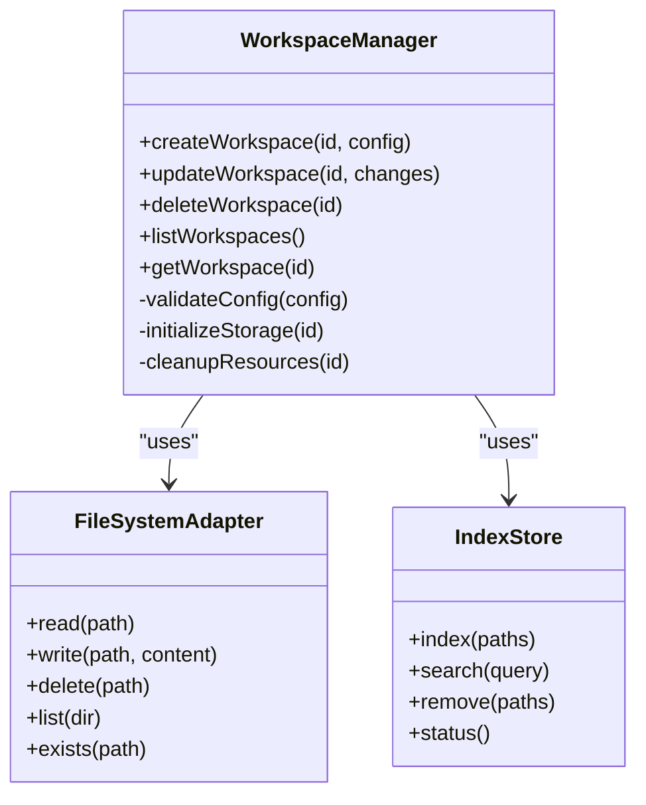
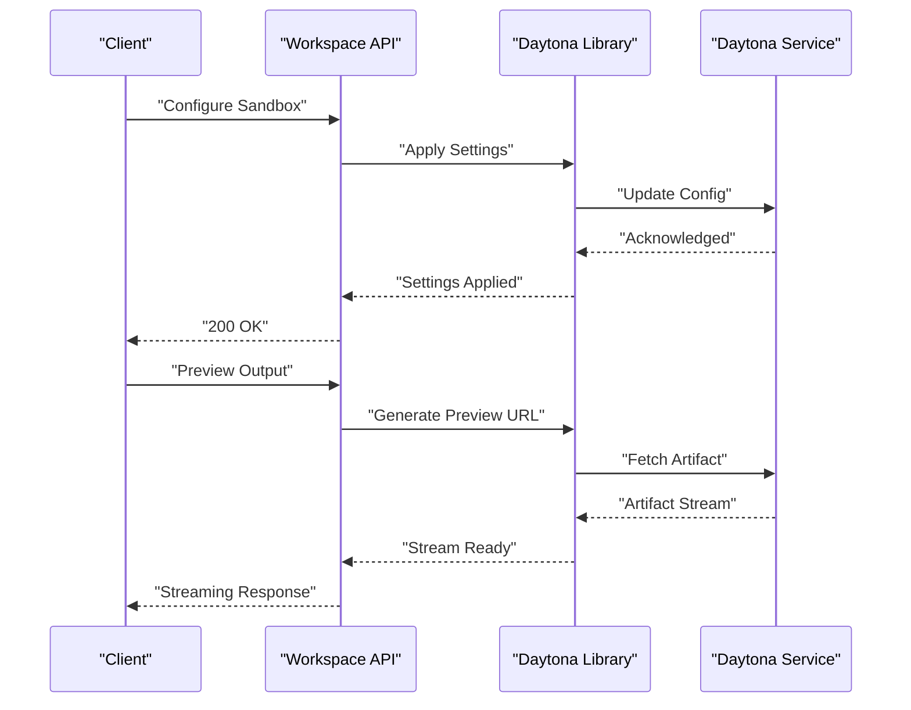
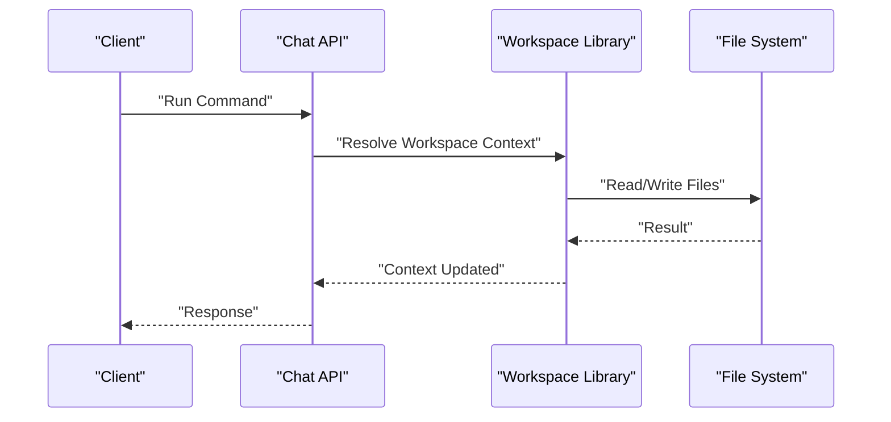
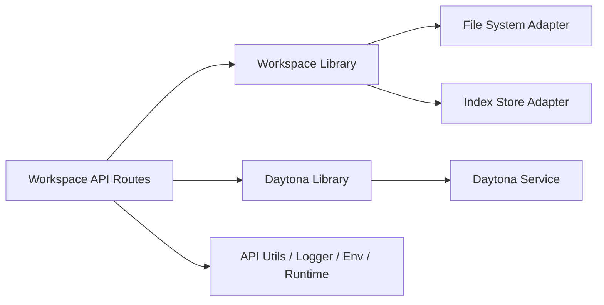

# Workspace Architecture

<cite>
**Referenced Files in This Document**
- [README.md](file://README.md)
- [WORKSPACE.md](file://WORKSPACE.md)
- [architecture.md](file://docs/architecture.md)
- [agent-workspace.md](file://docs/agent-workspace.md)
- [workspace/index.ts](file://apps/web/src/lib/workspace/index.ts)
- [workspace/file.ts](file://apps/web/src/routes/api/workspace/file.ts)
- [workspace/item.ts](file://apps/web/src/routes/api/workspace/item.ts)
- [workspace/items.ts](file://apps/web/src/routes/api/workspace/items.ts)
- [workspace/tree.ts](file://apps/web/src/routes/api/workspace/tree.ts)
- [workspace/search.ts](file://apps/web/src/routes/api/workspace/search.ts)
- [workspace/reindex.ts](file://apps/web/src/routes/api/workspace/reindex.ts)
- [workspace/health.ts](file://apps/web/src/routes/api/workspace/health.ts)
- [daytona/sandbox.ts](file://apps/web/src/lib/daytona/sandbox.ts)
- [daytona/settings.ts](file://apps/web/src/lib/daytona/settings.ts)
- [api-utils.ts](file://apps/web/src/lib/api-utils.ts)
- [logger.ts](file://apps/web/src/lib/logger.ts)
- [env-manager.ts](file://apps/web/src/lib/env-manager.ts)
- [app-runtime.ts](file://apps/web/src/lib/app-runtime.ts)
- [chat/run.ts](file://apps/web/src/routes/api/chat/run.ts)
- [chat/session.ts](file://apps/web/src/routes/api/chat/session.ts)
- [webhooks/daytona.ts](file://apps/web/src/routes/api/webhooks/daytona.ts)
- [sandbox/preview.ts](file://apps/web/src/routes/api/sandbox/preview.ts)
- [sandbox/settings.ts](file://apps/web/src/routes/api/sandbox/settings.ts)
</cite>

## Table of Contents

1. [Introduction](#introduction)
2. [Project Structure](#project-structure)
3. [Core Components](#core-components)
4. [Architecture Overview](#architecture-overview)
5. [Detailed Component Analysis](#detailed-component-analysis)
6. [Dependency Analysis](#dependency-analysis)
7. [Performance Considerations](#performance-considerations)
8. [Troubleshooting Guide](#troubleshooting-guide)
9. [Conclusion](#conclusion)

## Introduction

This document provides comprehensive architectural documentation for the Agent Workspace system. It explains design patterns, component interactions, and data flow across the web application, workspace manager, file system, and external tools. It also documents the workspace lifecycle, isolation mechanisms, security boundaries, scalability considerations, performance optimization strategies, and troubleshooting approaches.

## Project Structure

The Agent Workspace is implemented as part of a multi-module web application. The key areas relevant to workspaces include:

- Web routes under apps/web/src/routes/api/workspace that expose endpoints for file operations, tree traversal, search, reindexing, and health checks.
- Library modules under apps/web/src/lib/workspace and apps/web/src/lib/daytona that encapsulate workspace orchestration and sandbox integration.
- Supporting utilities for API handling, logging, environment management, and runtime configuration.

**Diagram sources**

- [workspace/index.ts](file://apps/web/src/lib/workspace/index.ts)
- [daytona/sandbox.ts](file://apps/web/src/lib/daytona/sandbox.ts)
- [file.ts](file://apps/web/src/routes/api/workspace/file.ts)
- [item.ts](file://apps/web/src/routes/api/workspace/item.ts)
- [items.ts](file://apps/web/src/routes/api/workspace/items.ts)
- [tree.ts](file://apps/web/src/routes/api/workspace/tree.ts)
- [search.ts](file://apps/web/src/routes/api/workspace/search.ts)
- [reindex.ts](file://apps/web/src/routes/api/workspace/reindex.ts)
- [health.ts](file://apps/web/src/routes/api/workspace/health.ts)
- [api-utils.ts](file://apps/web/src/lib/api-utils.ts)
- [logger.ts](file://apps/web/src/lib/logger.ts)
- [env-manager.ts](file://apps/web/src/lib/env-manager.ts)
- [app-runtime.ts](file://apps/web/src/lib/app-runtime.ts)

**Section sources**

- [README.md](file://README.md)
- [WORKSPACE.md](file://WORKSPACE.md)
- [architecture.md](file://docs/architecture.md)
- [agent-workspace.md](file://docs/agent-workspace.md)

## Core Components

- Workspace API Routes: Provide HTTP endpoints for file CRUD, directory tree listing, search, reindex triggers, and health checks. They enforce authentication, input validation, and rate limiting where applicable.
- Workspace Library: Encapsulates workspace lifecycle operations such as creation, initialization, indexing, and cleanup. It coordinates with the file system and index store.
- Dayonta Integration: Manages sandbox provisioning, configuration, and lifecycle events via webhooks. It isolates agent execution from the host environment.
- Utilities: Centralized API helpers, structured logging, environment variable management, and runtime context access.

Key responsibilities:

- Input validation and authorization at route boundaries.
- Abstraction over filesystem and indexing operations.
- Secure communication with external sandboxes.
- Observability through structured logs and health endpoints.

**Section sources**

- [workspace/index.ts](file://apps/web/src/lib/workspace/index.ts)
- [file.ts](file://apps/web/src/routes/api/workspace/file.ts)
- [item.ts](file://apps/web/src/routes/api/workspace/item.ts)
- [items.ts](file://apps/web/src/routes/api/workspace/items.ts)
- [tree.ts](file://apps/web/src/routes/api/workspace/tree.ts)
- [search.ts](file://apps/web/src/routes/api/workspace/search.ts)
- [reindex.ts](file://apps/web/src/routes/api/workspace/reindex.ts)
- [health.ts](file://apps/web/src/routes/api/workspace/health.ts)
- [daytona/sandbox.ts](file://apps/web/src/lib/daytona/sandbox.ts)
- [daytona/settings.ts](file://apps/web/src/lib/daytona/settings.ts)
- [api-utils.ts](file://apps/web/src/lib/api-utils.ts)
- [logger.ts](file://apps/web/src/lib/logger.ts)
- [env-manager.ts](file://apps/web/src/lib/env-manager.ts)
- [app-runtime.ts](file://apps/web/src/lib/app-runtime.ts)

## Architecture Overview

The Agent Workspace follows a layered architecture:

- Presentation layer (web routes) handles HTTP requests, validates inputs, and delegates to services.
- Service layer (workspace library) orchestrates business logic, including workspace lifecycle and indexing.
- Infrastructure layer interacts with the file system, index store, and external sandbox provider.
- Cross-cutting concerns (logging, env, auth) are provided by utility modules.

**Diagram sources**

- [file.ts](file://apps/web/src/routes/api/workspace/file.ts)
- [workspace/index.ts](file://apps/web/src/lib/workspace/index.ts)
- [reindex.ts](file://apps/web/src/routes/api/workspace/reindex.ts)
- [daytona/sandbox.ts](file://apps/web/src/lib/daytona/sandbox.ts)

## Detailed Component Analysis

### Workspace API Layer

Responsibilities:

- Expose REST endpoints for workspace operations.
- Enforce authentication and authorization.
- Validate payloads and sanitize inputs.
- Coordinate background tasks like reindexing.

Endpoints overview:

- File operations: create, read, update, delete files within a workspace.
- Tree operations: list directories recursively.
- Search: query indexed content.
- Reindex: trigger or manage indexing jobs.
- Health: report readiness and liveness.

**Diagram sources**

- [file.ts](file://apps/web/src/routes/api/workspace/file.ts)
- [item.ts](file://apps/web/src/routes/api/workspace/item.ts)
- [items.ts](file://apps/web/src/routes/api/workspace/items.ts)
- [tree.ts](file://apps/web/src/routes/api/workspace/tree.ts)
- [search.ts](file://apps/web/src/routes/api/workspace/search.ts)
- [reindex.ts](file://apps/web/src/routes/api/workspace/reindex.ts)
- [health.ts](file://apps/web/src/routes/api/workspace/health.ts)

**Section sources**

- [file.ts](file://apps/web/src/routes/api/workspace/file.ts)
- [item.ts](file://apps/web/src/routes/api/workspace/item.ts)
- [items.ts](file://apps/web/src/routes/api/workspace/items.ts)
- [tree.ts](file://apps/web/src/routes/api/workspace/tree.ts)
- [search.ts](file://apps/web/src/routes/api/workspace/search.ts)
- [reindex.ts](file://apps/web/src/routes/api/workspace/reindex.ts)
- [health.ts](file://apps/web/src/routes/api/workspace/health.ts)

### Workspace Library

Responsibilities:

- Manage workspace lifecycle: creation, initialization, updates, deletion.
- Orchestrate file operations and indexing.
- Provide abstractions over storage backends.
- Integrate with sandbox provisioning and configuration.

Lifecycle highlights:

- Creation: allocate isolated storage, initialize metadata, set permissions.
- Indexing: scan paths, build indexes, handle incremental updates.
- Cleanup: remove artifacts, revoke sandbox resources, purge indexes.

**Diagram sources**

- [workspace/index.ts](file://apps/web/src/lib/workspace/index.ts)

**Section sources**

- [workspace/index.ts](file://apps/web/src/lib/workspace/index.ts)

### Dayonta Sandbox Integration

Responsibilities:

- Provision and configure isolated execution environments.
- Manage sandbox lifecycle via webhooks.
- Enforce resource limits and security policies.

Integration points:

- Settings endpoint to configure sandbox behavior.
- Preview endpoint to serve sandbox outputs securely.
- Webhook handler to reconcile state changes.

**Diagram sources**

- [daytona/sandbox.ts](file://apps/web/src/lib/daytona/sandbox.ts)
- [daytona/settings.ts](file://apps/web/src/lib/daytona/settings.ts)
- [sandbox/preview.ts](file://apps/web/src/routes/api/sandbox/preview.ts)
- [sandbox/settings.ts](file://apps/web/src/routes/api/sandbox/settings.ts)
- [webhooks/daytona.ts](file://apps/web/src/routes/api/webhooks/daytona.ts)

**Section sources**

- [daytona/sandbox.ts](file://apps/web/src/lib/daytona/sandbox.ts)
- [daytona/settings.ts](file://apps/web/src/lib/daytona/settings.ts)
- [sandbox/preview.ts](file://apps/web/src/routes/api/sandbox/preview.ts)
- [sandbox/settings.ts](file://apps/web/src/routes/api/sandbox/settings.ts)
- [webhooks/daytona.ts](file://apps/web/src/routes/api/webhooks/daytona.ts)

### Chat Integration with Workspaces

Responsibilities:

- Allow chat sessions to interact with workspaces (e.g., reading/writing files, triggering reindex).
- Maintain session state and ensure isolation per user.

**Diagram sources**

- [chat/run.ts](file://apps/web/src/routes/api/chat/run.ts)
- [chat/session.ts](file://apps/web/src/routes/api/chat/session.ts)
- [workspace/index.ts](file://apps/web/src/lib/workspace/index.ts)

**Section sources**

- [chat/run.ts](file://apps/web/src/routes/api/chat/run.ts)
- [chat/session.ts](file://apps/web/src/routes/api/chat/session.ts)

## Dependency Analysis

The workspace system exhibits clear separation of concerns:

- API routes depend on workspace and daytona libraries.
- Libraries depend on infrastructure adapters (filesystem, index store, external services).
- Utilities provide cross-cutting functionality used across layers.

**Diagram sources**

- [workspace/index.ts](file://apps/web/src/lib/workspace/index.ts)
- [daytona/sandbox.ts](file://apps/web/src/lib/daytona/sandbox.ts)
- [api-utils.ts](file://apps/web/src/lib/api-utils.ts)
- [logger.ts](file://apps/web/src/lib/logger.ts)
- [env-manager.ts](file://apps/web/src/lib/env-manager.ts)
- [app-runtime.ts](file://apps/web/src/lib/app-runtime.ts)

**Section sources**

- [workspace/index.ts](file://apps/web/src/lib/workspace/index.ts)
- [daytona/sandbox.ts](file://apps/web/src/lib/daytona/sandbox.ts)
- [api-utils.ts](file://apps/web/src/lib/api-utils.ts)
- [logger.ts](file://apps/web/src/lib/logger.ts)
- [env-manager.ts](file://apps/web/src/lib/env-manager.ts)
- [app-runtime.ts](file://apps/web/src/lib/app-runtime.ts)

## Performance Considerations

- Indexing Strategy: Use incremental indexing to minimize overhead; batch file changes and debounce reindex triggers.
- Caching: Cache frequently accessed workspace metadata and search results with appropriate invalidation policies.
- Concurrency: Limit concurrent filesystem operations and sandbox provisioning to avoid resource contention.
- Streaming: For large artifacts, stream responses instead of buffering entirely in memory.
- Backpressure: Implement queue-based job processing for reindex and heavy tasks to prevent overload.

[No sources needed since this section provides general guidance]

## Troubleshooting Guide

Common issues and resolutions:

- Authentication failures: Verify token validity and permission scopes; check logger output for auth errors.
- File operation errors: Inspect filesystem permissions and path resolution; validate input sanitization.
- Index inconsistencies: Trigger manual reindex; verify indexer status and error logs.
- Sandbox provisioning failures: Check webhook delivery and settings; review external service health.
- Health checks failing: Review liveness/readiness probes and dependency statuses.

Operational tips:

- Enable structured logging with correlation IDs for request tracing.
- Monitor workspace health endpoints and alert on degraded states.
- Use environment managers to validate configuration at startup.

**Section sources**

- [logger.ts](file://apps/web/src/lib/logger.ts)
- [health.ts](file://apps/web/src/routes/api/workspace/health.ts)
- [env-manager.ts](file://apps/web/src/lib/env-manager.ts)
- [app-runtime.ts](file://apps/web/src/lib/app-runtime.ts)

## Conclusion

The Agent Workspace system is designed with clear separation of concerns, robust isolation via sandboxes, and scalable indexing and file operations. By adhering to the documented patterns and leveraging the provided utilities, teams can extend and maintain the system effectively while ensuring security and performance.

[No sources needed since this section summarizes without analyzing specific files]
