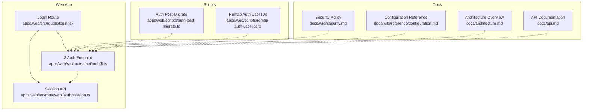
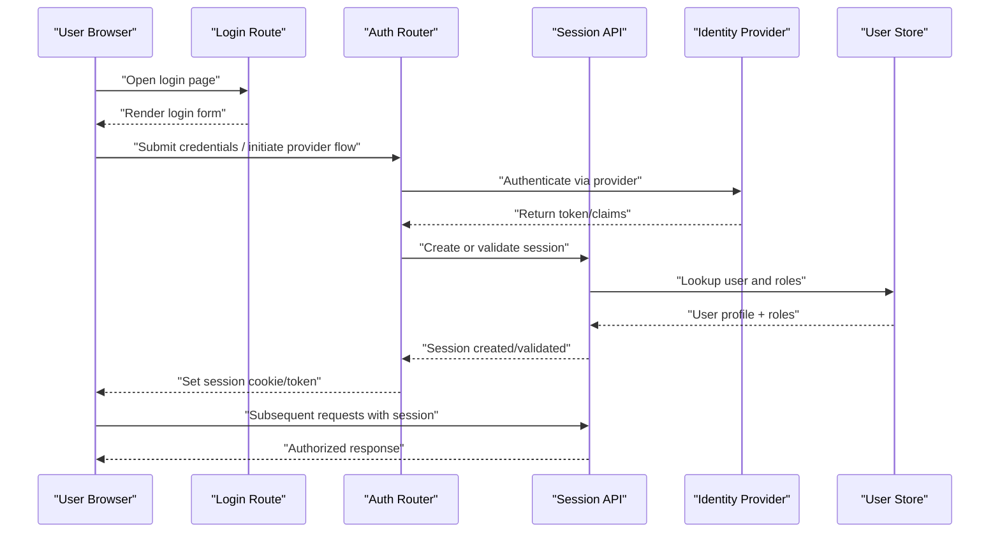
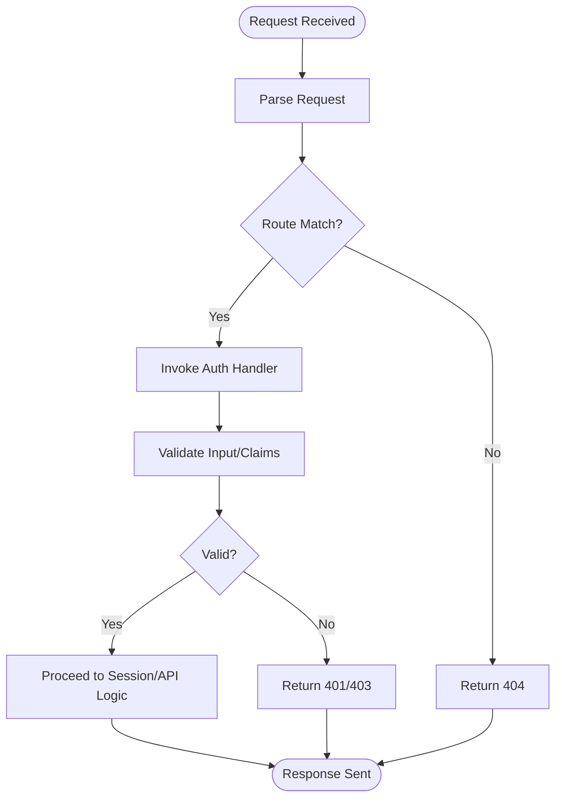
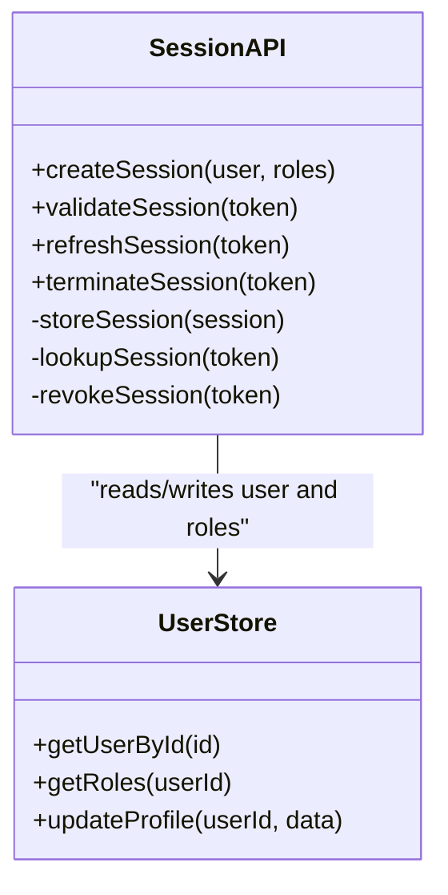
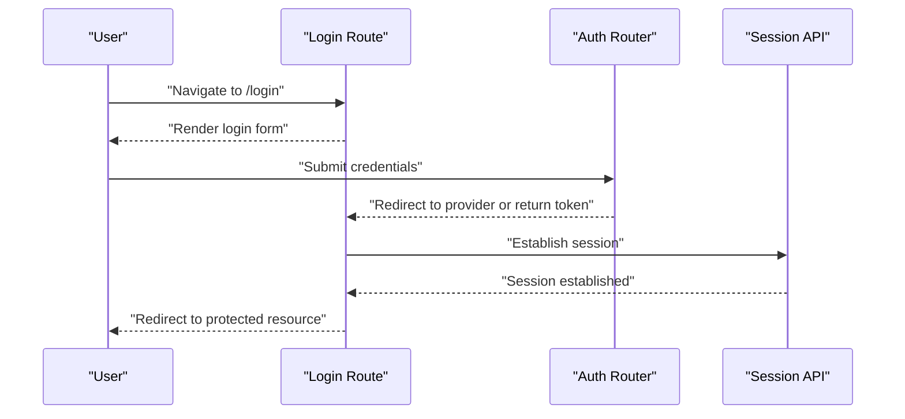
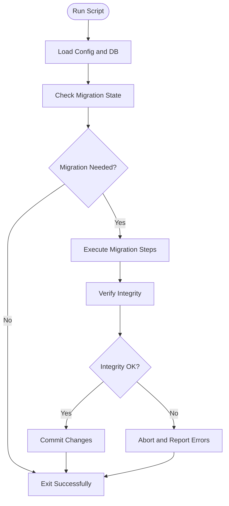
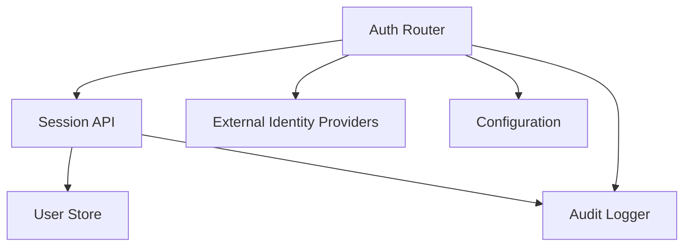

# Authentication & Authorization

<cite>
**Referenced Files in This Document**
- [auth-post-migrate.ts](file://apps/web/scripts/auth-post-migrate.ts)
- [remap-auth-user-ids.ts](file://apps/web/scripts/remap-auth-user-ids.ts)
- [session.ts](file://apps/web/src/routes/api/auth/session.ts)
- [$.ts](file://apps/web/src/routes/api/auth/$.ts)
- [login.tsx](file://apps/web/src/routes/login.tsx)
- [security.md](file://docs/wiki/security.md)
- [configuration.md](file://docs/wiki/reference/configuration.md)
- [api.md](file://docs/api.md)
- [architecture.md](file://docs/architecture.md)
- [SECURITY.md](file://SECURITY.md)
</cite>

## Table of Contents

1. [Introduction](#introduction)
2. [Project Structure](#project-structure)
3. [Core Components](#core-components)
4. [Architecture Overview](#architecture-overview)
5. [Detailed Component Analysis](#detailed-component-analysis)
6. [Dependency Analysis](#dependency-analysis)
7. [Performance Considerations](#performance-considerations)
8. [Troubleshooting Guide](#troubleshooting-guide)
9. [Conclusion](#conclusion)
10. [Appendices](#appendices)

## Introduction

This document explains Fleet Pi’s authentication and authorization system, covering user registration and login flows, session management, role-based access control (RBAC), permissions, external identity provider integration, JWT handling, security best practices, configuration, custom providers, audit logging, and compliance considerations. It is intended for both technical and non-technical readers to understand how identity is established, validated, and enforced across the application.

## Project Structure

Authentication-related code is primarily located under:

- apps/web/src/routes/api/auth: API endpoints for session and auth routing
- apps/web/src/routes/login.tsx: Login UI route
- apps/web/scripts: Migration and utility scripts related to authentication data
- docs: Security policies, configuration references, and architecture documentation

**Diagram sources**

- [login.tsx](file://apps/web/src/routes/login.tsx)
- [$.ts](file://apps/web/src/routes/api/auth/$.ts)
- [session.ts](file://apps/web/src/routes/api/auth/session.ts)
- [auth-post-migrate.ts](file://apps/web/scripts/auth-post-migrate.ts)
- [remap-auth-user-ids.ts](file://apps/web/scripts/remap-auth-user-ids.ts)
- [security.md](file://docs/wiki/security.md)
- [configuration.md](file://docs/wiki/reference/configuration.md)
- [architecture.md](file://docs/architecture.md)
- [api.md](file://docs/api.md)

**Section sources**

- [login.tsx](file://apps/web/src/routes/login.tsx)
- [$.ts](file://apps/web/src/routes/api/auth/$.ts)
- [session.ts](file://apps/web/src/routes/api/auth/session.ts)
- [auth-post-migrate.ts](file://apps/web/scripts/auth-post-migrate.ts)
- [remap-auth-user-ids.ts](file://apps/web/scripts/remap-auth-user-ids.ts)
- [security.md](file://docs/wiki/security.md)
- [configuration.md](file://docs/wiki/reference/configuration.md)
- [architecture.md](file://docs/architecture.md)
- [api.md](file://docs/api.md)

## Core Components

- Auth Router ($ endpoint): Centralizes authentication routes and delegates to specific handlers.
- Session API: Manages session lifecycle, including creation, validation, and termination.
- Login Route: Presents the login UI and initiates authentication flows.
- Scripts: Provide migration and remediation capabilities for authentication data integrity.

Key responsibilities:

- Establishing authenticated sessions
- Validating tokens and claims
- Enforcing roles and permissions at request boundaries
- Integrating with external identity providers
- Logging and auditing authentication events

**Section sources**

- [$.ts](file://apps/web/src/routes/api/auth/$.ts)
- [session.ts](file://apps/web/src/routes/api/auth/session.ts)
- [login.tsx](file://apps/web/src/routes/login.tsx)
- [auth-post-migrate.ts](file://apps/web/scripts/auth-post-migrate.ts)
- [remap-auth-user-ids.ts](file://apps/web/scripts/remap-auth-user-ids.ts)

## Architecture Overview

The authentication architecture follows a layered approach:

- Presentation layer: Login route handles user interaction.
- API layer: Auth router and session endpoints manage requests and responses.
- Identity layer: External providers or internal mechanisms issue tokens/claims.
- Enforcement layer: Middleware validates sessions and enforces RBAC/permissions.
- Data layer: Persistent storage holds user identities, roles, and session state.

**Diagram sources**

- [login.tsx](file://apps/web/src/routes/login.tsx)
- [$.ts](file://apps/web/src/routes/api/auth/$.ts)
- [session.ts](file://apps/web/src/routes/api/auth/session.ts)

**Section sources**

- [architecture.md](file://docs/architecture.md)
- [api.md](file://docs/api.md)

## Detailed Component Analysis

### Auth Router ($ endpoint)

Responsibilities:

- Exposes unified authentication endpoints
- Delegates to provider-specific handlers
- Orchestrates session creation/validation
- Returns standardized error responses

**Diagram sources**

- [$.ts](file://apps/web/src/routes/api/auth/$.ts)

**Section sources**

- [$.ts](file://apps/web/src/routes/api/auth/$.ts)

### Session API

Responsibilities:

- Create, refresh, and terminate sessions
- Validate session tokens and claims on each request
- Associate sessions with user identities and roles
- Persist session metadata securely

**Diagram sources**

- [session.ts](file://apps/web/src/routes/api/auth/session.ts)

**Section sources**

- [session.ts](file://apps/web/src/routes/api/auth/session.ts)

### Login Route

Responsibilities:

- Renders login UI
- Initiates authentication flows (local or external provider)
- Handles redirects and callback processing
- Displays errors and success states

**Diagram sources**

- [login.tsx](file://apps/web/src/routes/login.tsx)
- [$.ts](file://apps/web/src/routes/api/auth/$.ts)
- [session.ts](file://apps/web/src/routes/api/auth/session.ts)

**Section sources**

- [login.tsx](file://apps/web/src/routes/login.tsx)

### Scripts: Auth Migrations and Remediation

- auth-post-migrate.ts: Performs post-deployment migrations for authentication schema or data consistency.
- remap-auth-user-ids.ts: Reconciles user identifiers across systems to maintain referential integrity.

**Diagram sources**

- [auth-post-migrate.ts](file://apps/web/scripts/auth-post-migrate.ts)
- [remap-auth-user-ids.ts](file://apps/web/scripts/remap-auth-user-ids.ts)

**Section sources**

- [auth-post-migrate.ts](file://apps/web/scripts/auth-post-migrate.ts)
- [remap-auth-user-ids.ts](file://apps/web/scripts/remap-auth-user-ids.ts)

## Dependency Analysis

Authentication components depend on:

- External identity providers for issuing tokens
- Database stores for user profiles and roles
- Configuration for provider settings and security policies
- Logging and audit subsystems for compliance

**Diagram sources**

- [$.ts](file://apps/web/src/routes/api/auth/$.ts)
- [session.ts](file://apps/web/src/routes/api/auth/session.ts)

**Section sources**

- [$.ts](file://apps/web/src/routes/api/auth/$.ts)
- [session.ts](file://apps/web/src/routes/api/auth/session.ts)

## Performance Considerations

- Minimize round-trips to identity providers by caching tokens where appropriate.
- Use short-lived sessions with refresh mechanisms to balance security and performance.
- Index user and role lookups to reduce database latency.
- Avoid heavy computations during session validation; precompute roles when possible.
- Implement rate limiting on authentication endpoints to mitigate abuse.

[No sources needed since this section provides general guidance]

## Troubleshooting Guide

Common issues and resolutions:

- Invalid token errors: Verify token signing keys and expiration settings.
- Session not found: Ensure session persistence is configured and accessible.
- Role mismatch: Confirm role assignments and claim mappings from identity providers.
- Migration failures: Review script logs and rollback steps if integrity checks fail.

Recommended diagnostics:

- Enable detailed audit logs for authentication events.
- Inspect configuration values for identity providers and session settings.
- Validate database schema and indexes after migrations.

**Section sources**

- [security.md](file://docs/wiki/security.md)
- [configuration.md](file://docs/wiki/reference/configuration.md)

## Conclusion

Fleet Pi’s authentication and authorization system combines robust session management, flexible identity provider integration, and strict RBAC enforcement. By following the documented flows, configurations, and best practices, teams can ensure secure, scalable, and compliant authentication across the application.

[No sources needed since this section summarizes without analyzing specific files]

## Appendices

### Security Policies and Best Practices

- Enforce strong password policies and multi-factor authentication where applicable.
- Use HTTPS everywhere and secure cookies with HttpOnly, Secure, and SameSite attributes.
- Rotate secrets regularly and store them securely.
- Audit and monitor authentication attempts for anomalies.

**Section sources**

- [SECURITY.md](file://SECURITY.md)
- [security.md](file://docs/wiki/security.md)

### Configuration Examples

- Configure identity provider URLs, client IDs, and secrets.
- Set session lifetime, refresh intervals, and cookie policies.
- Define role mappings and permission scopes.

**Section sources**

- [configuration.md](file://docs/wiki/reference/configuration.md)

### Custom Authentication Providers

- Implement provider adapters that conform to the expected interface.
- Map provider claims to internal roles and permissions.
- Test provider flows thoroughly before deployment.

**Section sources**

- [$.ts](file://apps/web/src/routes/api/auth/$.ts)
- [session.ts](file://apps/web/src/routes/api/auth/session.ts)

### Compliance Considerations

- Maintain audit trails for authentication and authorization events.
- Support data retention and deletion policies.
- Ensure privacy controls for sensitive user data.

**Section sources**

- [security.md](file://docs/wiki/security.md)
- [api.md](file://docs/api.md)
