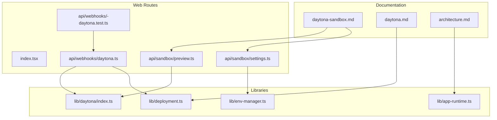
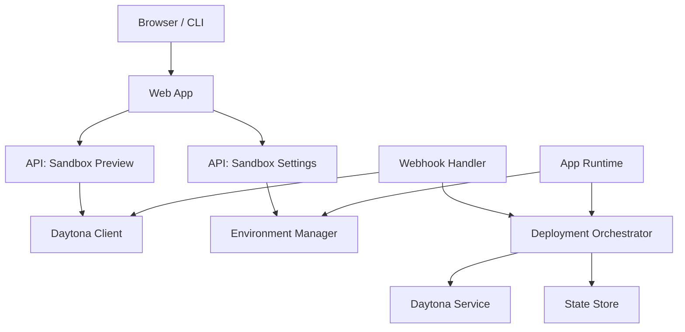
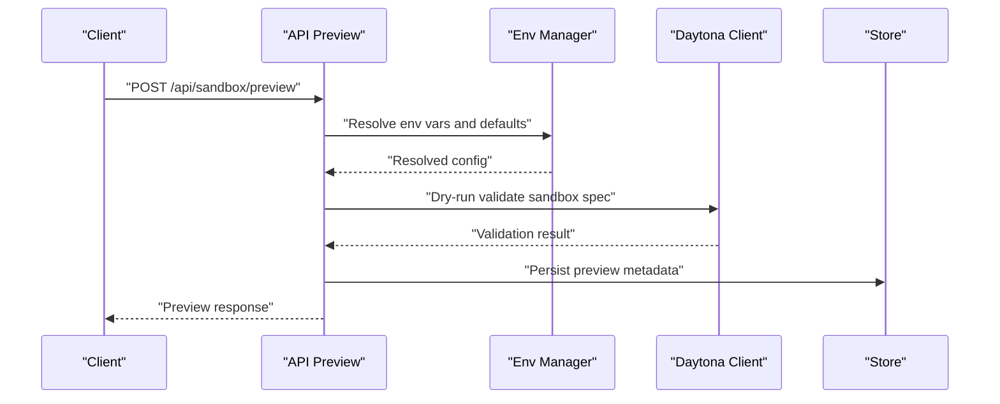
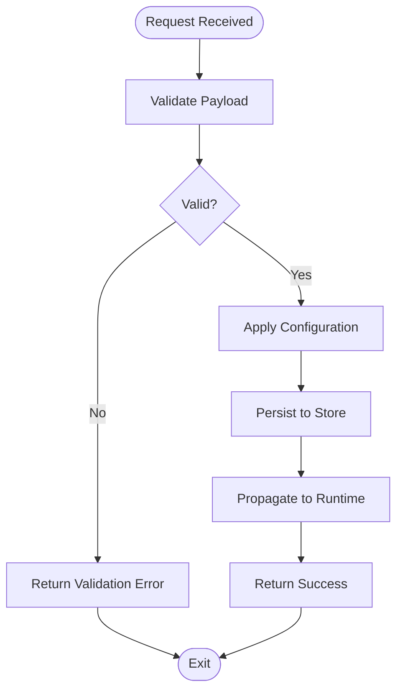
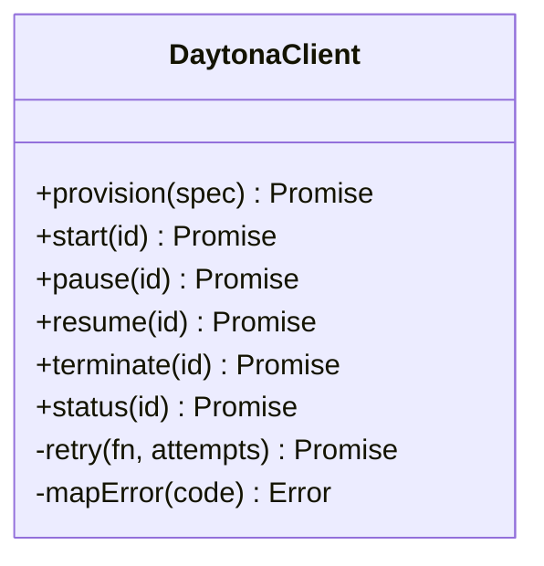
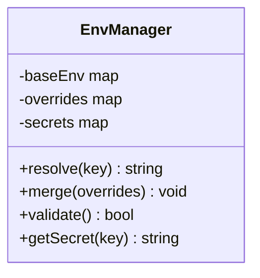
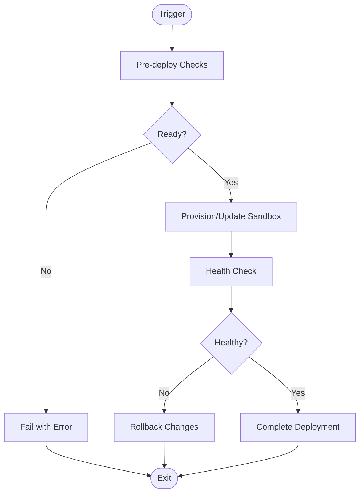
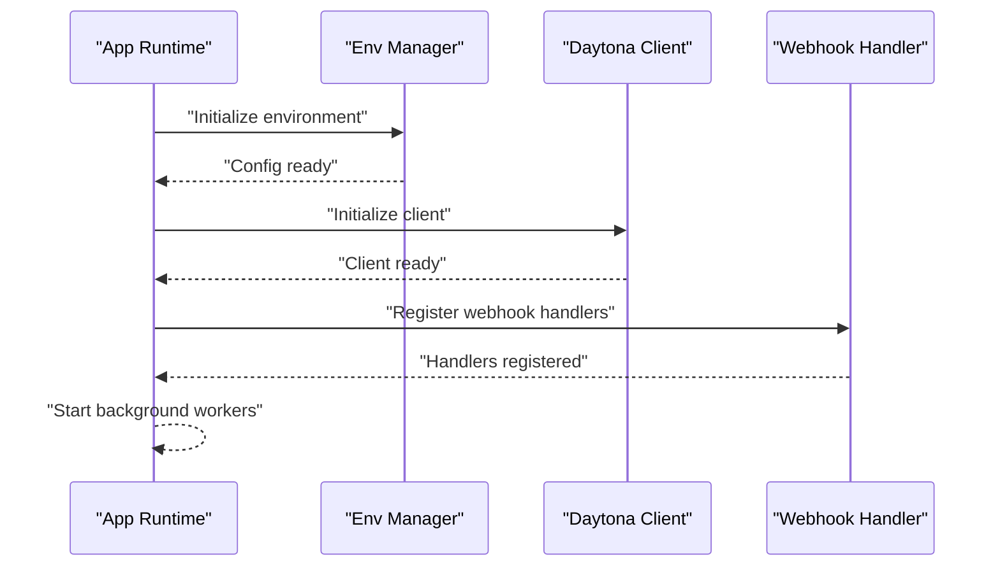
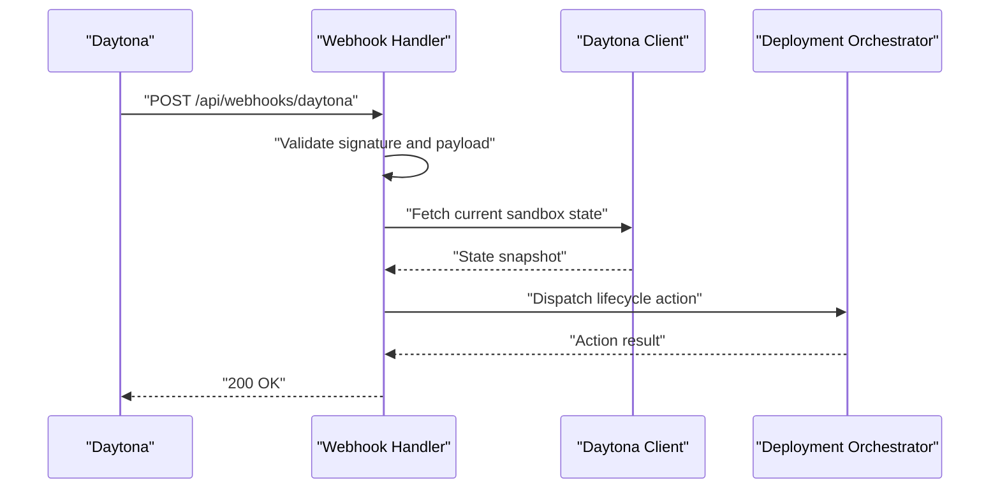
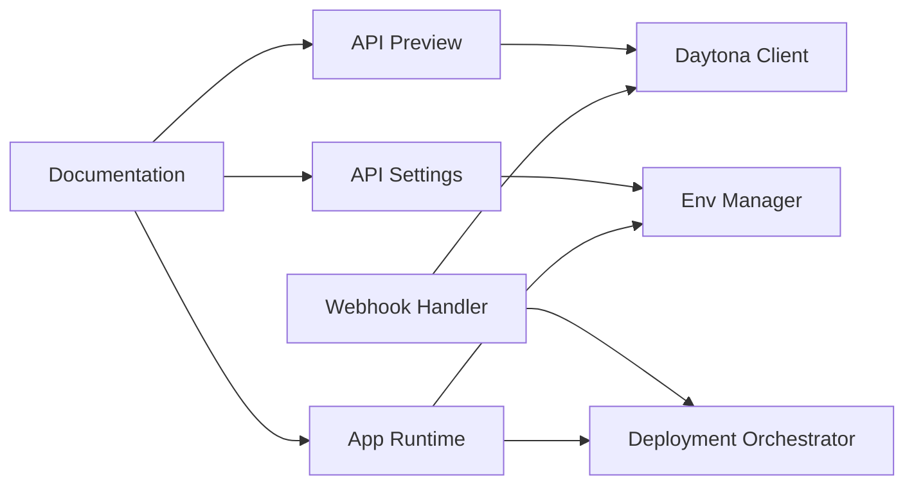

# Daytona Sandbox Integration

<cite>
**Referenced Files in This Document**
- [daytona-sandbox.md](file://docs/wiki/features/daytona-sandbox.md)
- [daytona.md](file://docs/daytona.md)
- [architecture.md](file://docs/architecture.md)
- [index.tsx](file://apps/web/src/routes/index.tsx)
- [preview.ts](file://apps/web/src/routes/api/sandbox/preview.ts)
- [settings.ts](file://apps/web/src/routes/api/sandbox/settings.ts)
- [daytona.ts](file://apps/web/src/lib/daytona/index.ts)
- [env-manager.ts](file://apps/web/src/lib/env-manager.ts)
- [deployment.ts](file://apps/web/src/lib/deployment.ts)
- [app-runtime.ts](file://apps/web/src/lib/app-runtime.ts)
- [webhooks-daytona.test.ts](file://apps/web/src/routes/api/webhooks/-daytona.test.ts)
- [daytona.ts](file://apps/web/src/routes/api/webhooks/daytona.ts)
</cite>

## Table of Contents

1. [Introduction](#introduction)
2. [Project Structure](#project-structure)
3. [Core Components](#core-components)
4. [Architecture Overview](#architecture-overview)
5. [Detailed Component Analysis](#detailed-component-analysis)
6. [Dependency Analysis](#dependency-analysis)
7. [Performance Considerations](#performance-considerations)
8. [Troubleshooting Guide](#troubleshooting-guide)
9. [Conclusion](#conclusion)
10. [Appendices](#appendices)

## Introduction

This document provides comprehensive documentation for integrating and operating Daytona sandboxes within the application. It covers sandbox lifecycle management, container orchestration patterns, resource allocation, isolation mechanisms, configuration, environment management, state persistence, monitoring, scaling strategies, security boundaries, networking, and integration with external services. Practical examples are included to guide creation, deployment workflows, and troubleshooting common issues.

## Project Structure

The Daytona integration spans documentation, web routes, and shared libraries:

- Documentation and feature guides describe concepts and usage.
- Web API routes expose endpoints for previewing and configuring sandboxes.
- Shared libraries encapsulate runtime behavior, environment management, and deployment orchestration.

**Diagram sources**

- [daytona-sandbox.md](file://docs/wiki/features/daytona-sandbox.md)
- [daytona.md](file://docs/daytona.md)
- [architecture.md](file://docs/architecture.md)
- [index.tsx](file://apps/web/src/routes/index.tsx)
- [preview.ts](file://apps/web/src/routes/api/sandbox/preview.ts)
- [settings.ts](file://apps/web/src/routes/api/sandbox/settings.ts)
- [daytona.ts](file://apps/web/src/lib/daytona/index.ts)
- [env-manager.ts](file://apps/web/src/lib/env-manager.ts)
- [deployment.ts](file://apps/web/src/lib/deployment.ts)
- [app-runtime.ts](file://apps/web/src/lib/app-runtime.ts)
- [webhooks-daytona.test.ts](file://apps/web/src/routes/api/webhooks/-daytona.test.ts)
- [daytona.ts](file://apps/web/src/routes/api/webhooks/daytona.ts)

**Section sources**

- [daytona-sandbox.md](file://docs/wiki/features/daytona-sandbox.md)
- [daytona.md](file://docs/daytona.md)
- [architecture.md](file://docs/architecture.md)

## Core Components

- Sandbox API routes: Provide endpoints to preview and configure sandboxes.
- Daytona client library: Encapsulates communication with the Daytona service.
- Environment manager: Centralizes environment variables and secrets used by sandboxes.
- Deployment orchestrator: Coordinates provisioning, scaling, and lifecycle events.
- App runtime: Initializes runtime context and integrates with sandbox features.
- Webhooks: Handle asynchronous events from Daytona (e.g., lifecycle transitions).

Key responsibilities:

- Lifecycle management: Create, start, stop, and destroy sandboxes via API and webhooks.
- Resource allocation: Define CPU, memory, and storage quotas per sandbox.
- Isolation: Enforce network and filesystem boundaries per sandbox.
- Persistence: Manage durable state across restarts and deployments.
- Monitoring: Expose metrics and logs for observability.

**Section sources**

- [preview.ts](file://apps/web/src/routes/api/sandbox/preview.ts)
- [settings.ts](file://apps/web/src/routes/api/sandbox/settings.ts)
- [daytona.ts](file://apps/web/src/lib/daytona/index.ts)
- [env-manager.ts](file://apps/web/src/lib/env-manager.ts)
- [deployment.ts](file://apps/web/src/lib/deployment.ts)
- [app-runtime.ts](file://apps/web/src/lib/app-runtime.ts)
- [daytona.ts](file://apps/web/src/routes/api/webhooks/daytona.ts)
- [webhooks-daytona.test.ts](file://apps/web/src/routes/api/webhooks/-daytona.test.ts)

## Architecture Overview

The system integrates a web frontend with backend APIs that communicate with the Daytona service. Sandboxes are provisioned as isolated containers orchestrated through the deployment layer, with environment and runtime configuration managed centrally.

**Diagram sources**

- [preview.ts](file://apps/web/src/routes/api/sandbox/preview.ts)
- [settings.ts](file://apps/web/src/routes/api/sandbox/settings.ts)
- [daytona.ts](file://apps/web/src/lib/daytona/index.ts)
- [env-manager.ts](file://apps/web/src/lib/env-manager.ts)
- [deployment.ts](file://apps/web/src/lib/deployment.ts)
- [app-runtime.ts](file://apps/web/src/lib/app-runtime.ts)
- [daytona.ts](file://apps/web/src/routes/api/webhooks/daytona.ts)

## Detailed Component Analysis

### Sandbox Preview Endpoint

Purpose:

- Validate sandbox configuration and return a preview of the intended environment before provisioning.

Flow:

- Receive request with desired sandbox settings.
- Resolve environment variables and defaults.
- Perform dry-run validation against Daytona constraints.
- Return preview details including resources, networking, and persistence options.

**Diagram sources**

- [preview.ts](file://apps/web/src/routes/api/sandbox/preview.ts)
- [env-manager.ts](file://apps/web/src/lib/env-manager.ts)
- [daytona.ts](file://apps/web/src/lib/daytona/index.ts)

**Section sources**

- [preview.ts](file://apps/web/src/routes/api/sandbox/preview.ts)
- [env-manager.ts](file://apps/web/src/lib/env-manager.ts)
- [daytona.ts](file://apps/web/src/lib/daytona/index.ts)

### Sandbox Settings Endpoint

Purpose:

- Persist and apply sandbox configuration, including environment variables, resource limits, and feature flags.

Flow:

- Accept configuration payload.
- Validate schema and constraints.
- Update environment store and propagate changes to runtime.
- Acknowledge successful update or return errors.

**Diagram sources**

- [settings.ts](file://apps/web/src/routes/api/sandbox/settings.ts)
- [env-manager.ts](file://apps/web/src/lib/env-manager.ts)

**Section sources**

- [settings.ts](file://apps/web/src/routes/api/sandbox/settings.ts)
- [env-manager.ts](file://apps/web/src/lib/env-manager.ts)

### Daytona Client Library

Responsibilities:

- Communicate with the Daytona service for sandbox lifecycle operations.
- Translate domain-specific requests into Daytona-compatible payloads.
- Handle retries, timeouts, and error mapping.

Key interactions:

- Provisioning: Create and configure new sandboxes.
- Lifecycle: Start, pause, resume, and terminate instances.
- Status: Query current state and health.
- Events: Subscribe to webhook-driven updates.

**Diagram sources**

- [daytona.ts](file://apps/web/src/lib/daytona/index.ts)

**Section sources**

- [daytona.ts](file://apps/web/src/lib/daytona/index.ts)

### Environment Manager

Responsibilities:

- Centralize environment variable resolution, merging defaults, secrets, and overrides.
- Provide typed accessors for sandbox configuration.
- Ensure sensitive values are handled securely.

Operations:

- Load base environment.
- Merge user-provided overrides.
- Validate presence of required keys.
- Expose getters for runtime consumption.

**Diagram sources**

- [env-manager.ts](file://apps/web/src/lib/env-manager.ts)

**Section sources**

- [env-manager.ts](file://apps/web/src/lib/env-manager.ts)

### Deployment Orchestrator

Responsibilities:

- Coordinate sandbox provisioning and scaling based on configuration and demand.
- Manage state persistence volumes and snapshots.
- Integrate with external services (e.g., registries, secret stores).

Lifecycle hooks:

- Pre-deploy: Validate dependencies and prerequisites.
- Deploy: Create or update sandbox instances.
- Post-deploy: Health checks and readiness probes.
- Scale: Adjust replicas and resource allocations.

**Diagram sources**

- [deployment.ts](file://apps/web/src/lib/deployment.ts)

**Section sources**

- [deployment.ts](file://apps/web/src/lib/deployment.ts)

### App Runtime

Responsibilities:

- Initialize application context and load sandbox-related modules.
- Wire up event listeners for Daytona webhooks.
- Expose runtime configuration to components.

Initialization steps:

- Load environment and secrets.
- Configure logging and telemetry.
- Register route handlers and middleware.
- Start background workers for lifecycle tasks.

**Diagram sources**

- [app-runtime.ts](file://apps/web/src/lib/app-runtime.ts)
- [daytona.ts](file://apps/web/src/lib/daytona/index.ts)
- [daytona.ts](file://apps/web/src/routes/api/webhooks/daytona.ts)

**Section sources**

- [app-runtime.ts](file://apps/web/src/lib/app-runtime.ts)
- [daytona.ts](file://apps/web/src/lib/daytona/index.ts)
- [daytona.ts](file://apps/web/src/routes/api/webhooks/daytona.ts)

### Webhook Handler

Responsibilities:

- Process asynchronous events from Daytona (e.g., lifecycle transitions, health status).
- Update internal state and trigger downstream actions.
- Provide test coverage for webhook processing paths.

Event types:

- Sandbox created, started, paused, resumed, terminated.
- Health check results and alerts.
- Scaling events and resource utilization thresholds.

**Diagram sources**

- [daytona.ts](file://apps/web/src/routes/api/webhooks/daytona.ts)
- [webhooks-daytona.test.ts](file://apps/web/src/routes/api/webhooks/-daytona.test.ts)
- [daytona.ts](file://apps/web/src/lib/daytona/index.ts)
- [deployment.ts](file://apps/web/src/lib/deployment.ts)

**Section sources**

- [daytona.ts](file://apps/web/src/routes/api/webhooks/daytona.ts)
- [webhooks-daytona.test.ts](file://apps/web/src/routes/api/webhooks/-daytona.test.ts)
- [daytona.ts](file://apps/web/src/lib/daytona/index.ts)
- [deployment.ts](file://apps/web/src/lib/deployment.ts)

## Dependency Analysis

Inter-module relationships and coupling:

- API routes depend on the Daytona client and environment manager.
- Webhook handler depends on the Daytona client and deployment orchestrator.
- App runtime initializes and wires all subsystems.
- Documentation informs implementation and usage patterns.

**Diagram sources**

- [preview.ts](file://apps/web/src/routes/api/sandbox/preview.ts)
- [settings.ts](file://apps/web/src/routes/api/sandbox/settings.ts)
- [daytona.ts](file://apps/web/src/lib/daytona/index.ts)
- [env-manager.ts](file://apps/web/src/lib/env-manager.ts)
- [deployment.ts](file://apps/web/src/lib/deployment.ts)
- [app-runtime.ts](file://apps/web/src/lib/app-runtime.ts)
- [daytona-sandbox.md](file://docs/wiki/features/daytona-sandbox.md)
- [daytona.md](file://docs/daytona.md)

**Section sources**

- [preview.ts](file://apps/web/src/routes/api/sandbox/preview.ts)
- [settings.ts](file://apps/web/src/routes/api/sandbox/settings.ts)
- [daytona.ts](file://apps/web/src/lib/daytona/index.ts)
- [env-manager.ts](file://apps/web/src/lib/env-manager.ts)
- [deployment.ts](file://apps/web/src/lib/deployment.ts)
- [app-runtime.ts](file://apps/web/src/lib/app-runtime.ts)
- [daytona-sandbox.md](file://docs/wiki/features/daytona-sandbox.md)
- [daytona.md](file://docs/daytona.md)

## Performance Considerations

- Use dry-run previews to avoid unnecessary provisioning attempts.
- Cache frequently accessed configuration and reduce repeated environment lookups.
- Implement exponential backoff and circuit breakers in the Daytona client.
- Monitor resource utilization and scale horizontally when thresholds are exceeded.
- Optimize webhook processing by batching and prioritizing critical events.

[No sources needed since this section provides general guidance]

## Troubleshooting Guide

Common issues and resolutions:

- Validation failures: Inspect payload schemas and required fields; use preview endpoint to catch errors early.
- Provisioning timeouts: Check Daytona service health and network connectivity; increase retry limits if necessary.
- State persistence errors: Verify volume mounts and permissions; ensure snapshots are consistent.
- Webhook delivery failures: Validate signatures and timestamps; review logs for payload parsing errors.
- Resource exhaustion: Adjust CPU/memory quotas and monitor usage metrics; implement auto-scaling policies.

Diagnostic steps:

- Enable detailed logging for API routes and webhook handlers.
- Query sandbox status via the Daytona client and inspect health endpoints.
- Review environment configuration for missing or invalid secrets.
- Reproduce issues using preview responses and minimal payloads.

**Section sources**

- [preview.ts](file://apps/web/src/routes/api/sandbox/preview.ts)
- [settings.ts](file://apps/web/src/routes/api/sandbox/settings.ts)
- [daytona.ts](file://apps/web/src/lib/daytona/index.ts)
- [env-manager.ts](file://apps/web/src/lib/env-manager.ts)
- [deployment.ts](file://apps/web/src/lib/deployment.ts)
- [daytona.ts](file://apps/web/src/routes/api/webhooks/daytona.ts)
- [webhooks-daytona.test.ts](file://apps/web/src/routes/api/webhooks/-daytona.test.ts)

## Conclusion

The Daytona sandbox integration provides a robust framework for managing isolated development environments. By leveraging well-defined API routes, a dedicated client library, centralized environment management, and a deployment orchestrator, the system ensures reliable lifecycle management, secure configuration, and scalable operations. Adhering to the outlined practices will help maintain performance, reliability, and security while enabling seamless integration with external services.

[No sources needed since this section summarizes without analyzing specific files]

## Appendices

### Practical Examples

- Creating a sandbox:
  - Use the preview endpoint to validate configuration, then proceed with provisioning via the deployment orchestrator.
- Deployment workflow:
  - Initialize runtime, resolve environment, register webhooks, and deploy sandboxes with health checks.
- Scaling strategy:
  - Monitor resource utilization and adjust replica counts dynamically; persist scaling decisions for auditability.

[No sources needed since this section provides general guidance]
