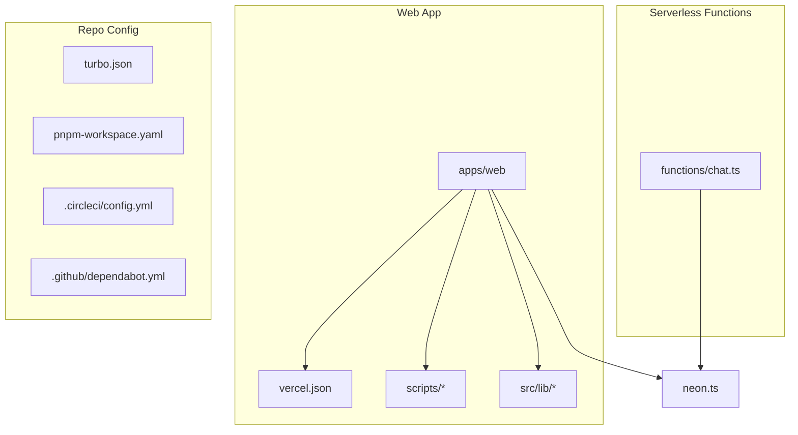
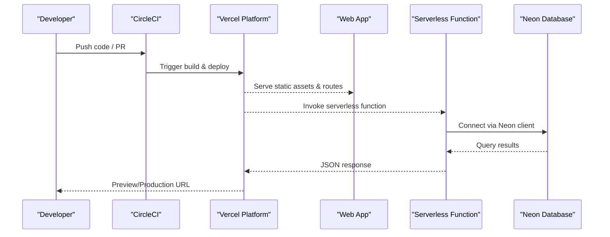
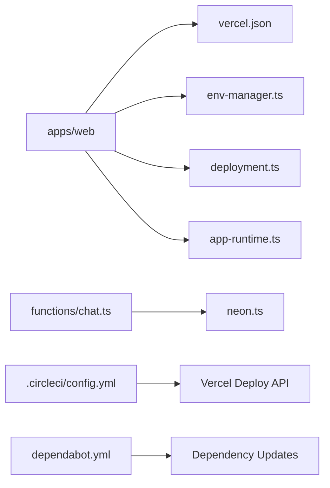

# Deployment & Configuration

<cite>
**Referenced Files in This Document**
- [vercel.json](file://apps/web/vercel.json)
- [package.json](file://apps/web/package.json)
- [vite.config.ts](file://apps/web/vite.config.ts)
- [build-vercel-output.mjs](file://apps/web/scripts/build-vercel-output.mjs)
- [verify-deployment-readiness.mjs](file://apps/web/scripts/verify-deployment-readiness.mjs)
- [chat-migrate.ts](file://apps/web/scripts/chat-migrate.ts)
- [auth-post-migrate.ts](file://apps/web/scripts/auth-post-migrate.ts)
- [env-manager.ts](file://apps/web/src/lib/env-manager.ts)
- [deployment.ts](file://apps/web/src/lib/deployment.ts)
- [app-runtime.ts](file://apps/web/src/lib/app-runtime.ts)
- [neon.ts](file://neon.ts)
- [functions/chat.ts](file://functions/chat.ts)
- [.circleci/config.yml](file://.circleci/config.yml)
- [dependabot.yml](file://.github/dependabot.yml)
- [turbo.json](file://turbo.json)
- [pnpm-workspace.yaml](file://pnpm-workspace.yaml)
- [README.md](file://README.md)
- [docs/deployment.md](file://docs/deployment.md)
- [docs/runbooks/deployment-release-gate.md](file://docs/runbooks/deployment-release-gate.md)
- [docs/wiki/reference/configuration.md](file://docs/wiki/reference/configuration.md)
- [docs/wiki/overview/getting-started.md](file://docs/wiki/overview/getting-started.md)
</cite>

## Table of Contents

1. [Introduction](#introduction)
2. [Project Structure](#project-structure)
3. [Core Components](#core-components)
4. [Architecture Overview](#architecture-overview)
5. [Detailed Component Analysis](#detailed-component-analysis)
6. [Dependency Analysis](#dependency-analysis)
7. [Performance Considerations](#performance-considerations)
8. [Troubleshooting Guide](#troubleshooting-guide)
9. [Conclusion](#conclusion)
10. [Appendices](#appendices)

## Introduction

This document provides a comprehensive guide to deploying and configuring Fleet Pi on Vercel, including environment configuration, database provisioning with Neon, CI/CD setup, scaling considerations, monitoring, backups, maintenance procedures, and performance tuning. It consolidates repository-specific deployment artifacts and scripts into actionable steps for different scenarios (development, staging, production).

## Project Structure

Fleet Pi is a monorepo managed with pnpm workspaces and Turborepo. The web application resides under apps/web and includes Vercel configuration, build scripts, and runtime modules for environment management and deployment detection. Database integration is configured via a top-level Neon client module. CI/CD is defined using CircleCI, while Dependabot manages dependency updates.

**Diagram sources**

- [vercel.json](file://apps/web/vercel.json)
- [build-vercel-output.mjs](file://apps/web/scripts/build-vercel-output.mjs)
- [env-manager.ts](file://apps/web/src/lib/env-manager.ts)
- [deployment.ts](file://apps/web/src/lib/deployment.ts)
- [neon.ts](file://neon.ts)
- [functions/chat.ts](file://functions/chat.ts)
- [turbo.json](file://turbo.json)
- [pnpm-workspace.yaml](file://pnpm-workspace.yaml)
- [.circleci/config.yml](file://.circleci/config.yml)
- [.github/dependabot.yml](file://.github/dependabot.yml)

**Section sources**

- [README.md](file://README.md)
- [turbo.json](file://turbo.json)
- [pnpm-workspace.yaml](file://pnpm-workspace.yaml)

## Core Components

- Vercel configuration: Defines build settings, rewrites, and serverless functions mapping for the web app.
- Build and verification scripts: Prepare Vercel output and validate deployment readiness.
- Environment manager: Centralizes environment variable resolution at runtime and build time.
- Deployment detection: Determines runtime context (Vercel preview vs production).
- Database client: Configures Neon connection parameters and pool behavior.
- Serverless function: Handles chat-related requests and interacts with the database.
- CI/CD pipeline: Automates builds, tests, and deployments; dependency updates are managed by Dependabot.

**Section sources**

- [vercel.json](file://apps/web/vercel.json)
- [build-vercel-output.mjs](file://apps/web/scripts/build-vercel-output.mjs)
- [verify-deployment-readiness.mjs](file://apps/web/scripts/verify-deployment-readiness.mjs)
- [env-manager.ts](file://apps/web/src/lib/env-manager.ts)
- [deployment.ts](file://apps/web/src/lib/deployment.ts)
- [neon.ts](file://neon.ts)
- [functions/chat.ts](file://functions/chat.ts)
- [.circleci/config.yml](file://.circleci/config.yml)
- [.github/dependabot.yml](file://.github/dependabot.yml)

## Architecture Overview

The deployment architecture centers around a Vercel-hosted Next.js/Vite-based web app with serverless functions. Database connectivity uses Neon with connection pooling and SSL. CI/CD pipelines run tests and deploy previews or production releases based on branch policies.

**Diagram sources**

- [vercel.json](file://apps/web/vercel.json)
- [functions/chat.ts](file://functions/chat.ts)
- [neon.ts](file://neon.ts)
- [.circleci/config.yml](file://.circleci/config.yml)

## Detailed Component Analysis

### Vercel Deployment Setup

- Build configuration: Define framework, build command, output directory, and environment variables.
- Rewrites and redirects: Route API endpoints to serverless functions.
- Functions mapping: Map function paths to handler files.
- Preview environments: Enable per-PR previews with isolated env vars.

Key implementation points:

- Build script orchestrates asset generation and prepares Vercel-compatible output.
- Verification script checks required environment variables and connectivity prerequisites before deployment.

**Section sources**

- [vercel.json](file://apps/web/vercel.json)
- [build-vercel-output.mjs](file://apps/web/scripts/build-vercel-output.mjs)
- [verify-deployment-readiness.mjs](file://apps/web/scripts/verify-deployment-readiness.mjs)

### Environment Configuration

- Runtime environment variables: Managed through Vercel project settings and injected at build/runtime.
- Env manager module: Provides typed accessors and fallbacks for optional features.
- Deployment detection: Uses platform signals to adjust behavior (e.g., local dev vs Vercel).

Recommended variables:

- Database connection string and pool settings for Neon.
- Authentication provider secrets and session configuration.
- Feature flags toggling experimental capabilities.
- Logging and analytics identifiers.

**Section sources**

- [env-manager.ts](file://apps/web/src/lib/env-manager.ts)
- [deployment.ts](file://apps/web/src/lib/deployment.ts)
- [app-runtime.ts](file://apps/web/src/lib/app-runtime.ts)

### Database Provisioning (Neon)

- Client initialization: Configure connection string, SSL, and pool size.
- Connection pooling: Use appropriate pool sizes for serverless concurrency.
- Migrations: Run schema migrations during deployment or pre-deploy hooks.

Migration scripts:

- Chat schema migration ensures data model consistency.
- Auth post-migration handles user identity transformations.

**Section sources**

- [neon.ts](file://neon.ts)
- [chat-migrate.ts](file://apps/web/scripts/chat-migrate.ts)
- [auth-post-migrate.ts](file://apps/web/scripts/auth-post-migrate.ts)

### CI/CD Pipeline Configuration

- CircleCI workflow: Install dependencies, run lint/tests, build artifacts, and deploy to Vercel.
- Branch policies: Deploy previews on feature branches; promote to production on main.
- Dependency updates: Dependabot opens PRs for security and version bumps.

Operational notes:

- Cache node_modules and build caches to speed up pipelines.
- Store secrets securely in CI environment.
- Gate releases with automated checks and manual approvals if needed.

**Section sources**

- [.circleci/config.yml](file://.circleci/config.yml)
- [.github/dependabot.yml](file://.github/dependabot.yml)

### Scaling Considerations

- Vercel auto-scaling: Stateless functions scale horizontally; ensure idempotent operations.
- Database scaling: Use Neon’s autoscaling and connection pooling; monitor query latency.
- Caching strategies: Implement edge caching for static assets and read-heavy endpoints.
- Rate limiting: Apply limits at the platform level or within functions to protect resources.

[No sources needed since this section provides general guidance]

### Monitoring Setup

- Application logs: Stream logs from Vercel functions and collect structured logs.
- Error tracking: Integrate error reporting services and capture stack traces.
- Metrics: Track request latency, error rates, and database performance.
- Health checks: Expose health endpoints and monitor uptime.

[No sources needed since this section provides general guidance]

### Backup Strategies

- Automated snapshots: Enable Neon automatic backups and point-in-time recovery.
- Export routines: Schedule periodic exports of critical tables.
- Restore procedures: Document restore steps and test regularly.

[No sources needed since this section provides general guidance]

### Maintenance Procedures

- Schema migrations: Run migrations in a controlled manner with rollback plans.
- Dependency updates: Review Dependabot PRs and apply security patches promptly.
- Secrets rotation: Rotate credentials and update environment variables accordingly.
- Performance reviews: Analyze slow queries and optimize indexes.

[No sources needed since this section provides general guidance]

## Dependency Analysis

The web app depends on Vercel runtime, Neon client, and internal libraries for environment and deployment logic. CI/CD tools orchestrate builds and deployments.

**Diagram sources**

- [vercel.json](file://apps/web/vercel.json)
- [env-manager.ts](file://apps/web/src/lib/env-manager.ts)
- [deployment.ts](file://apps/web/src/lib/deployment.ts)
- [app-runtime.ts](file://apps/web/src/lib/app-runtime.ts)
- [functions/chat.ts](file://functions/chat.ts)
- [neon.ts](file://neon.ts)
- [.circleci/config.yml](file://.circleci/config.yml)
- [.github/dependabot.yml](file://.github/dependabot.yml)

**Section sources**

- [turbo.json](file://turbo.json)
- [pnpm-workspace.yaml](file://pnpm-workspace.yaml)

## Performance Considerations

- Build optimization: Leverage incremental builds and cache dependencies.
- Asset optimization: Minify and compress static assets; use CDN caching.
- Database efficiency: Index frequently queried columns; avoid N+1 queries.
- Function cold starts: Keep payloads small and initialize connections efficiently.

[No sources needed since this section provides general guidance]

## Troubleshooting Guide

Common issues and resolutions:

- Missing environment variables: Ensure all required variables are set in Vercel project settings.
- Database connection failures: Verify connection strings, SSL settings, and network access.
- Migration errors: Check schema compatibility and run migrations in correct order.
- CI/CD failures: Inspect logs for dependency installation or test failures; update lockfiles if needed.

Diagnostic steps:

- Use verification script to pre-check deployment readiness.
- Inspect Vercel function logs for runtime errors.
- Validate Neon connectivity with provided scripts.

**Section sources**

- [verify-deployment-readiness.mjs](file://apps/web/scripts/verify-deployment-readiness.mjs)
- [chat-migrate.ts](file://apps/web/scripts/chat-migrate.ts)
- [auth-post-migrate.ts](file://apps/web/scripts/auth-post-migrate.ts)

## Conclusion

Fleet Pi’s deployment on Vercel leverages serverless functions, robust environment management, and Neon for scalable database operations. By following the outlined configuration, CI/CD practices, and operational guidelines, teams can achieve reliable, secure, and performant deployments across development, staging, and production environments.

[No sources needed since this section summarizes without analyzing specific files]

## Appendices

### Step-by-Step Deployment Guide

1. Set up Vercel project and link repository.
2. Configure environment variables in Vercel dashboard.
3. Add Neon database credentials and enable SSL.
4. Run migrations via CI/CD or pre-deploy hook.
5. Deploy preview environments for PRs.
6. Promote to production after validation.

[No sources needed since this section provides general guidance]

### Configuration Options and Feature Flags

- Environment variables: Refer to the environment manager for supported keys and defaults.
- Feature flags: Toggle experimental features via environment variables.
- Customization points: Extend serverless functions and rewrite rules as needed.

**Section sources**

- [env-manager.ts](file://apps/web/src/lib/env-manager.ts)
- [docs/wiki/reference/configuration.md](file://docs/wiki/reference/configuration.md)

### Getting Started

- Initial setup instructions and prerequisites.
- Local development workflow and testing.

**Section sources**

- [docs/wiki/overview/getting-started.md](file://docs/wiki/overview/getting-started.md)

### Release Gate and Runbook

- Pre-release checks and validation criteria.
- Rollback procedures and incident response steps.

**Section sources**

- [docs/runbooks/deployment-release-gate.md](file://docs/runbooks/deployment-release-gate.md)
