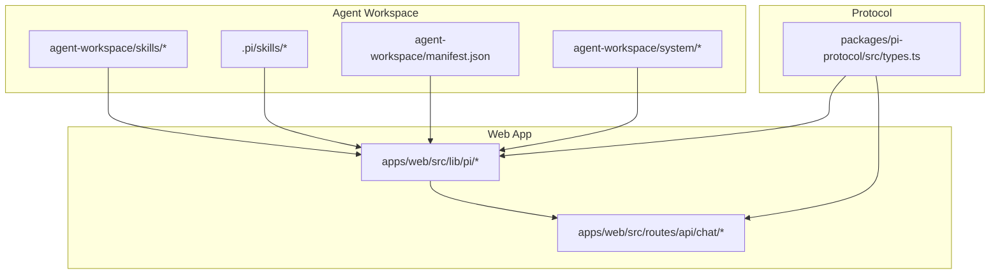
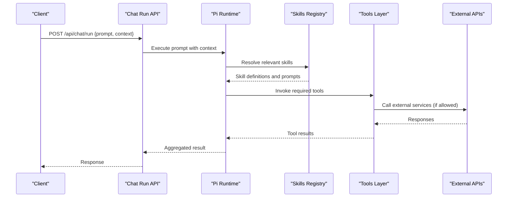
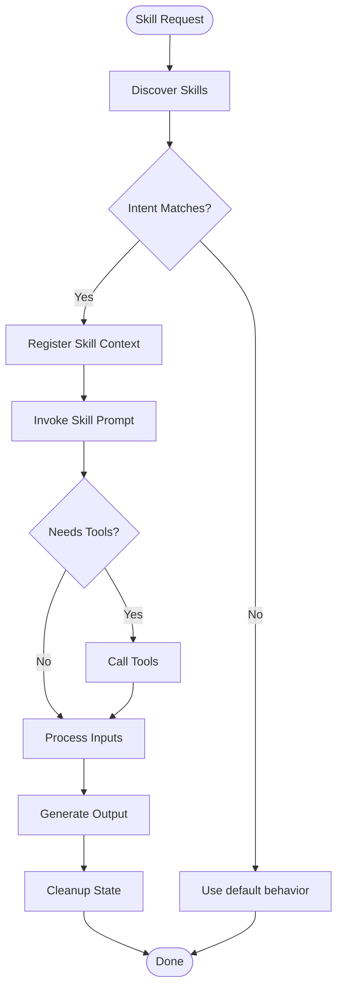
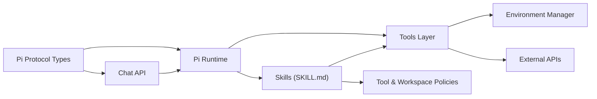

# Extensibility & Skills

<cite>
**Referenced Files in This Document**
- [agent-workspace/skills/codebase-research/SKILL.md](file://agent-workspace/skills/codebase-research/SKILL.md)
- [agent-workspace/skills/doc-gardening/SKILL.md](file://agent-workspace/skills/doc-gardening/SKILL.md)
- [agent-workspace/skills/execution-plan/SKILL.md](file://agent-workspace/skills/execution-plan/SKILL.md)
- [agent-workspace/skills/frontend-design/SKILL.md](file://agent-workspace/skills/frontend-design/SKILL.md)
- [agent-workspace/skills/memory-synthesis/SKILL.md](file://agent-workspace/skills/memory-synthesis/SKILL.md)
- [agent-workspace/.pi/skills/README.md](file://agent-workspace/.pi/skills/README.md)
- [.pi/skills/README.md](file://.pi/skills/README.md)
- [agent-workspace/manifest.json](file://agent-workspace/manifest.json)
- [agent-workspace/system/tool-policy.md](file://agent-workspace/system/tool-policy.md)
- [agent-workspace/system/workspace-policy.md](file://agent-workspace/system/workspace-policy.md)
- [agent-workspace/AGENTS.md](file://agent-workspace/AGENTS.md)
- [apps/web/src/lib/pi/index.ts](file://apps/web/src/lib/pi/index.ts)
- [apps/web/src/lib/pi/skills.ts](file://apps/web/src/lib/pi/skills.ts)
- [apps/web/src/lib/pi/tools.ts](file://apps/web/src/lib/pi/tools.ts)
- [apps/web/src/routes/api/chat/run.ts](file://apps/web/src/routes/api/chat/run.ts)
- [apps/web/src/routes/api/chat/commands.ts](file://apps/web/src/routes/api/chat/commands.ts)
- [apps/web/src/lib/env-manager.ts](file://apps/web/src/lib/env-manager.ts)
- [packages/pi-protocol/src/types.ts](file://packages/pi-protocol/src/types.ts)
</cite>

## Table of Contents

1. [Introduction](#introduction)
2. [Project Structure](#project-structure)
3. [Core Components](#core-components)
4. [Architecture Overview](#architecture-overview)
5. [Detailed Component Analysis](#detailed-component-analysis)
6. [Dependency Analysis](#dependency-analysis)
7. [Performance Considerations](#performance-considerations)
8. [Troubleshooting Guide](#troubleshooting-guide)
9. [Conclusion](#conclusion)
10. [Appendices](#appendices)

## Introduction

This document explains Fleet Pi’s extensibility framework and skills system. It covers how to create custom skills, define prompts, implement tool integrations, and extend agent capabilities. You will learn the skill lifecycle, dependency management, testing strategies, and distribution methods. Practical examples show how to build custom skills, integrate with external APIs, and create reusable components. Best practices for development, performance optimization, and community contribution guidelines are included.

## Project Structure

Fleet Pi organizes skills and extensions across multiple locations:

- Agent workspace skills under agent-workspace/skills provide example implementations and templates.
- Per-agent or per-project skills can be placed under .pi/skills within an agent workspace.
- The runtime loads skills via the Pi protocol and exposes them through API routes.
- Policies and manifests govern behavior, permissions, and discovery.

**Diagram sources**

- [agent-workspace/skills/codebase-research/SKILL.md](file://agent-workspace/skills/codebase-research/SKILL.md)
- [agent-workspace/.pi/skills/README.md](file://agent-workspace/.pi/skills/README.md)
- [agent-workspace/manifest.json](file://agent-workspace/manifest.json)
- [agent-workspace/system/tool-policy.md](file://agent-workspace/system/tool-policy.md)
- [apps/web/src/lib/pi/index.ts](file://apps/web/src/lib/pi/index.ts)
- [apps/web/src/routes/api/chat/run.ts](file://apps/web/src/routes/api/chat/run.ts)
- [packages/pi-protocol/src/types.ts](file://packages/pi-protocol/src/types.ts)

**Section sources**

- [agent-workspace/skills/codebase-research/SKILL.md](file://agent-workspace/skills/codebase-research/SKILL.md)
- [agent-workspace/skills/doc-gardening/SKILL.md](file://agent-workspace/skills/doc-gardening/SKILL.md)
- [agent-workspace/skills/execution-plan/SKILL.md](file://agent-workspace/skills/execution-plan/SKILL.md)
- [agent-workspace/skills/frontend-design/SKILL.md](file://agent-workspace/skills/frontend-design/SKILL.md)
- [agent-workspace/skills/memory-synthesis/SKILL.md](file://agent-workspace/skills/memory-synthesis/SKILL.md)
- [agent-workspace/.pi/skills/README.md](file://agent-workspace/.pi/skills/README.md)
- [.pi/skills/README.md](file://.pi/skills/README.md)
- [agent-workspace/manifest.json](file://agent-workspace/manifest.json)
- [agent-workspace/system/tool-policy.md](file://agent-workspace/system/tool-policy.md)
- [agent-workspace/system/workspace-policy.md](file://agent-workspace/system/workspace-policy.md)
- [apps/web/src/lib/pi/index.ts](file://apps/web/src/lib/pi/index.ts)
- [apps/web/src/routes/api/chat/run.ts](file://apps/web/src/routes/api/chat/run.ts)
- [packages/pi-protocol/src/types.ts](file://packages/pi-protocol/src/types.ts)

## Core Components

- Skill definitions: Each skill is a directory containing a SKILL.md that describes intent, inputs, outputs, and usage patterns. Example skills demonstrate structure and conventions.
- Policy files: Tool and workspace policies constrain what tools and actions skills may invoke.
- Manifest: Declares metadata and dependencies for the agent workspace.
- Runtime integration: The web app’s Pi library discovers and executes skills and tools, exposing endpoints for chat runs and commands.

Key responsibilities:

- SKILL.md files define prompts and expected behaviors for skills.
- Policy files enforce safe execution boundaries.
- The manifest coordinates skill availability and configuration.
- The Pi runtime wires skills to API routes and tool invocations.

**Section sources**

- [agent-workspace/skills/codebase-research/SKILL.md](file://agent-workspace/skills/codebase-research/SKILL.md)
- [agent-workspace/skills/doc-gardening/SKILL.md](file://agent-workspace/skills/doc-gardening/SKILL.md)
- [agent-workspace/skills/execution-plan/SKILL.md](file://agent-workspace/skills/execution-plan/SKILL.md)
- [agent-workspace/skills/frontend-design/SKILL.md](file://agent-workspace/skills/frontend-design/SKILL.md)
- [agent-workspace/skills/memory-synthesis/SKILL.md](file://agent-workspace/skills/memory-synthesis/SKILL.md)
- [agent-workspace/system/tool-policy.md](file://agent-workspace/system/tool-policy.md)
- [agent-workspace/system/workspace-policy.md](file://agent-workspace/system/workspace-policy.md)
- [agent-workspace/manifest.json](file://agent-workspace/manifest.json)

## Architecture Overview

The extensibility architecture connects user requests to skills and tools via the Pi protocol and API layer.

**Diagram sources**

- [apps/web/src/routes/api/chat/run.ts](file://apps/web/src/routes/api/chat/run.ts)
- [apps/web/src/lib/pi/index.ts](file://apps/web/src/lib/pi/index.ts)
- [apps/web/src/lib/pi/skills.ts](file://apps/web/src/lib/pi/skills.ts)
- [apps/web/src/lib/pi/tools.ts](file://apps/web/src/lib/pi/tools.ts)
- [packages/pi-protocol/src/types.ts](file://packages/pi-protocol/src/types.ts)

## Detailed Component Analysis

### Skill Definition and Lifecycle

A skill is defined by a SKILL.md file describing its purpose, inputs, outputs, and usage guidance. The runtime discovers skills from known directories and integrates them into the agent’s capability set.

Lifecycle stages:

- Discovery: The runtime scans skill directories and reads SKILL.md files.
- Registration: Skills are registered with their prompts and metadata.
- Invocation: When a request matches a skill’s intent, the runtime invokes it with provided context.
- Execution: The skill may call tools, read/write workspace artifacts, and return results.
- Teardown: Any temporary state is cleaned up; logs and traces are persisted.

**Diagram sources**

- [agent-workspace/skills/codebase-research/SKILL.md](file://agent-workspace/skills/codebase-research/SKILL.md)
- [agent-workspace/skills/doc-gardening/SKILL.md](file://agent-workspace/skills/doc-gardening/SKILL.md)
- [agent-workspace/skills/execution-plan/SKILL.md](file://agent-workspace/skills/execution-plan/SKILL.md)
- [agent-workspace/skills/frontend-design/SKILL.md](file://agent-workspace/skills/frontend-design/SKILL.md)
- [agent-workspace/skills/memory-synthesis/SKILL.md](file://agent-workspace/skills/memory-synthesis/SKILL.md)
- [apps/web/src/lib/pi/skills.ts](file://apps/web/src/lib/pi/skills.ts)

**Section sources**

- [agent-workspace/skills/codebase-research/SKILL.md](file://agent-workspace/skills/codebase-research/SKILL.md)
- [agent-workspace/skills/doc-gardening/SKILL.md](file://agent-workspace/skills/doc-gardening/SKILL.md)
- [agent-workspace/skills/execution-plan/SKILL.md](file://agent-workspace/skills/execution-plan/SKILL.md)
- [agent-workspace/skills/frontend-design/SKILL.md](file://agent-workspace/skills/frontend-design/SKILL.md)
- [agent-workspace/skills/memory-synthesis/SKILL.md](file://agent-workspace/skills/memory-synthesis/SKILL.md)
- [apps/web/src/lib/pi/skills.ts](file://apps/web/src/lib/pi/skills.ts)

### Prompts and Instructions

Prompts are authored in SKILL.md files and guide the agent’s behavior for each skill. They should specify:

- Goal and scope
- Required inputs and constraints
- Expected outputs and formats
- Tool usage rules and safety considerations

Best practices:

- Keep prompts concise and deterministic where possible.
- Define clear success criteria and error conditions.
- Reference policies to ensure compliance.

**Section sources**

- [agent-workspace/skills/codebase-research/SKILL.md](file://agent-workspace/skills/codebase-research/SKILL.md)
- [agent-workspace/skills/doc-gardening/SKILL.md](file://agent-workspace/skills/doc-gardening/SKILL.md)
- [agent-workspace/skills/execution-plan/SKILL.md](file://agent-workspace/skills/execution-plan/SKILL.md)
- [agent-workspace/skills/frontend-design/SKILL.md](file://agent-workspace/skills/frontend-design/SKILL.md)
- [agent-workspace/skills/memory-synthesis/SKILL.md](file://agent-workspace/skills/memory-synthesis/SKILL.md)

### Tool Integrations

Tools are invoked by skills to perform actions such as reading files, running commands, or calling external APIs. The tools layer enforces policy and manages credentials.

Integration steps:

- Declare tool requirements in the skill definition.
- Implement tool handlers in the tools module.
- Use environment variables for secrets and configuration.
- Validate inputs and handle errors gracefully.

Security considerations:

- Follow tool-policy.md to restrict dangerous operations.
- Scope tool access to necessary resources only.
- Log and audit tool calls for traceability.

**Section sources**

- [apps/web/src/lib/pi/tools.ts](file://apps/web/src/lib/pi/tools.ts)
- [agent-workspace/system/tool-policy.md](file://agent-workspace/system/tool-policy.md)
- [apps/web/src/lib/env-manager.ts](file://apps/web/src/lib/env-manager.ts)

### API Endpoints and Command Routing

The chat run endpoint orchestrates skill execution and tool invocation. Commands can trigger specific skills or workflows.

Flow overview:

- Client sends a request with prompt and context.
- API validates input and delegates to Pi runtime.
- Pi resolves skills and executes prompts.
- Tools are called as needed, respecting policies.
- Results are aggregated and returned.

**Section sources**

- [apps/web/src/routes/api/chat/run.ts](file://apps/web/src/routes/api/chat/run.ts)
- [apps/web/src/routes/api/chat/commands.ts](file://apps/web/src/routes/api/chat/commands.ts)
- [apps/web/src/lib/pi/index.ts](file://apps/web/src/lib/pi/index.ts)

### Manifest and Dependencies

The manifest declares metadata and dependencies for the agent workspace, including available skills and configurations.

Guidelines:

- List all skills and versions explicitly.
- Specify required tools and environment variables.
- Keep dependencies minimal and auditable.

**Section sources**

- [agent-workspace/manifest.json](file://agent-workspace/manifest.json)

### Protocol Types and Contracts

The Pi protocol defines types and contracts used by skills, tools, and API layers.

Recommendations:

- Align skill inputs/outputs with protocol types.
- Update types when extending capabilities.
- Validate payloads against schema before processing.

**Section sources**

- [packages/pi-protocol/src/types.ts](file://packages/pi-protocol/src/types.ts)

## Dependency Analysis

Skills depend on tools and policies; the runtime depends on the protocol and API layer.

**Diagram sources**

- [agent-workspace/skills/codebase-research/SKILL.md](file://agent-workspace/skills/codebase-research/SKILL.md)
- [apps/web/src/lib/pi/tools.ts](file://apps/web/src/lib/pi/tools.ts)
- [apps/web/src/lib/env-manager.ts](file://apps/web/src/lib/env-manager.ts)
- [apps/web/src/routes/api/chat/run.ts](file://apps/web/src/routes/api/chat/run.ts)
- [packages/pi-protocol/src/types.ts](file://packages/pi-protocol/src/types.ts)

**Section sources**

- [agent-workspace/manifest.json](file://agent-workspace/manifest.json)
- [apps/web/src/lib/pi/index.ts](file://apps/web/src/lib/pi/index.ts)
- [apps/web/src/lib/pi/skills.ts](file://apps/web/src/lib/pi/skills.ts)
- [apps/web/src/lib/pi/tools.ts](file://apps/web/src/lib/pi/tools.ts)
- [apps/web/src/routes/api/chat/run.ts](file://apps/web/src/routes/api/chat/run.ts)
- [packages/pi-protocol/src/types.ts](file://packages/pi-protocol/src/types.ts)

## Performance Considerations

- Minimize tool calls: Batch operations and cache results where appropriate.
- Stream responses: For long-running tasks, stream progress updates to clients.
- Limit scope: Provide precise prompts to reduce unnecessary computation.
- Avoid heavy I/O: Prefer lightweight checks and incremental updates.
- Profile skills: Measure latency and resource usage during development.

[No sources needed since this section provides general guidance]

## Troubleshooting Guide

Common issues and resolutions:

- Skill not discovered: Ensure SKILL.md exists in a recognized directory and follows naming conventions.
- Tool permission denied: Review tool-policy.md and adjust permissions accordingly.
- Missing environment variables: Configure secrets via env-manager and verify at runtime.
- Protocol mismatch: Validate payloads against packages/pi-protocol types.
- API errors: Inspect chat run logs and command routing paths.

Debugging tips:

- Enable verbose logging in development.
- Use evals and examples in skills to validate behavior.
- Test tool integrations in isolation before combining with skills.

**Section sources**

- [agent-workspace/system/tool-policy.md](file://agent-workspace/system/tool-policy.md)
- [apps/web/src/lib/env-manager.ts](file://apps/web/src/lib/env-manager.ts)
- [apps/web/src/routes/api/chat/run.ts](file://apps/web/src/routes/api/chat/run.ts)
- [apps/web/src/routes/api/chat/commands.ts](file://apps/web/src/routes/api/chat/commands.ts)
- [packages/pi-protocol/src/types.ts](file://packages/pi-protocol/src/types.ts)

## Conclusion

Fleet Pi’s extensibility framework enables powerful, policy-driven skills and tool integrations. By following the documented structure, policies, and best practices, you can build robust custom skills, integrate external APIs safely, and distribute capabilities effectively. Consistent use of prompts, protocols, and testing ensures reliability and maintainability across your agent ecosystem.

[No sources needed since this section summarizes without analyzing specific files]

## Appendices

### Creating a Custom Skill: Step-by-Step

- Create a new directory under agent-workspace/skills or .pi/skills.
- Add a SKILL.md defining goal, inputs, outputs, and tool usage.
- Implement any required tools in the tools module.
- Update manifest if adding new dependencies.
- Test via chat run endpoint and review logs.

**Section sources**

- [agent-workspace/skills/codebase-research/SKILL.md](file://agent-workspace/skills/codebase-research/SKILL.md)
- [agent-workspace/skills/doc-gardening/SKILL.md](file://agent-workspace/skills/doc-gardening/SKILL.md)
- [agent-workspace/skills/execution-plan/SKILL.md](file://agent-workspace/skills/execution-plan/SKILL.md)
- [agent-workspace/skills/frontend-design/SKILL.md](file://agent-workspace/skills/frontend-design/SKILL.md)
- [agent-workspace/skills/memory-synthesis/SKILL.md](file://agent-workspace/skills/memory-synthesis/SKILL.md)
- [agent-workspace/manifest.json](file://agent-workspace/manifest.json)
- [apps/web/src/lib/pi/tools.ts](file://apps/web/src/lib/pi/tools.ts)

### Integrating with External APIs

- Define tool handlers for API calls.
- Store credentials securely using environment variables.
- Handle retries, timeouts, and errors gracefully.
- Respect rate limits and caching strategies.

**Section sources**

- [apps/web/src/lib/pi/tools.ts](file://apps/web/src/lib/pi/tools.ts)
- [apps/web/src/lib/env-manager.ts](file://apps/web/src/lib/env-manager.ts)

### Testing Strategies

- Unit test tool handlers independently.
- Use evals and examples in SKILL.md to validate end-to-end flows.
- Simulate external API responses for deterministic tests.
- Monitor performance and correctness in staging environments.

**Section sources**

- [agent-workspace/skills/codebase-research/SKILL.md](file://agent-workspace/skills/codebase-research/SKILL.md)
- [agent-workspace/skills/doc-gardening/SKILL.md](file://agent-workspace/skills/doc-gardening/SKILL.md)
- [agent-workspace/skills/execution-plan/SKILL.md](file://agent-workspace/skills/execution-plan/SKILL.md)
- [agent-workspace/skills/frontend-design/SKILL.md](file://agent-workspace/skills/frontend-design/SKILL.md)
- [agent-workspace/skills/memory-synthesis/SKILL.md](file://agent-workspace/skills/memory-synthesis/SKILL.md)

### Distribution Methods

- Package skills into repositories or archives.
- Include SKILL.md, tool implementations, and manifest.
- Provide installation instructions and prerequisites.
- Version skills and update dependencies carefully.

**Section sources**

- [agent-workspace/manifest.json](file://agent-workspace/manifest.json)
- [agent-workspace/.pi/skills/README.md](file://agent-workspace/.pi/skills/README.md)
- [.pi/skills/README.md](file://.pi/skills/README.md)

### Best Practices for Skill Development

- Keep prompts focused and explicit.
- Enforce policies strictly; avoid bypassing restrictions.
- Document assumptions and edge cases.
- Iterate based on evals and user feedback.

**Section sources**

- [agent-workspace/system/tool-policy.md](file://agent-workspace/system/tool-policy.md)
- [agent-workspace/system/workspace-policy.md](file://agent-workspace/system/workspace-policy.md)
- [agent-workspace/AGENTS.md](file://agent-workspace/AGENTS.md)
