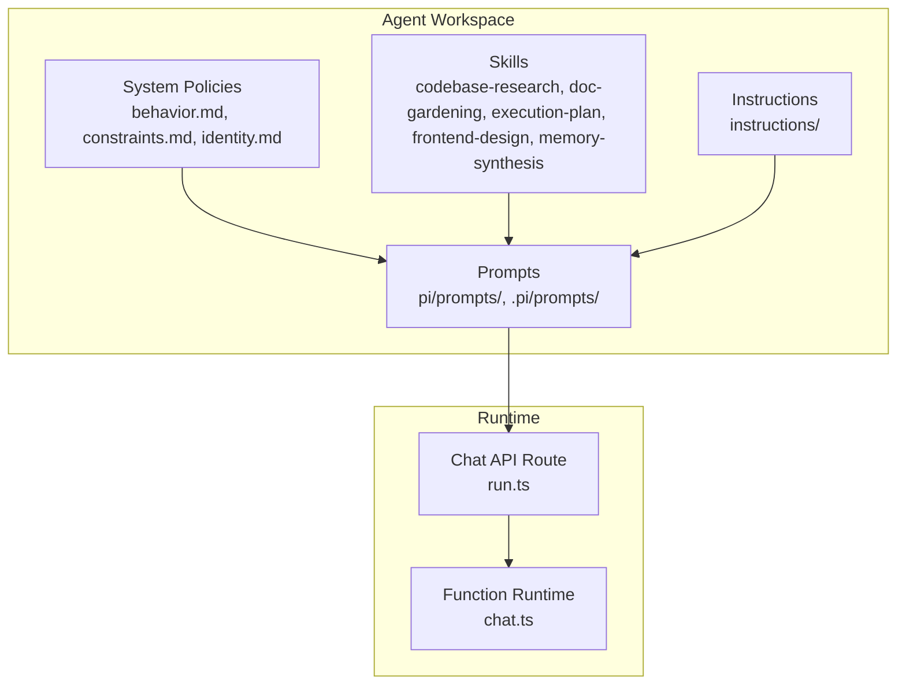
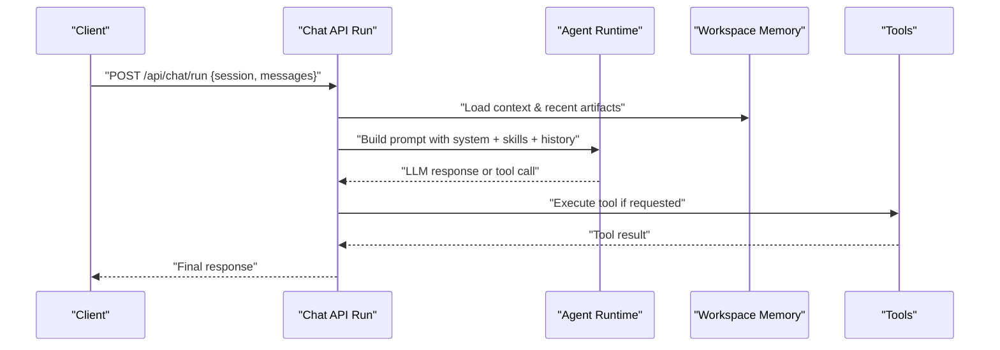
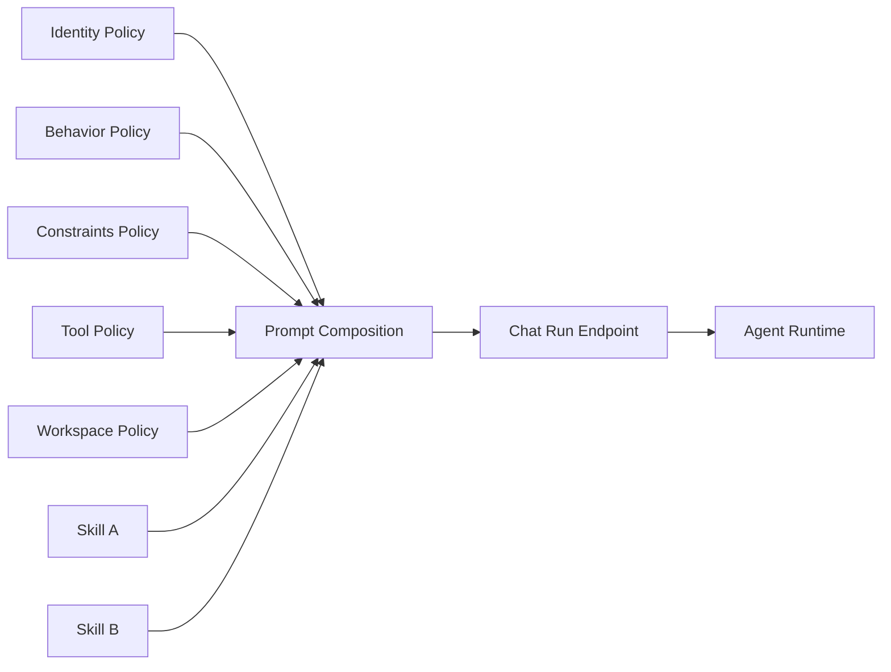

# Prompt Engineering

<cite>
**Referenced Files in This Document**
- [README.md](file://README.md)
- [AGENTS.md](file://AGENTS.md)
- [WORKSPACE.md](file://WORKSPACE.md)
- [CONTEXT.md](file://CONTEXT.md)
- [DESIGN.md](file://DESIGN.md)
- [PRODUCT.md](file://PRODUCT.md)
- [agent-workspace/AGENTS.md](file://agent-workspace/AGENTS.md)
- [agent-workspace/ARCHITECTURE.md](file://agent-workspace/ARCHITECTURE.md)
- [agent-workspace/system/behavior.md](file://agent-workspace/system/behavior.md)
- [agent-workspace/system/constraints.md](file://agent-workspace/system/constraints.md)
- [agent-workspace/system/identity.md](file://agent-workspace/system/identity.md)
- [agent-workspace/system/tool-policy.md](file://agent-workspace/system/tool-policy.md)
- [agent-workspace/system/workspace-policy.md](file://agent-workspace/system/workspace-policy.md)
- [agent-workspace/instructions/](file://agent-workspace/instructions/)
- [agent-workspace/skills/codebase-research/SKILL.md](file://agent-workspace/skills/codebase-research/SKILL.md)
- [agent-workspace/skills/doc-gardening/SKILL.md](file://agent-workspace/skills/doc-gardening/SKILL.md)
- [agent-workspace/skills/execution-plan/SKILL.md](file://agent-workspace/skills/execution-plan/SKILL.md)
- [agent-workspace/skills/frontend-design/SKILL.md](file://agent-workspace/skills/frontend-design/SKILL.md)
- [agent-workspace/skills/memory-synthesis/SKILL.md](file://agent-workspace/skills/memory-synthesis/SKILL.md)
- [agent-workspace/pi/prompts/](file://agent-workspace/pi/prompts/)
- [agent-workspace/.pi/prompts/](file://agent-workspace/.pi/prompts/)
- [apps/web/src/routes/api/chat/run.ts](file://apps/web/src/routes/api/chat/run.ts)
- [apps/web/src/lib/pi/](file://apps/web/src/lib/pi/)
- [functions/chat.ts](file://functions/chat.ts)
</cite>

## Table of Contents

1. [Introduction](#introduction)
2. [Project Structure](#project-structure)
3. [Core Components](#core-components)
4. [Architecture Overview](#architecture-overview)
5. [Detailed Component Analysis](#detailed-component-analysis)
6. [Dependency Analysis](#dependency-analysis)
7. [Performance Considerations](#performance-considerations)
8. [Troubleshooting Guide](#troubleshooting-guide)
9. [Conclusion](#conclusion)
10. [Appendices](#appendices)

## Introduction

This document explains how to engineer effective prompts within Fleet Pi’s extensibility framework. It covers prompt structure, system instructions, conversation templates, variable substitution, conditional logic, and context management. It also provides guidelines for writing clear, actionable prompts that steer agent behavior, along with testing methodologies, performance optimization techniques, and security considerations. The guidance is grounded in the repository’s agent workspace conventions, system policies, skills, and chat runtime.

## Project Structure

Fleet Pi organizes prompts and agent behavior across several layers:

- System-level directives define identity, behavior, constraints, tool usage, and workspace policy.
- Skills encapsulate reusable behaviors and prompt patterns for specific domains.
- Prompts live under agent workspace directories and are consumed by the chat runtime.
- The web API routes orchestrate chat runs and integrate with the underlying agent runtime.

**Diagram sources**

- [agent-workspace/system/behavior.md](file://agent-workspace/system/behavior.md)
- [agent-workspace/system/constraints.md](file://agent-workspace/system/constraints.md)
- [agent-workspace/system/identity.md](file://agent-workspace/system/identity.md)
- [agent-workspace/skills/codebase-research/SKILL.md](file://agent-workspace/skills/codebase-research/SKILL.md)
- [agent-workspace/skills/doc-gardening/SKILL.md](file://agent-workspace/skills/doc-gardening/SKILL.md)
- [agent-workspace/skills/execution-plan/SKILL.md](file://agent-workspace/skills/execution-plan/SKILL.md)
- [agent-workspace/skills/frontend-design/SKILL.md](file://agent-workspace/skills/frontend-design/SKILL.md)
- [agent-workspace/skills/memory-synthesis/SKILL.md](file://agent-workspace/skills/memory-synthesis/SKILL.md)
- [agent-workspace/pi/prompts/](file://agent-workspace/pi/prompts/)
- [agent-workspace/.pi/prompts/](file://agent-workspace/.pi/prompts/)
- [apps/web/src/routes/api/chat/run.ts](file://apps/web/src/routes/api/chat/run.ts)
- [functions/chat.ts](file://functions/chat.ts)

**Section sources**

- [README.md](file://README.md)
- [AGENTS.md](file://AGENTS.md)
- [WORKSPACE.md](file://WORKSPACE.md)
- [CONTEXT.md](file://CONTEXT.md)
- [DESIGN.md](file://DESIGN.md)
- [PRODUCT.md](file://PRODUCT.md)
- [agent-workspace/AGENTS.md](file://agent-workspace/AGENTS.md)
- [agent-workspace/ARCHITECTURE.md](file://agent-workspace/ARCHITECTURE.md)

## Core Components

- System policies (identity, behavior, constraints, tool policy, workspace policy) provide foundational instructions that shape all prompts and agent actions.
- Skills define domain-specific capabilities and include reusable prompt patterns and evaluation references.
- Prompts directory contains templates used at runtime to assemble messages for the LLM.
- Chat API route coordinates request handling, session state, and invocation of the agent runtime.

Key responsibilities:

- System policies: enforce safety, scope, and operational boundaries.
- Skills: standardize task-oriented prompting and outputs.
- Prompts: template-based message construction with variables and conditionals.
- Chat runtime: manage conversation history, context injection, and tool calls.

**Section sources**

- [agent-workspace/system/behavior.md](file://agent-workspace/system/behavior.md)
- [agent-workspace/system/constraints.md](file://agent-workspace/system/constraints.md)
- [agent-workspace/system/identity.md](file://agent-workspace/system/identity.md)
- [agent-workspace/system/tool-policy.md](file://agent-workspace/system/tool-policy.md)
- [agent-workspace/system/workspace-policy.md](file://agent-workspace/system/workspace-policy.md)
- [agent-workspace/skills/codebase-research/SKILL.md](file://agent-workspace/skills/codebase-research/SKILL.md)
- [agent-workspace/skills/doc-gardening/SKILL.md](file://agent-workspace/skills/doc-gardening/SKILL.md)
- [agent-workspace/skills/execution-plan/SKILL.md](file://agent-workspace/skills/execution-plan/SKILL.md)
- [agent-workspace/skills/frontend-design/SKILL.md](file://agent-workspace/skills/frontend-design/SKILL.md)
- [agent-workspace/skills/memory-synthesis/SKILL.md](file://agent-workspace/skills/memory-synthesis/SKILL.md)
- [apps/web/src/routes/api/chat/run.ts](file://apps/web/src/routes/api/chat/run.ts)
- [functions/chat.ts](file://functions/chat.ts)

## Architecture Overview

The prompt engineering architecture integrates system policies, skills, and prompt templates into a cohesive runtime flow. When a user sends a message, the chat route assembles context from session state, injects relevant system and skill prompts, and invokes the agent runtime to generate responses or execute tools.

**Diagram sources**

- [apps/web/src/routes/api/chat/run.ts](file://apps/web/src/routes/api/chat/run.ts)
- [functions/chat.ts](file://functions/chat.ts)

## Detailed Component Analysis

### System Instructions and Policies

System instructions define who the agent is, how it behaves, what it must avoid, and how it may use tools and workspace resources. These files act as the authoritative source of truth for prompt composition and runtime behavior.

Guidelines:

- Keep identity concise and role-focused.
- Enumerate explicit constraints and safety rules.
- Define tool usage boundaries and approval flows.
- Clarify workspace access and data handling policies.

Best practices:

- Use imperative, unambiguous language.
- Separate concerns across files (identity, behavior, constraints, tool policy, workspace policy).
- Reference external policies only when necessary; prefer embedding critical rules directly.

Security considerations:

- Avoid instructing the agent to expose secrets or sensitive data.
- Enforce least privilege for tool access.
- Explicitly forbid unauthorized operations.

**Section sources**

- [agent-workspace/system/identity.md](file://agent-workspace/system/identity.md)
- [agent-workspace/system/behavior.md](file://agent-workspace/system/behavior.md)
- [agent-workspace/system/constraints.md](file://agent-workspace/system/constraints.md)
- [agent-workspace/system/tool-policy.md](file://agent-workspace/system/tool-policy.md)
- [agent-workspace/system/workspace-policy.md](file://agent-workspace/system/workspace-policy.md)

### Skills and Reusable Prompt Patterns

Skills encapsulate domain-specific behaviors and include standardized prompts, examples, and evaluation criteria. They promote consistency and reusability across tasks.

How to craft effective skills:

- Define a clear objective and expected output format.
- Provide step-by-step instructions and decision points.
- Include examples and anti-patterns.
- Link to evals where applicable.

Common skill categories:

- Codebase research: search, summarize, and trace changes.
- Documentation gardening: maintain clarity and structure.
- Execution planning: break down tasks and track progress.
- Frontend design: produce UI specifications and components.
- Memory synthesis: consolidate insights and decisions.

**Section sources**

- [agent-workspace/skills/codebase-research/SKILL.md](file://agent-workspace/skills/codebase-research/SKILL.md)
- [agent-workspace/skills/doc-gardening/SKILL.md](file://agent-workspace/skills/doc-gardening/SKILL.md)
- [agent-workspace/skills/execution-plan/SKILL.md](file://agent-workspace/skills/execution-plan/SKILL.md)
- [agent-workspace/skills/frontend-design/SKILL.md](file://agent-workspace/skills/frontend-design/SKILL.md)
- [agent-workspace/skills/memory-synthesis/SKILL.md](file://agent-workspace/skills/memory-synthesis/SKILL.md)

### Prompt Templates and Variable Substitution

Prompt templates reside under the agent workspace prompts directories and are composed at runtime. Effective templates:

- Use descriptive placeholders for variables (e.g., user input, retrieved context, tool results).
- Apply conditional logic to include or exclude sections based on available data.
- Maintain consistent formatting for predictable parsing.

Variable substitution guidelines:

- Always validate inputs before substitution.
- Escape special characters to prevent injection.
- Provide sensible defaults for optional variables.

Conditional logic guidelines:

- Prefer explicit flags over implicit assumptions.
- Keep branches minimal and testable.
- Log which branch was taken for observability.

Context management guidelines:

- Inject only the most relevant snippets to reduce noise.
- Summarize long histories when needed.
- Tag context sources for traceability.

Testing methodologies:

- Unit-test templates with sample payloads.
- Validate outputs against schema expectations.
- Perform regression checks after template updates.

Performance optimization techniques:

- Cache frequently used template expansions.
- Limit context window size via summarization.
- Defer heavy computations until necessary.

Security considerations:

- Sanitize user-provided variables.
- Restrict file paths and commands allowed in prompts.
- Audit tool invocations triggered by prompts.

**Section sources**

- [agent-workspace/pi/prompts/](file://agent-workspace/pi/prompts/)
- [agent-workspace/.pi/prompts/](file://agent-workspace/.pi/prompts/)
- [apps/web/src/routes/api/chat/run.ts](file://apps/web/src/routes/api/chat/run.ts)

### Conversation Templates and Flow Control

Conversation templates structure multi-turn interactions:

- Start with a system message establishing role and constraints.
- Follow with user intent and required context.
- Include assistant steps and tool call instructions.
- End with a clear action request or confirmation prompt.

Flow control best practices:

- Use explicit checkpoints for complex workflows.
- Ask clarifying questions when inputs are ambiguous.
- Provide structured outputs for downstream processing.

Anti-patterns to avoid:

- Overloading a single prompt with too many tasks.
- Using vague instructions without measurable outcomes.
- Hardcoding environment-specific details in templates.

**Section sources**

- [agent-workspace/instructions/](file://agent-workspace/instructions/)
- [apps/web/src/routes/api/chat/run.ts](file://apps/web/src/routes/api/chat/run.ts)

### Chat Runtime Integration

The chat run endpoint orchestrates prompt assembly, context loading, and agent invocation. It ensures consistent behavior across sessions and integrates with tools and memory.

Key responsibilities:

- Validate requests and session state.
- Compose system, skill, and user prompts.
- Manage conversation history and context injection.
- Handle tool calls and results.
- Return structured responses.

Integration points:

- Workspace memory for retrieval-augmented context.
- Tool registry for executing actions.
- Logging and tracing for observability.

**Section sources**

- [apps/web/src/routes/api/chat/run.ts](file://apps/web/src/routes/api/chat/run.ts)
- [functions/chat.ts](file://functions/chat.ts)

## Dependency Analysis

Prompt engineering depends on multiple layers:

- System policies influence all prompts.
- Skills contribute domain-specific instructions.
- Prompts compose final messages for the LLM.
- Chat runtime binds everything together.

**Diagram sources**

- [agent-workspace/system/identity.md](file://agent-workspace/system/identity.md)
- [agent-workspace/system/behavior.md](file://agent-workspace/system/behavior.md)
- [agent-workspace/system/constraints.md](file://agent-workspace/system/constraints.md)
- [agent-workspace/system/tool-policy.md](file://agent-workspace/system/tool-policy.md)
- [agent-workspace/system/workspace-policy.md](file://agent-workspace/system/workspace-policy.md)
- [agent-workspace/skills/codebase-research/SKILL.md](file://agent-workspace/skills/codebase-research/SKILL.md)
- [agent-workspace/skills/doc-gardening/SKILL.md](file://agent-workspace/skills/doc-gardening/SKILL.md)
- [apps/web/src/routes/api/chat/run.ts](file://apps/web/src/routes/api/chat/run.ts)

**Section sources**

- [agent-workspace/system/behavior.md](file://agent-workspace/system/behavior.md)
- [agent-workspace/system/constraints.md](file://agent-workspace/system/constraints.md)
- [agent-workspace/system/identity.md](file://agent-workspace/system/identity.md)
- [agent-workspace/system/tool-policy.md](file://agent-workspace/system/tool-policy.md)
- [agent-workspace/system/workspace-policy.md](file://agent-workspace/system/workspace-policy.md)
- [apps/web/src/routes/api/chat/run.ts](file://apps/web/src/routes/api/chat/run.ts)

## Performance Considerations

- Minimize token usage by pruning irrelevant context and summarizing long histories.
- Cache expanded templates and frequent context snippets.
- Use streaming responses where possible to improve perceived latency.
- Batch tool calls when safe and efficient.
- Monitor token consumption and adjust prompts to stay within limits.

[No sources needed since this section provides general guidance]

## Troubleshooting Guide

Common issues and resolutions:

- Vague prompts leading to inconsistent outputs: refine instructions and add explicit success criteria.
- Excessive context causing truncation: prioritize relevance and summarize.
- Unsafe tool usage: enforce tool policy and restrict permissions.
- Template errors due to missing variables: validate inputs and provide defaults.
- Slow responses: optimize context selection and enable caching.

Debugging tips:

- Inspect assembled prompts before sending to the LLM.
- Log which skill or policy contributed to the final prompt.
- Track tool call arguments and results for auditability.

**Section sources**

- [agent-workspace/system/tool-policy.md](file://agent-workspace/system/tool-policy.md)
- [apps/web/src/routes/api/chat/run.ts](file://apps/web/src/routes/api/chat/run.ts)

## Conclusion

Effective prompt engineering in Fleet Pi hinges on clear system policies, well-structured skills, and robust prompt templates. By following the guidelines for variable substitution, conditional logic, and context management—and by applying testing, performance, and security best practices—you can craft prompts that reliably guide agent behavior and deliver consistent, high-quality outcomes.

[No sources needed since this section summarizes without analyzing specific files]

## Appendices

### Prompt Testing Methodologies

- Unit tests for template expansion with edge cases.
- Regression tests to ensure stability after updates.
- Evals linked from skills to measure quality and correctness.

**Section sources**

- [agent-workspace/skills/codebase-research/SKILL.md](file://agent-workspace/skills/codebase-research/SKILL.md)
- [agent-workspace/skills/doc-gardening/SKILL.md](file://agent-workspace/skills/doc-gardening/SKILL.md)
- [agent-workspace/skills/execution-plan/SKILL.md](file://agent-workspace/skills/execution-plan/SKILL.md)
- [agent-workspace/skills/frontend-design/SKILL.md](file://agent-workspace/skills/frontend-design/SKILL.md)
- [agent-workspace/skills/memory-synthesis/SKILL.md](file://agent-workspace/skills/memory-synthesis/SKILL.md)

### Security Considerations

- Sanitize all user inputs before substitution.
- Enforce strict tool policies and least-privilege access.
- Avoid embedding secrets or sensitive data in prompts.
- Audit and log tool invocations triggered by prompts.

**Section sources**

- [agent-workspace/system/constraints.md](file://agent-workspace/system/constraints.md)
- [agent-workspace/system/tool-policy.md](file://agent-workspace/system/tool-policy.md)
- [agent-workspace/system/workspace-policy.md](file://agent-workspace/system/workspace-policy.md)
