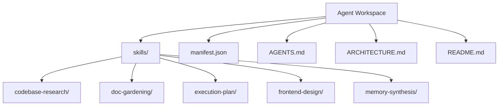
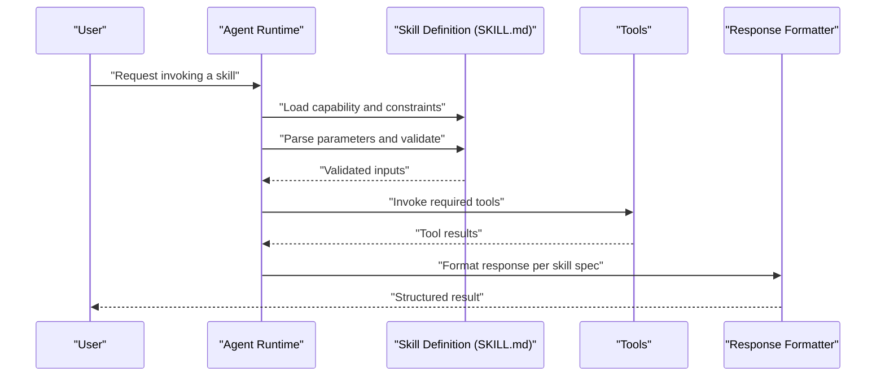
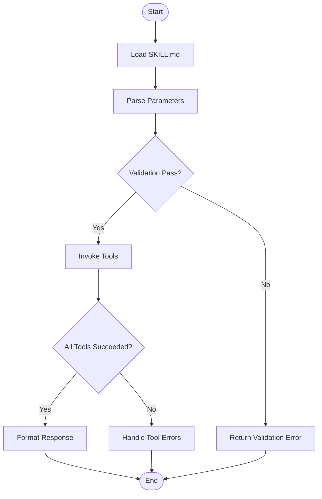
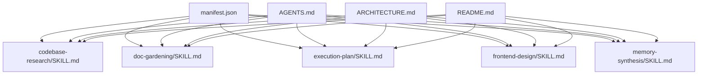

# Skill Development

<cite>
**Referenced Files in This Document**
- [SKILL.md](file://agent-workspace/skills/codebase-research/SKILL.md)
- [evals.md](file://agent-workspace/skills/codebase-research/evals.md)
- [examples.md](file://agent-workspace/skills/codebase-research/examples.md)
- [SKILL.md](file://agent-workspace/skills/doc-gardening/SKILL.md)
- [SKILL.md](file://agent-workspace/skills/execution-plan/SKILL.md)
- [SKILL.md](file://agent-workspace/skills/frontend-design/SKILL.md)
- [SKILL.md](file://agent-workspace/skills/memory-synthesis/SKILL.md)
- [manifest.json](file://agent-workspace/manifest.json)
- [AGENTS.md](file://agent-workspace/AGENTS.md)
- [ARCHITECTURE.md](file://agent-workspace/ARCHITECTURE.md)
- [README.md](file://agent-workspace/README.md)
</cite>

## Table of Contents

1. [Introduction](#introduction)
2. [Project Structure](#project-structure)
3. [Core Components](#core-components)
4. [Architecture Overview](#architecture-overview)
5. [Detailed Component Analysis](#detailed-component-analysis)
6. [Dependency Analysis](#dependency-analysis)
7. [Performance Considerations](#performance-considerations)
8. [Troubleshooting Guide](#troubleshooting-guide)
9. [Conclusion](#conclusion)
10. [Appendices](#appendices)

## Introduction

This document explains how to develop custom skills for Fleet Pi’s agent workspace. It covers the skill architecture, required file structure, and the SKILL.md format used to define capabilities, tool integrations, parameters, responses, and lifecycle behavior. You will find step-by-step guidance to create your first skill, best practices for organizing skills, error handling patterns, and testing strategies. Concrete references are provided from existing skills such as codebase-research, doc-gardening, execution-plan, frontend-design, and memory-synthesis.

## Project Structure

Skills live under the agent workspace’s skills directory. Each skill is a folder containing at least a SKILL.md that describes its purpose, inputs, outputs, tools, and constraints. Optional companion files (e.g., evals.md, examples.md) can provide evaluation criteria and usage examples. The agent workspace manifest and top-level documents coordinate discovery and runtime behavior.

**Diagram sources**

- [manifest.json](file://agent-workspace/manifest.json)
- [AGENTS.md](file://agent-workspace/AGENTS.md)
- [ARCHITECTURE.md](file://agent-workspace/ARCHITECTURE.md)
- [README.md](file://agent-workspace/README.md)

**Section sources**

- [manifest.json](file://agent-workspace/manifest.json)
- [AGENTS.md](file://agent-workspace/AGENTS.md)
- [ARCHITECTURE.md](file://agent-workspace/ARCHITECTURE.md)
- [README.md](file://agent-workspace/README.md)

## Core Components

A skill is primarily defined by:

- SKILL.md: Declares capability description, inputs/parameters, expected outputs, tool usage, constraints, and lifecycle notes.
- Optional documentation: evals.md for evaluation criteria; examples.md for usage scenarios.
- Integration points: Tools referenced within SKILL.md are invoked by the agent during execution. Parameters and responses must be clearly specified to ensure reliable orchestration.

Key responsibilities:

- Capability definition: What the skill does and when it should be used.
- Tool integration: Which external or internal tools are called and with what arguments.
- Parameter handling: Input validation, defaults, and error messages.
- Response formatting: Structured outputs suitable for downstream consumption.
- Lifecycle management: Initialization, execution, cleanup, and state considerations.

**Section sources**

- [SKILL.md](file://agent-workspace/skills/codebase-research/SKILL.md)
- [evals.md](file://agent-workspace/skills/codebase-research/evals.md)
- [examples.md](file://agent-workspace/skills/codebase-research/examples.md)
- [SKILL.md](file://agent-workspace/skills/doc-gardening/SKILL.md)
- [SKILL.md](file://agent-workspace/skills/execution-plan/SKILL.md)
- [SKILL.md](file://agent-workspace/skills/frontend-design/SKILL.md)
- [SKILL.md](file://agent-workspace/skills/memory-synthesis/SKILL.md)

## Architecture Overview

The skill system follows a declarative model where each SKILL.md acts as a contract between the agent runtime and the skill implementation. The agent discovers skills via the workspace manifest and loads their definitions to determine invocation context, available tools, and expected I/O shapes. During execution, the agent parses user requests, selects an appropriate skill, validates parameters, invokes tools, and formats responses according to the skill’s specification.

[No sources needed since this diagram shows conceptual workflow, not actual code structure]

## Detailed Component Analysis

### Skill Definition Format (SKILL.md)

Use SKILL.md to describe:

- Purpose and scope: When to use the skill and what problem it solves.
- Inputs and parameters: Required and optional fields, types, defaults, and validation rules.
- Outputs: Expected response schema and any post-processing steps.
- Tools: Names and roles of tools used, including argument mapping and error handling expectations.
- Constraints: Limits on scope, environment requirements, and safety policies.
- Lifecycle: Initialization steps, execution phases, and cleanup actions.

Best practices:

- Keep descriptions concise and unambiguous.
- Enumerate all parameters explicitly, including defaults.
- Define clear success and failure conditions.
- Provide examples of valid inputs and expected outputs.

**Section sources**

- [SKILL.md](file://agent-workspace/skills/codebase-research/SKILL.md)
- [SKILL.md](file://agent-workspace/skills/doc-gardening/SKILL.md)
- [SKILL.md](file://agent-workspace/skills/execution-plan/SKILL.md)
- [SKILL.md](file://agent-workspace/skills/frontend-design/SKILL.md)
- [SKILL.md](file://agent-workspace/skills/memory-synthesis/SKILL.md)

### Example: codebase-research

Focus areas:

- Capability: Researching codebase structure, dependencies, and relevant modules.
- Tools: File search, code indexing, and repository metadata retrieval.
- Parameters: Target directories, file patterns, depth limits, and output granularity.
- Responses: Summaries, dependency graphs, and links to relevant files.

Evaluation and examples:

- Use evals.md to define quality metrics and test cases.
- Use examples.md to demonstrate typical queries and expected outcomes.

**Section sources**

- [SKILL.md](file://agent-workspace/skills/codebase-research/SKILL.md)
- [evals.md](file://agent-workspace/skills/codebase-research/evals.md)
- [examples.md](file://agent-workspace/skills/codebase-research/examples.md)

### Example: doc-gardening

Focus areas:

- Capability: Curating, updating, and archiving documentation artifacts.
- Tools: File read/write, markdown processing, and version control operations.
- Parameters: Target docs, update rules, archival criteria, and retention policies.
- Responses: Change logs, updated content summaries, and archive locations.

**Section sources**

- [SKILL.md](file://agent-workspace/skills/doc-gardening/SKILL.md)

### Example: execution-plan

Focus areas:

- Capability: Generating actionable execution plans from tasks or goals.
- Tools: Task parsing, dependency resolution, and scheduling utilities.
- Parameters: Goals, constraints, resource limits, and milestones.
- Responses: Step-by-step plans, timelines, and risk assessments.

**Section sources**

- [SKILL.md](file://agent-workspace/skills/execution-plan/SKILL.md)

### Example: frontend-design

Focus areas:

- Capability: Designing UI components, layouts, and style guidelines.
- Tools: Template generation, asset management, and design token handling.
- Parameters: Component specs, theme settings, and accessibility requirements.
- Responses: Generated assets, style sheets, and component blueprints.

**Section sources**

- [SKILL.md](file://agent-workspace/skills/frontend-design/SKILL.md)

### Example: memory-synthesis

Focus areas:

- Capability: Synthesizing project memories, decisions, and knowledge bases.
- Tools: Memory storage, summarization, and cross-reference linking.
- Parameters: Scope filters, synthesis depth, and output formats.
- Responses: Consolidated knowledge entries and reference indexes.

**Section sources**

- [SKILL.md](file://agent-workspace/skills/memory-synthesis/SKILL.md)

### Conceptual Overview

The following flowchart illustrates a generic skill execution path, emphasizing parameter validation, tool invocation, and response formatting.

[No sources needed since this diagram shows conceptual workflow, not actual code structure]

## Dependency Analysis

Skills depend on:

- Agent workspace manifest for discovery and configuration.
- Top-level agent documents for policy and behavior alignment.
- Tools referenced within SKILL.md for execution.

**Diagram sources**

- [manifest.json](file://agent-workspace/manifest.json)
- [AGENTS.md](file://agent-workspace/AGENTS.md)
- [ARCHITECTURE.md](file://agent-workspace/ARCHITECTURE.md)
- [README.md](file://agent-workspace/README.md)
- [SKILL.md](file://agent-workspace/skills/codebase-research/SKILL.md)
- [SKILL.md](file://agent-workspace/skills/doc-gardening/SKILL.md)
- [SKILL.md](file://agent-workspace/skills/execution-plan/SKILL.md)
- [SKILL.md](file://agent-workspace/skills/frontend-design/SKILL.md)
- [SKILL.md](file://agent-workspace/skills/memory-synthesis/SKILL.md)

**Section sources**

- [manifest.json](file://agent-workspace/manifest.json)
- [AGENTS.md](file://agent-workspace/AGENTS.md)
- [ARCHITECTURE.md](file://agent-workspace/ARCHITECTURE.md)
- [README.md](file://agent-workspace/README.md)

## Performance Considerations

- Minimize tool calls: Batch operations where possible and avoid redundant reads.
- Cache results: Reuse outputs for repeated queries within a session.
- Stream large outputs: Return incremental updates instead of blocking payloads.
- Limit scope: Narrow search ranges and filter early to reduce processing overhead.
- Avoid deep recursion: Prefer iterative approaches for traversal-heavy tasks.

[No sources needed since this section provides general guidance]

## Troubleshooting Guide

Common issues and resolutions:

- Parameter validation failures: Ensure all required fields are present and correctly typed; provide helpful error messages.
- Tool invocation errors: Implement retries with backoff and fallback strategies; log detailed context.
- Unexpected responses: Normalize outputs to expected schemas; add defensive checks.
- Lifecycle mismatches: Clearly define initialization and cleanup steps; handle partial failures gracefully.

Testing strategies:

- Unit tests for parameter validation and response formatting.
- Integration tests for tool interactions and error paths.
- Evaluation suites using evals.md to measure quality and correctness.
- Example-driven tests based on examples.md scenarios.

**Section sources**

- [evals.md](file://agent-workspace/skills/codebase-research/evals.md)
- [examples.md](file://agent-workspace/skills/codebase-research/examples.md)

## Conclusion

Fleet Pi’s skill system centers around clear, declarative SKILL.md definitions that specify capabilities, parameters, tool integrations, and response formats. By following best practices for organization, error handling, and testing—and by referencing existing skills—you can build robust, maintainable skills that integrate seamlessly with the agent workspace.

[No sources needed since this section summarizes without analyzing specific files]

## Appendices

### Step-by-Step: Creating Your First Skill

1. Create a new folder under agent-workspace/skills/<your-skill>.
2. Add SKILL.md describing purpose, parameters, tools, outputs, and constraints.
3. Optionally include evals.md and examples.md for evaluation and usage scenarios.
4. Align with workspace manifest and agent policies.
5. Test parameter validation, tool calls, and response formatting.
6. Iterate based on evaluation results and example-driven feedback.

[No sources needed since this section provides general guidance]

### Best Practices for Skill Organization

- One skill per folder with a single SKILL.md entry point.
- Keep documentation close to implementation (evals.md, examples.md).
- Use consistent naming conventions for parameters and outputs.
- Document error codes and recovery strategies explicitly.
- Version changes incrementally and note breaking modifications.

[No sources needed since this section provides general guidance]

### Error Handling Patterns

- Fail fast on invalid inputs with descriptive messages.
- Wrap tool calls with try/catch and return structured error responses.
- Log contextual information without exposing sensitive data.
- Provide retry logic for transient failures.
- Distinguish between recoverable and non-recoverable errors.

[No sources needed since this section provides general guidance]

### Testing Strategies

- Define evaluation criteria in evals.md.
- Build example-driven tests using examples.md.
- Mock external tools for deterministic testing.
- Measure performance and accuracy across test suites.
- Automate regression checks for critical paths.

[No sources needed since this section provides general guidance]
