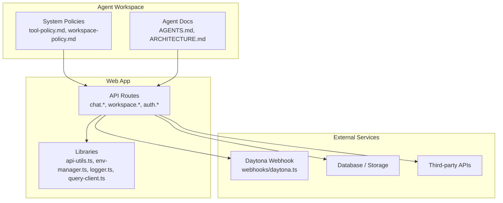
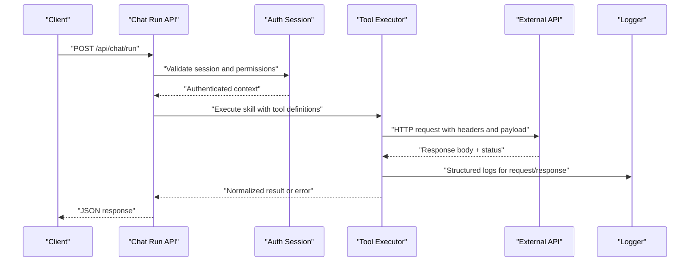
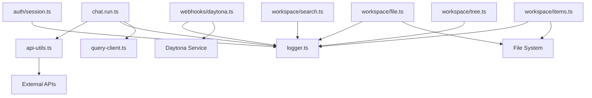

# Tool Integration

<cite>
**Referenced Files in This Document**
- [README.md](file://README.md)
- [architecture.md](file://docs/architecture.md)
- [runtime-sdk-integration.md](file://docs/runtime-sdk-integration.md)
- [tool-policy.md](file://agent-workspace/system/tool-policy.md)
- [workspace-policy.md](file://agent-workspace/system/workspace-policy.md)
- [AGENTS.md](file://agent-workspace/AGENTS.md)
- [ARCHITECTURE.md](file://agent-workspace/ARCHITECTURE.md)
- [chat.ts](file://functions/chat.ts)
- [api-utils.ts](file://apps/web/src/lib/api-utils.ts)
- [env-manager.ts](file://apps/web/src/lib/env-manager.ts)
- [logger.ts](file://apps/web/src/lib/logger.ts)
- [query-client.ts](file://apps/web/src/lib/query-client.ts)
- [auth/session.ts](file://apps/web/src/routes/api/auth/session.ts)
- [webhooks/daytona.ts](file://apps/web/src/routes/api/webhooks/daytona.ts)
- [workspace/file.ts](file://apps/web/src/routes/api/workspace/file.ts)
- [workspace/items.ts](file://apps/web/src/routes/api/workspace/items.ts)
- [workspace/search.ts](file://apps/web/src/routes/api/workspace/search.ts)
- [workspace/tree.ts](file://apps/web/src/routes/api/workspace/tree.ts)
- [chat.run.ts](file://apps/web/src/routes/api/chat/run.ts)
- [chat.sessions.ts](file://apps/web/src/routes/api/chat/sessions.ts)
- [chat.settings.ts](file://apps/web/src/routes/api/chat/settings.ts)
</cite>

## Table of Contents

1. [Introduction](#introduction)
2. [Project Structure](#project-structure)
3. [Core Components](#core-components)
4. [Architecture Overview](#architecture-overview)
5. [Detailed Component Analysis](#detailed-component-analysis)
6. [Dependency Analysis](#dependency-analysis)
7. [Performance Considerations](#performance-considerations)
8. [Troubleshooting Guide](#troubleshooting-guide)
9. [Conclusion](#conclusion)
10. [Appendices](#appendices)

## Introduction

This document explains how to integrate external tools and APIs into Fleet Pi skills. It covers tool definition, authentication, API call handling, response processing, error handling patterns, rate limiting strategies, caching mechanisms, security best practices, input validation, output sanitization, testing, and debugging. The guidance is grounded in the repository’s architecture and existing integrations for web APIs, file systems, and third-party services.

## Project Structure

Fleet Pi organizes runtime behavior, policies, and integrations across several layers:

- Agent workspace system policies define tool usage constraints and workspace boundaries.
- Web routes expose APIs that orchestrate chat runs, session management, and workspace operations.
- Shared libraries provide utilities for environment configuration, logging, and HTTP client setup.
- Functions and webhooks integrate with external services (e.g., Daytona).

**Diagram sources**

- [tool-policy.md](file://agent-workspace/system/tool-policy.md)
- [workspace-policy.md](file://agent-workspace/system/workspace-policy.md)
- [AGENTS.md](file://agent-workspace/AGENTS.md)
- [ARCHITECTURE.md](file://agent-workspace/ARCHITECTURE.md)
- [chat.run.ts](file://apps/web/src/routes/api/chat/run.ts)
- [auth/session.ts](file://apps/web/src/routes/api/auth/session.ts)
- [webhooks/daytona.ts](file://apps/web/src/routes/api/webhooks/daytona.ts)
- [api-utils.ts](file://apps/web/src/lib/api-utils.ts)
- [env-manager.ts](file://apps/web/src/lib/env-manager.ts)
- [logger.ts](file://apps/web/src/lib/logger.ts)
- [query-client.ts](file://apps/web/src/lib/query-client.ts)

**Section sources**

- [README.md](file://README.md)
- [architecture.md](file://docs/architecture.md)
- [runtime-sdk-integration.md](file://docs/runtime-sdk-integration.md)
- [tool-policy.md](file://agent-workspace/system/tool-policy.md)
- [workspace-policy.md](file://agent-workspace/system/workspace-policy.md)
- [AGENTS.md](file://agent-workspace/AGENTS.md)
- [ARCHITECTURE.md](file://agent-workspace/ARCHITECTURE.md)

## Core Components

- Tool Policy and Workspace Policy: Define what tools are allowed, their scopes, and constraints. These policies govern how skills can invoke tools safely.
- API Utilities and Environment Manager: Centralize HTTP client configuration, headers, retries, timeouts, and secret management for secure API calls.
- Logger: Provides structured logging for requests, responses, errors, and performance metrics.
- Query Client: Manages data fetching, caching, and synchronization for API responses.
- Chat Run and Sessions: Orchestrate skill execution, tool invocation, and state management during a run.
- Webhooks and External Integrations: Handle inbound events from third-party services (e.g., Daytona), validate payloads, and trigger downstream actions.

Key responsibilities:

- Tool definitions are enforced by policies; skills declare capabilities within these bounds.
- Authentication flows are handled via session endpoints and environment-managed secrets.
- API calls use centralized utilities for consistent behavior, error handling, and observability.
- Responses are validated and sanitized before being returned to clients or used by skills.

**Section sources**

- [tool-policy.md](file://agent-workspace/system/tool-policy.md)
- [workspace-policy.md](file://agent-workspace/system/workspace-policy.md)
- [api-utils.ts](file://apps/web/src/lib/api-utils.ts)
- [env-manager.ts](file://apps/web/src/lib/env-manager.ts)
- [logger.ts](file://apps/web/src/lib/logger.ts)
- [query-client.ts](file://apps/web/src/lib/query-client.ts)
- [chat.run.ts](file://apps/web/src/routes/api/chat/run.ts)
- [chat.sessions.ts](file://apps/web/src/routes/api/chat/sessions.ts)
- [webhooks/daytona.ts](file://apps/web/src/routes/api/webhooks/daytona.ts)

## Architecture Overview

The integration architecture connects skills and agents to external tools through well-defined routes and shared libraries. Requests flow from the client to API routes, which coordinate authentication, policy checks, tool execution, and response serialization. External services communicate via webhooks and outbound HTTP calls.

**Diagram sources**

- [chat.run.ts](file://apps/web/src/routes/api/chat/run.ts)
- [auth/session.ts](file://apps/web/src/routes/api/auth/session.ts)
- [api-utils.ts](file://apps/web/src/lib/api-utils.ts)
- [logger.ts](file://apps/web/src/lib/logger.ts)

## Detailed Component Analysis

### Tool Definitions and Policy Enforcement

- Tool definitions should be declared in skill metadata and constrained by tool-policy rules.
- Workspace-policy defines boundaries for file system access and resource usage.
- Skills must adhere to allowed tool sets and parameter schemas defined by policies.

Best practices:

- Keep tool schemas minimal and explicit.
- Validate inputs at the boundary using schema validators.
- Enforce least privilege by restricting tool access per skill.

**Section sources**

- [tool-policy.md](file://agent-workspace/system/tool-policy.md)
- [workspace-policy.md](file://agent-workspace/system/workspace-policy.md)
- [AGENTS.md](file://agent-workspace/AGENTS.md)
- [ARCHITECTURE.md](file://agent-workspace/ARCHITECTURE.md)

### Authentication and Authorization

- Use session-based authentication to establish identity and roles.
- Store secrets securely via environment manager; never hardcode credentials.
- Apply authorization checks before invoking tools or accessing resources.

Flow overview:

- Client authenticates via session endpoint.
- Subsequent requests carry tokens or cookies validated by middleware.
- Tools execute within an authorized context scoped to the user and skill.

**Section sources**

- [auth/session.ts](file://apps/web/src/routes/api/auth/session.ts)
- [env-manager.ts](file://apps/web/src/lib/env-manager.ts)
- [api-utils.ts](file://apps/web/src/lib/api-utils.ts)

### API Call Handling and Response Processing

- Centralize HTTP client configuration in api-utils for consistent headers, timeouts, and retries.
- Normalize responses into a standard shape for downstream consumption.
- Sanitize outputs to prevent injection and ensure safe rendering.

Patterns:

- Use typed request/response models.
- Implement retry with exponential backoff for transient failures.
- Cache successful responses where appropriate.

**Section sources**

- [api-utils.ts](file://apps/web/src/lib/api-utils.ts)
- [query-client.ts](file://apps/web/src/lib/query-client.ts)
- [logger.ts](file://apps/web/src/lib/logger.ts)

### Webhooks and Third-Party Integrations

- Validate webhook signatures and payloads before processing.
- Idempotently handle events to avoid duplicate work.
- Emit structured logs and metrics for observability.

Example integration:

- Daytona webhook handler validates incoming events and triggers workspace updates.

**Section sources**

- [webhooks/daytona.ts](file://apps/web/src/routes/api/webhooks/daytona.ts)

### File System and Database Access

- Restrict file system operations to allowed directories per workspace-policy.
- Use database clients configured via environment variables for connection settings.
- Parameterize queries to prevent SQL injection.

Security considerations:

- Escape and sanitize file paths.
- Limit read/write permissions based on role and skill scope.

**Section sources**

- [workspace-policy.md](file://agent-workspace/system/workspace-policy.md)
- [workspace/file.ts](file://apps/web/src/routes/api/workspace/file.ts)
- [workspace/items.ts](file://apps/web/src/routes/api/workspace/items.ts)

### Rate Limiting and Caching Strategies

- Apply rate limits at API route level to protect against abuse.
- Cache frequently accessed data using query-client with TTLs.
- Implement cache invalidation on write operations.

Recommendations:

- Use in-memory caches for low-latency reads.
- Persist cache keys and invalidate on mutations.
- Monitor hit rates and adjust TTLs accordingly.

**Section sources**

- [query-client.ts](file://apps/web/src/lib/query-client.ts)
- [api-utils.ts](file://apps/web/src/lib/api-utils.ts)

### Error Handling Patterns

- Catch and categorize errors (network, validation, authorization).
- Return consistent error shapes with actionable messages.
- Log errors with correlation IDs for tracing.

Common patterns:

- Wrap external calls with try/catch and map to domain errors.
- Surface user-friendly messages while preserving detailed logs.

**Section sources**

- [logger.ts](file://apps/web/src/lib/logger.ts)
- [api-utils.ts](file://apps/web/src/lib/api-utils.ts)

### Security Best Practices

- Validate all inputs with strict schemas.
- Sanitize outputs to prevent XSS and injection attacks.
- Rotate secrets regularly and limit exposure via environment variables.
- Audit tool usage and log sensitive operations.

**Section sources**

- [env-manager.ts](file://apps/web/src/lib/env-manager.ts)
- [logger.ts](file://apps/web/src/lib/logger.ts)
- [tool-policy.md](file://agent-workspace/system/tool-policy.md)

### Testing Tool Integrations

- Mock external APIs using test doubles or local servers.
- Assert request payloads, headers, and response transformations.
- Verify error paths and edge cases (timeouts, invalid inputs).

Guidelines:

- Use unit tests for utility functions and integration tests for routes.
- Simulate webhook events to validate handlers.
- Measure latency and failure rates in test environments.

**Section sources**

- [api-utils.ts](file://apps/web/src/lib/api-utils.ts)
- [webhooks/daytona.ts](file://apps/web/src/routes/api/webhooks/daytona.ts)

### Debugging Common Integration Issues

- Enable verbose logging for failed requests and responses.
- Inspect environment variables for misconfigured secrets.
- Check network connectivity and firewall rules for outbound calls.
- Validate webhook signatures and payload formats.

**Section sources**

- [logger.ts](file://apps/web/src/lib/logger.ts)
- [env-manager.ts](file://apps/web/src/lib/env-manager.ts)
- [webhooks/daytona.ts](file://apps/web/src/routes/api/webhooks/daytona.ts)

## Dependency Analysis

The following diagram shows key dependencies between routes, libraries, and external services:

**Diagram sources**

- [chat.run.ts](file://apps/web/src/routes/api/chat/run.ts)
- [auth/session.ts](file://apps/web/src/routes/api/auth/session.ts)
- [webhooks/daytona.ts](file://apps/web/src/routes/api/webhooks/daytona.ts)
- [workspace/file.ts](file://apps/web/src/routes/api/workspace/file.ts)
- [workspace/items.ts](file://apps/web/src/routes/api/workspace/items.ts)
- [workspace/search.ts](file://apps/web/src/routes/api/workspace/search.ts)
- [workspace/tree.ts](file://apps/web/src/routes/api/workspace/tree.ts)
- [api-utils.ts](file://apps/web/src/lib/api-utils.ts)
- [logger.ts](file://apps/web/src/lib/logger.ts)
- [query-client.ts](file://apps/web/src/lib/query-client.ts)

**Section sources**

- [chat.run.ts](file://apps/web/src/routes/api/chat/run.ts)
- [auth/session.ts](file://apps/web/src/routes/api/auth/session.ts)
- [webhooks/daytona.ts](file://apps/web/src/routes/api/webhooks/daytona.ts)
- [workspace/file.ts](file://apps/web/src/routes/api/workspace/file.ts)
- [workspace/items.ts](file://apps/web/src/routes/api/workspace/items.ts)
- [workspace/search.ts](file://apps/web/src/routes/api/workspace/search.ts)
- [workspace/tree.ts](file://apps/web/src/routes/api/workspace/tree.ts)
- [api-utils.ts](file://apps/web/src/lib/api-utils.ts)
- [logger.ts](file://apps/web/src/lib/logger.ts)
- [query-client.ts](file://apps/web/src/lib/query-client.ts)

## Performance Considerations

- Minimize payload sizes by selecting only necessary fields.
- Use pagination for large datasets.
- Implement connection pooling for databases and HTTP clients.
- Cache immutable or rarely changing data aggressively.
- Profile hot paths and add metrics for latency percentiles.

[No sources needed since this section provides general guidance]

## Troubleshooting Guide

Common issues and resolutions:

- Authentication failures: Verify session tokens and environment secrets.
- Network errors: Check timeouts, retries, and DNS resolution.
- Validation errors: Ensure input schemas match expected types.
- Webhook rejections: Confirm signature algorithms and payload structures.
- Rate limiting: Adjust limits and implement backoff strategies.

**Section sources**

- [logger.ts](file://apps/web/src/lib/logger.ts)
- [api-utils.ts](file://apps/web/src/lib/api-utils.ts)
- [env-manager.ts](file://apps/web/src/lib/env-manager.ts)
- [webhooks/daytona.ts](file://apps/web/src/routes/api/webhooks/daytona.ts)

## Conclusion

Integrating external tools and APIs into Fleet Pi skills requires clear tool definitions, robust authentication, centralized HTTP utilities, and strong error handling. By adhering to policies, validating inputs, sanitizing outputs, and implementing rate limiting and caching, you can build reliable and secure integrations. Use structured logging and comprehensive testing to debug and maintain integrations effectively.

[No sources needed since this section summarizes without analyzing specific files]

## Appendices

- Runtime SDK Integration: Refer to runtime-sdk-integration.md for SDK-level details and examples.
- Architecture Reference: See architecture.md for high-level system design and component interactions.

**Section sources**

- [runtime-sdk-integration.md](file://docs/runtime-sdk-integration.md)
- [architecture.md](file://docs/architecture.md)
