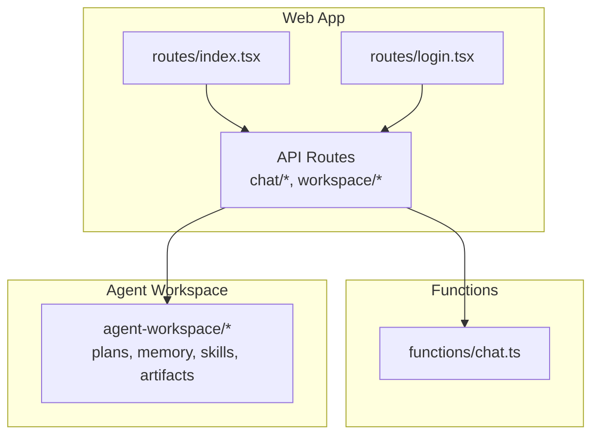
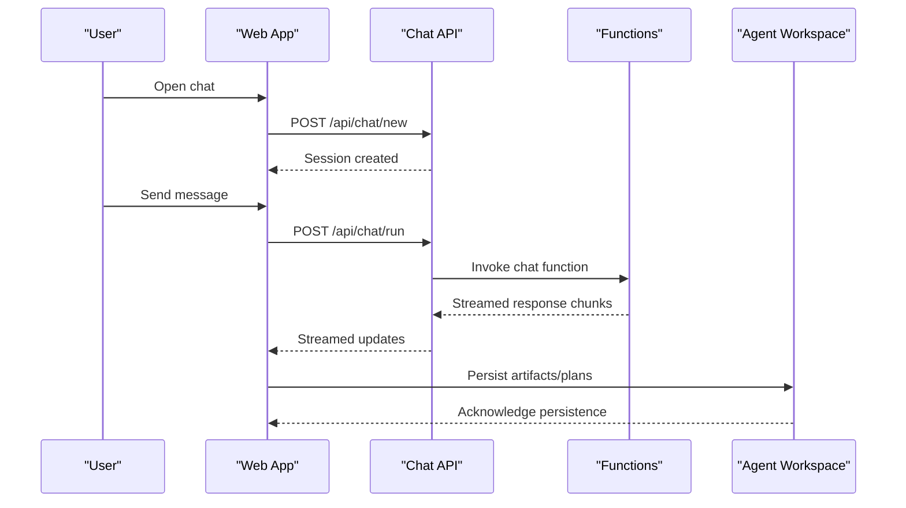
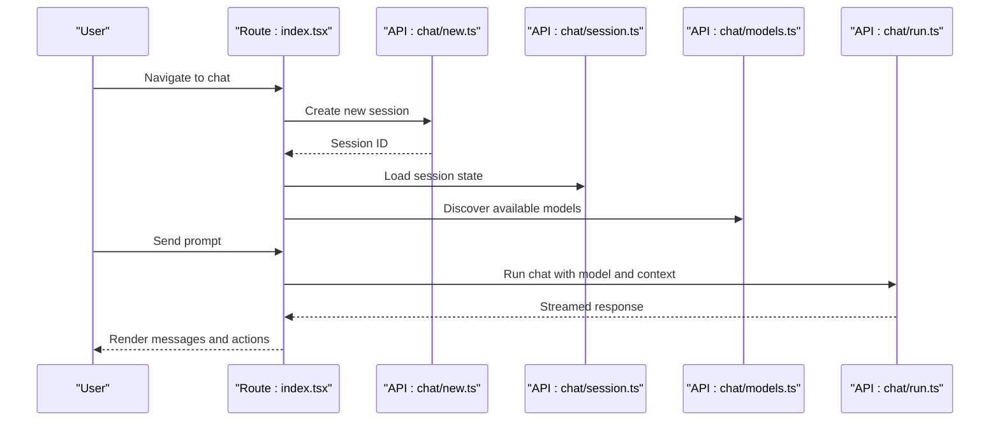
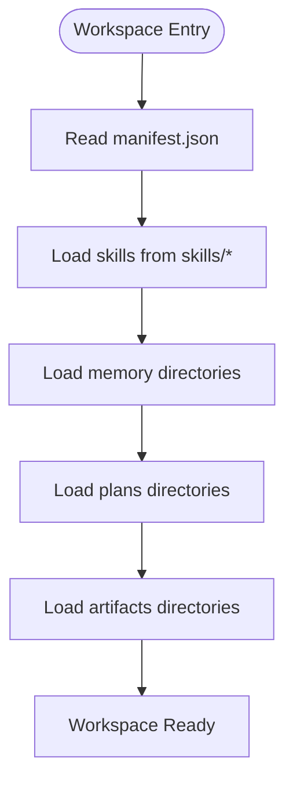
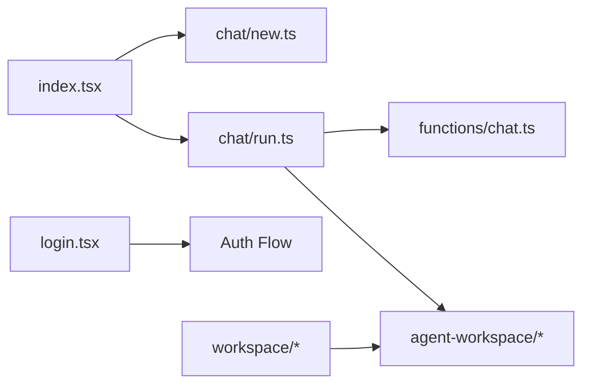

# Features & Capabilities

<cite>
**Referenced Files in This Document**
- [README.md](file://README.md)
- [PRODUCT.md](file://PRODUCT.md)
- [ARCHITECTURE.md](file://docs/architecture.md)
- [agent-workspace.md](file://docs/agent-workspace.md)
- [chat.md](file://docs/wiki/features/chat.md)
- [daytona-sandbox.md](file://docs/wiki/features/daytona-sandbox.md)
- [openui.md](file://docs/wiki/features/openui.md)
- [configuration.md](file://docs/wiki/reference/configuration.md)
- [data-models.md](file://docs/wiki/reference/data-models.md)
- [getting-started.md](file://docs/wiki/overview/getting-started.md)
- [architecture.md](file://docs/wiki/overview/architecture.md)
- [index.tsx](file://apps/web/src/routes/index.tsx)
- [login.tsx](file://apps/web/src/routes/login.tsx)
- [chat-api.md](file://docs/wiki/apps/web/chat-api.md)
- [pi-integration.md](file://docs/wiki/apps/web/pi-integration.md)
- [plan-mode.md](file://docs/wiki/apps/web/plan-mode.md)
- [chat.run.ts](file://apps/web/src/routes/api/chat/run.ts)
- [chat.new.ts](file://apps/web/src/routes/api/chat/new.ts)
- [chat.session.ts](file://apps/web/src/routes/api/chat/session.ts)
- [chat.settings.ts](file://apps/web/src/routes/api/chat/settings.ts)
- [workspace.item.ts](file://apps/web/src/routes/api/workspace/item.ts)
- [workspace.items.ts](file://apps/web/src/routes/api/workspace/items.ts)
- [workspace.tree.ts](file://apps/web/src/routes/api/workspace/tree.ts)
- [workspace.search.ts](file://apps/web/src/routes/api/workspace/search.ts)
- [workspace.reindex.ts](file://apps/web/src/routes/api/workspace/reindex.ts)
- [workspace.health.ts](file://apps/web/src/routes/api/workspace/health.ts)
- [functions.chat.ts](file://functions/chat.ts)
- [manifest.json](file://agent-workspace/manifest.json)
- [AGENTS.md](file://agent-workspace/AGENTS.md)
- [skills/codebase-research/SKILL.md](file://agent-workspace/skills/codebase-research/SKILL.md)
- [skills/doc-gardening/SKILL.md](file://agent-workspace/skills/doc-gardening/SKILL.md)
- [skills/execution-plan/SKILL.md](file://agent-workspace/skills/execution-plan/SKILL.md)
- [skills/frontend-design/SKILL.md](file://agent-workspace/skills/frontend-design/SKILL.md)
- [skills/memory-synthesis/SKILL.md](file://agent-workspace/skills/memory-synthesis/SKILL.md)
</cite>

## Table of Contents

1. [Introduction](#introduction)
2. [Project Structure](#project-structure)
3. [Core Components](#core-components)
4. [Architecture Overview](#architecture-overview)
5. [Detailed Component Analysis](#detailed-component-analysis)
6. [Dependency Analysis](#dependency-analysis)
7. [Performance Considerations](#performance-considerations)
8. [Troubleshooting Guide](#troubleshooting-guide)
9. [Conclusion](#conclusion)
10. [Appendices](#appendices)

## Introduction

Fleet Pi is an AI-powered development environment that combines a conversational chat interface with an agent workspace for collaborative, plan-driven coding. It supports:

- AI-powered chat for code generation, refactoring, and research
- Agent workspace with plans, memory, skills, and artifacts
- Collaborative features via sessions and shared context
- Integrations with external providers and sandbox environments

This document explains how each feature works, configuration options, usage patterns, and advanced extensibility points to maximize productivity.

## Project Structure

At a high level, Fleet Pi consists of:

- Web application (SvelteKit-based) exposing API routes for chat, workspace, and integrations
- Functions layer for serverless endpoints
- Agent workspace directory containing plans, memory, skills, prompts, and artifacts
- Documentation and design references describing architecture and features

**Diagram sources**

- [index.tsx](file://apps/web/src/routes/index.tsx)
- [login.tsx](file://apps/web/src/routes/login.tsx)
- [functions.chat.ts](file://functions/chat.ts)
- [manifest.json](file://agent-workspace/manifest.json)

**Section sources**

- [README.md](file://README.md)
- [PRODUCT.md](file://PRODUCT.md)
- [architecture.md](file://docs/wiki/overview/architecture.md)

## Core Components

- Chat Interface: Conversational UI backed by API routes for session management, model discovery, and streaming responses.
- Agent Workspace: Persistent workspace with plans, memory, skills, prompts, and artifacts; configurable via manifest and settings.
- Integrations: Provider configuration for LLM backends and sandbox environments for execution.
- Extensibility: Custom skills, prompts, and workspace policies to tailor behavior.

Key capabilities:

- Create and manage chat sessions
- Stream responses from models
- Execute tasks using agent skills
- Maintain project memory and decisions
- Generate artifacts and diagrams

**Section sources**

- [chat.md](file://docs/wiki/features/chat.md)
- [agent-workspace.md](file://docs/agent-workspace.md)
- [configuration.md](file://docs/wiki/reference/configuration.md)
- [data-models.md](file://docs/wiki/reference/data-models.md)

## Architecture Overview

The system follows a layered architecture:

- Frontend routes handle user interactions and state synchronization
- API routes orchestrate chat flows, workspace operations, and provider calls
- Functions provide serverless endpoints for specific tasks
- Agent workspace persists plans, memory, skills, and artifacts

**Diagram sources**

- [chat-api.md](file://docs/wiki/apps/web/chat-api.md)
- [chat.run.ts](file://apps/web/src/routes/api/chat/run.ts)
- [chat.new.ts](file://apps/web/src/routes/api/chat/new.ts)
- [functions.chat.ts](file://functions/chat.ts)
- [manifest.json](file://agent-workspace/manifest.json)

## Detailed Component Analysis

### AI-Powered Chat Interface

The chat interface enables natural language interactions with the agent. Users can create sessions, send messages, receive streamed responses, and manage settings.

Key workflows:

- New session creation
- Message sending and streaming
- Settings and provider selection
- Resume previous sessions

Configuration and usage:

- Model discovery and provider configuration are exposed through API routes
- Session persistence allows resuming conversations
- Settings allow toggling behaviors and selecting providers

Practical examples:

- Start a new session and ask for code generation
- Switch models and adjust settings mid-conversation
- Resume a previous session to continue work

**Section sources**

- [chat.md](file://docs/wiki/features/chat.md)
- [chat-api.md](file://docs/wiki/apps/web/chat-api.md)
- [chat.new.ts](file://apps/web/src/routes/api/chat/new.ts)
- [chat.session.ts](file://apps/web/src/routes/api/chat/session.ts)
- [chat.run.ts](file://apps/web/src/routes/api/chat/run.ts)

### Agent Workspace Functionality

The agent workspace is the central repository for plans, memory, skills, prompts, and artifacts. It provides structure and persistence for long-running tasks and collaborative work.

Core elements:

- Plans: Active, completed, abandoned, and backlog
- Memory: Daily, project, research, and summaries
- Skills: Reusable capabilities like codebase research and frontend design
- Artifacts: Generated datasets, diagrams, reports, and traces
- Manifest and AGENTS metadata defining workspace identity and policies

Usage patterns:

- Define custom skills under skills/* with SKILL.md instructions
- Maintain project memory and decisions in memory/project
- Track plans and outcomes in plans/*
- Store generated outputs in artifacts/*

Extensibility:

- Add new skills by creating a folder with SKILL.md
- Customize behavior via system policies and prompts
- Integrate with external tools through workspace policies

**Section sources**

- [agent-workspace.md](file://docs/agent-workspace.md)
- [manifest.json](file://agent-workspace/manifest.json)
- [AGENTS.md](file://agent-workspace/AGENTS.md)
- [skills/codebase-research/SKILL.md](file://agent-workspace/skills/codebase-research/SKILL.md)
- [skills/doc-gardening/SKILL.md](file://agent-workspace/skills/doc-gardening/SKILL.md)
- [skills/execution-plan/SKILL.md](file://agent-workspace/skills/execution-plan/SKILL.md)
- [skills/frontend-design/SKILL.md](file://agent-workspace/skills/frontend-design/SKILL.md)
- [skills/memory-synthesis/SKILL.md](file://agent-workspace/skills/memory-synthesis/SKILL.md)

### Collaborative Development Features

Collaboration is supported through shared sessions, synchronized state, and persistent workspace artifacts. Teams can coordinate on plans, share insights via memory, and review generated artifacts.

Key aspects:

- Session mirroring and ownership controls
- Shared workspace artifacts accessible across users
- Versioned plans and memory entries for traceability

Integration scenarios:

- Use chat to generate code and commit changes tracked in plans
- Share diagrams and reports stored in artifacts
- Leverage memory to maintain architectural decisions and known issues

**Section sources**

- [architecture.md](file://docs/wiki/overview/architecture.md)
- [data-models.md](file://docs/wiki/reference/data-models.md)

### Integration Capabilities

Fleet Pi integrates with external providers and sandbox environments:

- LLM providers configured via settings and discovered through API routes
- Sandbox execution for safe testing and previewing
- Webhooks and functions for event-driven automation

Configuration options:

- Provider credentials and model IDs
- Sandbox settings and preview endpoints
- Environment variables managed by env-manager utilities

Practical examples:

- Configure a new provider and select it in chat settings
- Deploy a preview environment and link it to workspace artifacts
- Trigger functions based on workspace events

**Section sources**

- [configuration.md](file://docs/wiki/reference/configuration.md)
- [daytona-sandbox.md](file://docs/wiki/features/daytona-sandbox.md)
- [pi-integration.md](file://docs/wiki/apps/web/pi-integration.md)
- [functions.chat.ts](file://functions/chat.ts)

### Advanced Features and Extensibility

Advanced capabilities include custom agent skills, workspace customization, and extensibility points:

- Custom skills: Define reusable behaviors with SKILL.md files
- Workspace policies: Control tool usage and constraints
- Prompts: Tailor agent behavior with specialized instructions
- Extensions: Stage or enable extensions for additional functionality

Guidance:

- Start with existing skills as templates
- Use system policies to enforce security and quality
- Iterate on prompts to refine agent responses
- Test extensions in staged mode before enabling

**Section sources**

- [skills/codebase-research/SKILL.md](file://agent-workspace/skills/codebase-research/SKILL.md)
- [skills/execution-plan/SKILL.md](file://agent-workspace/skills/execution-plan/SKILL.md)
- [AGENTS.md](file://agent-workspace/AGENTS.md)
- [configuration.md](file://docs/wiki/reference/configuration.md)

## Dependency Analysis

The web app depends on API routes for chat and workspace operations, which in turn may call functions and interact with the agent workspace.

**Diagram sources**

- [index.tsx](file://apps/web/src/routes/index.tsx)
- [login.tsx](file://apps/web/src/routes/login.tsx)
- [chat.new.ts](file://apps/web/src/routes/api/chat/new.ts)
- [chat.run.ts](file://apps/web/src/routes/api/chat/run.ts)
- [functions.chat.ts](file://functions/chat.ts)
- [workspace.item.ts](file://apps/web/src/routes/api/workspace/item.ts)
- [workspace.items.ts](file://apps/web/src/routes/api/workspace/items.ts)
- [workspace.tree.ts](file://apps/web/src/routes/api/workspace/tree.ts)
- [workspace.search.ts](file://apps/web/src/routes/api/workspace/search.ts)
- [workspace.reindex.ts](file://apps/web/src/routes/api/workspace/reindex.ts)
- [workspace.health.ts](file://apps/web/src/routes/api/workspace/health.ts)

**Section sources**

- [architecture.md](file://docs/wiki/overview/architecture.md)
- [data-models.md](file://docs/wiki/reference/data-models.md)

## Performance Considerations

- Stream chat responses to reduce latency and improve UX
- Cache model discovery results where appropriate
- Optimize workspace indexing and search operations
- Use efficient data structures for session state and memory
- Monitor function invocation times and error rates

[No sources needed since this section provides general guidance]

## Troubleshooting Guide

Common issues and resolutions:

- Chat not responding: Verify provider configuration and network connectivity
- Workspace errors: Check manifest validity and skill definitions
- Authentication failures: Review login flow and session handling
- Sandbox preview failures: Inspect webhook configurations and endpoint availability

Debugging tips:

- Use health endpoints to verify service status
- Inspect logs for function invocations and API errors
- Validate workspace structure against manifest and policies

**Section sources**

- [workspace.health.ts](file://apps/web/src/routes/api/workspace/health.ts)
- [chat-api.md](file://docs/wiki/apps/web/chat-api.md)

## Conclusion

Fleet Pi provides a powerful combination of AI chat and agent workspace capabilities for collaborative development. By leveraging custom skills, workspace policies, and integrations, teams can streamline their workflows and enhance productivity. Use the provided APIs and extensibility points to tailor the environment to your needs.

[No sources needed since this section summarizes without analyzing specific files]

## Appendices

### Getting Started

- Install dependencies and configure environment variables
- Initialize the agent workspace and add initial skills
- Configure LLM providers and test chat interactions
- Explore workspace features like plans, memory, and artifacts

**Section sources**

- [getting-started.md](file://docs/wiki/overview/getting-started.md)
- [configuration.md](file://docs/wiki/reference/configuration.md)

### Feature Reference

- Chat: Sessions, models, settings, and streaming
- Workspace: Plans, memory, skills, artifacts, and policies
- Integrations: Providers, sandbox, and functions

**Section sources**

- [chat.md](file://docs/wiki/features/chat.md)
- [agent-workspace.md](file://docs/agent-workspace.md)
- [daytona-sandbox.md](file://docs/wiki/features/daytona-sandbox.md)
- [openui.md](file://docs/wiki/features/openui.md)
