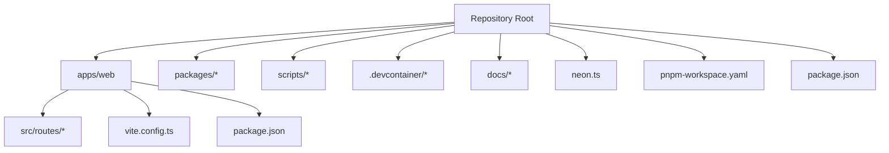
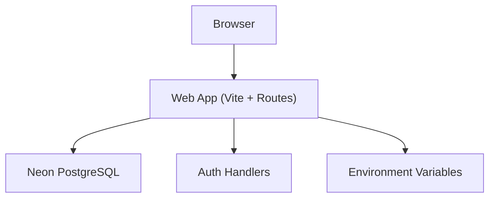
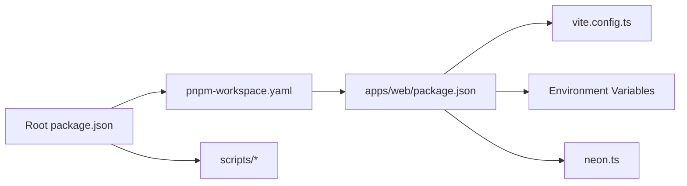

# Getting Started

<cite>
**Referenced Files in This Document**
- [README.md](file://README.md)
- [package.json](file://package.json)
- [pnpm-workspace.yaml](file://pnpm-workspace.yaml)
- [.devcontainer/devcontainer.json](file://.devcontainer/devcontainer.json)
- [apps/web/package.json](file://apps/web/package.json)
- [apps/web/vite.config.ts](file://apps/web/vite.config.ts)
- [neon.ts](file://neon.ts)
- [scripts/verify-neon-backend.mjs](file://scripts/verify-neon-backend.mjs)
- [docs/quickstart.md](file://docs/quickstart.md)
- [docs/wiki/overview/getting-started.md](file://docs/wiki/overview/getting-started.md)
</cite>

## Table of Contents

1. [Introduction](#introduction)
2. [Project Structure](#project-structure)
3. [Core Components](#core-components)
4. [Architecture Overview](#architecture-overview)
5. [Detailed Component Analysis](#detailed-component-analysis)
6. [Dependency Analysis](#dependency-analysis)
7. [Performance Considerations](#performance-considerations)
8. [Troubleshooting Guide](#troubleshooting-guide)
9. [Conclusion](#conclusion)
10. [Appendices](#appendices)

## Introduction

This guide helps you set up Fleet Pi for local development and run it end-to-end. You will:

- Prepare your environment using devcontainers or a local Node.js setup
- Install dependencies with pnpm (or npm)
- Configure environment variables for the web app and database
- Set up Neon (PostgreSQL) and authentication
- Start development servers and verify everything works

The goal is to get you from zero to a running application quickly, with clear steps and troubleshooting tips.

## Project Structure

Fleet Pi is a monorepo managed by pnpm workspaces. The primary user-facing application lives under apps/web, which includes routes, API endpoints, and build configuration. Shared tooling and scripts are at the repository root.

**Diagram sources**

- [pnpm-workspace.yaml](file://pnpm-workspace.yaml)
- [package.json](file://package.json)
- [apps/web/package.json](file://apps/web/package.json)
- [apps/web/vite.config.ts](file://apps/web/vite.config.ts)
- [neon.ts](file://neon.ts)

**Section sources**

- [pnpm-workspace.yaml](file://pnpm-workspace.yaml)
- [package.json](file://package.json)
- [apps/web/package.json](file://apps/web/package.json)
- [apps/web/vite.config.ts](file://apps/web/vite.config.ts)

## Core Components

- Web application (apps/web): Vite-based frontend with server-side routes and API endpoints.
- Database integration: Neon PostgreSQL via a shared configuration file.
- Dev container: Preconfigured environment for consistent local development.
- Scripts: Utility scripts for verification and maintenance tasks.

Key responsibilities:

- apps/web: UI, routing, API handlers, and build configuration.
- neon.ts: Centralized database connection settings.
- .devcontainer/devcontainer.json: Development container configuration.
- scripts: Verification and migration helpers.

**Section sources**

- [apps/web/package.json](file://apps/web/package.json)
- [apps/web/vite.config.ts](file://apps/web/vite.config.ts)
- [neon.ts](file://neon.ts)
- [.devcontainer/devcontainer.json](file://.devcontainer/devcontainer.json)

## Architecture Overview

At a high level, the web app serves the UI and exposes API endpoints. It connects to Neon for persistent data and uses environment variables for runtime configuration. Authentication flows are handled within the web app’s route handlers.

[No sources needed since this diagram shows conceptual workflow, not actual code structure]

## Detailed Component Analysis

### Environment Setup with Devcontainers

- Use the provided devcontainer to ensure consistent tooling and dependencies.
- Open the project in VS Code and select “Reopen in Container” to start the dev environment.
- The devcontainer config defines the Node.js version, workspace folders, and optional services.

Steps:

1. Install Docker and VS Code if not already installed.
2. Open the repository in VS Code.
3. Choose “Dev Containers: Reopen in Container”.
4. Wait for the container to build and install dependencies.

Verification:

- Inside the container, confirm Node.js and pnpm versions match expectations.
- Ensure the workspace folder is mounted correctly.

**Section sources**

- [.devcontainer/devcontainer.json](file://.devcontainer/devcontainer.json)

### Installing Dependencies (pnpm or npm)

- The repository uses pnpm workspaces. If you prefer npm, you can use npm commands, but pnpm is recommended.

Steps:

1. Install pnpm globally if needed.
2. Run the workspace install command at the repository root.
3. Verify that all packages are linked and available.

Notes:

- The root package.json defines workspace scripts and common commands.
- apps/web has its own package.json with local scripts for starting the dev server.

**Section sources**

- [package.json](file://package.json)
- [pnpm-workspace.yaml](file://pnpm-workspace.yaml)
- [apps/web/package.json](file://apps/web/package.json)

### Environment Configuration

- The web app reads environment variables for runtime configuration.
- Create a local environment file in the web app directory with required keys.
- Typical keys include database connection strings, auth secrets, and feature flags.

Steps:

1. Copy the example environment file (if present) to create a local .env file.
2. Fill in values for database URL, auth provider credentials, and any other required variables.
3. Validate that the web app starts without missing variable errors.

Verification:

- Start the web app and check logs for successful initialization.
- Confirm that database connectivity is established.

**Section sources**

- [apps/web/package.json](file://apps/web/package.json)
- [apps/web/vite.config.ts](file://apps/web/vite.config.ts)

### Setting Up Neon (PostgreSQL)

- Neon provides a managed PostgreSQL service. You will need a connection string for local development.

Steps:

1. Create a Neon account and provision a new project.
2. Obtain the database connection string (URI).
3. Add the connection string to your local environment configuration.
4. Run migrations or seed scripts if required by the application.

Verification:

- Use the provided verification script to test connectivity.
- Confirm that tables exist and basic queries succeed.

**Section sources**

- [neon.ts](file://neon.ts)
- [scripts/verify-neon-backend.mjs](file://scripts/verify-neon-backend.mjs)

### Configuring Authentication

- Authentication is handled within the web app’s route handlers.
- Provide necessary credentials (e.g., OAuth client ID/secret) in environment variables.
- Ensure redirect URLs and allowed domains are configured in your auth provider.

Steps:

1. Register an application with your chosen auth provider.
2. Add client ID, secret, and callback URLs to environment variables.
3. Test login flow locally and verify session creation.

Verification:

- Attempt to log in and check that sessions are created.
- Confirm protected routes require authentication.

**Section sources**

- [apps/web/package.json](file://apps/web/package.json)

### Starting Development Servers

- The web app uses Vite for development. Start the dev server to hot-reload changes.

Steps:

1. From the repository root, run the workspace command to start the web app.
2. Alternatively, navigate to apps/web and run the local dev script.
3. Open the local URL shown in the terminal.

Verification:

- The UI should load successfully.
- Check browser console for errors.
- Confirm API endpoints respond as expected.

**Section sources**

- [apps/web/package.json](file://apps/web/package.json)
- [apps/web/vite.config.ts](file://apps/web/vite.config.ts)

### First-Time User Experience

After setup:

- Visit the home page and explore navigation.
- Log in using configured authentication.
- Try creating a chat session or accessing protected features.
- Review logs for any warnings or errors.

Tips:

- Keep the dev server running while making changes.
- Use the browser’s developer tools to inspect network requests.

[No sources needed since this section doesn't analyze specific files]

## Dependency Analysis

The monorepo organizes dependencies across workspaces. The root package.json coordinates shared scripts and workspace commands. The web app depends on Vite and runtime libraries defined in its package.json. Database interactions are centralized through the shared configuration.

**Diagram sources**

- [package.json](file://package.json)
- [pnpm-workspace.yaml](file://pnpm-workspace.yaml)
- [apps/web/package.json](file://apps/web/package.json)
- [apps/web/vite.config.ts](file://apps/web/vite.config.ts)
- [neon.ts](file://neon.ts)

**Section sources**

- [package.json](file://package.json)
- [pnpm-workspace.yaml](file://pnpm-workspace.yaml)
- [apps/web/package.json](file://apps/web/package.json)
- [apps/web/vite.config.ts](file://apps/web/vite.config.ts)
- [neon.ts](file://neon.ts)

## Performance Considerations

- Use the devcontainer for consistent performance across machines.
- Avoid unnecessary rebuilds by keeping dependencies updated and pruning unused packages.
- Monitor database query performance and optimize connections when scaling.

[No sources needed since this section provides general guidance]

## Troubleshooting Guide

Common issues and resolutions:

- Missing environment variables: Ensure all required keys are present in the local .env file.
- Database connection failures: Verify the Neon connection string and network access.
- Port conflicts: Change the dev server port if the default is in use.
- Authentication errors: Double-check client IDs, secrets, and redirect URLs.

Verification steps:

- Run the Neon backend verification script to confirm connectivity.
- Start the web app and check logs for initialization messages.
- Access health endpoints if available to validate service status.

**Section sources**

- [scripts/verify-neon-backend.mjs](file://scripts/verify-neon-backend.mjs)
- [apps/web/package.json](file://apps/web/package.json)

## Conclusion

You now have a complete setup for developing Fleet Pi locally. With devcontainers, pnpm, environment configuration, and Neon ready, you can iterate quickly and confidently. Refer to the troubleshooting section if you encounter issues, and consult the quickstart and wiki guides for additional context.

[No sources needed since this section summarizes without analyzing specific files]

## Appendices

### Quickstart References

For additional reading and step-by-step instructions, see:

- docs/quickstart.md
- docs/wiki/overview/getting-started.md

**Section sources**

- [docs/quickstart.md](file://docs/quickstart.md)
- [docs/wiki/overview/getting-started.md](file://docs/wiki/overview/getting-started.md)
