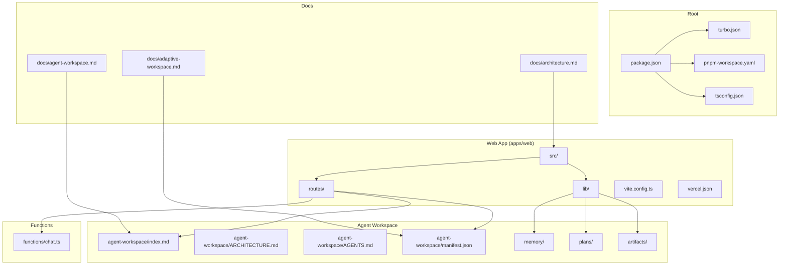
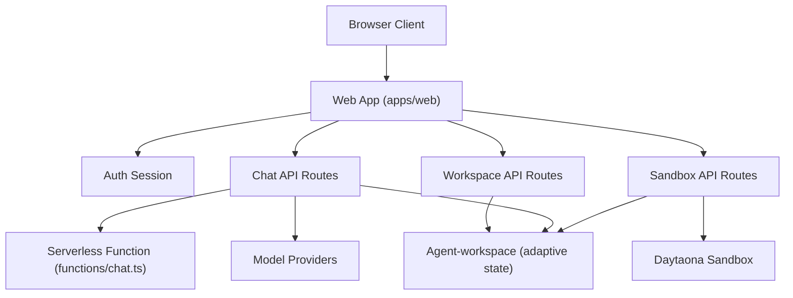
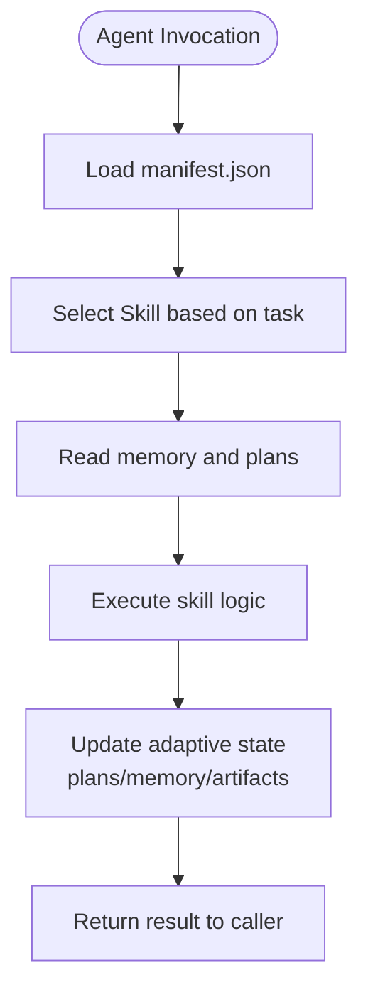
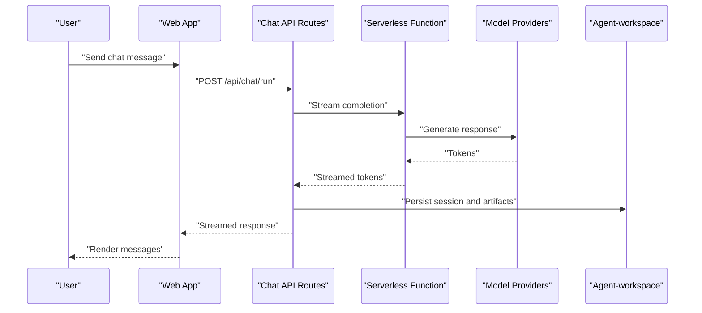
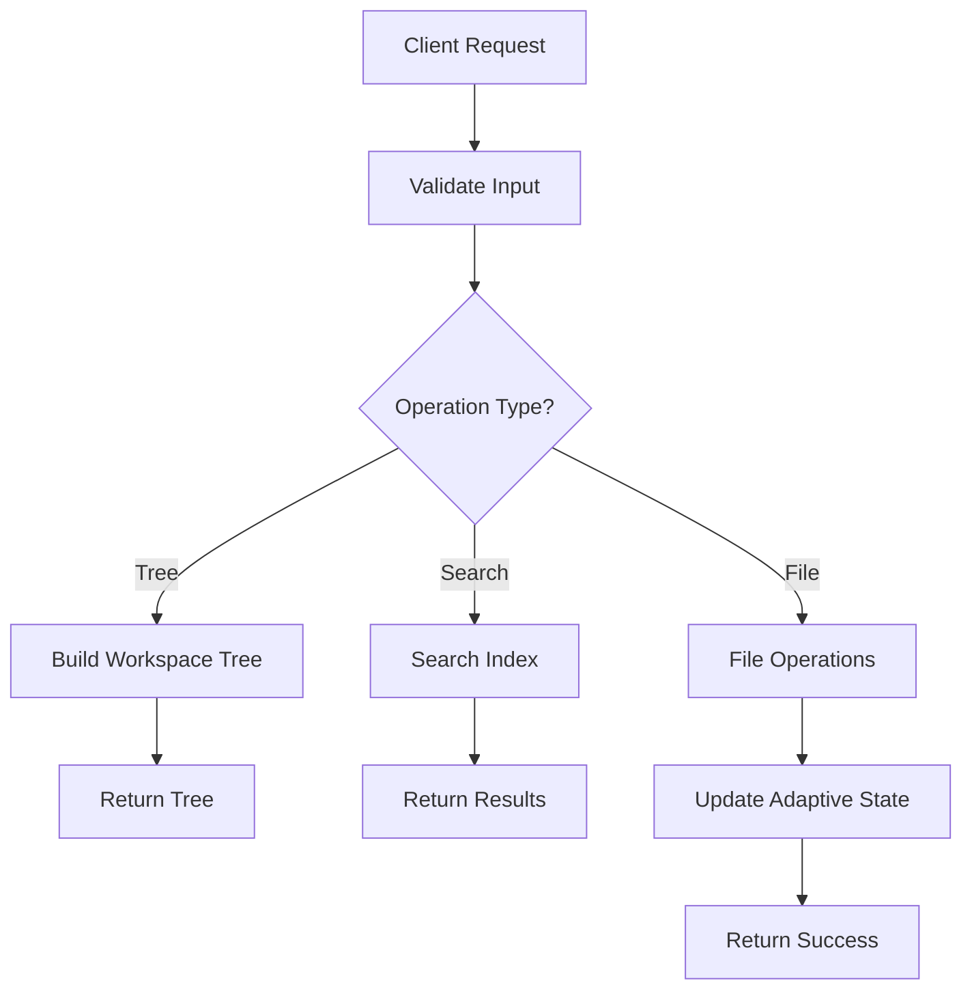
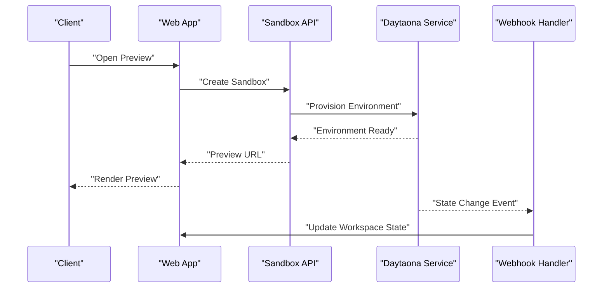
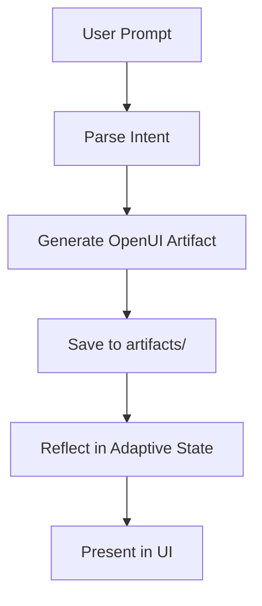
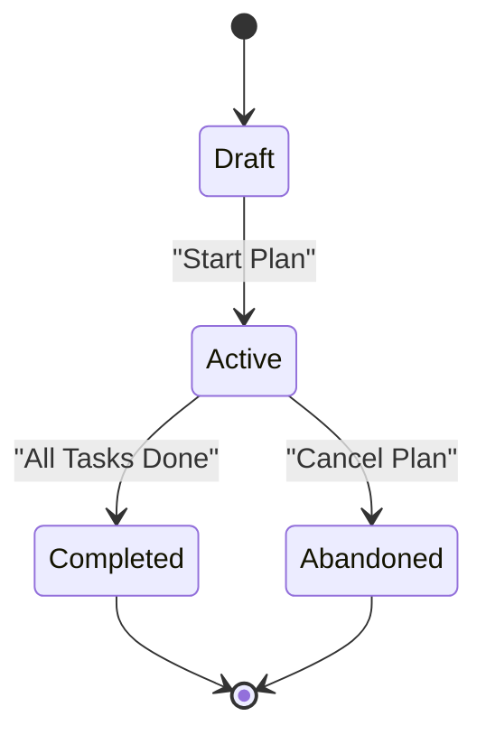
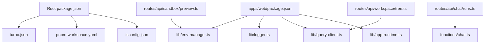

# Project Overview

<cite>
**Referenced Files in This Document**
- [README.md](file://README.md)
- [PRODUCT.md](file://PRODUCT.md)
- [DESIGN.md](file://DESIGN.md)
- [CONTEXT.md](file://CONTEXT.md)
- [WORKSPACE.md](file://WORKSPACE.md)
- [ARCHITECTURE.md](file://agent-workspace/ARCHITECTURE.md)
- [AGENTS.md](file://agent-workspace/AGENTS.md)
- [index.md](file://agent-workspace/index.md)
- [manifest.json](file://agent-workspace/manifest.json)
- [architecture.md](file://docs/architecture.md)
- [adaptive-workspace.md](file://docs/adaptive-workspace.md)
- [agent-workspace.md](file://docs/agent-workspace.md)
- [glossary.md](file://docs/wiki/overview/glossary.md)
- [getting-started.md](file://docs/wiki/overview/getting-started.md)
- [chat-api.md](file://docs/wiki/apps/web/chat-api.md)
- [pi-integration.md](file://docs/wiki/apps/web/pi-integration.md)
- [plan-mode.md](file://docs/wiki/apps/web/plan-mode.md)
- [daytona-sandbox.md](file://docs/wiki/features/daytona-sandbox.md)
- [openui.md](file://docs/wiki/features/openui.md)
- [package.json](file://package.json)
- [turbo.json](file://turbo.json)
- [pnpm-workspace.yaml](file://pnpm-workspace.yaml)
- [tsconfig.json](file://tsconfig.json)
- [vercel.json](file://apps/web/vercel.json)
- [vite.config.ts](file://apps/web/vite.config.ts)
- [chat.ts](file://functions/chat.ts)
- [chat.runs.ts](file://apps/web/src/routes/api/chat/runs.ts)
- [chat.session.ts](file://apps/web/src/routes/api/chat/session.ts)
- [workspace.tree.ts](file://apps/web/src/routes/api/workspace/tree.ts)
- [workspace.search.ts](file://apps/web/src/routes/api/workspace/search.ts)
- [daytona.webhook.ts](file://apps/web/src/routes/api/webhooks/daytona.ts)
- [env-manager.ts](file://apps/web/src/lib/env-manager.ts)
- [logger.ts](file://apps/web/src/lib/logger.ts)
- [query-client.ts](file://apps/web/src/lib/query-client.ts)
- [app-runtime.ts](file://apps/web/src/lib/app-runtime.ts)
- [auth-session.ts](file://apps/web/src/routes/api/auth/session.ts)
- [models.discover.ts](file://apps/web/src/routes/api/chat/models.discover.ts)
- [providers.ts](file://apps/web/src/routes/api/chat/providers.ts)
- [sandbox.preview.ts](file://apps/web/src/routes/api/sandbox/preview.ts)
- [sandbox.settings.ts](file://apps/web/src/routes/api/sandbox/settings.ts)
- [health.ts](file://apps/web/src/routes/api/health.ts)
- [index.tsx](file://apps/web/src/routes/index.tsx)
- [login.tsx](file://apps/web/src/routes/login.tsx)
- [router.tsx](file://apps/web/src/router.tsx)
</cite>

## Table of Contents

1. [Introduction](#introduction)
2. [Project Structure](#project-structure)
3. [Core Components](#core-components)
4. [Architecture Overview](#architecture-overview)
5. [Detailed Component Analysis](#detailed-component-analysis)
6. [Dependency Analysis](#dependency-analysis)
7. [Performance Considerations](#performance-considerations)
8. [Troubleshooting Guide](#troubleshooting-guide)
9. [Conclusion](#conclusion)
10. [Appendices](#appendices)

## Introduction

Fleet Pi is an AI-powered development workspace that combines a modern web application with intelligent agents to deliver adaptive, collaborative coding experiences. At its core, Fleet Pi centers around the agent-workspace as the canonical source of truth for project context and state. The platform exposes a Pi protocol for structured interactions between the web UI, backend services, and AI agents, enabling multi-agent collaboration across tasks such as code generation, architecture review, testing, and deployment.

Key value propositions:

- Adaptive workspaces: The agent-workspace maintains adaptive state that evolves with your work, surfacing relevant context, plans, and artifacts automatically.
- Multi-agent collaboration: Multiple specialized agents coordinate via the Pi protocol to tackle complex workflows end-to-end.
- Integrated development environment: A unified web app integrates chat-driven AI assistance, sandboxed execution, OpenUI-based design tools, and workspace operations into one cohesive experience.

Conceptual overview for newcomers:

- Think of Fleet Pi as a smart IDE where your project lives inside an agent-workspace. You interact through chat or visual tools, and agents plan, execute, and learn from your actions, keeping everything synchronized in adaptive state.

Technical overview for experienced developers:

- The system is a monorepo with a Next.js/SvelteKit-style web app (apps/web), serverless functions (functions), and shared packages (packages). The agent-workspace directory holds the canonical workspace manifest, skills, prompts, memory, and plans. The Pi protocol defines typed requests/responses used by the web routes and functions to orchestrate agents and tooling.

Practical examples:

- Ask the chat assistant to refactor a module; the agent proposes changes, runs tests in a Daytaona sandbox, and updates the agent-workspace plans and artifacts.
- Use OpenUI to sketch a UI flow; the agent translates it into components and commits them while updating the workspace index and memory summaries.
- Run a security audit skill; the agent scans dependencies, generates reports under artifacts/reports, and suggests remediation steps in adaptive state.

**Section sources**

- [README.md](file://README.md)
- [PRODUCT.md](file://PRODUCT.md)
- [DESIGN.md](file://DESIGN.md)
- [CONTEXT.md](file://CONTEXT.md)
- [WORKSPACE.md](file://WORKSPACE.md)
- [agent-workspace.md](file://docs/agent-workspace.md)
- [adaptive-workspace.md](file://docs/adaptive-workspace.md)
- [glossary.md](file://docs/wiki/overview/glossary.md)

## Project Structure

Fleet Pi is organized as a monorepo with clear separation between the web application, serverless functions, shared packages, and the agent-workspace. The root contains configuration for package management, linting, and CI. The apps/web directory implements the user-facing web application and API routes. The functions directory hosts serverless endpoints. The agent-workspace directory is the canonical adaptive state repository containing plans, memory, skills, prompts, and artifacts. Documentation resides under docs and wiki.

**Diagram sources**

- [package.json](file://package.json)
- [turbo.json](file://turbo.json)
- [pnpm-workspace.yaml](file://pnpm-workspace.yaml)
- [tsconfig.json](file://tsconfig.json)
- [apps/web/vite.config.ts](file://apps/web/vite.config.ts)
- [apps/web/vercel.json](file://apps/web/vercel.json)
- [functions/chat.ts](file://functions/chat.ts)
- [agent-workspace/index.md](file://agent-workspace/index.md)
- [agent-workspace/ARCHITECTURE.md](file://agent-workspace/ARCHITECTURE.md)
- [agent-workspace/AGENTS.md](file://agent-workspace/AGENTS.md)
- [agent-workspace/manifest.json](file://agent-workspace/manifest.json)
- [docs/architecture.md](file://docs/architecture.md)
- [docs/agent-workspace.md](file://docs/agent-workspace.md)
- [docs/adaptive-workspace.md](file://docs/adaptive-workspace.md)

**Section sources**

- [package.json](file://package.json)
- [turbo.json](file://turbo.json)
- [pnpm-workspace.yaml](file://pnpm-workspace.yaml)
- [tsconfig.json](file://tsconfig.json)
- [apps/web/vite.config.ts](file://apps/web/vite.config.ts)
- [apps/web/vercel.json](file://apps/web/vercel.json)
- [agent-workspace/index.md](file://agent-workspace/index.md)
- [agent-workspace/manifest.json](file://agent-workspace/manifest.json)
- [docs/architecture.md](file://docs/architecture.md)

## Core Components

- Agent-workspace: The canonical adaptive state repository holding plans, memory, skills, prompts, and artifacts. It drives contextual awareness and persistence across sessions.
- Pi protocol: Structured request/response contracts used by the web app and functions to communicate with agents and tools.
- Web application (apps/web): Provides the UI, authentication, chat, workspace operations, and integrations with Daytaona sandbox and OpenUI.
- Serverless functions: Lightweight endpoints for specific flows like chat streaming and webhook handling.
- Shared libraries: Utilities for environment management, logging, data fetching, and runtime configuration.

Value propositions mapped to components:

- Adaptive workspaces are realized through the agent-workspace structure and APIs that read/write plans, memory, and artifacts.
- Multi-agent collaboration is enabled by the Pi protocol and route handlers orchestrating multiple agent calls.
- Integrated development environment emerges from the combination of chat, sandbox preview, and workspace file operations within the same app.

**Section sources**

- [WORKSPACE.md](file://WORKSPACE.md)
- [agent-workspace.md](file://docs/agent-workspace.md)
- [adaptive-workspace.md](file://docs/adaptive-workspace.md)
- [glossary.md](file://docs/wiki/overview/glossary.md)
- [chat-api.md](file://docs/wiki/apps/web/chat-api.md)
- [pi-integration.md](file://docs/wiki/apps/web/pi-integration.md)

## Architecture Overview

The system follows a layered architecture:

- Presentation layer: Web app routes and UI components.
- API layer: Route handlers implementing Pi protocol endpoints for chat, workspace, sandbox, and auth.
- Integration layer: Functions and external services (Daytaona, model providers).
- State layer: Agent-workspace files and indexes representing adaptive state.

**Diagram sources**

- [apps/web/src/router.tsx](file://apps/web/src/router.tsx)
- [apps/web/src/routes/index.tsx](file://apps/web/src/routes/index.tsx)
- [apps/web/src/routes/login.tsx](file://apps/web/src/routes/login.tsx)
- [apps/web/src/routes/api/chat/runs.ts](file://apps/web/src/routes/api/chat/runs.ts)
- [apps/web/src/routes/api/chat/session.ts](file://apps/web/src/routes/api/chat/session.ts)
- [apps/web/src/routes/api/workspace/tree.ts](file://apps/web/src/routes/api/workspace/tree.ts)
- [apps/web/src/routes/api/workspace/search.ts](file://apps/web/src/routes/api/workspace/search.ts)
- [apps/web/src/routes/api/sandbox/preview.ts](file://apps/web/src/routes/api/sandbox/preview.ts)
- [apps/web/src/routes/api/sandbox/settings.ts](file://apps/web/src/routes/api/sandbox/settings.ts)
- [functions/chat.ts](file://functions/chat.ts)
- [agent-workspace/manifest.json](file://agent-workspace/manifest.json)

## Detailed Component Analysis

### Agent-workspace and Adaptive State

The agent-workspace encapsulates the project’s evolving context. It includes:

- Plans: Active, completed, abandoned, and backlog plans guiding agent behavior.
- Memory: Daily, project, research, and summaries capturing knowledge over time.
- Skills: Reusable capabilities for codebase research, documentation, execution planning, frontend design, and memory synthesis.
- Prompts and packages: Configurations and extensions shaping agent behavior.
- Artifacts: Generated datasets, diagrams, reports, and traces.

**Diagram sources**

- [agent-workspace/manifest.json](file://agent-workspace/manifest.json)
- [agent-workspace/AGENTS.md](file://agent-workspace/AGENTS.md)
- [agent-workspace/ARCHITECTURE.md](file://agent-workspace/ARCHITECTURE.md)
- [agent-workspace/index.md](file://agent-workspace/index.md)

**Section sources**

- [agent-workspace/manifest.json](file://agent-workspace/manifest.json)
- [agent-workspace/AGENTS.md](file://agent-workspace/AGENTS.md)
- [agent-workspace/ARCHITECTURE.md](file://agent-workspace/ARCHITECTURE.md)
- [agent-workspace/index.md](file://agent-workspace/index.md)
- [docs/agent-workspace.md](file://docs/agent-workspace.md)
- [docs/adaptive-workspace.md](file://docs/adaptive-workspace.md)

### Chat API and Pi Protocol Orchestration

The chat subsystem uses Pi protocol endpoints to manage sessions, models, providers, and runs. It integrates with serverless functions for streaming responses and interacts with model providers.

**Diagram sources**

- [apps/web/src/routes/api/chat/runs.ts](file://apps/web/src/routes/api/chat/runs.ts)
- [apps/web/src/routes/api/chat/session.ts](file://apps/web/src/routes/api/chat/session.ts)
- [functions/chat.ts](file://functions/chat.ts)
- [apps/web/src/routes/api/chat/models.discover.ts](file://apps/web/src/routes/api/chat/models.discover.ts)
- [apps/web/src/routes/api/chat/providers.ts](file://apps/web/src/routes/api/chat/providers.ts)
- [agent-workspace/manifest.json](file://agent-workspace/manifest.json)

**Section sources**

- [chat-api.md](file://docs/wiki/apps/web/chat-api.md)
- [pi-integration.md](file://docs/wiki/apps/web/pi-integration.md)
- [apps/web/src/routes/api/chat/runs.ts](file://apps/web/src/routes/api/chat/runs.ts)
- [apps/web/src/routes/api/chat/session.ts](file://apps/web/src/routes/api/chat/session.ts)
- [functions/chat.ts](file://functions/chat.ts)
- [apps/web/src/routes/api/chat/models.discover.ts](file://apps/web/src/routes/api/chat/models.discover.ts)
- [apps/web/src/routes/api/chat/providers.ts](file://apps/web/src/routes/api/chat/providers.ts)

### Workspace Operations and Search

Workspace routes provide tree traversal, search, and file operations aligned with the agent-workspace structure. They enable agents and users to navigate and modify project context.

**Diagram sources**

- [apps/web/src/routes/api/workspace/tree.ts](file://apps/web/src/routes/api/workspace/tree.ts)
- [apps/web/src/routes/api/workspace/search.ts](file://apps/web/src/routes/api/workspace/search.ts)
- [agent-workspace/index.md](file://agent-workspace/index.md)

**Section sources**

- [apps/web/src/routes/api/workspace/tree.ts](file://apps/web/src/routes/api/workspace/tree.ts)
- [apps/web/src/routes/api/workspace/search.ts](file://apps/web/src/routes/api/workspace/search.ts)
- [agent-workspace/index.md](file://agent-workspace/index.md)

### Sandbox Integration with Daytaona

Sandbox routes manage previews and settings, integrating with Daytaona for isolated execution environments. Webhooks synchronize state changes back to the workspace.

**Diagram sources**

- [apps/web/src/routes/api/sandbox/preview.ts](file://apps/web/src/routes/api/sandbox/preview.ts)
- [apps/web/src/routes/api/sandbox/settings.ts](file://apps/web/src/routes/api/sandbox/settings.ts)
- [apps/web/src/routes/api/webhooks/daytona.ts](file://apps/web/src/routes/api/webhooks/daytona.ts)

**Section sources**

- [daytona-sandbox.md](file://docs/wiki/features/daytona-sandbox.md)
- [apps/web/src/routes/api/sandbox/preview.ts](file://apps/web/src/routes/api/sandbox/preview.ts)
- [apps/web/src/routes/api/sandbox/settings.ts](file://apps/web/src/routes/api/sandbox/settings.ts)
- [apps/web/src/routes/api/webhooks/daytona.ts](file://apps/web/src/routes/api/webhooks/daytona.ts)

### OpenUI Features

OpenUI provides visual design and prototyping capabilities integrated into the workspace. Agents can generate and update OpenUI artifacts based on user prompts and workspace context.

**Diagram sources**

- [openui.md](file://docs/wiki/features/openui.md)
- [agent-workspace/manifest.json](file://agent-workspace/manifest.json)

**Section sources**

- [openui.md](file://docs/wiki/features/openui.md)
- [agent-workspace/manifest.json](file://agent-workspace/manifest.json)

### Plan Mode and Execution Planning

Plan mode enables agents to create, track, and execute structured plans. Plans are stored in the agent-workspace and updated as tasks progress.

**Diagram sources**

- [plan-mode.md](file://docs/wiki/apps/web/plan-mode.md)
- [agent-workspace/AGENTS.md](file://agent-workspace/AGENTS.md)

**Section sources**

- [plan-mode.md](file://docs/wiki/apps/web/plan-mode.md)
- [agent-workspace/AGENTS.md](file://agent-workspace/AGENTS.md)

## Dependency Analysis

Fleet Pi’s monorepo structure leverages pnpm workspaces and Turborepo for efficient builds and task orchestration. The web app depends on shared libraries for environment management, logging, and query client configuration. API routes depend on serverless functions and external services. The agent-workspace is consumed by both the web app and functions to maintain consistent adaptive state.

**Diagram sources**

- [package.json](file://package.json)
- [turbo.json](file://turbo.json)
- [pnpm-workspace.yaml](file://pnpm-workspace.yaml)
- [tsconfig.json](file://tsconfig.json)
- [apps/web/src/lib/env-manager.ts](file://apps/web/src/lib/env-manager.ts)
- [apps/web/src/lib/logger.ts](file://apps/web/src/lib/logger.ts)
- [apps/web/src/lib/query-client.ts](file://apps/web/src/lib/query-client.ts)
- [apps/web/src/lib/app-runtime.ts](file://apps/web/src/lib/app-runtime.ts)
- [apps/web/src/routes/api/chat/runs.ts](file://apps/web/src/routes/api/chat/runs.ts)
- [apps/web/src/routes/api/workspace/tree.ts](file://apps/web/src/routes/api/workspace/tree.ts)
- [apps/web/src/routes/api/sandbox/preview.ts](file://apps/web/src/routes/api/sandbox/preview.ts)
- [functions/chat.ts](file://functions/chat.ts)

**Section sources**

- [package.json](file://package.json)
- [turbo.json](file://turbo.json)
- [pnpm-workspace.yaml](file://pnpm-workspace.yaml)
- [tsconfig.json](file://tsconfig.json)
- [apps/web/src/lib/env-manager.ts](file://apps/web/src/lib/env-manager.ts)
- [apps/web/src/lib/logger.ts](file://apps/web/src/lib/logger.ts)
- [apps/web/src/lib/query-client.ts](file://apps/web/src/lib/query-client.ts)
- [apps/web/src/lib/app-runtime.ts](file://apps/web/src/lib/app-runtime.ts)

## Performance Considerations

- Streaming responses: Use serverless functions for long-running chat streams to reduce latency and improve UX.
- Indexed search: Maintain workspace indexes to accelerate search operations and reduce repeated parsing overhead.
- Caching: Leverage query client caching for frequently accessed workspace metadata and model provider configurations.
- Concurrency: Parallelize independent agent tasks where possible, respecting rate limits of external providers.
- Resource isolation: Use sandbox environments for heavy computations to avoid blocking the main thread.

[No sources needed since this section provides general guidance]

## Troubleshooting Guide

Common issues and resolutions:

- Authentication failures: Verify session endpoints and ensure proper token handling in the auth session route.
- Model provider errors: Check provider discovery and configuration routes for correct credentials and endpoints.
- Sandbox provisioning failures: Inspect webhook handlers and sandbox settings for misconfigured environments.
- Workspace indexing delays: Ensure reindex operations complete successfully and monitor logs for errors.

**Section sources**

- [apps/web/src/routes/api/auth/session.ts](file://apps/web/src/routes/api/auth/session.ts)
- [apps/web/src/routes/api/chat/models.discover.ts](file://apps/web/src/routes/api/chat/models.discover.ts)
- [apps/web/src/routes/api/chat/providers.ts](file://apps/web/src/routes/api/chat/providers.ts)
- [apps/web/src/routes/api/sandbox/settings.ts](file://apps/web/src/routes/api/sandbox/settings.ts)
- [apps/web/src/routes/api/webhooks/daytona.ts](file://apps/web/src/routes/api/webhooks/daytona.ts)
- [apps/web/src/lib/logger.ts](file://apps/web/src/lib/logger.ts)

## Conclusion

Fleet Pi delivers a powerful, adaptive development environment by uniting a modern web application with intelligent agents through the Pi protocol. The agent-workspace serves as the central adaptive state, enabling multi-agent collaboration and seamless integration of tools like chat, sandbox execution, and OpenUI. For newcomers, it offers an intuitive way to collaborate with AI agents; for developers, it provides a robust, extensible architecture ready for advanced customization and scaling.

[No sources needed since this section summarizes without analyzing specific files]

## Appendices

- Getting started: Follow the getting started guide to set up the workspace and run the app locally.
- Glossary: Review key terms such as agent-workspace, Pi protocol, and adaptive state for deeper understanding.

**Section sources**

- [getting-started.md](file://docs/wiki/overview/getting-started.md)
- [glossary.md](file://docs/wiki/overview/glossary.md)
