# Troubleshooting & FAQ

<cite>
**Referenced Files in This Document**
- [README.md](file://README.md)
- [CONTRIBUTING.md](file://CONTRIBUTING.md)
- [SECURITY.md](file://SECURITY.md)
- [apps/web/package.json](file://apps/web/package.json)
- [apps/web/vercel.json](file://apps/web/vercel.json)
- [apps/web/vite.config.ts](file://apps/web/vite.config.ts)
- [apps/web/src/lib/logger.ts](file://apps/web/src/lib/logger.ts)
- [apps/web/src/lib/env-manager.ts](file://apps/web/src/lib/env-manager.ts)
- [apps/web/src/lib/api-utils.ts](file://apps/web/src/lib/api-utils.ts)
- [apps/web/src/routes/api/chat/run.ts](file://apps/web/src/routes/api/chat/run.ts)
- [apps/web/src/routes/api/workspace/health.ts](file://apps/web/src/routes/api/workspace/health.ts)
- [apps/web/scripts/verify-deployment-readiness.mjs](file://apps/web/scripts/verify-deployment-readiness.mjs)
- [functions/chat.ts](file://functions/chat.ts)
- [neon.ts](file://neon.ts)
- [turbo.json](file://turbo.json)
- [.circleci/config.yml](file:.circleci/config.yml)
- [docs/wiki/how-to-contribute/debugging.md](file://docs/wiki/how-to-contribute/debugging.md)
- [docs/wiki/reference/configuration.md](file://docs/wiki/reference/configuration.md)
- [docs/deployment.md](file://docs/deployment.md)
- [docs/runbooks.md](file://docs/runbooks.md)
</cite>

## Table of Contents

1. Introduction
2. Project Structure
3. Core Components
4. Architecture Overview
5. Detailed Component Analysis
6. Dependency Analysis
7. Performance Considerations
8. Troubleshooting Guide
9. Conclusion
10. Appendices

## Introduction

This document provides comprehensive troubleshooting guidance for Fleet Pi across setup, development, and production deployment. It consolidates diagnostic procedures, log analysis techniques, performance profiling tips, and an FAQ to help resolve common issues quickly. Where applicable, it references concrete files in the repository to ensure traceability and accuracy.

## Project Structure

Fleet Pi is a monorepo with a web application under apps/web, serverless functions under functions, configuration and tooling at the root, and documentation under docs. The web app uses Vite, TypeScript, and a routing layer that exposes API endpoints under src/routes/api. Environment variables are managed via env-manager, logging is centralized through logger, and deployment targets include Vercel (vercel.json). CI is configured via CircleCI.

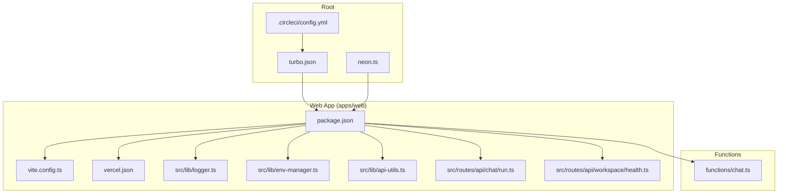

**Diagram sources**

- [turbo.json:1-200](file://turbo.json#L1-L200)
- [.circleci/config.yml:1-200](file:.circleci/config.yml#L1-L200)
- [neon.ts:1-200](file://neon.ts#L1-L200)
- [apps/web/package.json:1-200](file://apps/web/package.json#L1-L200)
- [apps/web/vite.config.ts:1-200](file://apps/web/vite.config.ts#L1-L200)
- [apps/web/vercel.json:1-200](file://apps/web/vercel.json#L1-L200)
- [apps/web/src/lib/logger.ts:1-200](file://apps/web/src/lib/logger.ts#L1-L200)
- [apps/web/src/lib/env-manager.ts:1-200](file://apps/web/src/lib/env-manager.ts#L1-L200)
- [apps/web/src/lib/api-utils.ts:1-200](file://apps/web/src/lib/api-utils.ts#L1-L200)
- [apps/web/src/routes/api/chat/run.ts:1-200](file://apps/web/src/routes/api/chat/run.ts#L1-L200)
- [apps/web/src/routes/api/workspace/health.ts:1-200](file://apps/web/src/routes/api/workspace/health.ts#L1-L200)
- [functions/chat.ts:1-200](file://functions/chat.ts#L1-L200)

**Section sources**

- [README.md:1-200](file://README.md#L1-L200)
- [CONTRIBUTING.md:1-200](file://CONTRIBUTING.md#L1-L200)
- [SECURITY.md:1-200](file://SECURITY.md#L1-L200)

## Core Components

- Logging: Centralized logging module used across the app to emit structured logs for requests, errors, and diagnostics.
- Environment management: Configuration loader and validator for environment variables required by the app and integrations.
- API utilities: Shared helpers for HTTP requests, error mapping, retries, and timeouts.
- Chat API route: Orchestrates chat runs, integrates with providers, and returns results or errors.
- Workspace health endpoint: Provides readiness/liveness checks for workspace services.
- Deployment verification script: Validates environment and dependencies before deployment.
- Serverless function: Handles chat-related logic as a function target.
- Database integration: Neon configuration for database connectivity.

Key responsibilities:

- Ensure consistent logging and error reporting.
- Validate and surface misconfiguration early.
- Provide robust error handling and retry strategies for external calls.
- Expose health endpoints for monitoring.

**Section sources**

- [apps/web/src/lib/logger.ts:1-200](file://apps/web/src/lib/logger.ts#L1-L200)
- [apps/web/src/lib/env-manager.ts:1-200](file://apps/web/src/lib/env-manager.ts#L1-L200)
- [apps/web/src/lib/api-utils.ts:1-200](file://apps/web/src/lib/api-utils.ts#L1-L200)
- [apps/web/src/routes/api/chat/run.ts:1-200](file://apps/web/src/routes/api/chat/run.ts#L1-L200)
- [apps/web/src/routes/api/workspace/health.ts:1-200](file://apps/web/src/routes/api/workspace/health.ts#L1-L200)
- [apps/web/scripts/verify-deployment-readiness.mjs:1-200](file://apps/web/scripts/verify-deployment-readiness.mjs#L1-L200)
- [functions/chat.ts:1-200](file://functions/chat.ts#L1-L200)
- [neon.ts:1-200](file://neon.ts#L1-L200)

## Architecture Overview

The web app exposes API routes that orchestrate chat operations and workspace interactions. Requests flow from the browser to the API routes, which may call external providers or serverless functions. Health endpoints enable proactive monitoring. Environment variables drive behavior and integrations.

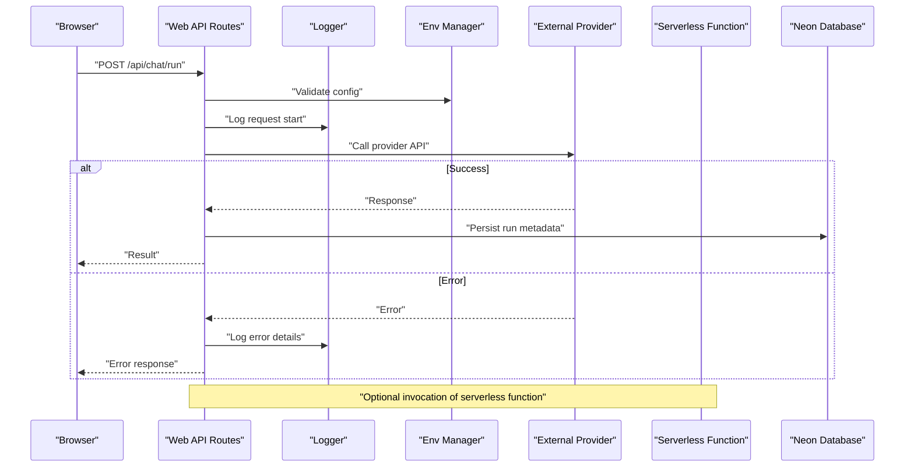

**Diagram sources**

- [apps/web/src/routes/api/chat/run.ts:1-200](file://apps/web/src/routes/api/chat/run.ts#L1-L200)
- [apps/web/src/lib/logger.ts:1-200](file://apps/web/src/lib/logger.ts#L1-L200)
- [apps/web/src/lib/env-manager.ts:1-200](file://apps/web/src/lib/env-manager.ts#L1-L200)
- [functions/chat.ts:1-200](file://functions/chat.ts#L1-L200)
- [neon.ts:1-200](file://neon.ts#L1-L200)

## Detailed Component Analysis

### Logging and Diagnostics

- Purpose: Emit structured logs for requests, errors, and operational events; support filtering and severity levels.
- Common issues: Missing log levels, incorrect timestamps, excessive verbosity in production.
- Resolution steps:
  - Verify logger initialization and default settings.
  - Ensure environment controls for log level are set.
  - Use correlation IDs to trace requests across components.

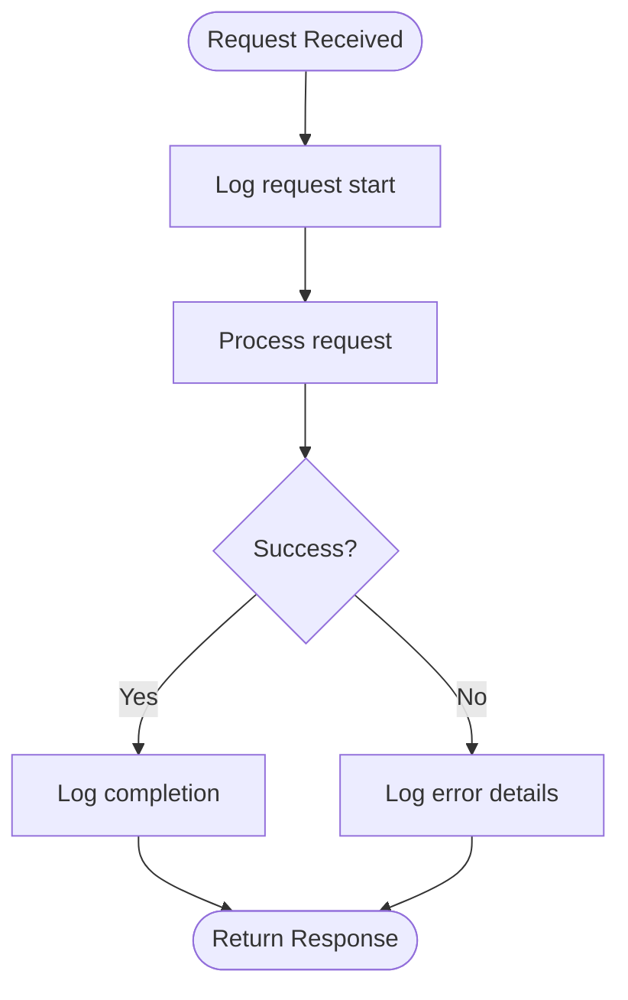

**Diagram sources**

- [apps/web/src/lib/logger.ts:1-200](file://apps/web/src/lib/logger.ts#L1-L200)

**Section sources**

- [apps/web/src/lib/logger.ts:1-200](file://apps/web/src/lib/logger.ts#L1-L200)

### Environment Management

- Purpose: Load, validate, and expose environment variables for integrations and runtime behavior.
- Common issues: Missing keys, invalid values, mismatched types, secrets not injected.
- Resolution steps:
  - Confirm all required variables exist and are correctly formatted.
  - Check variable precedence and override rules.
  - Use the deployment readiness script to pre-validate configuration.

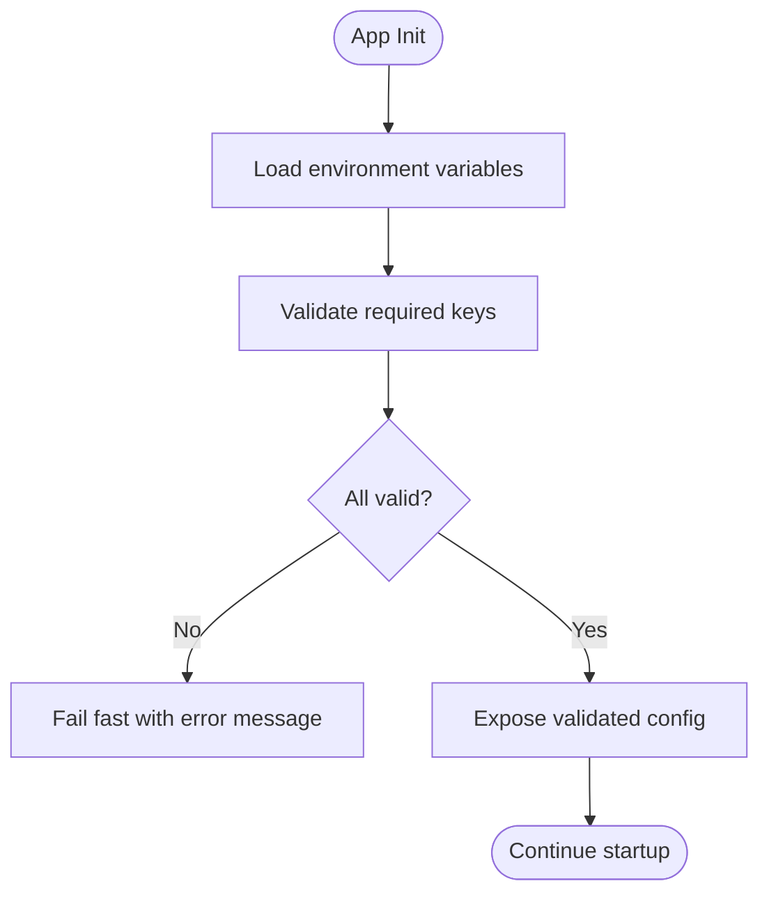

**Diagram sources**

- [apps/web/src/lib/env-manager.ts:1-200](file://apps/web/src/lib/env-manager.ts#L1-L200)
- [apps/web/scripts/verify-deployment-readiness.mjs:1-200](file://apps/web/scripts/verify-deployment-readiness.mjs#L1-L200)

**Section sources**

- [apps/web/src/lib/env-manager.ts:1-200](file://apps/web/src/lib/env-manager.ts#L1-L200)
- [apps/web/scripts/verify-deployment-readiness.mjs:1-200](file://apps/web/scripts/verify-deployment-readiness.mjs#L1-L200)

### API Utilities and Error Handling

- Purpose: Standardize HTTP calls, handle retries, timeouts, and map errors consistently.
- Common issues: Unhandled network errors, missing retry policies, inconsistent error shapes.
- Resolution steps:
  - Ensure all API calls use shared utilities.
  - Configure appropriate retry/backoff for transient failures.
  - Normalize error responses for clients.

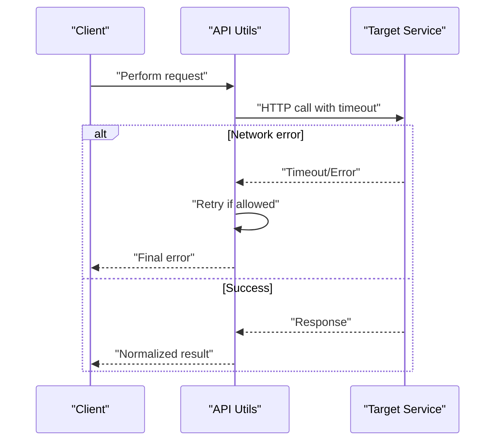

**Diagram sources**

- [apps/web/src/lib/api-utils.ts:1-200](file://apps/web/src/lib/api-utils.ts#L1-L200)

**Section sources**

- [apps/web/src/lib/api-utils.ts:1-200](file://apps/web/src/lib/api-utils.ts#L1-L200)

### Chat Run Orchestration

- Purpose: Coordinate chat execution, integrate with providers, persist metadata, and return results.
- Common issues: Provider authentication failures, rate limits, malformed payloads, timeouts.
- Resolution steps:
  - Validate provider credentials and model selection.
  - Inspect request payload structure and constraints.
  - Monitor provider status and adjust timeouts/retries.

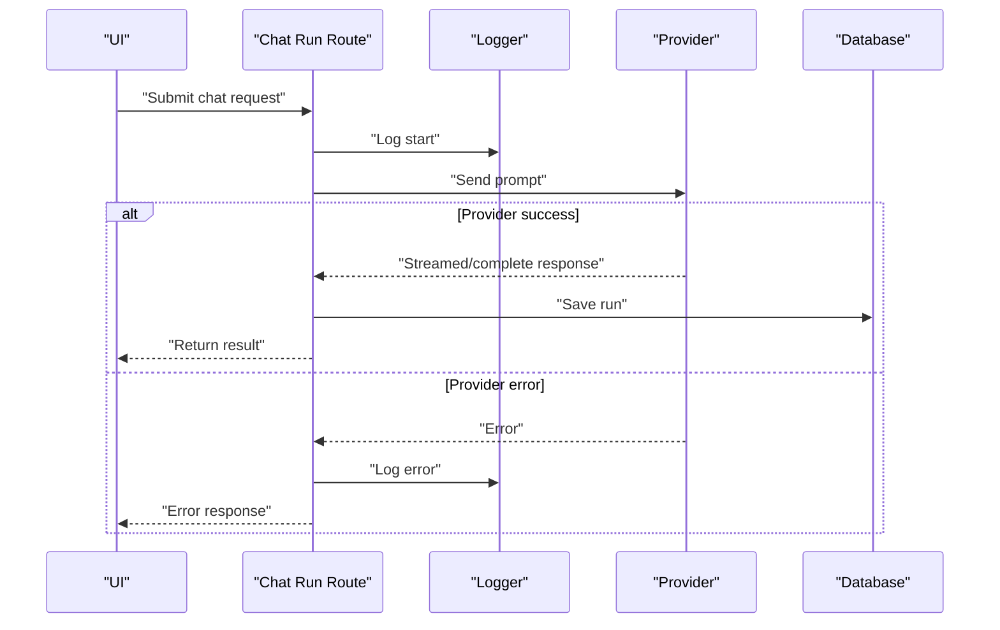

**Diagram sources**

- [apps/web/src/routes/api/chat/run.ts:1-200](file://apps/web/src/routes/api/chat/run.ts#L1-L200)
- [apps/web/src/lib/logger.ts:1-200](file://apps/web/src/lib/logger.ts#L1-L200)
- [neon.ts:1-200](file://neon.ts#L1-L200)

**Section sources**

- [apps/web/src/routes/api/chat/run.ts:1-200](file://apps/web/src/routes/api/chat/run.ts#L1-L200)

### Workspace Health Endpoint

- Purpose: Provide liveness/readiness checks for workspace services.
- Common issues: Downstream service unavailability, stale health state, incorrect status codes.
- Resolution steps:
  - Ensure health checks reflect actual dependency states.
  - Return appropriate HTTP status codes (200 OK vs 5xx).
  - Integrate with monitoring systems for alerting.

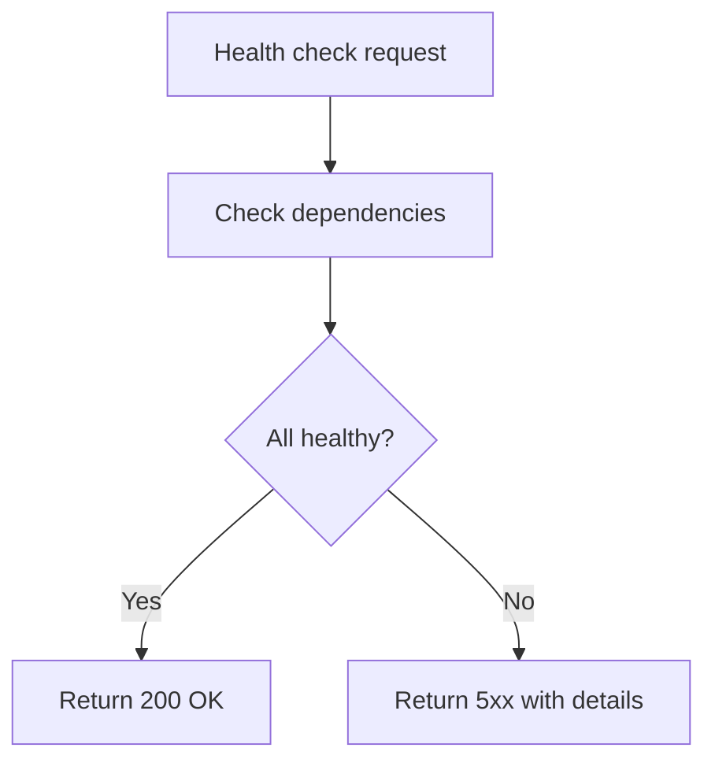

**Diagram sources**

- [apps/web/src/routes/api/workspace/health.ts:1-200](file://apps/web/src/routes/api/workspace/health.ts#L1-L200)

**Section sources**

- [apps/web/src/routes/api/workspace/health.ts:1-200](file://apps/web/src/routes/api/workspace/health.ts#L1-L200)

### Deployment Verification Script

- Purpose: Pre-flight checks for environment, dependencies, and configuration before deployment.
- Common issues: Missing environment variables, incompatible versions, failed dependency resolution.
- Resolution steps:
  - Run the verification script locally and in CI.
  - Fix reported issues prior to deploying.
  - Review output for warnings about deprecated features.

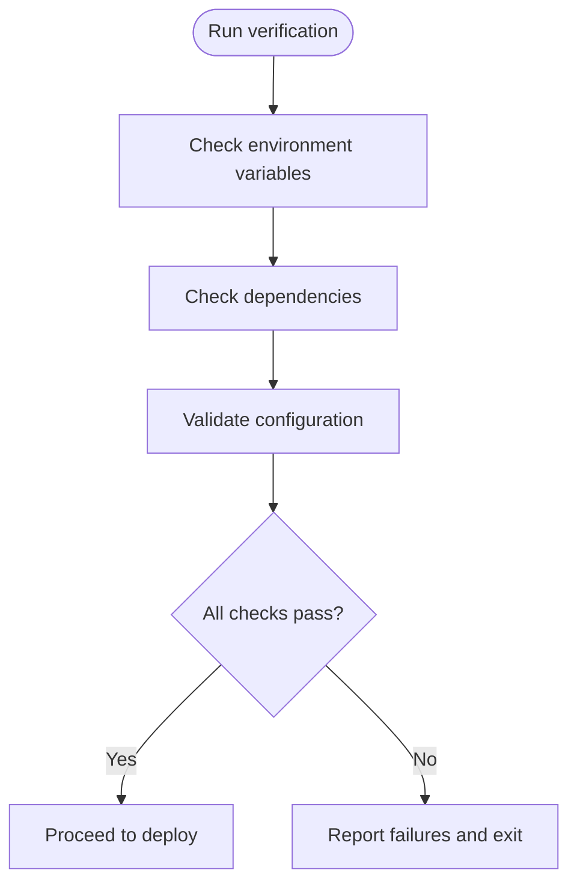

**Diagram sources**

- [apps/web/scripts/verify-deployment-readiness.mjs:1-200](file://apps/web/scripts/verify-deployment-readiness.mjs#L1-L200)

**Section sources**

- [apps/web/scripts/verify-deployment-readiness.mjs:1-200](file://apps/web/scripts/verify-deployment-readiness.mjs#L1-L200)

### Serverless Function (Chat)

- Purpose: Handle chat-related logic as a serverless function, potentially offloading heavy tasks.
- Common issues: Cold starts, memory limits, timeouts, missing secrets.
- Resolution steps:
  - Optimize payload size and reduce cold start impact.
  - Ensure secrets are available in the function environment.
  - Monitor function metrics and adjust resource allocation.

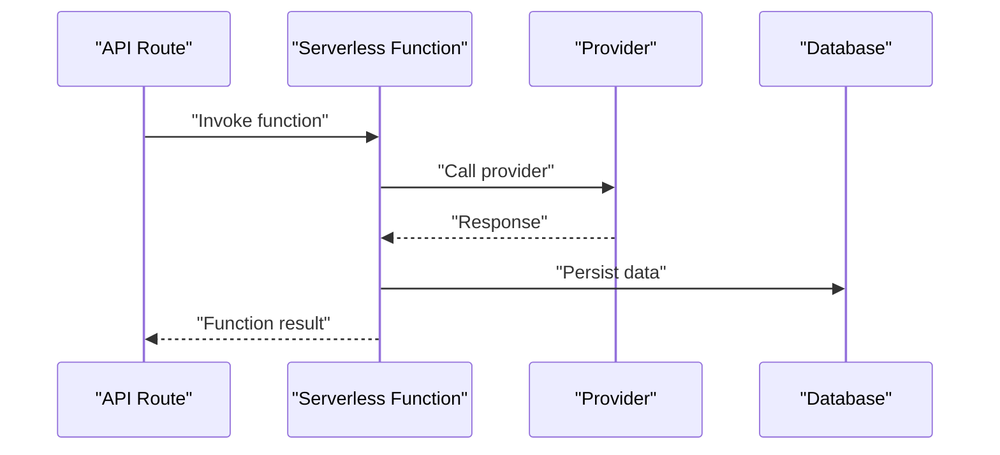

**Diagram sources**

- [functions/chat.ts:1-200](file://functions/chat.ts#L1-L200)

**Section sources**

- [functions/chat.ts:1-200](file://functions/chat.ts#L1-L200)

### Database Integration (Neon)

- Purpose: Manage database connections and queries for persistence.
- Common issues: Connection failures, credential misconfiguration, pool exhaustion.
- Resolution steps:
  - Verify connection string and credentials.
  - Tune connection pool settings based on load.
  - Monitor query performance and optimize slow queries.

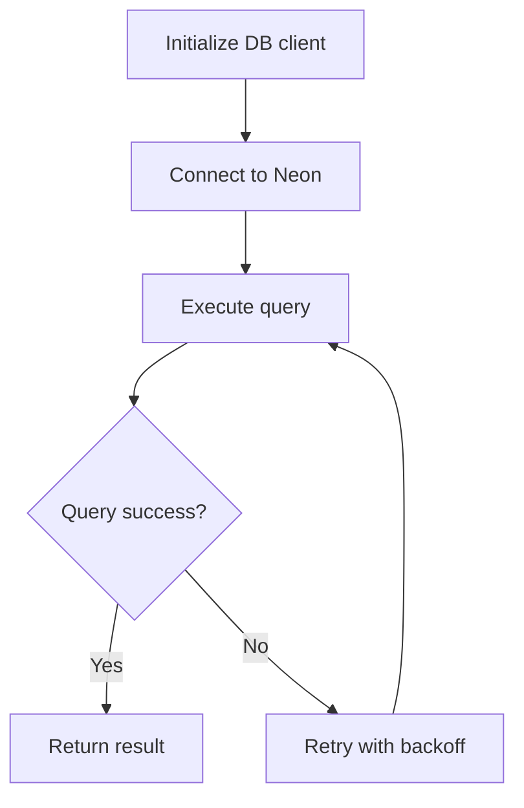

**Diagram sources**

- [neon.ts:1-200](file://neon.ts#L1-L200)

**Section sources**

- [neon.ts:1-200](file://neon.ts#L1-L200)

## Dependency Analysis

Fleet Pi’s build and runtime depend on several key files:

- Build tooling: Vite configuration defines bundling and dev server options.
- Package manager: package.json lists dependencies and scripts.
- Monorepo orchestration: turbo.json coordinates tasks across packages.
- CI pipeline: CircleCI config automates builds and tests.
- Deployment: vercel.json configures serverless hosting.

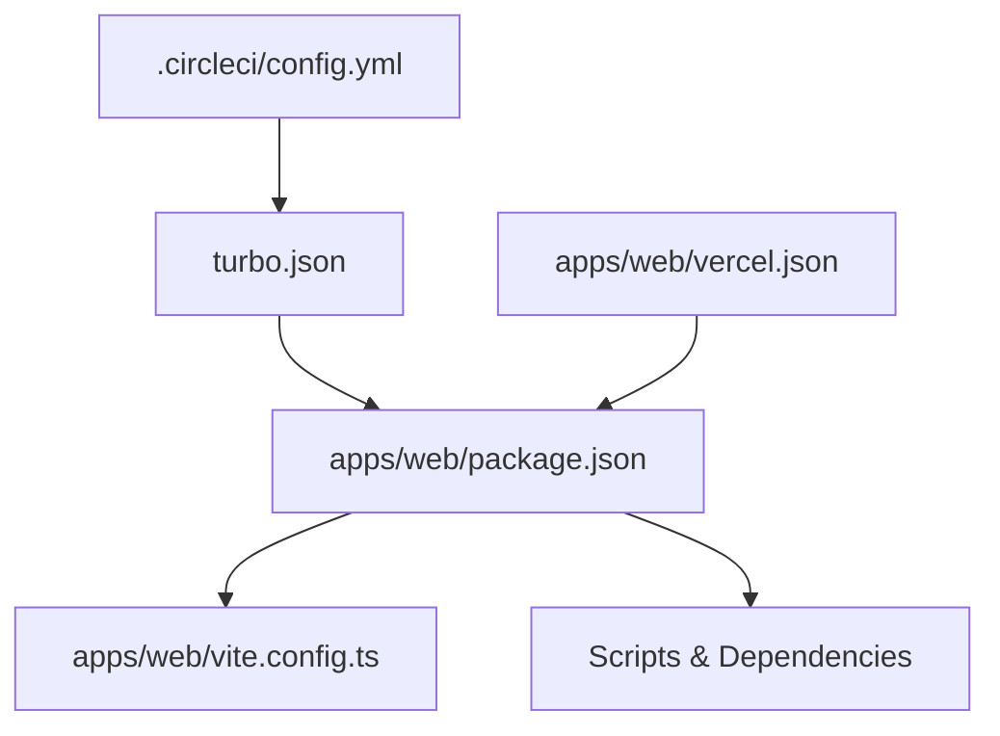

**Diagram sources**

- [apps/web/package.json:1-200](file://apps/web/package.json#L1-L200)
- [apps/web/vite.config.ts:1-200](file://apps/web/vite.config.ts#L1-L200)
- [turbo.json:1-200](file://turbo.json#L1-L200)
- [.circleci/config.yml:1-200](file:.circleci/config.yml#L1-L200)
- [apps/web/vercel.json:1-200](file://apps/web/vercel.json#L1-L200)

**Section sources**

- [apps/web/package.json:1-200](file://apps/web/package.json#L1-L200)
- [apps/web/vite.config.ts:1-200](file://apps/web/vite.config.ts#L1-L200)
- [turbo.json:1-200](file://turbo.json#L1-L200)
- [.circleci/config.yml:1-200](file:.circleci/config.yml#L1-L200)
- [apps/web/vercel.json:1-200](file://apps/web/vercel.json#L1-L200)

## Performance Considerations

- Logging overhead: Avoid excessive logging in hot paths; use sampling or reduced verbosity in production.
- Network latency: Implement retries with exponential backoff for external APIs; cache where safe.
- Database performance: Index frequently queried fields; monitor slow queries; tune connection pools.
- Build times: Leverage caching in CI; split large bundles; defer non-critical assets.
- Serverless cold starts: Minimize initialization cost; keep dependencies lean; consider provisioned concurrency if supported.

[No sources needed since this section provides general guidance]

## Troubleshooting Guide

### Setup Issues

- Symptom: Application fails to start due to missing environment variables.
  - Action: Verify all required variables are present and correctly formatted using the environment manager and deployment readiness script.
- Symptom: Build fails due to dependency conflicts.
  - Action: Clear lockfiles and reinstall dependencies; verify Node.js version compatibility.
- Symptom: Local dev server cannot connect to external services.
  - Action: Check proxy settings, firewall rules, and local environment file overrides.

**Section sources**

- [apps/web/src/lib/env-manager.ts:1-200](file://apps/web/src/lib/env-manager.ts#L1-L200)
- [apps/web/scripts/verify-deployment-readiness.mjs:1-200](file://apps/web/scripts/verify-deployment-readiness.mjs#L1-L200)

### Development Issues

- Symptom: API routes return unexpected errors.
  - Action: Inspect logs for error details; validate request payloads; confirm provider credentials.
- Symptom: Hot reload not working.
  - Action: Restart dev server; clear caches; check Vite configuration for watch exclusions.
- Symptom: Tests fail intermittently.
  - Action: Stabilize mocks; increase timeouts; isolate flaky tests.

**Section sources**

- [apps/web/src/lib/logger.ts:1-200](file://apps/web/src/lib/logger.ts#L1-L200)
- [apps/web/src/lib/api-utils.ts:1-200](file://apps/web/src/lib/api-utils.ts#L1-L200)
- [apps/web/vite.config.ts:1-200](file://apps/web/vite.config.ts#L1-L200)

### Production Deployment Issues

- Symptom: Deployment fails verification checks.
  - Action: Run the deployment readiness script locally; fix reported issues; re-run CI.
- Symptom: Health endpoint returns degraded status.
  - Action: Investigate downstream dependencies; review logs; scale resources if necessary.
- Symptom: High error rates after deployment.
  - Action: Roll back to previous version; analyze logs; identify regression changes.

**Section sources**

- [apps/web/scripts/verify-deployment-readiness.mjs:1-200](file://apps/web/scripts/verify-deployment-readiness.mjs#L1-L200)
- [apps/web/src/routes/api/workspace/health.ts:1-200](file://apps/web/src/routes/api/workspace/health.ts#L1-L200)

### Debugging Techniques

- Enable verbose logging temporarily for problematic requests; correlate using request IDs.
- Use browser developer tools to inspect network requests and responses.
- Add targeted console logs around failing code paths; remove them post-resolution.
- Profile CPU and memory usage during high-load scenarios.

**Section sources**

- [apps/web/src/lib/logger.ts:1-200](file://apps/web/src/lib/logger.ts#L1-L200)
- [docs/wiki/how-to-contribute/debugging.md:1-200](file://docs/wiki/how-to-contribute/debugging.md#L1-L200)

### Log Analysis Procedures

- Filter logs by severity and time range to isolate incidents.
- Search for error patterns and stack traces to pinpoint failures.
- Correlate logs across components using correlation IDs.
- Export logs to external systems for long-term retention and analysis.

**Section sources**

- [apps/web/src/lib/logger.ts:1-200](file://apps/web/src/lib/logger.ts#L1-L200)

### Performance Profiling Guidance

- Use built-in profilers in browsers and Node.js to identify bottlenecks.
- Monitor database query performance and optimize slow queries.
- Track API response times and identify slow external calls.
- Set up alerts for latency spikes and error rate increases.

[No sources needed since this section provides general guidance]

### Monitoring and Alerting Setup

- Instrument health endpoints to feed into uptime monitors.
- Configure log aggregation and dashboards for key metrics.
- Define alert thresholds for error rates, latency, and resource usage.
- Integrate with incident management tools for automated notifications.

[No sources needed since this section provides general guidance]

### Critical Failure Resolution Procedures

- Immediate actions:
  - Roll back recent changes if a regression is suspected.
  - Scale out resources to mitigate overload.
  - Temporarily disable non-essential features to stabilize the system.
- Post-incident:
  - Conduct root cause analysis.
  - Update runbooks and add safeguards.
  - Communicate status and resolutions to stakeholders.

[No sources needed since this section provides general guidance]

## Conclusion

This troubleshooting guide consolidates common issues, diagnostic steps, and resolution procedures for Fleet Pi. By leveraging centralized logging, environment validation, and health endpoints, teams can detect and resolve problems proactively. Continuous monitoring, alerting, and iterative improvements will enhance reliability and user experience.

[No sources needed since this section summarizes without analyzing specific files]

## Appendices

### FAQ

- Q: How do I configure environment variables for local development?
  - A: Use the environment manager to define required variables; verify with the deployment readiness script.
- Q: Why am I seeing provider authentication errors?
  - A: Ensure credentials are correct and accessible; check rate limits and account status.
- Q: How can I improve build performance?
  - A: Enable caching, split bundles, and avoid unnecessary dependencies.
- Q: What should I do if the health endpoint reports degraded status?
  - A: Investigate downstream dependencies, review logs, and scale resources as needed.
- Q: How do I enable detailed logs in production?
  - A: Adjust log levels via environment variables; monitor carefully to avoid performance impact.

**Section sources**

- [apps/web/src/lib/env-manager.ts:1-200](file://apps/web/src/lib/env-manager.ts#L1-L200)
- [apps/web/scripts/verify-deployment-readiness.mjs:1-200](file://apps/web/scripts/verify-deployment-readiness.mjs#L1-L200)
- [apps/web/src/routes/api/workspace/health.ts:1-200](file://apps/web/src/routes/api/workspace/health.ts#L1-L200)

### Error Messages Reference

- Missing environment variable: Indicates required configuration is absent; populate and restart.
- Provider authentication failed: Credentials invalid or expired; update and retry.
- Network timeout: External service unreachable; check connectivity and timeouts.
- Database connection error: Credential or pool issue; verify connection string and pool settings.
- Health check degraded: One or more dependencies unhealthy; investigate and restore.

**Section sources**

- [apps/web/src/lib/env-manager.ts:1-200](file://apps/web/src/lib/env-manager.ts#L1-L200)
- [apps/web/src/lib/api-utils.ts:1-200](file://apps/web/src/lib/api-utils.ts#L1-L200)
- [apps/web/src/routes/api/workspace/health.ts:1-200](file://apps/web/src/routes/api/workspace/health.ts#L1-L200)

### Configuration Reference

- Environment variables: See configuration reference for required keys and defaults.
- Deployment settings: Review Vercel configuration for hosting-specific options.
- CI configuration: Inspect CircleCI pipeline for build and test steps.

**Section sources**

- [docs/wiki/reference/configuration.md:1-200](file://docs/wiki/reference/configuration.md#L1-L200)
- [apps/web/vercel.json:1-200](file://apps/web/vercel.json#L1-L200)
- [.circleci/config.yml:1-200](file:.circleci/config.yml#L1-L200)

### Deployment Notes

- Pre-deployment checklist: Run verification script; ensure environment variables are set; validate dependencies.
- Rollback strategy: Maintain previous versions; automate rollback in case of critical failures.
- Monitoring: Set up health checks and alerts; review logs continuously.

**Section sources**

- [apps/web/scripts/verify-deployment-readiness.mjs:1-200](file://apps/web/scripts/verify-deployment-readiness.mjs#L1-L200)
- [docs/deployment.md:1-200](file://docs/deployment.md#L1-L200)
- [docs/runbooks.md:1-200](file://docs/runbooks.md#L1-L200)
