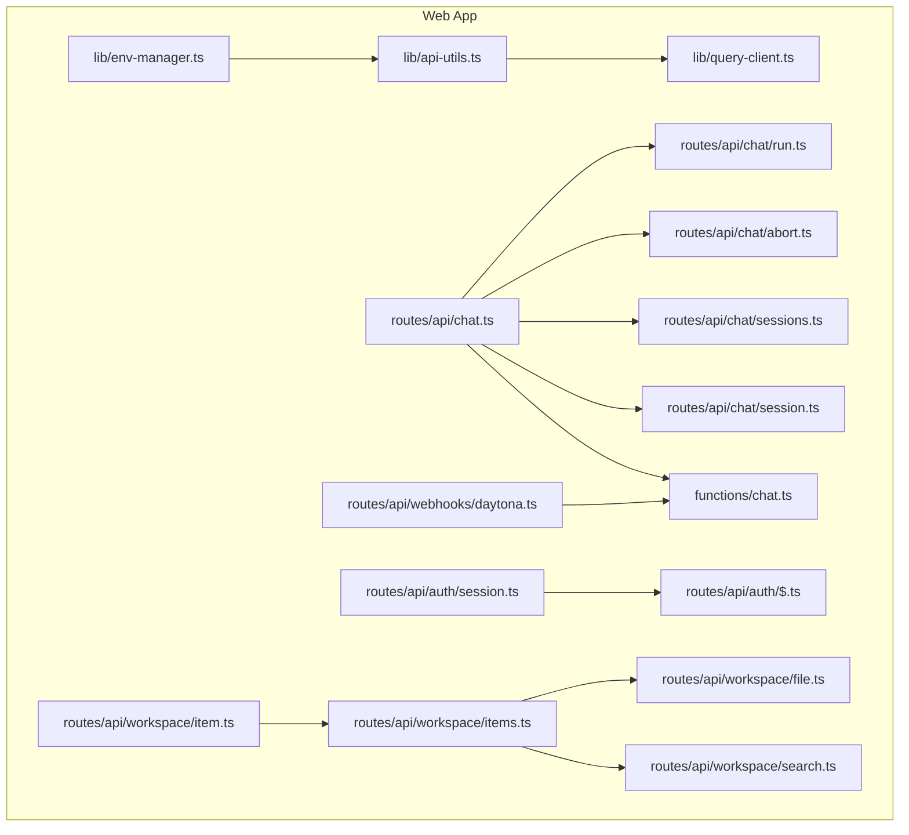
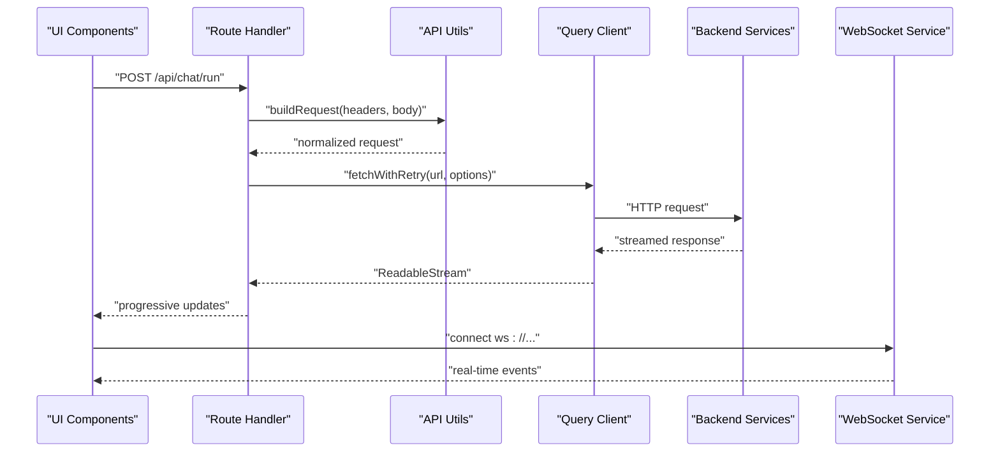
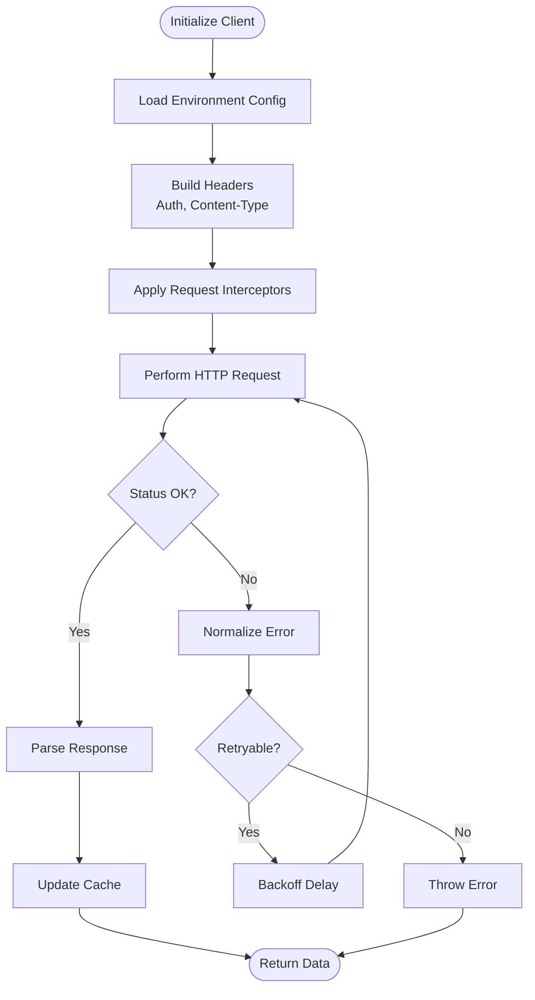
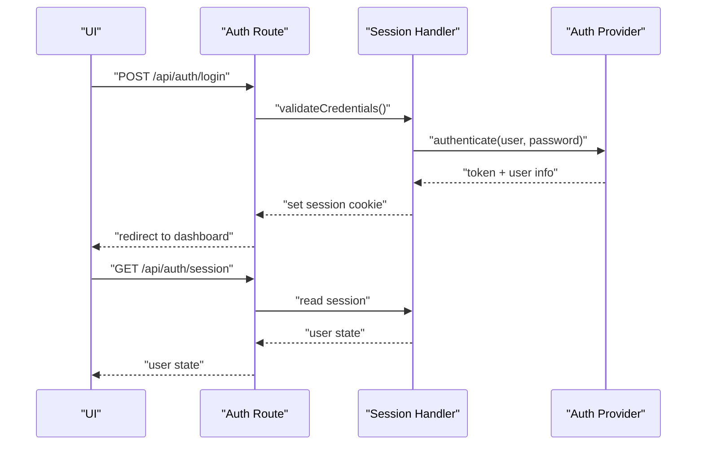
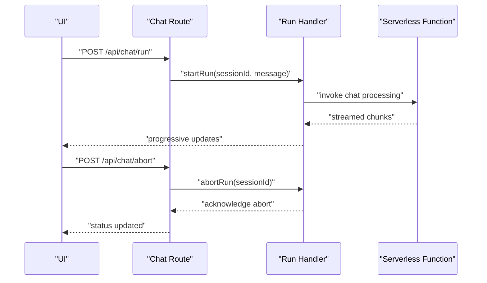
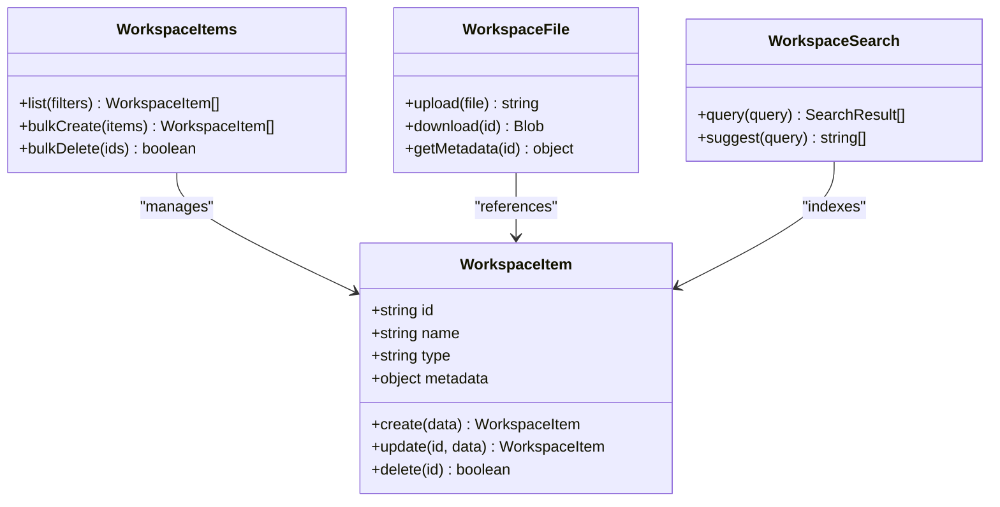
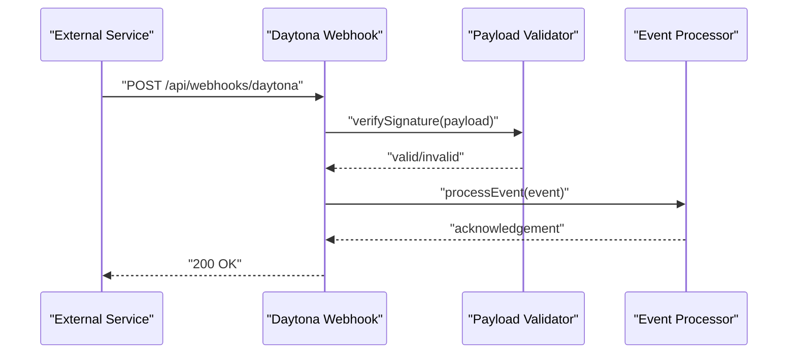
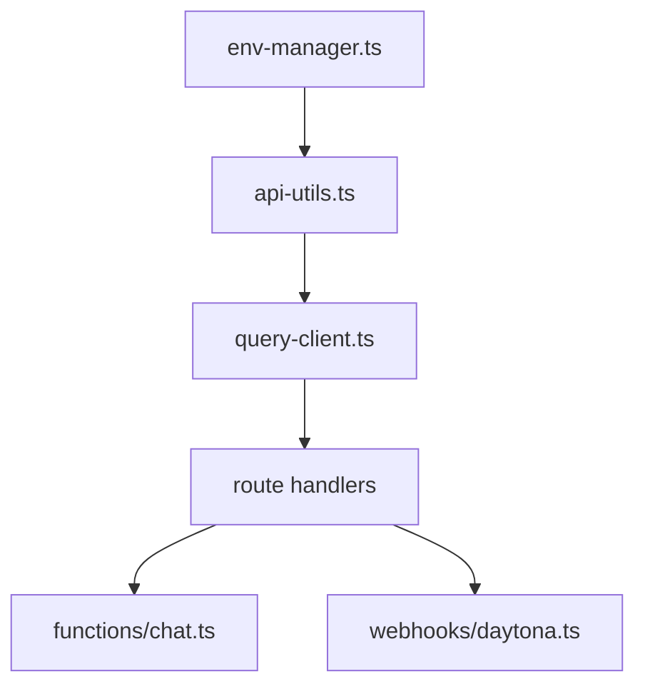

# API Integration Layer

<cite>
**Referenced Files in This Document**
- [api-utils.ts](file://apps/web/src/lib/api-utils.ts)
- [query-client.ts](file://apps/web/src/lib/query-client.ts)
- [env-manager.ts](file://apps/web/src/lib/env-manager.ts)
- [chat.ts](file://functions/chat.ts)
- [session.ts](file://apps/web/src/routes/api/auth/session.ts)
- [$.ts](file://apps/web/src/routes/api/auth/$.ts)
- [chat.ts](file://apps/web/src/routes/api/chat.ts)
- [run.ts](file://apps/web/src/routes/api/chat/run.ts)
- [abort.ts](file://apps/web/src/routes/api/chat/abort.ts)
- [sessions.ts](file://apps/web/src/routes/api/chat/sessions.ts)
- [session.ts](file://apps/web/src/routes/api/chat/session.ts)
- [health.ts](file://apps/web/src/routes/api/health.ts)
- [workspace/item.ts](file://apps/web/src/routes/api/workspace/item.ts)
- [workspace/items.ts](file://apps/web/src/routes/api/workspace/items.ts)
- [workspace/file.ts](file://apps/web/src/routes/api/workspace/file.ts)
- [workspace/search.ts](file://apps/web/src/routes/api/workspace/search.ts)
- [daytona.ts](file://apps/web/src/routes/api/webhooks/daytona.ts)
- [pi-integration.md](file://docs/wiki/apps/web/pi-integration.md)
- [architecture.md](file://docs/architecture.md)
</cite>

## Table of Contents

1. [Introduction](#introduction)
2. [Project Structure](#project-structure)
3. [Core Components](#core-components)
4. [Architecture Overview](#architecture-overview)
5. [Detailed Component Analysis](#detailed-component-analysis)
6. [Dependency Analysis](#dependency-analysis)
7. [Performance Considerations](#performance-considerations)
8. [Troubleshooting Guide](#troubleshooting-guide)
9. [Conclusion](#conclusion)
10. [Appendices](#appendices)

## Introduction

This document describes the Fleet Pi API integration layer used by the web application. It covers HTTP client configuration, request/response interceptors, error handling strategies, service layer architecture across domains (chat, workspace management, authentication, external integrations), API versioning, rate limiting, retry mechanisms, caching strategies, examples for making API calls and streaming responses, custom fetch wrappers, and WebSocket integration patterns for real-time communication.

## Project Structure

The API integration is implemented primarily within the web application’s lib and routes directories:

- lib/api-utils.ts: Shared utilities for building requests, headers, and common behaviors.
- lib/query-client.ts: Query client configuration for data fetching, caching, retries, and background updates.
- lib/env-manager.ts: Environment configuration loader to centralize base URLs and feature flags.
- routes/api/*: Route handlers that expose endpoints to the frontend and proxy or orchestrate calls to backend services.
- functions/chat.ts: Serverless function entry points for chat-related operations.

**Diagram sources**

- [api-utils.ts](file://apps/web/src/lib/api-utils.ts)
- [query-client.ts](file://apps/web/src/lib/query-client.ts)
- [env-manager.ts](file://apps/web/src/lib/env-manager.ts)
- [chat.ts](file://functions/chat.ts)
- [session.ts](file://apps/web/src/routes/api/auth/session.ts)
- [$.ts](file://apps/web/src/routes/api/auth/$.ts)
- [chat.ts](file://apps/web/src/routes/api/chat.ts)
- [run.ts](file://apps/web/src/routes/api/chat/run.ts)
- [abort.ts](file://apps/web/src/routes/api/chat/abort.ts)
- [sessions.ts](file://apps/web/src/routes/api/chat/sessions.ts)
- [session.ts](file://apps/web/src/routes/api/chat/session.ts)
- [item.ts](file://apps/web/src/routes/api/workspace/item.ts)
- [items.ts](file://apps/web/src/routes/api/workspace/items.ts)
- [file.ts](file://apps/web/src/routes/api/workspace/file.ts)
- [search.ts](file://apps/web/src/routes/api/workspace/search.ts)
- [daytona.ts](file://apps/web/src/routes/api/webhooks/daytona.ts)

**Section sources**

- [api-utils.ts](file://apps/web/src/lib/api-utils.ts)
- [query-client.ts](file://apps/web/src/lib/query-client.ts)
- [env-manager.ts](file://apps/web/src/lib/env-manager.ts)
- [chat.ts](file://functions/chat.ts)
- [session.ts](file://apps/web/src/routes/api/auth/session.ts)
- [$.ts](file://apps/web/src/routes/api/auth/$.ts)
- [chat.ts](file://apps/web/src/routes/api/chat.ts)
- [run.ts](file://apps/web/src/routes/api/chat/run.ts)
- [abort.ts](file://apps/web/src/routes/api/chat/abort.ts)
- [sessions.ts](file://apps/web/src/routes/api/chat/sessions.ts)
- [session.ts](file://apps/web/src/routes/api/chat/session.ts)
- [item.ts](file://apps/web/src/routes/api/workspace/item.ts)
- [items.ts](file://apps/web/src/routes/api/workspace/items.ts)
- [file.ts](file://apps/web/src/routes/api/workspace/file.ts)
- [search.ts](file://apps/web/src/routes/api/workspace/search.ts)
- [daytona.ts](file://apps/web/src/routes/api/webhooks/daytona.ts)

## Core Components

- HTTP Client Configuration: Centralized environment-based base URL resolution and header normalization are handled via shared utilities and environment manager.
- Request/Response Interceptors: Common request preprocessing (e.g., auth headers, content-type) and response post-processing (e.g., error normalization) are applied through utility functions and query client hooks.
- Error Handling Strategies: Consistent error mapping from network failures, HTTP status codes, and domain-specific errors into user-friendly messages and actionable states.
- Service Layer Architecture: Domain-specific route handlers encapsulate business logic and orchestrate calls to backend services or serverless functions.
- API Versioning: Base paths and endpoint versions are managed centrally to ensure backward compatibility.
- Rate Limiting and Retry Mechanisms: Configurable retry policies and backoff strategies are applied at the client level; rate limiting is enforced via headers and server-side controls.
- Caching Strategies: Query client manages optimistic updates, stale-while-revalidate, and cache invalidation based on mutations.

**Section sources**

- [api-utils.ts](file://apps/web/src/lib/api-utils.ts)
- [query-client.ts](file://apps/web/src/lib/query-client.ts)
- [env-manager.ts](file://apps/web/src/lib/env-manager.ts)

## Architecture Overview

The integration layer follows a layered approach:

- Presentation Layer: UI components call service methods exposed by route handlers.
- Service Layer: Route handlers coordinate requests, handle authentication, and manage streaming responses.
- Data Access Layer: Utilities and query client abstract HTTP interactions, retries, and caching.
- External Integrations: Webhooks and serverless functions integrate with third-party services like Daytona and chat providers.

**Diagram sources**

- [chat.ts](file://apps/web/src/routes/api/chat.ts)
- [run.ts](file://apps/web/src/routes/api/chat/run.ts)
- [api-utils.ts](file://apps/web/src/lib/api-utils.ts)
- [query-client.ts](file://apps/web/src/lib/query-client.ts)
- [chat.ts](file://functions/chat.ts)

## Detailed Component Analysis

### HTTP Client Configuration and Interceptors

- Environment Manager: Loads base URLs and feature flags to configure clients consistently across environments.
- API Utils: Provides helpers to construct requests, set headers (e.g., authorization, content-type), and normalize payloads.
- Query Client: Configures global retry policies, error transformers, and cache behavior.

**Diagram sources**

- [env-manager.ts](file://apps/web/src/lib/env-manager.ts)
- [api-utils.ts](file://apps/web/src/lib/api-utils.ts)
- [query-client.ts](file://apps/web/src/lib/query-client.ts)

**Section sources**

- [env-manager.ts](file://apps/web/src/lib/env-manager.ts)
- [api-utils.ts](file://apps/web/src/lib/api-utils.ts)
- [query-client.ts](file://apps/web/src/lib/query-client.ts)

### Authentication Service Layer

- Session Management: Handles session creation, validation, and refresh flows.
- Auth Routes: Expose endpoints for login, logout, and session state checks.
- Interceptor Integration: Injects tokens into requests and handles unauthorized responses.

**Diagram sources**

- [session.ts](file://apps/web/src/routes/api/auth/session.ts)
- [$.ts](file://apps/web/src/routes/api/auth/$.ts)

**Section sources**

- [session.ts](file://apps/web/src/routes/api/auth/session.ts)
- [$.ts](file://apps/web/src/routes/api/auth/$.ts)

### Chat Service Layer

- Chat Routes: Orchestrate chat sessions, message runs, aborts, and session listings.
- Streaming Responses: Uses ReadableStream to deliver progressive updates during long-running operations.
- Abort Handling: Supports cancellation of ongoing requests.

**Diagram sources**

- [chat.ts](file://apps/web/src/routes/api/chat.ts)
- [run.ts](file://apps/web/src/routes/api/chat/run.ts)
- [abort.ts](file://apps/web/src/routes/api/chat/abort.ts)
- [chat.ts](file://functions/chat.ts)

**Section sources**

- [chat.ts](file://apps/web/src/routes/api/chat.ts)
- [run.ts](file://apps/web/src/routes/api/chat/run.ts)
- [abort.ts](file://apps/web/src/routes/api/chat/abort.ts)
- [chat.ts](file://functions/chat.ts)

### Workspace Service Layer

- Item and Items Handlers: Manage individual items and collections within workspaces.
- File Operations: Provide file upload, retrieval, and metadata management.
- Search: Implements search functionality over workspace contents.

**Diagram sources**

- [item.ts](file://apps/web/src/routes/api/workspace/item.ts)
- [items.ts](file://apps/web/src/routes/api/workspace/items.ts)
- [file.ts](file://apps/web/src/routes/api/workspace/file.ts)
- [search.ts](file://apps/web/src/routes/api/workspace/search.ts)

**Section sources**

- [item.ts](file://apps/web/src/routes/api/workspace/item.ts)
- [items.ts](file://apps/web/src/routes/api/workspace/items.ts)
- [file.ts](file://apps/web/src/routes/api/workspace/file.ts)
- [search.ts](file://apps/web/src/routes/api/workspace/search.ts)

### External Integrations (Daytona Webhooks)

- Webhook Handler: Processes incoming webhooks from external services like Daytona.
- Validation and Security: Verifies signatures and enforces expected payload schemas.
- Event Processing: Dispatches events to internal queues or triggers background jobs.

**Diagram sources**

- [daytona.ts](file://apps/web/src/routes/api/webhooks/daytona.ts)

**Section sources**

- [daytona.ts](file://apps/web/src/routes/api/webhooks/daytona.ts)

### Health Check Endpoint

- Health Route: Provides system health status and dependency checks.
- Monitoring: Used by orchestrators to verify service readiness.

**Section sources**

- [health.ts](file://apps/web/src/routes/api/health.ts)

## Dependency Analysis

The integration layer exhibits clear separation of concerns:

- Environment Manager depends on runtime configuration.
- API Utils depend on environment configuration and provide shared HTTP behaviors.
- Query Client depends on API Utils and implements caching/retry logic.
- Route handlers depend on API Utils and Query Client for consistent data access.
- External integrations depend on webhook validators and event processors.

**Diagram sources**

- [env-manager.ts](file://apps/web/src/lib/env-manager.ts)
- [api-utils.ts](file://apps/web/src/lib/api-utils.ts)
- [query-client.ts](file://apps/web/src/lib/query-client.ts)
- [chat.ts](file://functions/chat.ts)
- [daytona.ts](file://apps/web/src/routes/api/webhooks/daytona.ts)

**Section sources**

- [env-manager.ts](file://apps/web/src/lib/env-manager.ts)
- [api-utils.ts](file://apps/web/src/lib/api-utils.ts)
- [query-client.ts](file://apps/web/src/lib/query-client.ts)
- [chat.ts](file://functions/chat.ts)
- [daytona.ts](file://apps/web/src/routes/api/webhooks/daytona.ts)

## Performance Considerations

- Caching: Use stale-while-revalidate to improve perceived performance while keeping data fresh.
- Retries: Implement exponential backoff for transient failures.
- Streaming: Prefer streaming responses for long-running operations to reduce latency.
- Rate Limiting: Respect server-provided rate limit headers and implement client-side throttling.
- Connection Pooling: Reuse connections where possible to minimize overhead.

[No sources needed since this section provides general guidance]

## Troubleshooting Guide

- Network Errors: Inspect network logs and verify base URL configuration.
- Authentication Failures: Check token validity and session state.
- Streaming Issues: Ensure proper stream handling and error boundaries.
- Webhook Failures: Validate signatures and payload formats.

**Section sources**

- [api-utils.ts](file://apps/web/src/lib/api-utils.ts)
- [query-client.ts](file://apps/web/src/lib/query-client.ts)
- [daytona.ts](file://apps/web/src/routes/api/webhooks/daytona.ts)

## Conclusion

The Fleet Pi API integration layer provides a robust foundation for HTTP client configuration, interceptors, error handling, and service layer architecture. By leveraging centralized utilities, query client features, and domain-specific route handlers, the application achieves consistency, reliability, and scalability across chat, workspace, authentication, and external integrations.

[No sources needed since this section summarizes without analyzing specific files]

## Appendices

- API Versioning Strategy: Centralize version prefixes in environment configuration to maintain backward compatibility.
- WebSocket Integration Patterns: Establish persistent connections for real-time updates with reconnection logic and heartbeat monitoring.
- Custom Fetch Wrappers: Encapsulate common behaviors like logging, metrics, and error tracking in reusable wrappers.

**Section sources**

- [pi-integration.md](file://docs/wiki/apps/web/pi-integration.md)
- [architecture.md](file://docs/architecture.md)
