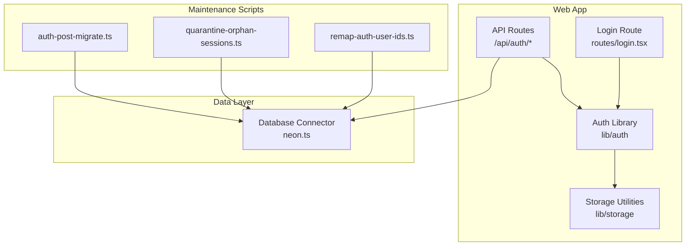
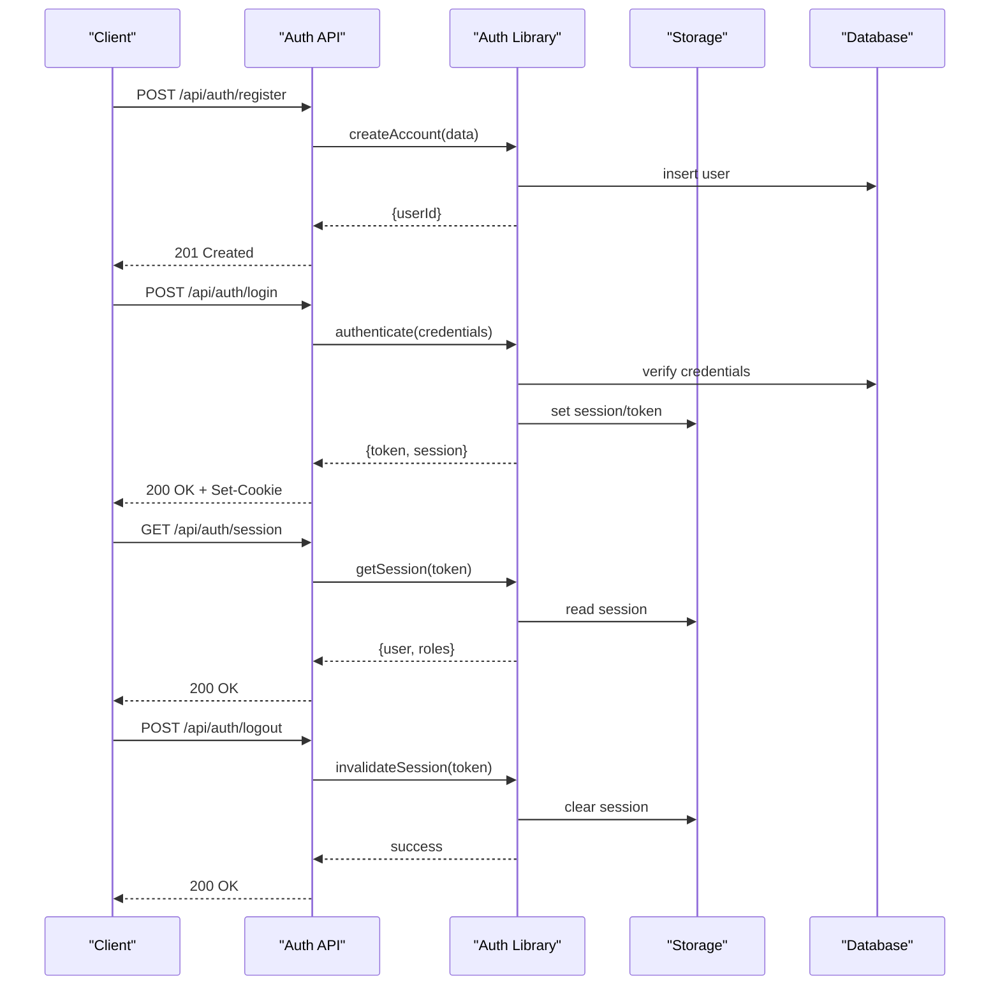
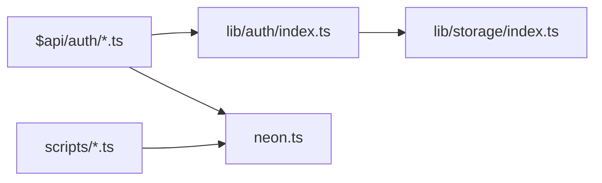

# Authentication Service

<cite>
**Referenced Files in This Document**
- [apps/web/src/routes/api/auth/$.ts](file://apps/web/src/routes/api/auth/$.ts)
- [apps/web/src/routes/api/auth/session.ts](file://apps/web/src/routes/api/auth/session.ts)
- [apps/web/src/routes/login.tsx](file://apps/web/src/routes/login.tsx)
- [apps/web/src/lib/auth/index.ts](file://apps/web/src/lib/auth/index.ts)
- [apps/web/src/lib/storage/index.ts](file://apps/web/src/lib/storage/index.ts)
- [scripts/auth-post-migrate.ts](file://scripts/auth-post-migrate.ts)
- [scripts/quarantine-orphan-sessions.ts](file://scripts/quarantine-orphan-sessions.ts)
- [scripts/remap-auth-user-ids.ts](file://scripts/remap-auth-user-ids.ts)
- [neon.ts](file://neon.ts)
</cite>

## Table of Contents

1. [Introduction](#introduction)
2. [Project Structure](#project-structure)
3. [Core Components](#core-components)
4. [Architecture Overview](#architecture-overview)
5. [Detailed Component Analysis](#detailed-component-analysis)
6. [Dependency Analysis](#dependency-analysis)
7. [Performance Considerations](#performance-considerations)
8. [Troubleshooting Guide](#troubleshooting-guide)
9. [Conclusion](#conclusion)
10. [Appendices](#appendices)

## Introduction

This document provides comprehensive documentation for the Authentication service layer, focusing on user registration and login flows, session management, role-based access control (RBAC), JWT token handling, secure storage patterns, authentication middleware, protected routes, error handling, CSRF protection, and session timeout strategies. It is designed to be accessible to both technical and non-technical readers while providing code-level references where applicable.

## Project Structure

The authentication system spans API routes, client-side libraries, and utility scripts:

- API routes under apps/web/src/routes/api/auth handle authentication endpoints and session operations.
- Client-side auth utilities manage tokens and sessions.
- Storage utilities provide secure persistence patterns.
- Scripts support migrations, session maintenance, and data remediation.

**Diagram sources**

- [apps/web/src/routes/api/auth/$.ts](file://apps/web/src/routes/api/auth/$.ts)
- [apps/web/src/routes/api/auth/session.ts](file://apps/web/src/routes/api/auth/session.ts)
- [apps/web/src/lib/auth/index.ts](file://apps/web/src/lib/auth/index.ts)
- [apps/web/src/lib/storage/index.ts](file://apps/web/src/lib/storage/index.ts)
- [apps/web/src/routes/login.tsx](file://apps/web/src/routes/login.tsx)
- [neon.ts](file://neon.ts)
- [scripts/auth-post-migrate.ts](file://scripts/auth-post-migrate.ts)
- [scripts/quarantine-orphan-sessions.ts](file://scripts/quarantine-orphan-sessions.ts)
- [scripts/remap-auth-user-ids.ts](file://scripts/remap-auth-user-ids.ts)

**Section sources**

- [apps/web/src/routes/api/auth/$.ts](file://apps/web/src/routes/api/auth/$.ts)
- [apps/web/src/routes/api/auth/session.ts](file://apps/web/src/routes/api/auth/session.ts)
- [apps/web/src/lib/auth/index.ts](file://apps/web/src/lib/auth/index.ts)
- [apps/web/src/lib/storage/index.ts](file://apps/web/src/lib/storage/index.ts)
- [apps/web/src/routes/login.tsx](file://apps/web/src/routes/login.tsx)
- [neon.ts](file://neon.ts)
- [scripts/auth-post-migrate.ts](file://scripts/auth-post-migrate.ts)
- [scripts/quarantine-orphan-sessions.ts](file://scripts/quarantine-orphan-sessions.ts)
- [scripts/remap-auth-user-ids.ts](file://scripts/remap-auth-user-ids.ts)

## Core Components

- Authentication API endpoints: Provide user registration, login, logout, and session management via HTTP handlers.
- Auth library: Encapsulates token creation/validation, session lifecycle, and RBAC checks.
- Storage utilities: Implement secure storage patterns for tokens and session metadata.
- Login route: Orchestrates user-facing login flow and redirects based on authentication state.
- Database connector: Centralizes database connectivity used by auth endpoints and scripts.
- Maintenance scripts: Handle post-deployment migrations, orphan session cleanup, and user ID remapping.

Key responsibilities:

- Enforce secure token handling and validation.
- Manage session creation, refresh, and termination.
- Apply role-based authorization across protected routes.
- Ensure safe storage practices and mitigate common vulnerabilities.

**Section sources**

- [apps/web/src/routes/api/auth/$.ts](file://apps/web/src/routes/api/auth/$.ts)
- [apps/web/src/routes/api/auth/session.ts](file://apps/web/src/routes/api/auth/session.ts)
- [apps/web/src/lib/auth/index.ts](file://apps/web/src/lib/auth/index.ts)
- [apps/web/src/lib/storage/index.ts](file://apps/web/src/lib/storage/index.ts)
- [apps/web/src/routes/login.tsx](file://apps/web/src/routes/login.tsx)
- [neon.ts](file://neon.ts)
- [scripts/auth-post-migrate.ts](file://scripts/auth-post-migrate.ts)
- [scripts/quarantine-orphan-sessions.ts](file://scripts/quarantine-orphan-sessions.ts)
- [scripts/remap-auth-user-ids.ts](file://scripts/remap-auth-user-ids.ts)

## Architecture Overview

The authentication architecture follows a layered approach:

- API layer exposes REST endpoints for auth operations.
- Auth library implements core logic for JWT handling, session management, and RBAC.
- Storage layer persists tokens and session metadata securely.
- Database connector interacts with persistent storage for user and session records.
- Maintenance scripts ensure data integrity and operational hygiene.

**Diagram sources**

- [apps/web/src/routes/api/auth/$.ts](file://apps/web/src/routes/api/auth/$.ts)
- [apps/web/src/routes/api/auth/session.ts](file://apps/web/src/routes/api/auth/session.ts)
- [apps/web/src/lib/auth/index.ts](file://apps/web/src/lib/auth/index.ts)
- [apps/web/src/lib/storage/index.ts](file://apps/web/src/lib/storage/index.ts)
- [neon.ts](file://neon.ts)

## Detailed Component Analysis

### Authentication API Endpoints

Responsibilities:

- Register new users with validated input and secure password hashing.
- Authenticate users and issue JWTs with appropriate claims.
- Manage sessions including creation, retrieval, and invalidation.
- Enforce role-based access control on protected endpoints.

Security considerations:

- Validate all inputs and sanitize outputs.
- Use short-lived JWTs with refresh mechanisms if applicable.
- Secure cookies with HttpOnly, Secure, SameSite attributes.
- Rate-limit sensitive endpoints to prevent brute-force attacks.

Protected routes pattern:

- Middleware validates JWT presence and signature.
- Extracts user identity and roles from token claims.
- Authorizes requests based on RBAC policies.

Error handling:

- Return standardized error responses for invalid credentials, expired tokens, and insufficient permissions.
- Log security-relevant events without exposing sensitive details.

**Section sources**

- [apps/web/src/routes/api/auth/$.ts](file://apps/web/src/routes/api/auth/$.ts)
- [apps/web/src/routes/api/auth/session.ts](file://apps/web/src/routes/api/auth/session.ts)

### Session Management

Responsibilities:

- Create sessions upon successful authentication.
- Retrieve and validate sessions for subsequent requests.
- Invalidate sessions during logout or on security events.
- Support session rotation and renewal strategies.

Secure storage patterns:

- Store minimal session identifiers server-side; avoid storing secrets in client storage.
- Use secure cookie flags and proper domain/path scoping.
- Encrypt sensitive session data at rest when necessary.

Session timeout handling:

- Implement sliding expiration with periodic refresh.
- Enforce absolute timeouts for high-security contexts.
- Clean up stale sessions using background jobs.

**Section sources**

- [apps/web/src/routes/api/auth/session.ts](file://apps/web/src/routes/api/auth/session.ts)
- [apps/web/src/lib/storage/index.ts](file://apps/web/src/lib/storage/index.ts)

### JWT Token Handling

Responsibilities:

- Generate signed JWTs containing user identity and roles.
- Validate tokens on each request through middleware.
- Rotate tokens securely and handle expiration gracefully.

Best practices:

- Use strong signing algorithms and rotate keys periodically.
- Include minimal claims to reduce payload size and risk.
- Store tokens securely and avoid logging sensitive values.

**Section sources**

- [apps/web/src/lib/auth/index.ts](file://apps/web/src/lib/auth/index.ts)

### Role-Based Access Control (RBAC)

Responsibilities:

- Map user roles to permissions for resource access.
- Enforce authorization checks in middleware or route handlers.
- Support dynamic role assignment and policy updates.

Implementation patterns:

- Define role hierarchies and permission matrices.
- Cache role-permission mappings for performance.
- Audit access decisions for compliance and debugging.

**Section sources**

- [apps/web/src/lib/auth/index.ts](file://apps/web/src/lib/auth/index.ts)

### Login Flow Orchestration

Responsibilities:

- Present login UI and collect credentials securely.
- Submit credentials to authentication endpoint.
- Handle success and failure states with appropriate redirects.
- Maintain session state across application navigation.

User experience considerations:

- Provide clear error messages and recovery options.
- Support multi-step authentication if required.
- Persist login state safely across page reloads.

**Section sources**

- [apps/web/src/routes/login.tsx](file://apps/web/src/routes/login.tsx)

### Data Layer and Connectivity

Responsibilities:

- Provide centralized database connection configuration.
- Execute queries for user and session management.
- Ensure connection pooling and error resilience.

Operational aspects:

- Configure environment-specific settings securely.
- Monitor connection health and performance metrics.

**Section sources**

- [neon.ts](file://neon.ts)

### Maintenance and Migration Scripts

Responsibilities:

- Apply schema changes and seed data during deployment.
- Quarantine orphaned sessions to maintain data integrity.
- Remap user IDs during data migrations or integrations.

Operational best practices:

- Run scripts in controlled environments with rollback plans.
- Validate data consistency before and after migrations.
- Log execution results and errors for auditing.

**Section sources**

- [scripts/auth-post-migrate.ts](file://scripts/auth-post-migrate.ts)
- [scripts/quarantine-orphan-sessions.ts](file://scripts/quarantine-orphan-sessions.ts)
- [scripts/remap-auth-user-ids.ts](file://scripts/remap-auth-user-ids.ts)

## Dependency Analysis

The authentication system exhibits clear separation of concerns:

- API routes depend on the auth library for business logic.
- Auth library depends on storage utilities for persistence.
- All components interact with the database connector for data operations.
- Maintenance scripts operate independently but rely on the same data layer.

**Diagram sources**

- [apps/web/src/routes/api/auth/$.ts](file://apps/web/src/routes/api/auth/$.ts)
- [apps/web/src/routes/api/auth/session.ts](file://apps/web/src/routes/api/auth/session.ts)
- [apps/web/src/lib/auth/index.ts](file://apps/web/src/lib/auth/index.ts)
- [apps/web/src/lib/storage/index.ts](file://apps/web/src/lib/storage/index.ts)
- [neon.ts](file://neon.ts)
- [scripts/auth-post-migrate.ts](file://scripts/auth-post-migrate.ts)
- [scripts/quarantine-orphan-sessions.ts](file://scripts/quarantine-orphan-sessions.ts)
- [scripts/remap-auth-user-ids.ts](file://scripts/remap-auth-user-ids.ts)

**Section sources**

- [apps/web/src/routes/api/auth/$.ts](file://apps/web/src/routes/api/auth/$.ts)
- [apps/web/src/routes/api/auth/session.ts](file://apps/web/src/routes/api/auth/session.ts)
- [apps/web/src/lib/auth/index.ts](file://apps/web/src/lib/auth/index.ts)
- [apps/web/src/lib/storage/index.ts](file://apps/web/src/lib/storage/index.ts)
- [neon.ts](file://neon.ts)
- [scripts/auth-post-migrate.ts](file://scripts/auth-post-migrate.ts)
- [scripts/quarantine-orphan-sessions.ts](file://scripts/quarantine-orphan-sessions.ts)
- [scripts/remap-auth-user-ids.ts](file://scripts/remap-auth-user-ids.ts)

## Performance Considerations

- Minimize database round-trips by batching operations where possible.
- Cache frequently accessed role-permission mappings.
- Use connection pooling for database interactions.
- Implement efficient token validation with minimal parsing overhead.
- Monitor and optimize slow endpoints with profiling tools.

[No sources needed since this section provides general guidance]

## Troubleshooting Guide

Common issues and resolutions:

- Invalid credentials: Verify input validation and credential hashing implementation.
- Expired tokens: Check token lifetime settings and refresh mechanisms.
- Session not found: Ensure proper session storage and retrieval logic.
- Permission denied: Review RBAC policies and role assignments.
- Database connectivity errors: Validate connection strings and network configuration.

Debugging tips:

- Enable detailed logging for authentication flows.
- Inspect cookie headers and token payloads carefully.
- Use dedicated test accounts for reproducible scenarios.

**Section sources**

- [apps/web/src/routes/api/auth/$.ts](file://apps/web/src/routes/api/auth/$.ts)
- [apps/web/src/routes/api/auth/session.ts](file://apps/web/src/routes/api/auth/session.ts)
- [apps/web/src/lib/auth/index.ts](file://apps/web/src/lib/auth/index.ts)

## Conclusion

The Authentication service layer provides a robust foundation for secure user management, session handling, and access control. By following the documented patterns and best practices, developers can implement protected routes, manage JWT tokens securely, and maintain resilient session states. Continuous monitoring and adherence to security guidelines will ensure the system remains secure and performant.

[No sources needed since this section summarizes without analyzing specific files]

## Appendices

### Security Best Practices

- Use HTTPS exclusively for all authentication endpoints.
- Implement rate limiting and account lockout policies.
- Regularly rotate signing keys and update dependencies.
- Conduct security audits and penetration testing.

### CSRF Protection

- Use SameSite cookie attributes to prevent cross-site requests.
- Implement anti-CSRF tokens for state-changing operations.
- Validate Origin and Referer headers when appropriate.

### Session Timeout Strategies

- Configure sliding expiration for better user experience.
- Enforce absolute timeouts for sensitive operations.
- Implement automatic session cleanup for inactive users.

[No sources needed since this section provides general guidance]
