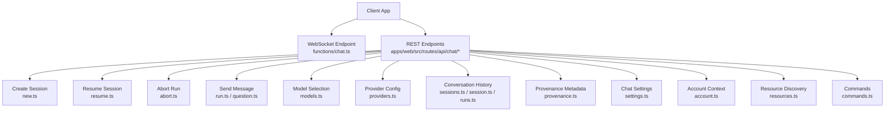
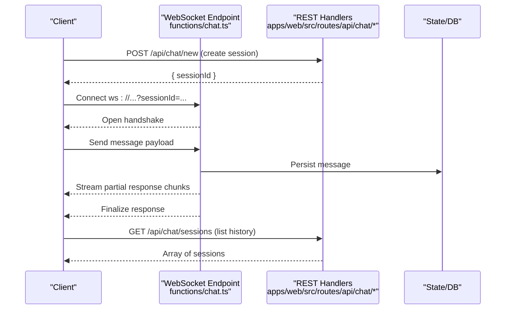
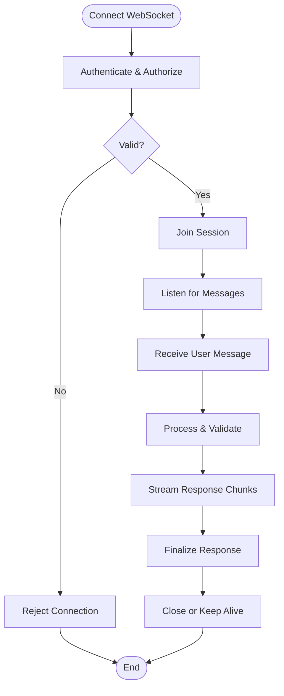
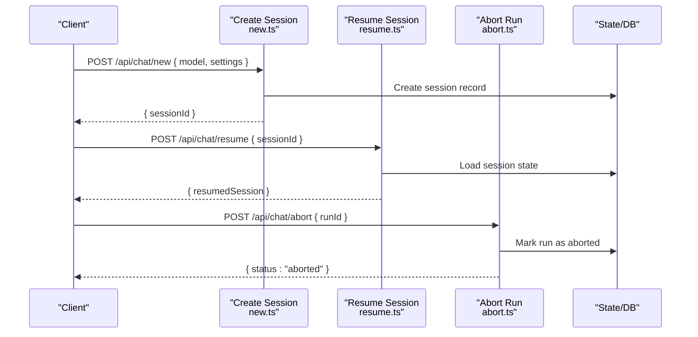
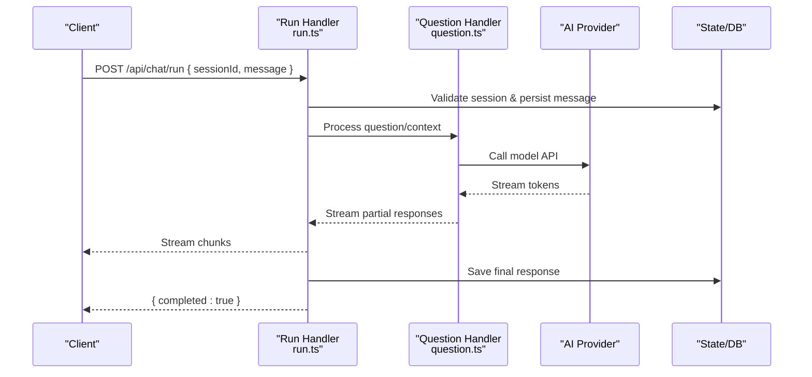
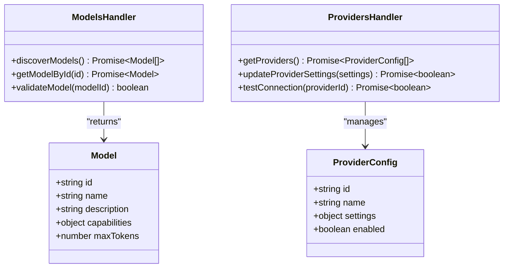
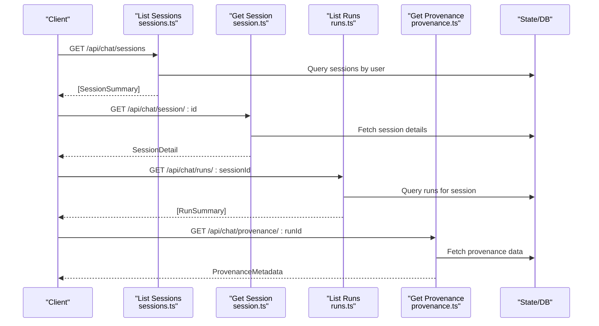
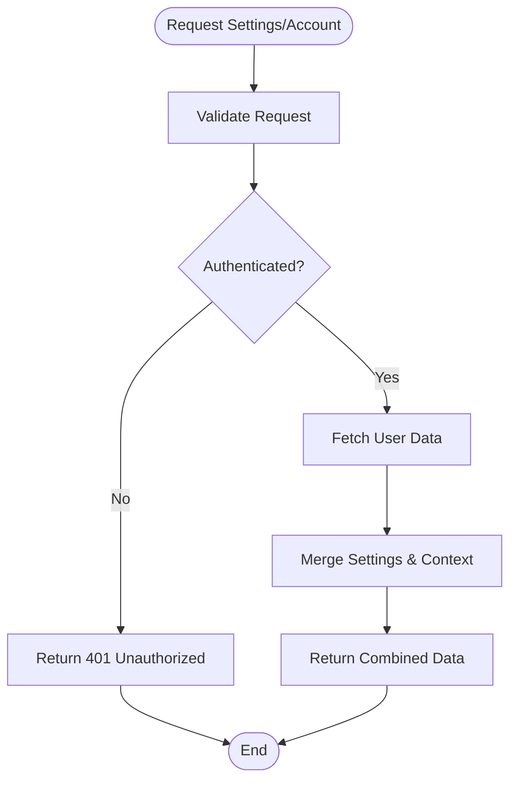
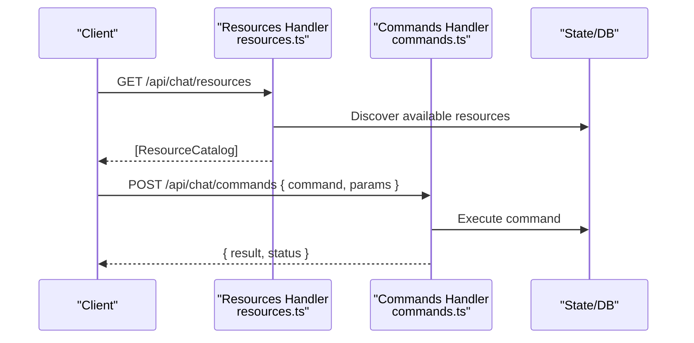
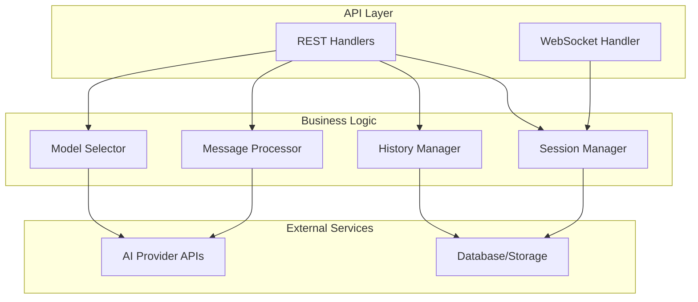

# Chat API Service

<cite>
**Referenced Files in This Document**
- [chat.ts](file://functions/chat.ts)
- [chat.ts](file://apps/web/src/routes/api/chat.ts)
- [new.ts](file://apps/web/src/routes/api/chat/new.ts)
- [run.ts](file://apps/web/src/routes/api/chat/run.ts)
- [abort.ts](file://apps/web/src/routes/api/chat/abort.ts)
- [resume.ts](file://apps/web/src/routes/api/chat/resume.ts)
- [sessions.ts](file://apps/web/src/routes/api/chat/sessions.ts)
- [session.ts](file://apps/web/src/routes/api/chat/session.ts)
- [models.ts](file://apps/web/src/routes/api/chat/models.ts)
- [providers.ts](file://apps/web/src/routes/api/chat/providers.ts)
- [question.ts](file://apps/web/src/routes/api/chat/question.ts)
- [commands.ts](file://apps/web/src/routes/api/chat/commands.ts)
- [resources.ts](file://apps/web/src/routes/api/chat/resources.ts)
- [provenance.ts](file://apps/web/src/routes/api/chat/provenance.ts)
- [runs.ts](file://apps/web/src/routes/api/chat/runs.ts)
- [settings.ts](file://apps/web/src/routes/api/chat/settings.ts)
- [account.ts](file://apps/web/src/routes/api/chat/account.ts)
</cite>

## Table of Contents

1. [Introduction](#introduction)
2. [Project Structure](#project-structure)
3. [Core Components](#core-components)
4. [Architecture Overview](#architecture-overview)
5. [Detailed Component Analysis](#detailed-component-analysis)
6. [Dependency Analysis](#dependency-analysis)
7. [Performance Considerations](#performance-considerations)
8. [Troubleshooting Guide](#troubleshooting-guide)
9. [Conclusion](#conclusion)
10. [Appendices](#appendices)

## Introduction

This document provides comprehensive documentation for the Chat API service layer, focusing on session management, message streaming, model selection, and conversation history. It explains how WebSocket integration enables real-time chat functionality, how streaming responses are handled, and what error recovery patterns are used. It also includes examples of creating new sessions, sending messages, handling AI responses, and synchronizing chat state across clients. Security considerations, rate limiting strategies, and message validation practices are covered to ensure robust and secure chat operations.

## Project Structure

The Chat API is implemented as a set of route handlers under the web application’s API routes, with a serverless function entry point for the WebSocket endpoint. The structure follows a feature-based organization where each chat capability has its own file:

- Serverless function for WebSocket: functions/chat.ts
- REST endpoints for chat operations: apps/web/src/routes/api/chat/*
  - Session lifecycle: new.ts, resume.ts, abort.ts
  - Message streaming and execution: run.ts, question.ts
  - Model and provider configuration: models.ts, providers.ts
  - Conversation history and metadata: sessions.ts, session.ts, runs.ts, provenance.ts
  - Settings and account context: settings.ts, account.ts
  - Resource discovery and commands: resources.ts, commands.ts

**Diagram sources**

- [chat.ts](file://functions/chat.ts)
- [new.ts](file://apps/web/src/routes/api/chat/new.ts)
- [resume.ts](file://apps/web/src/routes/api/chat/resume.ts)
- [abort.ts](file://apps/web/src/routes/api/chat/abort.ts)
- [run.ts](file://apps/web/src/routes/api/chat/run.ts)
- [question.ts](file://apps/web/src/routes/api/chat/question.ts)
- [models.ts](file://apps/web/src/routes/api/chat/models.ts)
- [providers.ts](file://apps/web/src/routes/api/chat/providers.ts)
- [sessions.ts](file://apps/web/src/routes/api/chat/sessions.ts)
- [session.ts](file://apps/web/src/routes/api/chat/session.ts)
- [runs.ts](file://apps/web/src/routes/api/chat/runs.ts)
- [provenance.ts](file://apps/web/src/routes/api/chat/provenance.ts)
- [settings.ts](file://apps/web/src/routes/api/chat/settings.ts)
- [account.ts](file://apps/web/src/routes/api/chat/account.ts)
- [resources.ts](file://apps/web/src/routes/api/chat/resources.ts)
- [commands.ts](file://apps/web/src/routes/api/chat/commands.ts)

**Section sources**

- [chat.ts](file://functions/chat.ts)
- [new.ts](file://apps/web/src/routes/api/chat/new.ts)
- [run.ts](file://apps/web/src/routes/api/chat/run.ts)
- [sessions.ts](file://apps/web/src/routes/api/chat/sessions.ts)
- [session.ts](file://apps/web/src/routes/api/chat/session.ts)
- [models.ts](file://apps/web/src/routes/api/chat/models.ts)
- [providers.ts](file://apps/web/src/routes/api/chat/providers.ts)
- [question.ts](file://apps/web/src/routes/api/chat/question.ts)
- [commands.ts](file://apps/web/src/routes/api/chat/commands.ts)
- [resources.ts](file://apps/web/src/routes/api/chat/resources.ts)
- [provenance.ts](file://apps/web/src/routes/api/chat/provenance.ts)
- [runs.ts](file://apps/web/src/routes/api/chat/runs.ts)
- [settings.ts](file://apps/web/src/routes/api/chat/settings.ts)
- [account.ts](file://apps/web/src/routes/api/chat/account.ts)

## Core Components

- WebSocket endpoint (functions/chat.ts): Establishes and manages real-time bidirectional communication between client and server for live chat interactions.
- Session management (new.ts, resume.ts, abort.ts): Creates, resumes, and aborts chat sessions and runs.
- Message streaming (run.ts, question.ts): Handles sending user messages and streaming AI responses back to the client.
- Model and provider configuration (models.ts, providers.ts): Discovers available models and configures provider-specific settings.
- Conversation history (sessions.ts, session.ts, runs.ts, provenance.ts): Retrieves and manages historical conversations, runs, and provenance metadata.
- Settings and account (settings.ts, account.ts): Manages per-user or per-session chat settings and contextual account information.
- Resource discovery and commands (resources.ts, commands.ts): Exposes available resources and supports command execution within chat context.

Key responsibilities:

- Validate inputs and enforce security policies.
- Manage session state and synchronization across clients.
- Stream responses incrementally to reduce latency.
- Provide robust error handling and recovery mechanisms.
- Enforce rate limits and quotas where applicable.

**Section sources**

- [chat.ts](file://functions/chat.ts)
- [new.ts](file://apps/web/src/routes/api/chat/new.ts)
- [resume.ts](file://apps/web/src/routes/api/chat/resume.ts)
- [abort.ts](file://apps/web/src/routes/api/chat/abort.ts)
- [run.ts](file://apps/web/src/routes/api/chat/run.ts)
- [question.ts](file://apps/web/src/routes/api/chat/question.ts)
- [models.ts](file://apps/web/src/routes/api/chat/models.ts)
- [providers.ts](file://apps/web/src/routes/api/chat/providers.ts)
- [sessions.ts](file://apps/web/src/routes/api/chat/sessions.ts)
- [session.ts](file://apps/web/src/routes/api/chat/session.ts)
- [runs.ts](file://apps/web/src/routes/api/chat/runs.ts)
- [provenance.ts](file://apps/web/src/routes/api/chat/provenance.ts)
- [settings.ts](file://apps/web/src/routes/api/chat/settings.ts)
- [account.ts](file://apps/web/src/routes/api/chat/account.ts)
- [resources.ts](file://apps/web/src/routes/api/chat/resources.ts)
- [commands.ts](file://apps/web/src/routes/api/chat/commands.ts)

## Architecture Overview

The Chat API architecture separates real-time communication via WebSocket from REST endpoints that manage sessions, configuration, and history. Clients connect to the WebSocket endpoint for streaming responses while using REST endpoints for session lifecycle and metadata operations.

**Diagram sources**

- [chat.ts](file://functions/chat.ts)
- [new.ts](file://apps/web/src/routes/api/chat/new.ts)
- [sessions.ts](file://apps/web/src/routes/api/chat/sessions.ts)

## Detailed Component Analysis

### WebSocket Integration (Real-Time Chat)

The WebSocket endpoint handles connection lifecycle, authentication, and message routing. It streams incremental updates to the client and ensures reliable delivery with reconnection support.

**Diagram sources**

- [chat.ts](file://functions/chat.ts)

**Section sources**

- [chat.ts](file://functions/chat.ts)

### Session Management

Session creation, resumption, and abortion are handled through dedicated endpoints. Each operation validates input, checks permissions, and updates persistent state.

**Diagram sources**

- [new.ts](file://apps/web/src/routes/api/chat/new.ts)
- [resume.ts](file://apps/web/src/routes/api/chat/resume.ts)
- [abort.ts](file://apps/web/src/routes/api/chat/abort.ts)

**Section sources**

- [new.ts](file://apps/web/src/routes/api/chat/new.ts)
- [resume.ts](file://apps/web/src/routes/api/chat/resume.ts)
- [abort.ts](file://apps/web/src/routes/api/chat/abort.ts)

### Message Streaming and AI Responses

Message handling involves validating user input, invoking the appropriate model/provider, and streaming responses incrementally. Error handling ensures graceful degradation and retry logic.

**Diagram sources**

- [run.ts](file://apps/web/src/routes/api/chat/run.ts)
- [question.ts](file://apps/web/src/routes/api/chat/question.ts)

**Section sources**

- [run.ts](file://apps/web/src/routes/api/chat/run.ts)
- [question.ts](file://apps/web/src/routes/api/chat/question.ts)

### Model Selection and Provider Configuration

Model discovery and provider configuration allow dynamic selection of AI models and customization of provider-specific parameters.

**Diagram sources**

- [models.ts](file://apps/web/src/routes/api/chat/models.ts)
- [providers.ts](file://apps/web/src/routes/api/chat/providers.ts)

**Section sources**

- [models.ts](file://apps/web/src/routes/api/chat/models.ts)
- [providers.ts](file://apps/web/src/routes/api/chat/providers.ts)

### Conversation History and Metadata

Conversation history retrieval includes listing sessions, fetching individual session details, and accessing run history and provenance metadata.

**Diagram sources**

- [sessions.ts](file://apps/web/src/routes/api/chat/sessions.ts)
- [session.ts](file://apps/web/src/routes/api/chat/session.ts)
- [runs.ts](file://apps/web/src/routes/api/chat/runs.ts)
- [provenance.ts](file://apps/web/src/routes/api/chat/provenance.ts)

**Section sources**

- [sessions.ts](file://apps/web/src/routes/api/chat/sessions.ts)
- [session.ts](file://apps/web/src/routes/api/chat/session.ts)
- [runs.ts](file://apps/web/src/routes/api/chat/runs.ts)
- [provenance.ts](file://apps/web/src/routes/api/chat/provenance.ts)

### Settings and Account Context

Chat settings and account context provide personalization and user-specific configurations for chat behavior.

**Diagram sources**

- [settings.ts](file://apps/web/src/routes/api/chat/settings.ts)
- [account.ts](file://apps/web/src/routes/api/chat/account.ts)

**Section sources**

- [settings.ts](file://apps/web/src/routes/api/chat/settings.ts)
- [account.ts](file://apps/web/src/routes/api/chat/account.ts)

### Resource Discovery and Commands

Resource discovery exposes available tools and capabilities, while command execution allows structured interactions within the chat context.

**Diagram sources**

- [resources.ts](file://apps/web/src/routes/api/chat/resources.ts)
- [commands.ts](file://apps/web/src/routes/api/chat/commands.ts)

**Section sources**

- [resources.ts](file://apps/web/src/routes/api/chat/resources.ts)
- [commands.ts](file://apps/web/src/routes/api/chat/commands.ts)

## Dependency Analysis

The Chat API components have clear separation of concerns with minimal coupling. WebSocket handling is independent from REST endpoints, and each handler focuses on specific functionality. Dependencies flow from handlers to storage/state layers and external AI providers.

**Diagram sources**

- [chat.ts](file://functions/chat.ts)
- [new.ts](file://apps/web/src/routes/api/chat/new.ts)
- [run.ts](file://apps/web/src/routes/api/chat/run.ts)
- [models.ts](file://apps/web/src/routes/api/chat/models.ts)
- [sessions.ts](file://apps/web/src/routes/api/chat/sessions.ts)

**Section sources**

- [chat.ts](file://functions/chat.ts)
- [new.ts](file://apps/web/src/routes/api/chat/new.ts)
- [run.ts](file://apps/web/src/routes/api/chat/run.ts)
- [models.ts](file://apps/web/src/routes/api/chat/models.ts)
- [sessions.ts](file://apps/web/src/routes/api/chat/sessions.ts)

## Performance Considerations

- **Streaming Optimization**: Use chunked transfer encoding for large responses to reduce perceived latency.
- **Connection Pooling**: Maintain efficient connections to AI providers and databases.
- **Caching Strategy**: Cache frequently accessed model metadata and provider configurations.
- **Memory Management**: Implement proper cleanup for WebSocket connections and temporary session data.
- **Rate Limiting**: Apply request throttling at both API gateway and application levels.
- **Database Optimization**: Use efficient queries and indexing for conversation history retrieval.

## Troubleshooting Guide

Common issues and their resolutions:

- **WebSocket Connection Failures**: Verify authentication tokens and network connectivity. Check server logs for connection errors.
- **Message Processing Errors**: Validate input payloads and check provider API availability. Implement retry logic for transient failures.
- **Session State Inconsistencies**: Ensure atomic updates to session state and implement conflict resolution strategies.
- **Streaming Interruptions**: Handle network timeouts gracefully and implement reconnection mechanisms.
- **Rate Limiting Issues**: Monitor request rates and adjust limits based on usage patterns.

Error handling patterns:

- Implement standardized error responses with meaningful messages
- Log detailed error contexts for debugging
- Provide client-friendly error codes and recovery suggestions
- Implement circuit breakers for external service dependencies

**Section sources**

- [chat.ts](file://functions/chat.ts)
- [run.ts](file://apps/web/src/routes/api/chat/run.ts)
- [new.ts](file://apps/web/src/routes/api/chat/new.ts)

## Conclusion

The Chat API service provides a comprehensive solution for real-time chat functionality with robust session management, streaming capabilities, and extensive configuration options. The architecture separates concerns effectively while maintaining performance and reliability. Key strengths include WebSocket integration for real-time communication, flexible model selection, and comprehensive conversation history management. Future enhancements could include advanced caching strategies, improved error recovery mechanisms, and enhanced monitoring capabilities.

## Appendices

### API Endpoints Reference

#### Session Management

- POST /api/chat/new - Create new chat session
- POST /api/chat/resume - Resume existing session
- POST /api/chat/abort - Abort current run

#### Message Handling

- POST /api/chat/run - Send message and receive streamed response
- POST /api/chat/question - Alternative message endpoint

#### Model and Provider Configuration

- GET /api/chat/models - Discover available models
- GET /api/chat/providers - List configured providers

#### Conversation History

- GET /api/chat/sessions - List user sessions
- GET /api/chat/session/:id - Get session details
- GET /api/chat/runs/:sessionId - List session runs
- GET /api/chat/provenance/:runId - Get run provenance

#### Settings and Context

- GET /api/chat/settings - Get chat settings
- GET /api/chat/account - Get account context

#### Resources and Commands

- GET /api/chat/resources - Discover available resources
- POST /api/chat/commands - Execute commands

### Security Considerations

- Input validation and sanitization for all endpoints
- Authentication and authorization checks
- Rate limiting and quota enforcement
- Secure WebSocket connections with TLS
- Data encryption for sensitive information
- Audit logging for compliance

### Message Validation Rules

- Required fields validation
- Length constraints for text content
- Format validation for structured data
- Content filtering for safety
- Size limits for attachments

### Error Codes Reference

- 400: Bad Request - Invalid input parameters
- 401: Unauthorized - Authentication failure
- 403: Forbidden - Insufficient permissions
- 404: Not Found - Resource not found
- 429: Too Many Requests - Rate limit exceeded
- 500: Internal Server Error - Server-side failure
- 503: Service Unavailable - External service down
