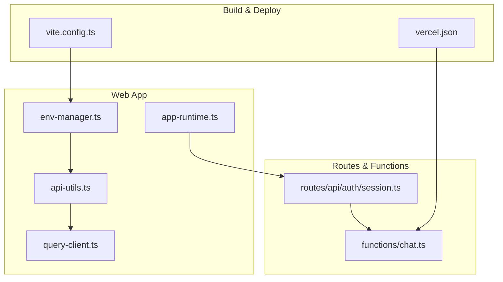
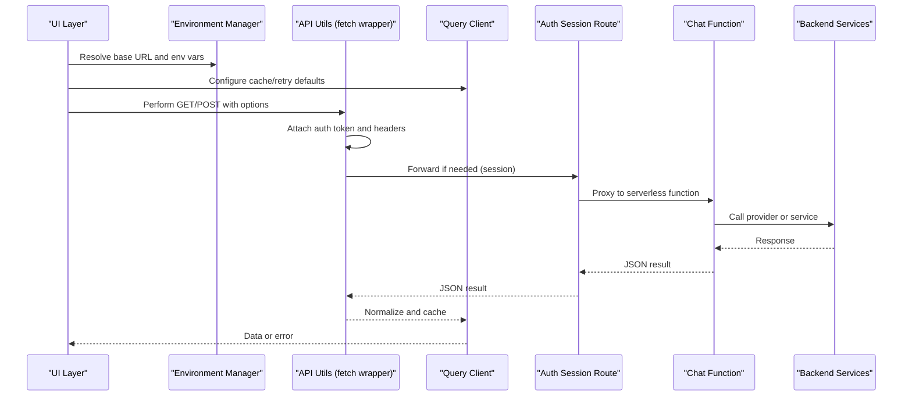
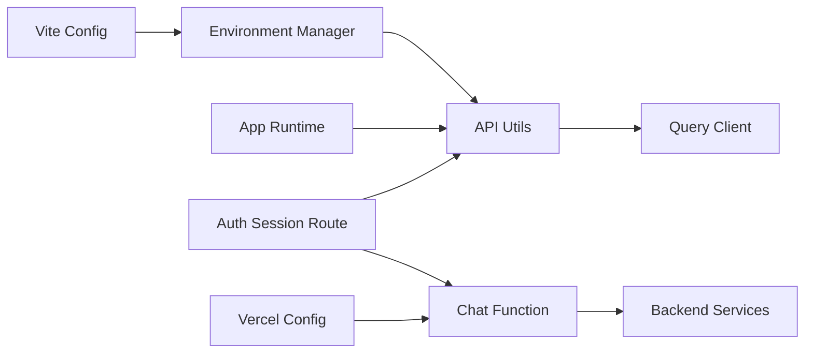

# HTTP Client Configuration

<cite>
**Referenced Files in This Document**
- [env-manager.ts](file://apps/web/src/lib/env-manager.ts)
- [api-utils.ts](file://apps/web/src/lib/api-utils.ts)
- [query-client.ts](file://apps/web/src/lib/query-client.ts)
- [app-runtime.ts](file://apps/web/src/lib/app-runtime.ts)
- [auth/session.ts](file://apps/web/src/routes/api/auth/session.ts)
- [chat.ts](file://functions/chat.ts)
- [vercel.json](file://apps/web/vercel.json)
- [vite.config.ts](file://apps/web/vite.config.ts)
</cite>

## Table of Contents

1. [Introduction](#introduction)
2. [Project Structure](#project-structure)
3. [Core Components](#core-components)
4. [Architecture Overview](#architecture-overview)
5. [Detailed Component Analysis](#detailed-component-analysis)
6. [Dependency Analysis](#dependency-analysis)
7. [Performance Considerations](#performance-considerations)
8. [Troubleshooting Guide](#troubleshooting-guide)
9. [Conclusion](#conclusion)

## Introduction

This document explains how Fleet Pi configures its HTTP client, including base URL setup, environment-specific configuration, request/response interceptors, authentication token handling, error response processing, retry mechanisms, timeouts, headers management, and CORS configuration. It also provides guidance for configuring different environments (development, staging, production) and implementing custom fetch wrappers.

## Project Structure

HTTP client configuration is primarily implemented in the web application layer under apps/web/src/lib with supporting runtime and routing files:

- Environment variables and base URL resolution are centralized in an environment manager.
- API utilities provide a shared fetch wrapper with common headers, error handling, and optional retries.
- Query client configuration centralizes caching, retries, and global behavior for data fetching.
- Runtime and route handlers manage session-based authentication and proxying to backend services.

**Diagram sources**

- [env-manager.ts](file://apps/web/src/lib/env-manager.ts)
- [api-utils.ts](file://apps/web/src/lib/api-utils.ts)
- [query-client.ts](file://apps/web/src/lib/query-client.ts)
- [app-runtime.ts](file://apps/web/src/lib/app-runtime.ts)
- [auth/session.ts](file://apps/web/src/routes/api/auth/session.ts)
- [chat.ts](file://functions/chat.ts)
- [vite.config.ts](file://apps/web/vite.config.ts)
- [vercel.json](file://apps/web/vercel.json)

**Section sources**

- [env-manager.ts](file://apps/web/src/lib/env-manager.ts)
- [api-utils.ts](file://apps/web/src/lib/api-utils.ts)
- [query-client.ts](file://apps/web/src/lib/query-client.ts)
- [app-runtime.ts](file://apps/web/src/lib/app-runtime.ts)
- [auth/session.ts](file://apps/web/src/routes/api/auth/session.ts)
- [chat.ts](file://functions/chat.ts)
- [vite.config.ts](file://apps/web/vite.config.ts)
- [vercel.json](file://apps/web/vercel.json)

## Core Components

- Environment Manager: Provides consistent access to environment variables and resolves base URLs per environment.
- API Utils: Centralized fetch wrapper that sets default headers, attaches tokens, handles errors, and can implement retries.
- Query Client: Configures global caching, retry policies, and background refetch behavior for data fetching.
- App Runtime: Initializes runtime context and may expose environment-aware settings to components.
- Auth Session Route: Manages server-side session state and forwards authenticated requests to backend services.
- Chat Function: Serverless function used by the app to proxy chat-related requests to external providers.

Key responsibilities:

- Base URL resolution per environment (dev/staging/prod).
- Token injection into outgoing requests.
- Standardized error parsing and user-friendly messages.
- Retry on transient failures where appropriate.
- Timeouts and headers management.
- CORS and proxy configuration for local and deployed environments.

**Section sources**

- [env-manager.ts](file://apps/web/src/lib/env-manager.ts)
- [api-utils.ts](file://apps/web/src/lib/api-utils.ts)
- [query-client.ts](file://apps/web/src/lib/query-client.ts)
- [app-runtime.ts](file://apps/web/src/lib/app-runtime.ts)
- [auth/session.ts](file://apps/web/src/routes/api/auth/session.ts)
- [chat.ts](file://functions/chat.ts)

## Architecture Overview

The HTTP client architecture follows a layered approach:

- Environment configuration determines base URLs and feature flags.
- API utils wrap native fetch to standardize behavior across the app.
- Query client adds caching, retries, and background updates.
- Routes and functions handle authentication and proxying to backend services.

**Diagram sources**

- [env-manager.ts](file://apps/web/src/lib/env-manager.ts)
- [api-utils.ts](file://apps/web/src/lib/api-utils.ts)
- [query-client.ts](file://apps/web/src/lib/query-client.ts)
- [auth/session.ts](file://apps/web/src/routes/api/auth/session.ts)
- [chat.ts](file://functions/chat.ts)

## Detailed Component Analysis

### Environment Manager: Base URL and Environment-Specific Configuration

Responsibilities:

- Read environment variables for base URLs and feature toggles.
- Provide a single source of truth for API endpoints per environment.
- Expose helpers to build full URLs safely.

Configuration patterns:

- Development uses a local backend or mock endpoint.
- Staging points to a preview deployment.
- Production uses the live domain.

Best practices:

- Validate required variables at startup.
- Fail fast with clear messages when critical variables are missing.
- Avoid hardcoding domains; use environment variables exclusively.

**Section sources**

- [env-manager.ts](file://apps/web/src/lib/env-manager.ts)

### API Utils: Request/Response Interceptors, Headers, and Retries

Responsibilities:

- Wrap fetch to set default headers (e.g., content type, accept).
- Inject authentication tokens from session or storage.
- Parse error responses consistently and surface actionable messages.
- Implement retry logic for transient network errors or server throttling.

Interceptors:

- Request interceptor: attach token, normalize headers, add request IDs.
- Response interceptor: parse JSON, handle non-2xx status codes, map backend errors to typed exceptions.

Retries:

- Retry on network failures and specific HTTP codes (e.g., 429, 500, 502, 503).
- Use exponential backoff with jitter to avoid thundering herds.
- Limit maximum attempts and respect abort signals.

Timeouts:

- Set per-request timeout using AbortController.
- Provide sensible defaults and allow overrides per call.

Headers management:

- Default headers applied globally.
- Per-request headers merged and deduplicated.
- Sensitive headers excluded from logs.

Custom fetch wrappers:

- Create specialized wrappers for authenticated vs public endpoints.
- Add logging and metrics hooks around requests/responses.

**Section sources**

- [api-utils.ts](file://apps/web/src/lib/api-utils.ts)

### Query Client: Global Caching, Retries, and Background Refetch

Responsibilities:

- Configure query cache size, stale times, and garbage collection.
- Define global retry policy and mutation behavior.
- Enable background refetching and focus tracking.

Caching:

- Cache successful queries with configurable TTL.
- Invalidate caches on mutations or navigation events.

Retries:

- Override per-query retry counts and strategies.
- Combine with API-level retries for robustness.

Background updates:

- Refetch on window focus or reconnect.
- Debounce rapid refetches to reduce load.

**Section sources**

- [query-client.ts](file://apps/web/src/lib/query-client.ts)

### App Runtime: Initialization and Environment Context

Responsibilities:

- Initialize runtime context with environment values.
- Expose environment-aware settings to components and services.
- Ensure consistent initialization order before API calls.

**Section sources**

- [app-runtime.ts](file://apps/web/src/lib/app-runtime.ts)

### Auth Session Route: Authentication Token Handling

Responsibilities:

- Manage session lifecycle and token storage.
- Validate tokens and forward authenticated requests to backend services.
- Handle token refresh flows and expiration.

Flow:

- On login, store token securely and set session cookie.
- On each request, validate session and attach token to outbound calls.
- On token expiry, refresh via secure endpoint or prompt re-login.

**Section sources**

- [auth/session.ts](file://apps/web/src/routes/api/auth/session.ts)

### Chat Function: Serverless Proxy and Provider Integration

Responsibilities:

- Proxy chat requests to external providers with proper headers and payloads.
- Stream responses where supported.
- Centralize provider configuration and rate limiting.

Proxy behavior:

- Forwards authenticated requests from the app to provider APIs.
- Normalizes responses and maps errors to app-wide formats.

**Section sources**

- [chat.ts](file://functions/chat.ts)

### Build and Deployment: Vite and Vercel Configuration

Vite configuration:

- Define environment variable prefixes and build-time constants.
- Configure dev server proxy to avoid CORS during development.

Vercel configuration:

- Define serverless functions and routes.
- Map API paths to functions for backend proxying.
- Set environment variables per deployment target.

CORS configuration:

- In development, use Vite dev server proxy to bypass CORS.
- In production, configure allowed origins and credentials on the backend or edge functions.

**Section sources**

- [vite.config.ts](file://apps/web/vite.config.ts)
- [vercel.json](file://apps/web/vercel.json)

## Dependency Analysis

The HTTP client stack has clear dependencies:

- API Utils depends on Environment Manager for base URLs and on App Runtime for context.
- Query Client depends on API Utils for data fetching and on Environment Manager for configuration.
- Auth Session Route depends on secure storage and may depend on Chat Function for provider calls.
- Chat Function depends on backend provider APIs and environment variables.

**Diagram sources**

- [env-manager.ts](file://apps/web/src/lib/env-manager.ts)
- [api-utils.ts](file://apps/web/src/lib/api-utils.ts)
- [query-client.ts](file://apps/web/src/lib/query-client.ts)
- [app-runtime.ts](file://apps/web/src/lib/app-runtime.ts)
- [auth/session.ts](file://apps/web/src/routes/api/auth/session.ts)
- [chat.ts](file://functions/chat.ts)
- [vite.config.ts](file://apps/web/vite.config.ts)
- [vercel.json](file://apps/web/vercel.json)

**Section sources**

- [env-manager.ts](file://apps/web/src/lib/env-manager.ts)
- [api-utils.ts](file://apps/web/src/lib/api-utils.ts)
- [query-client.ts](file://apps/web/src/lib/query-client.ts)
- [app-runtime.ts](file://apps/web/src/lib/app-runtime.ts)
- [auth/session.ts](file://apps/web/src/routes/api/auth/session.ts)
- [chat.ts](file://functions/chat.ts)
- [vite.config.ts](file://apps/web/vite.config.ts)
- [vercel.json](file://apps/web/vercel.json)

## Performance Considerations

- Prefer cached queries with appropriate stale times to minimize network calls.
- Use debounced refetches and focus tracking to avoid unnecessary requests.
- Implement exponential backoff with jitter for retries to prevent overload.
- Set reasonable timeouts to fail fast and free resources quickly.
- Minimize payload sizes and avoid sending sensitive data in logs.
- Leverage streaming for long-running operations like chat responses.

[No sources needed since this section provides general guidance]

## Troubleshooting Guide

Common issues and resolutions:

- Missing environment variables: Validate required variables at startup and log missing keys clearly.
- CORS errors in development: Use Vite dev server proxy and ensure correct origin configuration.
- Authentication failures: Verify token presence, expiration handling, and session validity.
- Network timeouts: Adjust per-request timeouts and check backend latency.
- Retry storms: Reduce retry counts and increase backoff intervals; add jitter.
- Header conflicts: Ensure headers are merged correctly and sensitive headers are not logged.

Debugging tips:

- Log request IDs and timestamps for correlation.
- Capture error payloads without sensitive data.
- Use browser dev tools to inspect network requests and responses.
- Test with curl or Postman to isolate frontend issues.

**Section sources**

- [api-utils.ts](file://apps/web/src/lib/api-utils.ts)
- [auth/session.ts](file://apps/web/src/routes/api/auth/session.ts)
- [vite.config.ts](file://apps/web/vite.config.ts)
- [vercel.json](file://apps/web/vercel.json)

## Conclusion

Fleet Pi’s HTTP client configuration is centered around a robust environment manager, a standardized fetch wrapper, and a powerful query client. Together, they provide consistent base URL resolution, authentication token handling, error processing, retries, timeouts, headers management, and CORS configuration across development, staging, and production. By following the patterns outlined here, you can extend the client with custom wrappers, fine-tune performance, and maintain reliability across environments.

[No sources needed since this section summarizes without analyzing specific files]
