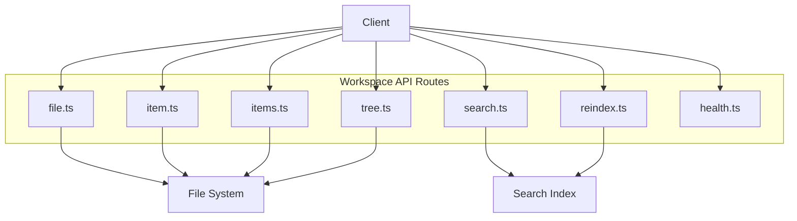
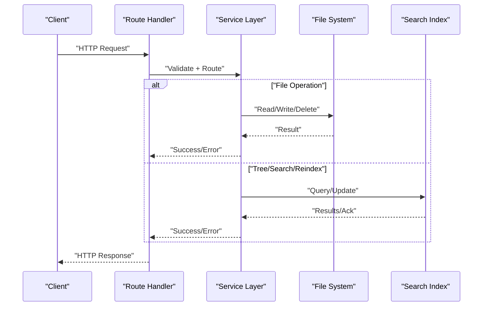
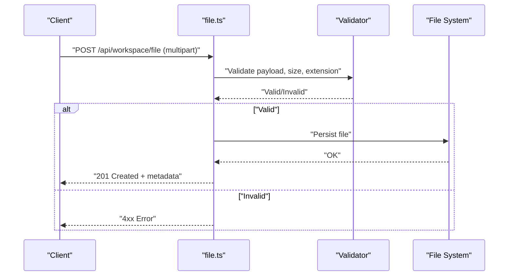
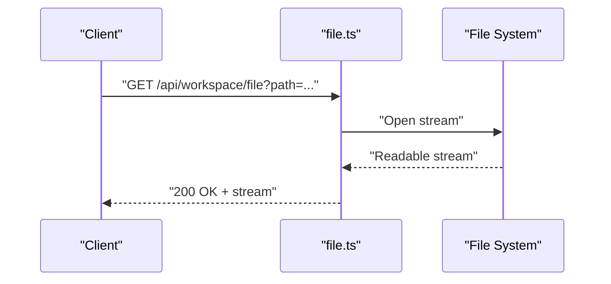
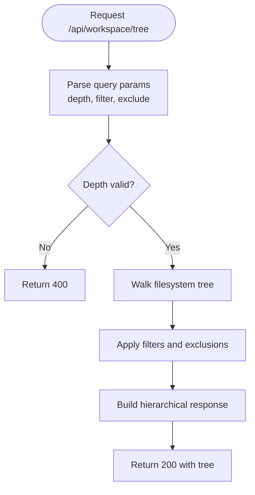
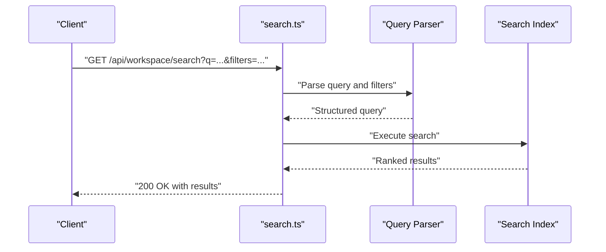
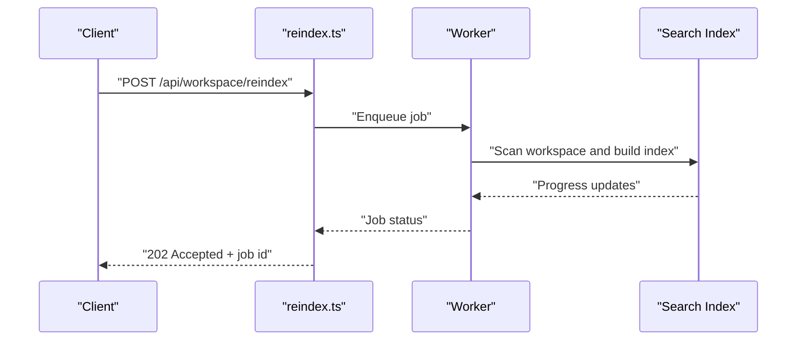
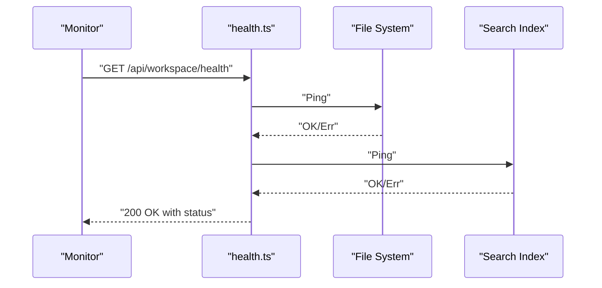
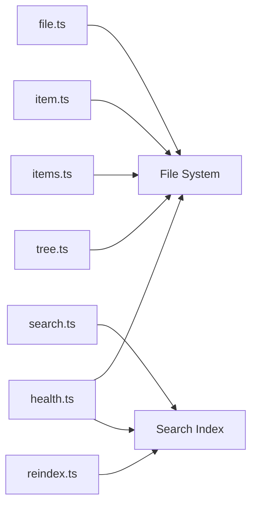

# Workspace API Service

<cite>
**Referenced Files in This Document**
- [file.ts](file://apps/web/src/routes/api/workspace/file.ts)
- [item.ts](file://apps/web/src/routes/api/workspace/item.ts)
- [items.ts](file://apps/web/src/routes/api/workspace/items.ts)
- [tree.ts](file://apps/web/src/routes/api/workspace/tree.ts)
- [search.ts](file://apps/web/src/routes/api/workspace/search.ts)
- [reindex.ts](file://apps/web/src/routes/api/workspace/reindex.ts)
- [health.ts](file://apps/web/src/routes/api/workspace/health.ts)
</cite>

## Table of Contents

1. [Introduction](#introduction)
2. [Project Structure](#project-structure)
3. [Core Components](#core-components)
4. [Architecture Overview](#architecture-overview)
5. [Detailed Component Analysis](#detailed-component-analysis)
6. [Dependency Analysis](#dependency-analysis)
7. [Performance Considerations](#performance-considerations)
8. [Troubleshooting Guide](#troubleshooting-guide)
9. [Conclusion](#conclusion)

## Introduction

This document describes the Workspace API service exposed under the /api/workspace routes. It covers file system operations, directory tree navigation, search functionality, and workspace indexing. It also explains file upload/download capabilities, real-time synchronization considerations, and workspace state management patterns. Practical examples are provided for navigating file structures, performing searches, managing workspace settings, and handling file operations. Performance optimizations for large file trees and search indexing strategies are included to guide efficient usage at scale.

## Project Structure

The Workspace API is implemented as a set of route handlers under apps/web/src/routes/api/workspace. Each handler exposes a focused capability:

- File operations (read, write, delete, download)
- Item-level operations (single item metadata and actions)
- Bulk item operations
- Directory tree traversal
- Search across indexed content
- Reindexing triggers
- Health checks

**Diagram sources**

- [file.ts](file://apps/web/src/routes/api/workspace/file.ts)
- [item.ts](file://apps/web/src/routes/api/workspace/item.ts)
- [items.ts](file://apps/web/src/routes/api/workspace/items.ts)
- [tree.ts](file://apps/web/src/routes/api/workspace/tree.ts)
- [search.ts](file://apps/web/src/routes/api/workspace/search.ts)
- [reindex.ts](file://apps/web/src/routes/api/workspace/reindex.ts)
- [health.ts](file://apps/web/src/routes/api/workspace/health.ts)

**Section sources**

- [file.ts](file://apps/web/src/routes/api/workspace/file.ts)
- [item.ts](file://apps/web/src/routes/api/workspace/item.ts)
- [items.ts](file://apps/web/src/routes/api/workspace/items.ts)
- [tree.ts](file://apps/web/src/routes/api/workspace/tree.ts)
- [search.ts](file://apps/web/src/routes/api/workspace/search.ts)
- [reindex.ts](file://apps/web/src/routes/api/workspace/reindex.ts)
- [health.ts](file://apps/web/src/routes/api/workspace/health.ts)

## Core Components

- File Operations: Read, write, update, delete, and download files within the workspace. Supports streaming responses for downloads and multipart uploads where applicable.
- Item Operations: Retrieve or modify metadata for a single item (file or directory).
- Items Operations: Batch operations over multiple items (e.g., list, move, rename).
- Tree Navigation: Traverse the workspace directory tree with optional depth limits and filters.
- Search: Query an index built from workspace content to find relevant files and snippets.
- Reindex: Trigger background reindexing of workspace content to keep the search index consistent.
- Health: Expose readiness/liveness endpoints for monitoring and orchestration.

Key responsibilities:

- Validate inputs and enforce permissions.
- Interact with the underlying file system safely.
- Manage index consistency via reindex triggers.
- Provide robust error responses and status codes.

**Section sources**

- [file.ts](file://apps/web/src/routes/api/workspace/file.ts)
- [item.ts](file://apps/web/src/routes/api/workspace/item.ts)
- [items.ts](file://apps/web/src/routes/api/workspace/items.ts)
- [tree.ts](file://apps/web/src/routes/api/workspace/tree.ts)
- [search.ts](file://apps/web/src/routes/api/workspace/search.ts)
- [reindex.ts](file://apps/web/src/routes/api/workspace/reindex.ts)
- [health.ts](file://apps/web/src/routes/api/workspace/health.ts)

## Architecture Overview

The Workspace API follows a thin-route architecture where each endpoint delegates to domain-specific logic. The file system is the source of truth for persistence, while a search index provides fast querying. Background jobs may be used for reindexing to avoid blocking requests.

[No sources needed since this diagram shows conceptual workflow, not actual code structure]

## Detailed Component Analysis

### File Operations (/api/workspace/file)

Responsibilities:

- Upload files (multipart/form-data or raw bytes depending on implementation).
- Download files with appropriate headers and streaming.
- Read/write/update/delete files by path.
- Enforce size limits, allowed extensions, and path sanitization.

Typical flow for upload:

Typical flow for download:

Usage examples:

- Upload: POST with multipart form containing file field; include optional metadata like target path.
- Download: GET with query parameter specifying file path; response includes Content-Type and Content-Disposition.
- Delete: DELETE with path parameter; returns success or error if file not found.

Error handling:

- 400 for invalid parameters or unsupported file types.
- 404 when file does not exist.
- 413 for oversized payloads.
- 500 for unexpected server errors.

**Section sources**

- [file.ts](file://apps/web/src/routes/api/workspace/file.ts)

### Item Operations (/api/workspace/item)

Responsibilities:

- Retrieve metadata for a single item (file or directory).
- Update metadata (e.g., rename, change attributes).
- Delete a single item.

Common operations:

- GET /api/workspace/item?path=... returns item details.
- PATCH /api/workspace/item updates metadata fields.
- DELETE /api/workspace/item removes the item.

Validation and safety:

- Path normalization and permission checks.
- Conflict detection for rename operations.

**Section sources**

- [item.ts](file://apps/web/src/routes/api/workspace/item.ts)

### Items Operations (/api/workspace/items)

Responsibilities:

- List multiple items with pagination and filtering.
- Batch operations such as moving or renaming multiple items.
- Bulk deletion or archival.

Example flows:

- List: GET /api/workspace/items?dir=...&limit=...&offset=...
- Move/Rename: PATCH /api/workspace/items with array of operations.
- Delete: DELETE /api/workspace/items with IDs or paths.

**Section sources**

- [items.ts](file://apps/web/src/routes/api/workspace/items.ts)

### Directory Tree Navigation (/api/workspace/tree)

Responsibilities:

- Traverse the workspace directory tree with configurable depth.
- Filter by type (files/directories), name patterns, or exclusion rules.
- Return a hierarchical structure suitable for UI rendering.

Navigation flow:

Performance tips:

- Limit depth to reduce memory usage.
- Use exclusion patterns to skip heavy directories.
- Cache frequently accessed subtrees if supported.

**Section sources**

- [tree.ts](file://apps/web/src/routes/api/workspace/tree.ts)

### Search Functionality (/api/workspace/search)

Responsibilities:

- Query the search index for text-based matches across workspace content.
- Support filters by path, file type, and date ranges.
- Return ranked results with snippets and metadata.

Search flow:

Indexing strategy:

- Incremental updates on file changes.
- Full reindex triggered via /api/workspace/reindex.
- Tokenization and stemming for improved recall.

**Section sources**

- [search.ts](file://apps/web/src/routes/api/workspace/search.ts)

### Reindexing (/api/workspace/reindex)

Responsibilities:

- Trigger background reindexing of workspace content.
- Monitor progress and completion status.
- Handle conflicts and partial failures gracefully.

Reindex flow:

Best practices:

- Rate-limit reindex triggers to avoid overload.
- Provide status endpoints to poll job progress.
- Ensure idempotency for retries.

**Section sources**

- [reindex.ts](file://apps/web/src/routes/api/workspace/reindex.ts)

### Health Check (/api/workspace/health)

Responsibilities:

- Expose liveness and readiness probes.
- Report dependency health (file system, index availability).

Health flow:

**Section sources**

- [health.ts](file://apps/web/src/routes/api/workspace/health.ts)

## Dependency Analysis

The Workspace API components have clear separation of concerns:

- Route handlers depend on validation and service layers.
- File operations depend on the file system abstraction.
- Search depends on the index layer.
- Reindex orchestrates background workers and index updates.
- Health aggregates dependency statuses.

**Diagram sources**

- [file.ts](file://apps/web/src/routes/api/workspace/file.ts)
- [item.ts](file://apps/web/src/routes/api/workspace/item.ts)
- [items.ts](file://apps/web/src/routes/api/workspace/items.ts)
- [tree.ts](file://apps/web/src/routes/api/workspace/tree.ts)
- [search.ts](file://apps/web/src/routes/api/workspace/search.ts)
- [reindex.ts](file://apps/web/src/routes/api/workspace/reindex.ts)
- [health.ts](file://apps/web/src/routes/api/workspace/health.ts)

**Section sources**

- [file.ts](file://apps/web/src/routes/api/workspace/file.ts)
- [item.ts](file://apps/web/src/routes/api/workspace/item.ts)
- [items.ts](file://apps/web/src/routes/api/workspace/items.ts)
- [tree.ts](file://apps/web/src/routes/api/workspace/tree.ts)
- [search.ts](file://apps/web/src/routes/api/workspace/search.ts)
- [reindex.ts](file://apps/web/src/routes/api/workspace/reindex.ts)
- [health.ts](file://apps/web/src/routes/api/workspace/health.ts)

## Performance Considerations

- Large file trees:
  - Use depth limits and exclusion patterns in tree queries.
  - Implement lazy loading for nested directories.
  - Cache frequent subtree responses where appropriate.
- Search indexing:
  - Prefer incremental updates to minimize rebuild time.
  - Use tokenization and stemming to improve query performance.
  - Partition indexes by directory or file type for targeted updates.
- Uploads/downloads:
  - Stream large files to reduce memory pressure.
  - Enforce size limits and chunked uploads for resilience.
- Concurrency:
  - Queue reindex jobs to prevent contention.
  - Use read locks for concurrent reads and exclusive locks for writes.

[No sources needed since this section provides general guidance]

## Troubleshooting Guide

Common issues and resolutions:

- Permission errors:
  - Verify user context and file system ACLs.
  - Ensure workspace root is accessible to the service account.
- Index inconsistencies:
  - Trigger a full reindex after migrations or bulk changes.
  - Validate index health via health endpoint.
- Slow tree traversal:
  - Reduce depth and apply filters.
  - Exclude known heavy directories.
- Upload failures:
  - Check payload size limits and MIME type restrictions.
  - Inspect server logs for I/O errors.

Operational checks:

- Use /api/workspace/health to verify dependencies.
- Monitor reindex job status and queue length.
- Review error responses for specific status codes and messages.

**Section sources**

- [health.ts](file://apps/web/src/routes/api/workspace/health.ts)
- [reindex.ts](file://apps/web/src/routes/api/workspace/reindex.ts)

## Conclusion

The Workspace API provides a comprehensive set of endpoints for file system operations, directory navigation, search, and indexing. By following the recommended performance optimizations and operational practices, you can efficiently manage large workspaces and maintain consistent search indexes. Use the health endpoints and structured error responses to monitor and troubleshoot effectively.
