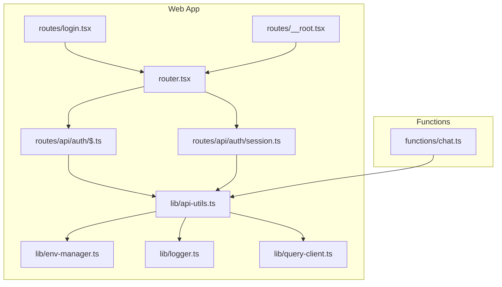
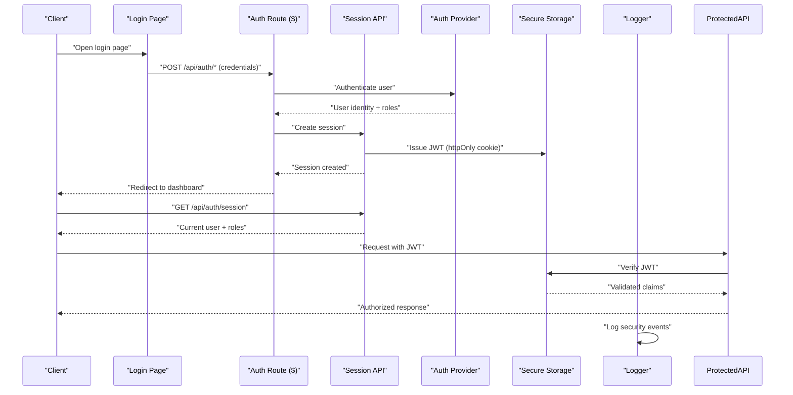
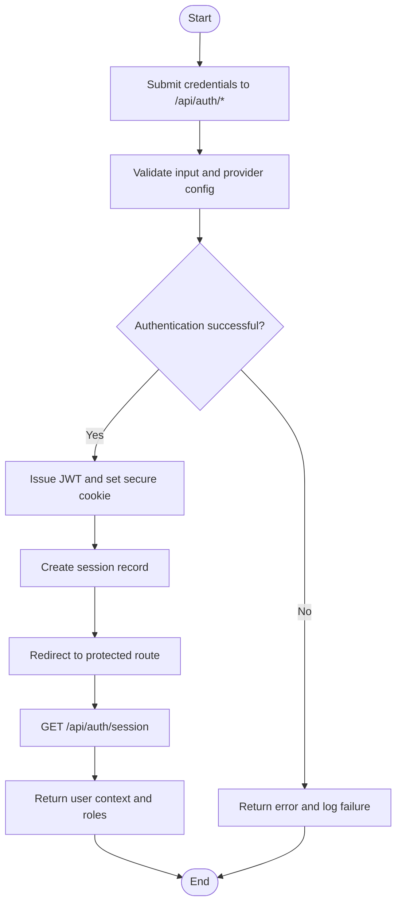
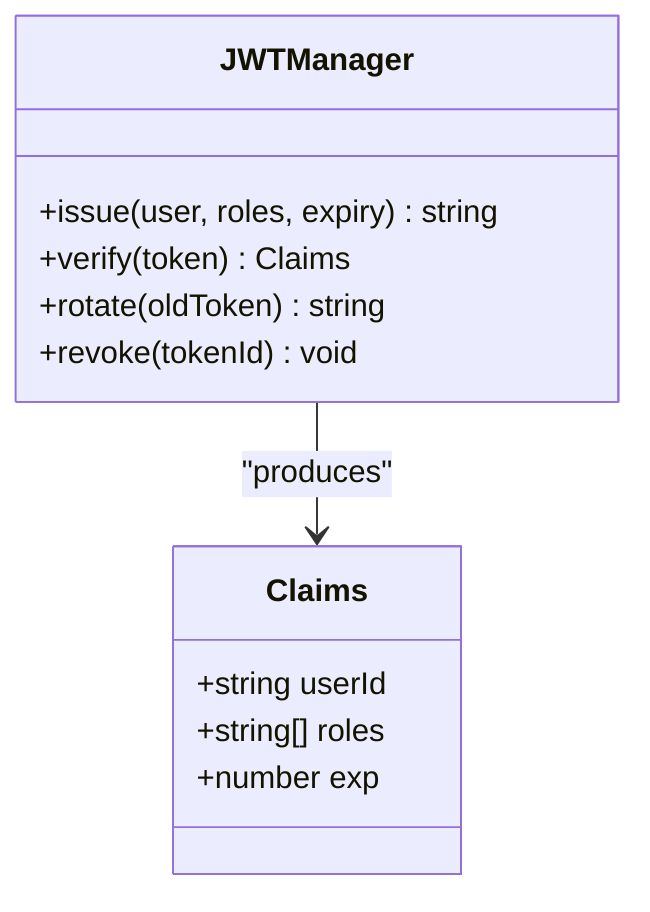
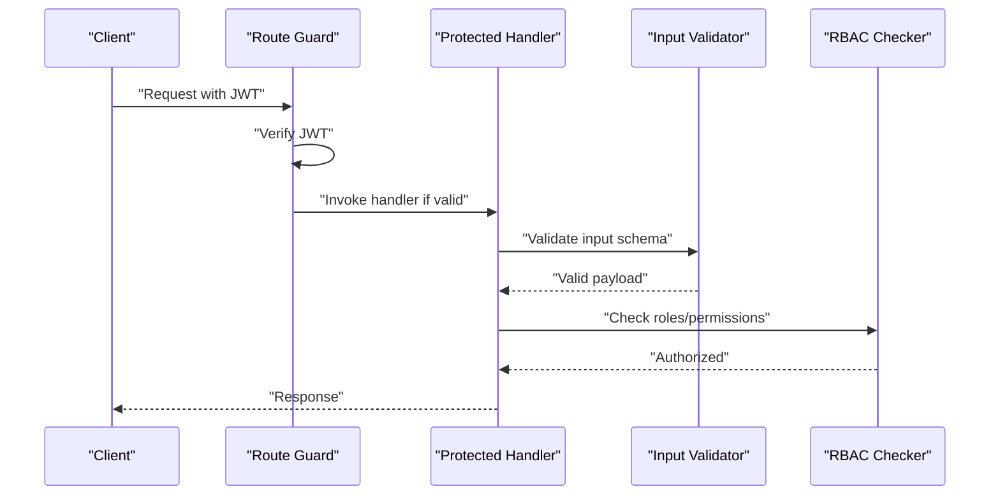
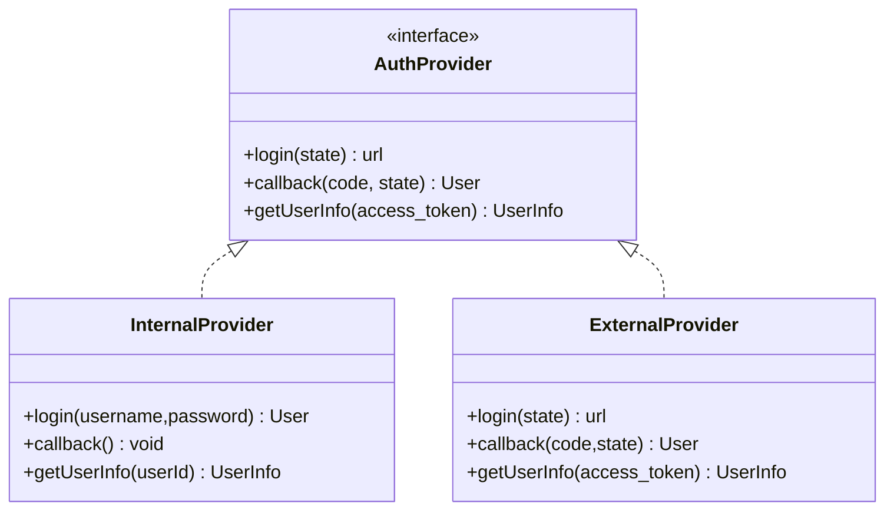
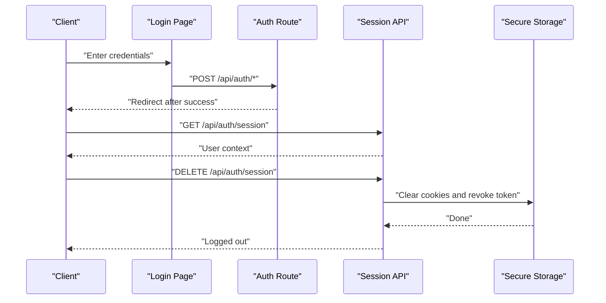
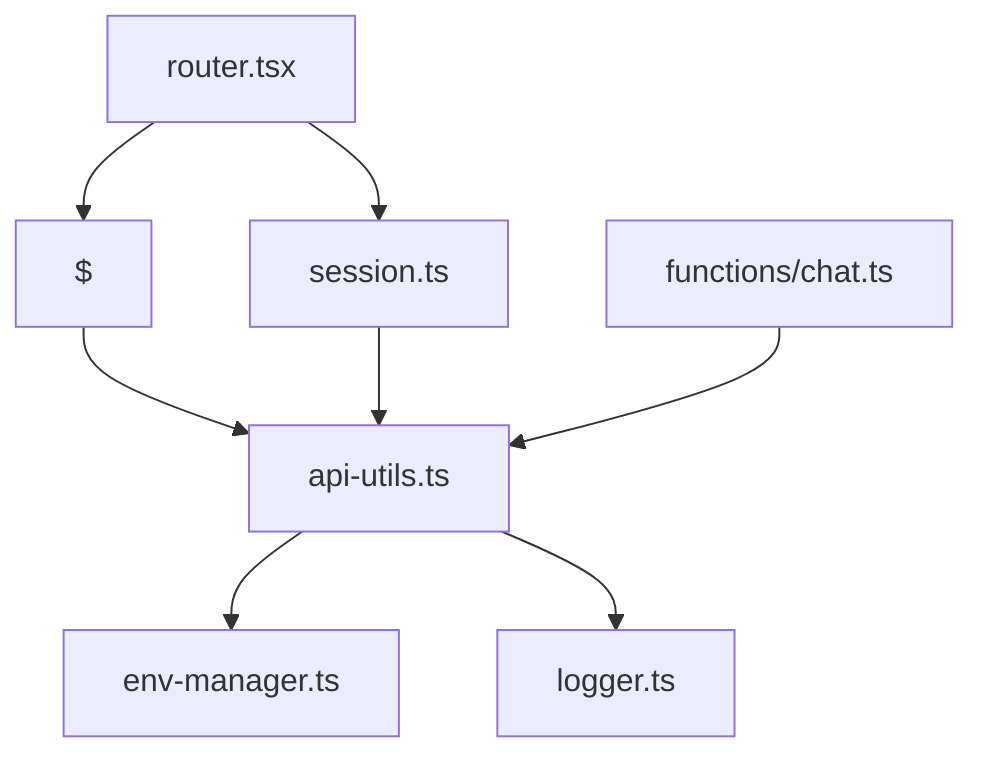

# Authentication & Security

<cite>
**Referenced Files in This Document**
- [auth-post-migrate.ts](file://apps/web/scripts/auth-post-migrate.ts)
- [quarantine-orphan-sessions.ts](file://apps/web/scripts/quarantine-orphan-sessions.ts)
- [remap-auth-user-ids.ts](file://apps/web/scripts/remap-auth-user-ids.ts)
- [api-utils.ts](file://apps/web/src/lib/api-utils.ts)
- [env-manager.ts](file://apps/web/src/lib/env-manager.ts)
- [logger.ts](file://apps/web/src/lib/logger.ts)
- [query-client.ts](file://apps/web/src/lib/query-client.ts)
- [session.ts](file://apps/web/src/routes/api/auth/session.ts)
- [$.ts](file://apps/web/src/routes/api/auth/$.ts)
- [login.tsx](file://apps/web/src/routes/login.tsx)
- [__root.tsx](file://apps/web/src/routes/__root.tsx)
- [router.tsx](file://apps/web/src/router.tsx)
- [chat.ts](file://functions/chat.ts)
- [security.md](file://docs/wiki/security.md)
- [architecture.md](file://docs/architecture.md)
- [vercel.json](file://apps/web/vercel.json)
- [package.json](file://apps/web/package.json)
</cite>

## Table of Contents

1. [Introduction](#introduction)
2. [Project Structure](#project-structure)
3. [Core Components](#core-components)
4. [Architecture Overview](#architecture-overview)
5. [Detailed Component Analysis](#detailed-component-analysis)
6. [Dependency Analysis](#dependency-analysis)
7. [Performance Considerations](#performance-considerations)
8. [Troubleshooting Guide](#troubleshooting-guide)
9. [Conclusion](#conclusion)
10. [Appendices](#appendices)

## Introduction

This document explains the authentication and security implementation for Fleet Pi, focusing on how users authenticate, how sessions are managed, and how roles and permissions are enforced. It covers JWT token handling, secure storage practices, CSRF protection, route protection, API authorization, input validation, custom authentication providers, login/logout flows, permission management, security best practices, vulnerability prevention, and audit logging. The goal is to provide both a high-level understanding and actionable guidance for developers extending or maintaining the system.

## Project Structure

The authentication and security features are primarily implemented within the web application layer under apps/web, with supporting scripts for migrations and maintenance. Key areas include:

- Authentication routes and session endpoints under apps/web/src/routes/api/auth
- Login page and routing logic under apps/web/src/routes and apps/web/src/router.tsx
- Utilities for API calls, environment configuration, logging, and query client setup under apps/web/src/lib
- Maintenance scripts for auth data migration and session cleanup under apps/web/scripts
- Documentation and architecture references under docs

**Diagram sources**

- [login.tsx](file://apps/web/src/routes/login.tsx)
- [__root.tsx](file://apps/web/src/routes/__root.tsx)
- [router.tsx](file://apps/web/src/router.tsx)
- [$.ts](file://apps/web/src/routes/api/auth/$.ts)
- [session.ts](file://apps/web/src/routes/api/auth/session.ts)
- [api-utils.ts](file://apps/web/src/lib/api-utils.ts)
- [env-manager.ts](file://apps/web/src/lib/env-manager.ts)
- [logger.ts](file://apps/web/src/lib/logger.ts)
- [query-client.ts](file://apps/web/src/lib/query-client.ts)
- [chat.ts](file://functions/chat.ts)

**Section sources**

- [architecture.md](file://docs/architecture.md)
- [security.md](file://docs/wiki/security.md)

## Core Components

- Authentication Routes:
  - Session endpoint for managing user sessions (create, read, update, delete).
  - Catch-all auth route for provider-specific flows and callbacks.
- Login Page:
  - User-facing login UI and redirection logic.
- API Utilities:
  - Centralized HTTP client configuration, headers, error handling, and request/response transformations.
- Environment Manager:
  - Secure loading of secrets and feature flags; ensures sensitive values are not exposed to the client.
- Logger:
  - Structured logging for security-relevant events (e.g., failed logins, token operations).
- Query Client:
  - Data fetching and caching utilities used by authenticated routes.
- Functions:
  - Serverless functions that may require authentication and role checks.

Key responsibilities:

- Enforce authentication before accessing protected routes.
- Validate inputs and sanitize outputs.
- Manage JWT lifecycle (issuance, verification, rotation, revocation).
- Protect against CSRF and XSS where applicable.
- Log security events without leaking sensitive data.

**Section sources**

- [session.ts](file://apps/web/src/routes/api/auth/session.ts)
- [$.ts](file://apps/web/src/routes/api/auth/$.ts)
- [login.tsx](file://apps/web/src/routes/login.tsx)
- [api-utils.ts](file://apps/web/src/lib/api-utils.ts)
- [env-manager.ts](file://apps/web/src/lib/env-manager.ts)
- [logger.ts](file://apps/web/src/lib/logger.ts)
- [query-client.ts](file://apps/web/src/lib/query-client.ts)
- [chat.ts](file://functions/chat.ts)

## Architecture Overview

The authentication architecture follows a typical modern web pattern:

- Clients interact with the login page and submit credentials.
- The server validates credentials via an authentication provider (internal or external).
- On success, a JWT is issued and stored securely (preferably httpOnly cookies).
- Subsequent requests carry the JWT, which is verified by middleware or route guards.
- Role-based access control (RBAC) enforces permissions at route and API levels.
- Audit logs capture critical security events.

**Diagram sources**

- [login.tsx](file://apps/web/src/routes/login.tsx)
- [$.ts](file://apps/web/src/routes/api/auth/$.ts)
- [session.ts](file://apps/web/src/routes/api/auth/session.ts)
- [api-utils.ts](file://apps/web/src/lib/api-utils.ts)
- [logger.ts](file://apps/web/src/lib/logger.ts)

## Detailed Component Analysis

### Authentication Flow and Session Management

- Login flow:
  - The login page submits credentials to the catch-all auth route.
  - The auth route delegates to the appropriate provider and returns a success/failure response.
- Session management:
  - The session endpoint creates, reads, updates, and deletes sessions.
  - JWTs are issued and stored using secure practices (e.g., httpOnly cookies).
  - Session retrieval returns current user context and roles.

**Diagram sources**

- [$.ts](file://apps/web/src/routes/api/auth/$.ts)
- [session.ts](file://apps/web/src/routes/api/auth/session.ts)
- [api-utils.ts](file://apps/web/src/lib/api-utils.ts)
- [logger.ts](file://apps/web/src/lib/logger.ts)

**Section sources**

- [$.ts](file://apps/web/src/routes/api/auth/$.ts)
- [session.ts](file://apps/web/src/routes/api/auth/session.ts)
- [api-utils.ts](file://apps/web/src/lib/api-utils.ts)
- [logger.ts](file://apps/web/src/lib/logger.ts)

### JWT Token Management

- Issuance:
  - JWTs are created upon successful authentication with minimal claims (user ID, roles, expiration).
- Storage:
  - Prefer httpOnly cookies to mitigate XSS risks; avoid localStorage for tokens.
- Verification:
  - Each protected route verifies the JWT signature and expiration.
- Rotation and Revocation:
  - Implement token rotation and revocation lists to handle compromised tokens.
- Best Practices:
  - Use short-lived tokens with refresh mechanisms.
  - Bind tokens to device/session metadata when feasible.
  - Never log token contents.

**Diagram sources**

- [session.ts](file://apps/web/src/routes/api/auth/session.ts)
- [api-utils.ts](file://apps/web/src/lib/api-utils.ts)

**Section sources**

- [session.ts](file://apps/web/src/routes/api/auth/session.ts)
- [api-utils.ts](file://apps/web/src/lib/api-utils.ts)

### Secure Storage Practices

- Cookies:
  - Use httpOnly, secure, sameSite attributes for session cookies.
- Secrets:
  - Load secrets via environment manager; never hardcode or expose to client bundles.
- Database:
  - Hash passwords using strong algorithms; store only necessary identifiers.
- Sensitive Data:
  - Avoid logging PII or tokens; redact sensitive fields in logs.

**Section sources**

- [env-manager.ts](file://apps/web/src/lib/env-manager.ts)
- [logger.ts](file://apps/web/src/lib/logger.ts)

### CSRF Protection

- Recommendations:
  - Use SameSite cookies and CSRF tokens for state-changing requests.
  - Validate Origin and Referer headers for cross-site requests.
  - Ensure APIs do not rely solely on cookies for CSRF mitigation.

[No sources needed since this section provides general guidance]

### Route Protection and API Authorization

- Route Guards:
  - Middleware or route wrappers verify authentication and roles before executing handlers.
- API Authorization:
  - Check user roles against required permissions per endpoint.
- Input Validation:
  - Validate all inputs using schema validators; reject malformed payloads early.

**Diagram sources**

- [router.tsx](file://apps/web/src/router.tsx)
- [api-utils.ts](file://apps/web/src/lib/api-utils.ts)

**Section sources**

- [router.tsx](file://apps/web/src/router.tsx)
- [api-utils.ts](file://apps/web/src/lib/api-utils.ts)

### Custom Authentication Providers

- Implementation Pattern:
  - Abstract provider interface with methods for login, callback, and user info retrieval.
  - Register providers dynamically based on configuration.
- Example Steps:
  - Define provider configuration (client IDs, secrets, scopes).
  - Implement provider-specific OAuth flows.
  - Map provider responses to internal user model and roles.

**Diagram sources**

- [$.ts](file://apps/web/src/routes/api/auth/$.ts)
- [session.ts](file://apps/web/src/routes/api/auth/session.ts)

**Section sources**

- [$.ts](file://apps/web/src/routes/api/auth/$.ts)
- [session.ts](file://apps/web/src/routes/api/auth/session.ts)

### Login/Logout Flows

- Login:
  - Submit credentials to auth route, receive JWT, redirect to dashboard.
- Logout:
  - Invalidate session, clear cookies, revoke tokens if necessary.
- State Handling:
  - Maintain consistent user state across pages using session endpoint.

**Diagram sources**

- [login.tsx](file://apps/web/src/routes/login.tsx)
- [$.ts](file://apps/web/src/routes/api/auth/$.ts)
- [session.ts](file://apps/web/src/routes/api/auth/session.ts)
- [api-utils.ts](file://apps/web/src/lib/api-utils.ts)

**Section sources**

- [login.tsx](file://apps/web/src/routes/login.tsx)
- [$.ts](file://apps/web/src/routes/api/auth/$.ts)
- [session.ts](file://apps/web/src/routes/api/auth/session.ts)
- [api-utils.ts](file://apps/web/src/lib/api-utils.ts)

### Managing User Permissions

- Roles:
  - Assign roles to users during provisioning or via admin panel.
- Policies:
  - Define policies per route or resource; enforce at API boundaries.
- Auditing:
  - Log permission checks and violations for compliance.

[No sources needed since this section provides general guidance]

### Audit Logging

- Events to Log:
  - Failed login attempts, token issuance, role changes, permission denials.
- Redaction:
  - Exclude sensitive data from logs; use structured formats.
- Retention:
  - Configure retention policies aligned with compliance requirements.

**Section sources**

- [logger.ts](file://apps/web/src/lib/logger.ts)

## Dependency Analysis

The authentication subsystem depends on:

- API utilities for HTTP handling and error normalization.
- Environment manager for secure configuration.
- Logger for security event recording.
- Router for route protection and guards.
- Functions for serverless endpoints requiring authentication.

**Diagram sources**

- [$.ts](file://apps/web/src/routes/api/auth/$.ts)
- [session.ts](file://apps/web/src/routes/api/auth/session.ts)
- [api-utils.ts](file://apps/web/src/lib/api-utils.ts)
- [env-manager.ts](file://apps/web/src/lib/env-manager.ts)
- [logger.ts](file://apps/web/src/lib/logger.ts)
- [router.tsx](file://apps/web/src/router.tsx)
- [chat.ts](file://functions/chat.ts)

**Section sources**

- [api-utils.ts](file://apps/web/src/lib/api-utils.ts)
- [env-manager.ts](file://apps/web/src/lib/env-manager.ts)
- [logger.ts](file://apps/web/src/lib/logger.ts)
- [router.tsx](file://apps/web/src/router.tsx)
- [chat.ts](file://functions/chat.ts)

## Performance Considerations

- Minimize JWT payload size to reduce bandwidth and processing overhead.
- Cache user context where safe to avoid repeated database lookups.
- Use connection pooling for database operations in session management.
- Implement rate limiting on authentication endpoints to prevent brute-force attacks.

[No sources needed since this section provides general guidance]

## Troubleshooting Guide

Common issues and resolutions:

- Invalid JWT:
  - Verify signing keys and expiration settings; check for clock skew.
- Session Not Found:
  - Ensure cookies are sent with requests; validate SameSite and secure flags.
- Permission Denied:
  - Review role assignments and policy definitions; check audit logs for denials.
- CSRF Errors:
  - Confirm CSRF token presence and validity; validate Origin headers.

**Section sources**

- [logger.ts](file://apps/web/src/lib/logger.ts)
- [api-utils.ts](file://apps/web/src/lib/api-utils.ts)

## Conclusion

Fleet Pi’s authentication and security implementation emphasizes secure session management, robust JWT handling, and strict authorization controls. By following the patterns and best practices outlined here, developers can extend authentication providers, enforce permissions, and maintain a secure environment. Continuous auditing and adherence to security guidelines will help prevent vulnerabilities and ensure compliance.

[No sources needed since this section summarizes without analyzing specific files]

## Appendices

### Migration and Maintenance Scripts

- Auth Post-Migrate:
  - Handles post-deployment adjustments for authentication data.
- Quarantine Orphan Sessions:
  - Cleans up stale sessions to prevent resource leaks.
- Remap Auth User IDs:
  - Updates user identifiers across systems for consistency.

**Section sources**

- [auth-post-migrate.ts](file://apps/web/scripts/auth-post-migrate.ts)
- [quarantine-orphan-sessions.ts](file://apps/web/scripts/quarantine-orphan-sessions.ts)
- [remap-auth-user-ids.ts](file://apps/web/scripts/remap-auth-user-ids.ts)

### Configuration and Deployment

- Vercel Configuration:
  - Defines runtime environment variables and deployment settings.
- Package Dependencies:
  - Lists libraries used for authentication, security, and utilities.

**Section sources**

- [vercel.json](file://apps/web/vercel.json)
- [package.json](file://apps/web/package.json)
