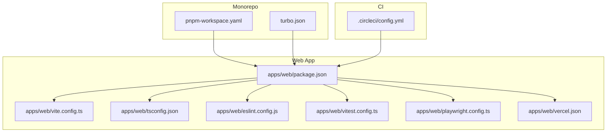
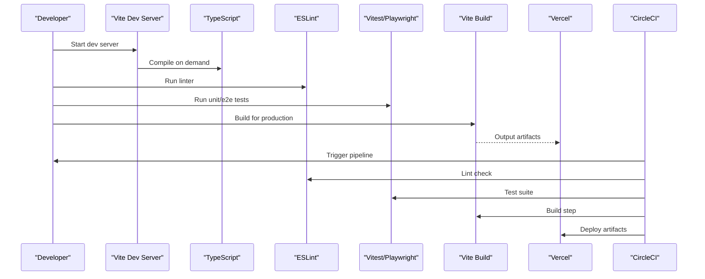
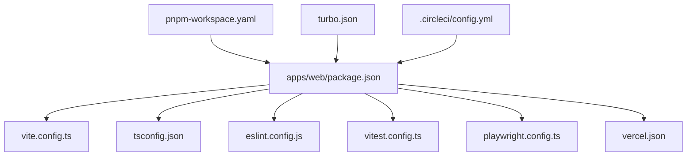

# Build Configuration & Development Workflow

<cite>
**Referenced Files in This Document**
- [package.json](file://apps/web/package.json)
- [vite.config.ts](file://apps/web/vite.config.ts)
- [tsconfig.json](file://apps/web/tsconfig.json)
- [eslint.config.js](file://apps/web/eslint.config.js)
- [vitest.config.ts](file://apps/web/vitest.config.ts)
- [playwright.config.ts](file://apps/web/playwright.config.ts)
- [vercel.json](file://apps/web/vercel.json)
- [.circleci/config.yml](file://.circleci/config.yml)
- [pnpm-workspace.yaml](file://pnpm-workspace.yaml)
- [turbo.json](file://turbo.json)
- [scripts/build-vercel-output.mjs](file://apps/web/scripts/build-vercel-output.mjs)
- [scripts/verify-deployment-readiness.mjs](file://apps/web/scripts/verify-deployment-readiness.mjs)
</cite>

## Table of Contents

1. [Introduction](#introduction)
2. [Project Structure](#project-structure)
3. [Core Components](#core-components)
4. [Architecture Overview](#architecture-overview)
5. [Detailed Component Analysis](#detailed-component-analysis)
6. [Dependency Analysis](#dependency-analysis)
7. [Performance Considerations](#performance-considerations)
8. [Troubleshooting Guide](#troubleshooting-guide)
9. [Conclusion](#conclusion)
10. [Appendices](#appendices)

## Introduction

This document explains the build configuration and development workflow for the Fleet Pi web application. It covers Vite setup, TypeScript configuration, ESLint rules, development server behavior (including hot module replacement), debugging, environment variables, build optimizations, deployment preparation, dependency management, plugin configuration, testing frameworks, code quality tools, and CI/CD integration points. The goal is to help contributors set up a productive local environment and understand how the project is built and deployed.

## Project Structure

The web application lives under apps/web and uses a modern toolchain:

- Vite as the build system and dev server
- TypeScript for type checking and compilation
- ESLint for linting
- Vitest for unit tests
- Playwright for end-to-end tests
- Vercel for deployment with custom build steps
- pnpm workspaces and Turborepo for monorepo orchestration
- CircleCI for continuous integration

**Diagram sources**

- [package.json](file://apps/web/package.json)
- [vite.config.ts](file://apps/web/vite.config.ts)
- [tsconfig.json](file://apps/web/tsconfig.json)
- [eslint.config.js](file://apps/web/eslint.config.js)
- [vitest.config.ts](file://apps/web/vitest.config.ts)
- [playwright.config.ts](file://apps/web/playwright.config.ts)
- [vercel.json](file://apps/web/vercel.json)
- [pnpm-workspace.yaml](file://pnpm-workspace.yaml)
- [turbo.json](file://turbo.json)
- [.circleci/config.yml](file://.circleci/config.yml)

**Section sources**

- [package.json](file://apps/web/package.json)
- [pnpm-workspace.yaml](file://pnpm-workspace.yaml)
- [turbo.json](file://turbo.json)

## Core Components

- Vite configuration defines the dev server, plugins, build targets, and optimization settings.
- TypeScript configuration centralizes compiler options and path mappings used across the app.
- ESLint configuration enforces consistent code style and catches common errors.
- Vitest configures unit testing with appropriate globals and environment settings.
- Playwright config sets up browser-based e2e test execution.
- Vercel configuration controls build and output generation for production deployments.
- Scripts provide automation for building outputs and verifying deployment readiness.

**Section sources**

- [vite.config.ts](file://apps/web/vite.config.ts)
- [tsconfig.json](file://apps/web/tsconfig.json)
- [eslint.config.js](file://apps/web/eslint.config.js)
- [vitest.config.ts](file://apps/web/vitest.config.ts)
- [playwright.config.ts](file://apps/web/playwright.config.ts)
- [vercel.json](file://apps/web/vercel.json)
- [scripts/build-vercel-output.mjs](file://apps/web/scripts/build-vercel-output.mjs)
- [scripts/verify-deployment-readiness.mjs](file://apps/web/scripts/verify-deployment-readiness.mjs)

## Architecture Overview

The build pipeline integrates multiple stages:

- Local development: Vite serves the app with HMR and TypeScript on-demand compilation.
- Testing: Vitest runs unit tests; Playwright executes e2e tests against a running instance.
- Linting: ESLint checks code quality before commits or CI runs.
- Production build: Vite bundles assets with optimizations; Vercel builds and deploys using vercel.json and scripts.
- CI: CircleCI orchestrates install, lint, test, build, and deploy steps.

[No sources needed since this diagram shows conceptual workflow, not actual code structure]

## Detailed Component Analysis

### Vite Setup and Development Server

- Entry point and scripts are defined in package.json.
- vite.config.ts configures:
  - Dev server host/port and proxy settings for backend APIs
  - Plugins for React, TypeScript, and other features
  - Build target, chunking strategy, and asset handling
  - Environment variable exposure to the client
- Hot Module Replacement (HMR) is enabled by default in dev mode for fast feedback during edits.

Key behaviors:

- Fast refresh updates components without full page reloads.
- Proxy routes forward API calls to the backend during development.
- Environment variables prefixed appropriately are injected into the client bundle.

**Section sources**

- [package.json](file://apps/web/package.json)
- [vite.config.ts](file://apps/web/vite.config.ts)

### TypeScript Configuration

- tsconfig.json centralizes compiler options such as strictness, module resolution, JSX support, and path aliases.
- Path mappings simplify imports and improve maintainability.
- Type checking is integrated into the dev server and build process.

Best practices:

- Keep strict mode enabled for robust type safety.
- Use path aliases consistently across modules.
- Exclude test files from certain compiler steps if needed.

**Section sources**

- [tsconfig.json](file://apps/web/tsconfig.json)

### ESLint Rules

- eslint.config.js defines rules for code style, best practices, and error prevention.
- Integrates with Prettier for formatting consistency.
- Can be extended with additional plugins for framework-specific checks.

Recommendations:

- Enable recommended rule sets for your framework.
- Add custom rules for project-specific patterns.
- Integrate ESLint into pre-commit hooks via Husky.

**Section sources**

- [eslint.config.js](file://apps/web/eslint.config.js)

### Testing Framework Configuration

- Vitest config (vitest.config.ts) sets up unit testing with:
  - Global mocks and fixtures
  - Environment configuration (browser vs node)
  - Coverage reporting options
- Playwright config (playwright.config.ts) configures e2e tests:
  - Browser selection and timeouts
  - Base URL and environment variables for tests
  - Parallel execution and reporting

Testing workflow:

- Unit tests run quickly with Vitest during development.
- E2E tests validate critical user flows against a running app.

**Section sources**

- [vitest.config.ts](file://apps/web/vitest.config.ts)
- [playwright.config.ts](file://apps/web/playwright.config.ts)

### Build Optimizations and Deployment Preparation

- Vite build produces optimized bundles with code splitting, minification, and asset hashing.
- vercel.json defines build commands, output directory, and environment variables for Vercel.
- Custom scripts assist in preparing Vercel-compatible outputs and verifying deployment readiness.

Deployment steps:

- Install dependencies with pnpm.
- Run lint and tests.
- Build the app with Vite.
- Generate Vercel output using provided script.
- Deploy to Vercel.

**Section sources**

- [vite.config.ts](file://apps/web/vite.config.ts)
- [vercel.json](file://apps/web/vercel.json)
- [scripts/build-vercel-output.mjs](file://apps/web/scripts/build-vercel-output.mjs)
- [scripts/verify-deployment-readiness.mjs](file://apps/web/scripts/verify-deployment-readiness.mjs)

### Environment Variables

- Client-facing variables are exposed through Vite’s env handling.
- Backend-only variables should remain server-side and not be bundled into the client.
- Use .env files for local development and platform-specific configurations for CI/CD.

Guidelines:

- Prefix client variables as required by Vite.
- Validate required variables at runtime where necessary.
- Avoid secrets in client bundles.

**Section sources**

- [vite.config.ts](file://apps/web/vite.config.ts)
- [vercel.json](file://apps/web/vercel.json)

### Adding New Dependencies

- Use pnpm to add dependencies within the apps/web workspace.
- Update package.json entries and ensure compatibility with existing toolchain.
- Re-run type checks and tests after adding dependencies.

Steps:

- Install dependency with pnpm.
- Import and use in code.
- Verify TypeScript types and linting pass.
- Add tests if applicable.

**Section sources**

- [package.json](file://apps/web/package.json)
- [pnpm-workspace.yaml](file://pnpm-workspace.yaml)

### Configuring Plugins

- Vite plugins extend functionality like routing, data fetching, and asset processing.
- Configure plugins in vite.config.ts according to their documentation.
- Ensure plugins do not conflict with each other and respect build targets.

Examples:

- React plugin for JSX support and fast refresh.
- TypeScript plugin for type-aware transformations.
- Additional plugins for analytics, service workers, or API mocking.

**Section sources**

- [vite.config.ts](file://apps/web/vite.config.ts)

### Debugging Setup

- Use browser developer tools for frontend debugging.
- Leverage Vite’s sourcemaps for accurate stack traces.
- Configure logging levels and environment flags for verbose output.

Tips:

- Enable source maps in development.
- Use conditional breakpoints for complex flows.
- Inspect network requests via proxy logs.

**Section sources**

- [vite.config.ts](file://apps/web/vite.config.ts)

### CI/CD Integration Points

- CircleCI orchestrates the pipeline with install, lint, test, build, and deploy steps.
- Cache dependencies to speed up builds.
- Fail fast on lint or test failures to maintain quality.

Pipeline stages:

- Install dependencies with pnpm.
- Run ESLint and type checks.
- Execute unit and e2e tests.
- Build production assets.
- Deploy to Vercel.

**Section sources**

- [.circleci/config.yml](file://.circleci/config.yml)
- [turbo.json](file://turbo.json)

## Dependency Analysis

The web app depends on core tooling and libraries managed via pnpm workspaces. Turborepo coordinates tasks across packages.

**Diagram sources**

- [package.json](file://apps/web/package.json)
- [vite.config.ts](file://apps/web/vite.config.ts)
- [tsconfig.json](file://apps/web/tsconfig.json)
- [eslint.config.js](file://apps/web/eslint.config.js)
- [vitest.config.ts](file://apps/web/vitest.config.ts)
- [playwright.config.ts](file://apps/web/playwright.config.ts)
- [vercel.json](file://apps/web/vercel.json)
- [pnpm-workspace.yaml](file://pnpm-workspace.yaml)
- [turbo.json](file://turbo.json)
- [.circleci/config.yml](file://.circleci/config.yml)

**Section sources**

- [package.json](file://apps/web/package.json)
- [pnpm-workspace.yaml](file://pnpm-workspace.yaml)
- [turbo.json](file://turbo.json)

## Performance Considerations

- Enable code splitting and lazy loading for large modules.
- Use Vite’s built-in optimizations like minification and tree-shaking.
- Profile bundle size with Vite’s analyzer plugin to identify heavy dependencies.
- Prefer static assets and avoid runtime overhead where possible.
- Cache dependencies in CI to reduce build times.

[No sources needed since this section provides general guidance]

## Troubleshooting Guide

Common issues and resolutions:

- Dev server fails to start: Check port conflicts and proxy settings.
- TypeScript errors: Ensure tsconfig paths match imports and dependencies are installed.
- Lint failures: Fix rule violations or adjust configuration if necessary.
- Tests failing: Verify environment variables and mock setups.
- Build errors: Review Vite configuration and plugin compatibility.
- Deployment issues: Validate vercel.json and environment variables on the platform.

Debugging tips:

- Use verbose logging in development.
- Inspect network requests and responses.
- Run individual steps locally to isolate problems.

**Section sources**

- [vite.config.ts](file://apps/web/vite.config.ts)
- [vercel.json](file://apps/web/vercel.json)
- [.circleci/config.yml](file://.circleci/config.yml)

## Conclusion

The Fleet Pi web application leverages a modern, efficient toolchain centered around Vite, TypeScript, ESLint, Vitest, and Playwright. With clear configuration files and scripts, developers can quickly set up a local environment, iterate with HMR, enforce code quality, and deploy reliably to Vercel. CI/CD ensures consistent builds and tests across environments. Following the guidelines in this document will streamline development and maintenance workflows.

[No sources needed since this section summarizes without analyzing specific files]

## Appendices

### Quickstart Commands

- Install dependencies: pnpm install
- Start dev server: pnpm dev
- Run linter: pnpm lint
- Run unit tests: pnpm test
- Run e2e tests: pnpm e2e
- Build production: pnpm build
- Prepare Vercel output: pnpm vercel:build
- Verify deployment readiness: pnpm verify:deploy

[No sources needed since this section provides general guidance]
