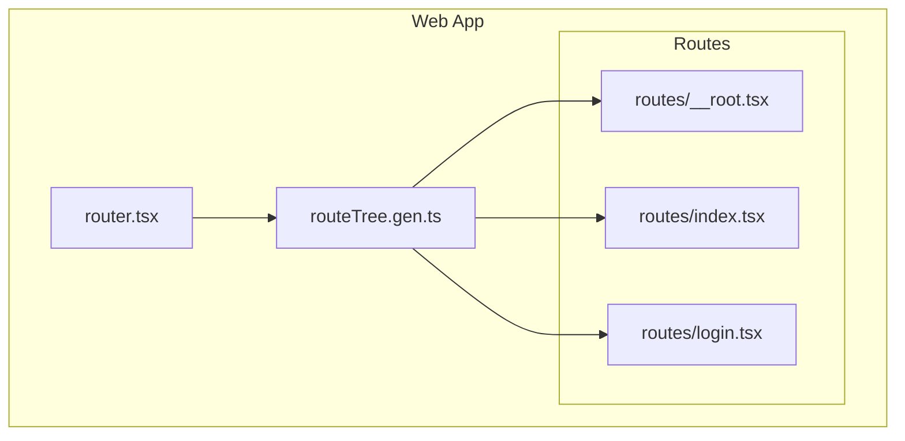
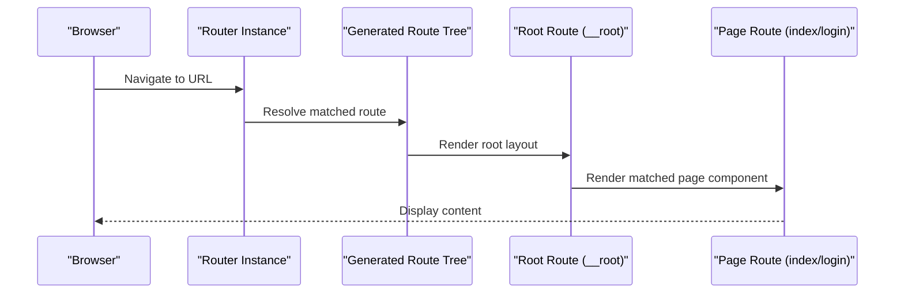
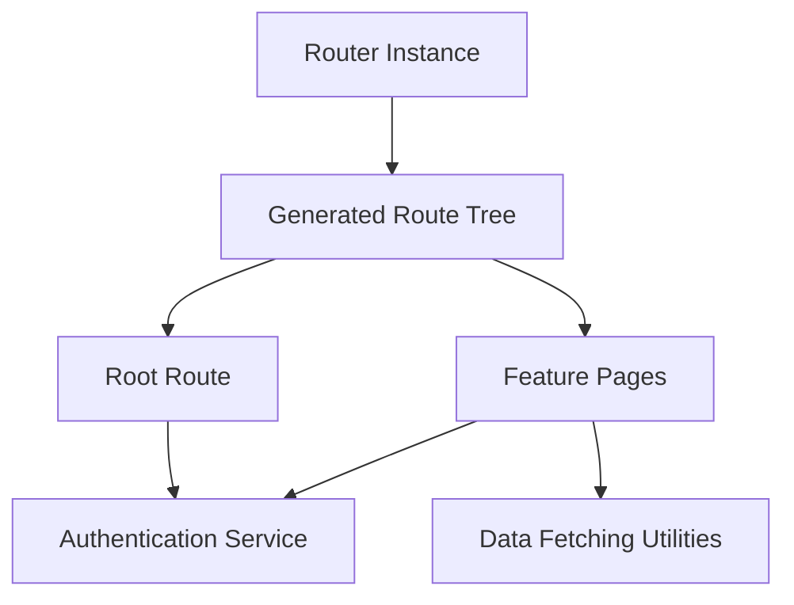

# Routing Structure

<cite>
**Referenced Files in This Document**
- [router.tsx](file://apps/web/src/router.tsx)
- [routeTree.gen.ts](file://apps/web/src/routeTree.gen.ts)
- [__root.tsx](file://apps/web/src/routes/__root.tsx)
- [index.tsx](file://apps/web/src/routes/index.tsx)
- [login.tsx](file://apps/web/src/routes/login.tsx)
</cite>

## Table of Contents

1. [Introduction](#introduction)
2. [Project Structure](#project-structure)
3. [Core Components](#core-components)
4. [Architecture Overview](#architecture-overview)
5. [Detailed Component Analysis](#detailed-component-analysis)
6. [Dependency Analysis](#dependency-analysis)
7. [Performance Considerations](#performance-considerations)
8. [Troubleshooting Guide](#troubleshooting-guide)
9. [Conclusion](#conclusion)

## Introduction

This document explains the routing structure of the Fleet Pi web application, focusing on how routes are defined, composed, and protected. It covers the React Router implementation used by the app, the generated route tree, nested routing patterns, authentication-based guards, dynamic routing, programmatic navigation, and strategies for adding new routes and implementing route-specific layouts.

## Project Structure

The routing is implemented using a file-based router that generates a typed route tree at build time. The key files involved are:

- A root router configuration that wires up the router instance and providers
- A generated route tree that reflects the file-based route definitions
- Route components under the routes directory, including a root layout and feature pages

**Diagram sources**

- [router.tsx](file://apps/web/src/router.tsx)
- [routeTree.gen.ts](file://apps/web/src/routeTree.gen.ts)
- [__root.tsx](file://apps/web/src/routes/__root.tsx)
- [index.tsx](file://apps/web/src/routes/index.tsx)
- [login.tsx](file://apps/web/src/routes/login.tsx)

**Section sources**

- [router.tsx](file://apps/web/src/router.tsx)
- [routeTree.gen.ts](file://apps/web/src/routeTree.gen.ts)
- [__root.tsx](file://apps/web/src/routes/__root.tsx)
- [index.tsx](file://apps/web/src/routes/index.tsx)
- [login.tsx](file://apps/web/src/routes/login.tsx)

## Core Components

- Root router setup: Initializes the router instance, configures history, and mounts the route tree into the application shell.
- Generated route tree: Provides strongly-typed routes derived from the file-based route definitions, enabling safe navigation and type inference.
- Root route component: Defines the global layout, error boundaries, and shared UI chrome (e.g., headers, footers).
- Feature routes: Page-level components such as the home page and login page.

Key responsibilities:

- Centralized router configuration and lifecycle
- Type-safe route generation and navigation helpers
- Shared layout and global state integration within the root route
- Authentication gating around protected routes

**Section sources**

- [router.tsx](file://apps/web/src/router.tsx)
- [routeTree.gen.ts](file://apps/web/src/routeTree.gen.ts)
- [__root.tsx](file://apps/web/src/routes/__root.tsx)
- [index.tsx](file://apps/web/src/routes/index.tsx)
- [login.tsx](file://apps/web/src/routes/login.tsx)

## Architecture Overview

The routing architecture follows a file-based pattern with a generated route tree. The root router composes the route tree and renders it inside the application shell. Protected routes can be guarded via wrappers or higher-order components integrated into the route definitions.

**Diagram sources**

- [router.tsx](file://apps/web/src/router.tsx)
- [routeTree.gen.ts](file://apps/web/src/routeTree.gen.ts)
- [__root.tsx](file://apps/web/src/routes/__root.tsx)
- [index.tsx](file://apps/web/src/routes/index.tsx)
- [login.tsx](file://apps/web/src/routes/login.tsx)

## Detailed Component Analysis

### Root Router Configuration

- Purpose: Create and configure the router instance, attach providers, and mount the route tree.
- Responsibilities:
  - Initialize history and location synchronization
  - Provide global context (e.g., theme, auth, query client)
  - Mount the generated route tree into the DOM

Typical considerations:

- Ensure the router is configured once at app bootstrap
- Wrap the router with necessary providers (auth, data fetching, analytics)
- Keep the router file free of business logic; delegate to route components and services

**Section sources**

- [router.tsx](file://apps/web/src/router.tsx)

### Generated Route Tree

- Purpose: Reflects the file-based route definitions into a strongly-typed structure used by the router.
- Benefits:
  - Type-safe navigation and search params
  - Automatic route matching and code splitting hooks
  - Centralized route metadata for guards and loaders

Usage patterns:

- Import the generated types for programmatic navigation
- Use the route tree to infer path parameters and search queries
- Extend the tree by adding new route files; regeneration updates types automatically

**Section sources**

- [routeTree.gen.ts](file://apps/web/src/routeTree.gen.ts)

### Root Route Component

- Purpose: Define the global layout and shared UI chrome for all pages.
- Responsibilities:
  - Render top-level layout (header, sidebar, footer)
  - Handle global error boundaries and fallbacks
  - Integrate global state (e.g., authentication status, user roles)
  - Provide route transitions and loading indicators

Best practices:

- Keep the root route lightweight; defer heavy logic to child routes
- Use suspense and lazy loading for non-critical sections
- Centralize authentication checks here if they apply globally

**Section sources**

- [__root.tsx](file://apps/web/src/routes/__root.tsx)

### Home Route

- Purpose: Entry point for unauthenticated users when no specific route is requested.
- Responsibilities:
  - Redirect authenticated users to dashboard or appropriate area
  - Present landing content or quick actions for guests

Navigation behavior:

- Programmatic redirects based on authentication state
- Optional deep-linking support via search params

**Section sources**

- [index.tsx](file://apps/web/src/routes/index.tsx)

### Login Route

- Purpose: Authenticate users and manage login flow.
- Responsibilities:
  - Collect credentials and submit to authentication service
  - Handle success/failure states and errors
  - Redirect to intended destination after successful login

Integration points:

- Connects with authentication provider and session management
- Uses programmatic navigation to redirect post-login

**Section sources**

- [login.tsx](file://apps/web/src/routes/login.tsx)

### Nested Routing Patterns

- File-based nesting: Parent folders map to parent routes; child files become nested routes.
- Layout inheritance: Child routes inherit the root layout unless overridden.
- Outlet rendering: Parent routes render child content via an outlet mechanism provided by the router.

Guidelines:

- Group related features under a common folder to create nested routes naturally
- Keep leaf routes focused on page-level concerns
- Use route-level loaders and guards to control data fetching and access

**Section sources**

- [routeTree.gen.ts](file://apps/web/src/routeTree.gen.ts)
- [__root.tsx](file://apps/web/src/routes/__root.tsx)

### Route Guards and Authentication-Based Protection

- Guard strategy: Protect routes by checking authentication and role permissions before rendering.
- Implementation options:
  - Route-level wrapper components that enforce access rules
  - Higher-order components or route loaders that prevent rendering until conditions are met
  - Redirects to login or unauthorized pages when access is denied

Role-based access control:

- Evaluate user roles against route requirements
- Show minimal UI for unauthorized users or redirect appropriately

**Section sources**

- [__root.tsx](file://apps/web/src/routes/__root.tsx)
- [login.tsx](file://apps/web/src/routes/login.tsx)

### Dynamic Routing and Parameter Handling

- Path parameters: Extracted from route segments and passed to components.
- Search parameters: Used for filtering, pagination, and stateful UI.
- Best practices:
  - Validate and sanitize parameters in route loaders or components
  - Provide sensible defaults for optional parameters
  - Use typed navigation helpers to avoid runtime mismatches

**Section sources**

- [routeTree.gen.ts](file://apps/web/src/routeTree.gen.ts)

### Programmatic Navigation

- Use typed navigation APIs to navigate between routes without hardcoding strings.
- Benefits:
  - Compile-time safety for paths and parameters
  - Consistent handling of search params and state
- Common patterns:
  - Redirect after form submission or API calls
  - Conditional navigation based on authentication or feature flags

**Section sources**

- [routeTree.gen.ts](file://apps/web/src/routeTree.gen.ts)

### Lazy Loading Strategies

- Code splitting: Load route components on demand to reduce initial bundle size.
- Suspense integration: Show loading states while routes are being fetched.
- Prefetching: Preload likely next routes to improve perceived performance.

Implementation tips:

- Configure lazy imports for route components
- Combine with route-level loaders for data prefetching
- Monitor bundle sizes and split points during development

**Section sources**

- [routeTree.gen.ts](file://apps/web/src/routeTree.gen.ts)

### Adding New Routes

Steps:

1. Create a new route file under the routes directory following the existing naming conventions.
2. Implement the route component with required props and loaders.
3. Add any necessary guards or redirects based on authentication and roles.
4. Verify the generated route tree includes the new route.
5. Test navigation and parameter handling.

Examples:

- Add a new dashboard page under a feature folder to create nested routes.
- Implement a settings page with role-based access control.

**Section sources**

- [routeTree.gen.ts](file://apps/web/src/routeTree.gen.ts)

### Implementing Route-Specific Layouts

Approach:

- Use nested routes to compose layouts per feature area.
- Override the root layout where needed by defining a parent route with its own layout.
- Keep shared elements in the root route and feature-specific elements in child routes.

Best practices:

- Minimize duplication across layouts
- Use composition over inheritance for flexible layouts
- Ensure consistent UX across nested layouts

**Section sources**

- [__root.tsx](file://apps/web/src/routes/__root.tsx)

### Handling Route Transitions

Patterns:

- Use transition hooks to animate between routes
- Persist scroll position and form state across transitions
- Debounce rapid navigations to avoid race conditions

Recommendations:

- Keep transitions subtle and performant
- Avoid blocking critical user flows with heavy animations
- Provide clear feedback during long-running transitions

**Section sources**

- [__root.tsx](file://apps/web/src/routes/__root.tsx)

### Integration with Authentication Flows

Flow overview:

- Unauthenticated users attempting to access protected routes are redirected to login.
- After successful login, users are redirected to the intended destination or default dashboard.
- Role checks determine access to feature-specific routes.

Implementation notes:

- Centralize authentication state and role evaluation
- Use route guards to enforce access consistently
- Handle logout by clearing session and redirecting to login

**Section sources**

- [login.tsx](file://apps/web/src/routes/login.tsx)
- [__root.tsx](file://apps/web/src/routes/__root.tsx)

## Dependency Analysis

The routing layer depends on:

- The router instance for navigation and route resolution
- The generated route tree for type-safe route definitions
- Authentication and role services for access control
- Data fetching utilities for route-level loaders

**Diagram sources**

- [router.tsx](file://apps/web/src/router.tsx)
- [routeTree.gen.ts](file://apps/web/src/routeTree.gen.ts)
- [__root.tsx](file://apps/web/src/routes/__root.tsx)
- [index.tsx](file://apps/web/src/routes/index.tsx)
- [login.tsx](file://apps/web/src/routes/login.tsx)

**Section sources**

- [router.tsx](file://apps/web/src/router.tsx)
- [routeTree.gen.ts](file://apps/web/src/routeTree.gen.ts)
- [__root.tsx](file://apps/web/src/routes/__root.tsx)
- [index.tsx](file://apps/web/src/routes/index.tsx)
- [login.tsx](file://apps/web/src/routes/login.tsx)

## Performance Considerations

- Prefer lazy loading for large route components to reduce initial load time.
- Use route-level loaders to fetch only the data needed for each route.
- Avoid heavy computations in route components; offload to services or workers.
- Monitor bundle sizes and optimize code splitting points.
- Leverage caching strategies for frequently accessed routes.

[No sources needed since this section provides general guidance]

## Troubleshooting Guide

Common issues and resolutions:

- Route not found: Verify the route file exists and matches the expected path convention.
- Authentication redirects loop: Ensure guards correctly handle pending authentication states.
- Parameter mismatch: Confirm path parameters match the route definition and are validated.
- Navigation errors: Use typed navigation APIs to avoid incorrect paths or missing parameters.

Debugging tips:

- Inspect the generated route tree for correct route registration.
- Log navigation events to trace unexpected redirects.
- Validate authentication state and roles before accessing protected routes.

**Section sources**

- [routeTree.gen.ts](file://apps/web/src/routeTree.gen.ts)
- [__root.tsx](file://apps/web/src/routes/__root.tsx)
- [login.tsx](file://apps/web/src/routes/login.tsx)

## Conclusion

The Fleet Pi web application uses a robust, file-based routing system with a generated route tree for type safety and maintainability. By leveraging nested routes, guards, and lazy loading, the app achieves a scalable and performant navigation experience. Following the guidelines in this document will help you add new routes, implement role-based access control, and integrate authentication flows seamlessly.

[No sources needed since this section summarizes without analyzing specific files]
