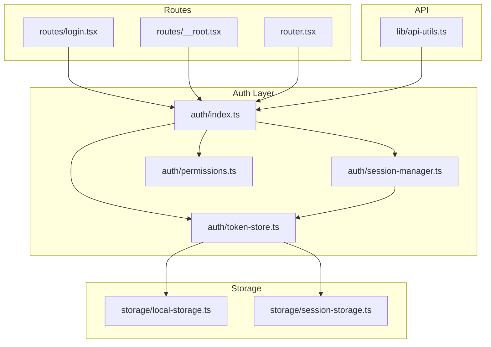
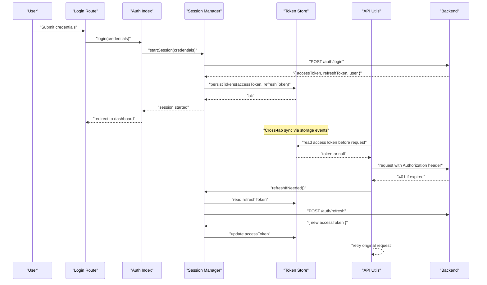
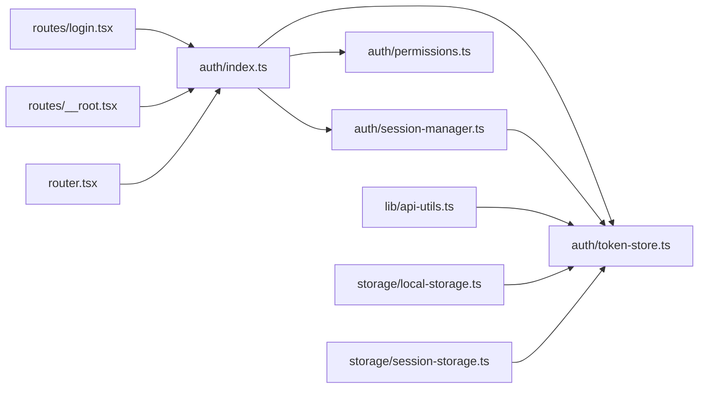

# Authentication State Management

<cite>
**Referenced Files in This Document**
- [src/lib/auth/index.ts](file://apps/web/src/lib/auth/index.ts)
- [src/lib/auth/session-manager.ts](file://apps/web/src/lib/auth/session-manager.ts)
- [src/lib/auth/token-store.ts](file://apps/web/src/lib/auth/token-store.ts)
- [src/lib/auth/permissions.ts](file://apps/web/src/lib/auth/permissions.ts)
- [src/routes/login.tsx](file://apps/web/src/routes/login.tsx)
- [src/routes/__root.tsx](file://apps/web/src/routes/__root.tsx)
- [src/router.tsx](file://apps/web/src/router.tsx)
- [src/lib/api-utils.ts](file://apps/web/src/lib/api-utils.ts)
- [src/lib/storage/local-storage.ts](file://apps/web/src/lib/storage/local-storage.ts)
- [src/lib/storage/session-storage.ts](file://apps/web/src/lib/storage/session-storage.ts)
- [scripts/auth-post-migrate.ts](file://apps/web/scripts/auth-post-migrate.ts)
</cite>

## Table of Contents

1. [Introduction](#introduction)
2. [Project Structure](#project-structure)
3. [Core Components](#core-components)
4. [Architecture Overview](#architecture-overview)
5. [Detailed Component Analysis](#detailed-component-analysis)
6. [Dependency Analysis](#dependency-analysis)
7. [Performance Considerations](#performance-considerations)
8. [Troubleshooting Guide](#troubleshooting-guide)
9. [Conclusion](#conclusion)
10. [Appendices](#appendices)

## Introduction

This document explains how Fleet Pi manages authentication state across the application. It covers user session handling, token storage strategies, and the authentication flow state. It also details how auth state is persisted across page reloads, synchronized across tabs, and maintained during offline periods. Role-based access control (RBAC) state, permission checking patterns, and dynamic UI rendering based on authentication status are documented. Finally, it describes logout flows, token refresh mechanisms, and security considerations for state persistence, with examples of protecting routes and components using authentication state.

## Project Structure

Authentication-related logic is primarily located under apps/web/src/lib/auth and integrates with storage utilities and route guards. Key files include:

- Session management and lifecycle
- Token storage abstraction
- Permission and role checks
- Login route and root layout integration
- API client integration for authenticated requests
- Storage helpers for local and session storage

**Diagram sources**

- [src/lib/auth/index.ts](file://apps/web/src/lib/auth/index.ts)
- [src/lib/auth/session-manager.ts](file://apps/web/src/lib/auth/session-manager.ts)
- [src/lib/auth/token-store.ts](file://apps/web/src/lib/auth/token-store.ts)
- [src/lib/auth/permissions.ts](file://apps/web/src/lib/auth/permissions.ts)
- [src/lib/storage/local-storage.ts](file://apps/web/src/lib/storage/local-storage.ts)
- [src/lib/storage/session-storage.ts](file://apps/web/src/lib/storage/session-storage.ts)
- [src/routes/login.tsx](file://apps/web/src/routes/login.tsx)
- [src/routes/__root.tsx](file://apps/web/src/routes/__root.tsx)
- [src/router.tsx](file://apps/web/src/router.tsx)
- [src/lib/api-utils.ts](file://apps/web/src/lib/api-utils.ts)

**Section sources**

- [src/lib/auth/index.ts](file://apps/web/src/lib/auth/index.ts)
- [src/lib/auth/session-manager.ts](file://apps/web/src/lib/auth/session-manager.ts)
- [src/lib/auth/token-store.ts](file://apps/web/src/lib/auth/token-store.ts)
- [src/lib/auth/permissions.ts](file://apps/web/src/lib/auth/permissions.ts)
- [src/routes/login.tsx](file://apps/web/src/routes/login.tsx)
- [src/routes/__root.tsx](file://apps/web/src/routes/__root.tsx)
- [src/router.tsx](file://apps/web/src/router.tsx)
- [src/lib/api-utils.ts](file://apps/web/src/lib/api-utils.ts)
- [src/lib/storage/local-storage.ts](file://apps/web/src/lib/storage/local-storage.ts)
- [src/lib/storage/session-storage.ts](file://apps/web/src/lib/storage/session-storage.ts)

## Core Components

- Auth index module: centralizes auth state, exposes hooks and actions for login/logout, token refresh, and permission checks.
- Session manager: orchestrates session lifecycle, handles online/offline transitions, and coordinates token refresh and invalidation.
- Token store: abstracts token persistence across localStorage and sessionStorage with secure defaults and migration support.
- Permissions: defines roles, permissions, and helper functions to evaluate access at runtime.
- Route integration: login route triggers authentication; root and router integrate guards and redirects based on auth state.
- API utils: attaches tokens to outgoing requests and handles 401/refresh flows.

Key responsibilities:

- Persisting and restoring auth state across reloads
- Synchronizing state across tabs via storage events
- Maintaining minimal state during offline periods
- Enforcing RBAC consistently across UI and API calls

**Section sources**

- [src/lib/auth/index.ts](file://apps/web/src/lib/auth/index.ts)
- [src/lib/auth/session-manager.ts](file://apps/web/src/lib/auth/session-manager.ts)
- [src/lib/auth/token-store.ts](file://apps/web/src/lib/auth/token-store.ts)
- [src/lib/auth/permissions.ts](file://apps/web/src/lib/auth/permissions.ts)
- [src/routes/login.tsx](file://apps/web/src/routes/login.tsx)
- [src/routes/__root.tsx](file://apps/web/src/routes/__root.tsx)
- [src/router.tsx](file://apps/web/src/router.tsx)
- [src/lib/api-utils.ts](file://apps/web/src/lib/api-utils.ts)

## Architecture Overview

The authentication architecture centers around a reactive auth state that persists tokens and session metadata. The session manager coordinates token refresh and invalidation, while the token store ensures durability and cross-tab synchronization. Routes and components consume auth state to render protected content and enforce RBAC.

**Diagram sources**

- [src/routes/login.tsx](file://apps/web/src/routes/login.tsx)
- [src/lib/auth/index.ts](file://apps/web/src/lib/auth/index.ts)
- [src/lib/auth/session-manager.ts](file://apps/web/src/lib/auth/session-manager.ts)
- [src/lib/auth/token-store.ts](file://apps/web/src/lib/auth/token-store.ts)
- [src/lib/api-utils.ts](file://apps/web/src/lib/api-utils.ts)

## Detailed Component Analysis

### Auth Index Module

Responsibilities:

- Exposes current auth state (user, roles, permissions)
- Provides login, logout, and refresh actions
- Subscribes to storage changes for cross-tab sync
- Integrates with session manager for lifecycle events

Patterns:

- Reactive state updates via subscribers/hooks
- Centralized error handling for auth failures
- Guarded operations that require an active session

Security considerations:

- Never expose sensitive tokens in logs
- Validate user roles before granting access

**Section sources**

- [src/lib/auth/index.ts](file://apps/web/src/lib/auth/index.ts)

### Session Manager

Responsibilities:

- Manages session lifecycle: creation, renewal, termination
- Handles online/offline transitions and queues critical actions when offline
- Coordinates token refresh and invalidation
- Emits events for UI updates and analytics

Offline behavior:

- Defers non-critical operations until reconnection
- Retries failed requests with exponential backoff
- Preserves minimal session state to resume after reconnect

Refresh mechanism:

- Proactively refreshes tokens before expiry
- Silently retries failed requests after refresh
- Clears session on persistent 401 responses

**Section sources**

- [src/lib/auth/session-manager.ts](file://apps/web/src/lib/auth/session-manager.ts)

### Token Store

Responsibilities:

- Persists access and refresh tokens securely
- Supports migration strategies for schema changes
- Emits storage events for cross-tab synchronization
- Provides atomic read/write operations

Storage strategy:

- Access token stored in memory with optional short-lived persistence
- Refresh token stored in secure storage with HttpOnly cookie fallback where available
- Migration scripts handle legacy keys and formats

Security considerations:

- Avoid storing secrets in plain text
- Use secure flags for cookies and storage where supported
- Sanitize inputs and validate token formats

**Section sources**

- [src/lib/auth/token-store.ts](file://apps/web/src/lib/auth/token-store.ts)
- [src/lib/storage/local-storage.ts](file://apps/web/src/lib/storage/local-storage.ts)
- [src/lib/storage/session-storage.ts](file://apps/web/src/lib/storage/session-storage.ts)
- [scripts/auth-post-migrate.ts](file://apps/web/scripts/auth-post-migrate.ts)

### Permissions and RBAC

Responsibilities:

- Defines roles and associated permissions
- Evaluates user permissions against required scopes
- Provides declarative guards for routes and components

Permission checking patterns:

- Route-level guards that block navigation without required roles
- Component-level guards that conditionally render UI elements
- API-level enforcement via middleware or server-side checks

RBAC state:

- Cached roles and permissions derived from user profile
- Updated on login and token refresh
- Re-evaluated when user data changes

**Section sources**

- [src/lib/auth/permissions.ts](file://apps/web/src/lib/auth/permissions.ts)

### Route Integration and Guards

Responsibilities:

- Protects routes by checking auth state and permissions
- Redirects unauthenticated users to login
- Renders loading states during auth initialization

Examples:

- Protected routes require valid session and specific roles
- Public routes allow guest access but may show limited features
- Dynamic UI renders admin-only sections based on roles

**Section sources**

- [src/routes/login.tsx](file://apps/web/src/routes/login.tsx)
- [src/routes/__root.tsx](file://apps/web/src/routes/__root.tsx)
- [src/router.tsx](file://apps/web/src/router.tsx)

### API Utilities and Token Attachment

Responsibilities:

- Attaches access tokens to outgoing requests
- Handles 401 responses by triggering refresh
- Retries failed requests after successful refresh
- Centralizes error handling and logging

Flow:

- Before each request, read token from store
- Attach Authorization header if present
- On 401, attempt refresh and retry once
- Clear session on repeated failures

**Section sources**

- [src/lib/api-utils.ts](file://apps/web/src/lib/api-utils.ts)
- [src/lib/auth/token-store.ts](file://apps/web/src/lib/auth/token-store.ts)

## Dependency Analysis

The authentication layer depends on storage abstractions and integrates with routing and API utilities. The following diagram shows key dependencies and interactions.

**Diagram sources**

- [src/lib/auth/index.ts](file://apps/web/src/lib/auth/index.ts)
- [src/lib/auth/session-manager.ts](file://apps/web/src/lib/auth/session-manager.ts)
- [src/lib/auth/token-store.ts](file://apps/web/src/lib/auth/token-store.ts)
- [src/lib/auth/permissions.ts](file://apps/web/src/lib/auth/permissions.ts)
- [src/lib/api-utils.ts](file://apps/web/src/lib/api-utils.ts)
- [src/routes/login.tsx](file://apps/web/src/routes/login.tsx)
- [src/routes/__root.tsx](file://apps/web/src/routes/__root.tsx)
- [src/router.tsx](file://apps/web/src/router.tsx)
- [src/lib/storage/local-storage.ts](file://apps/web/src/lib/storage/local-storage.ts)
- [src/lib/storage/session-storage.ts](file://apps/web/src/lib/storage/session-storage.ts)

**Section sources**

- [src/lib/auth/index.ts](file://apps/web/src/lib/auth/index.ts)
- [src/lib/auth/session-manager.ts](file://apps/web/src/lib/auth/session-manager.ts)
- [src/lib/auth/token-store.ts](file://apps/web/src/lib/auth/token-store.ts)
- [src/lib/auth/permissions.ts](file://apps/web/src/lib/auth/permissions.ts)
- [src/lib/api-utils.ts](file://apps/web/src/lib/api-utils.ts)
- [src/routes/login.tsx](file://apps/web/src/routes/login.tsx)
- [src/routes/__root.tsx](file://apps/web/src/routes/__root.tsx)
- [src/router.tsx](file://apps/web/src/router.tsx)
- [src/lib/storage/local-storage.ts](file://apps/web/src/lib/storage/local-storage.ts)
- [src/lib/storage/session-storage.ts](file://apps/web/src/lib/storage/session-storage.ts)

## Performance Considerations

- Minimize synchronous storage reads by caching tokens in memory where safe
- Debounce frequent storage writes to avoid blocking UI threads
- Batch permission checks to reduce redundant evaluations
- Use efficient event listeners for cross-tab synchronization
- Implement graceful degradation for offline mode to prevent unnecessary network calls

[No sources needed since this section provides general guidance]

## Troubleshooting Guide

Common issues and resolutions:

- Stale tokens causing repeated 401 errors: ensure refresh logic runs before retrying requests
- Cross-tab sync failures: verify storage event listeners are attached and not blocked by privacy settings
- Offline mode state loss: confirm session state is persisted minimally and restored on reconnect
- Permission mismatches: check role assignments and ensure permissions are recalculated after token refresh

Debugging tips:

- Log auth state transitions without exposing sensitive data
- Inspect storage contents for token presence and format
- Verify route guards redirect correctly for unauthenticated users
- Test refresh flow with mocked 401 responses

**Section sources**

- [src/lib/auth/session-manager.ts](file://apps/web/src/lib/auth/session-manager.ts)
- [src/lib/auth/token-store.ts](file://apps/web/src/lib/auth/token-store.ts)
- [src/lib/api-utils.ts](file://apps/web/src/lib/api-utils.ts)

## Conclusion

Fleet Pi’s authentication state management combines reactive state, robust session handling, and secure token storage to deliver a seamless user experience. By enforcing RBAC consistently and integrating with routing and API layers, the system ensures secure, synchronized, and resilient authentication across sessions, tabs, and offline periods. Following the patterns and security considerations outlined here will help maintain a consistent and secure auth implementation.

[No sources needed since this section summarizes without analyzing specific files]

## Appendices

### Example: Protecting Routes Based on Authentication State

- Define route guards that check for a valid session and required roles
- Redirect unauthenticated users to the login route
- Render protected content only when permissions are satisfied

Example:

- Protected route requires admin role
- Guest route allows public access but hides admin features

**Section sources**

- [src/routes/__root.tsx](file://apps/web/src/routes/__root.tsx)
- [src/router.tsx](file://apps/web/src/router.tsx)
- [src/lib/auth/permissions.ts](file://apps/web/src/lib/auth/permissions.ts)

### Example: Protecting Components Based on Authentication State

- Wrap components with a guard that checks user roles and permissions
- Conditionally render UI elements based on authorization
- Provide fallback UI for unauthorized users

Example:

- Admin-only settings panel rendered only for admins
- User profile section visible to authenticated users

**Section sources**

- [src/lib/auth/permissions.ts](file://apps/web/src/lib/auth/permissions.ts)

### Logout Flow

- Invalidate session and clear tokens from storage
- Redirect to login or home page
- Notify other tabs of logout via storage events

**Section sources**

- [src/lib/auth/session-manager.ts](file://apps/web/src/lib/auth/session-manager.ts)
- [src/lib/auth/token-store.ts](file://apps/web/src/lib/auth/token-store.ts)

### Token Refresh Mechanism

- Detect token expiry before making requests
- Attempt refresh using stored refresh token
- Retry original request after successful refresh
- Clear session on persistent refresh failures

**Section sources**

- [src/lib/api-utils.ts](file://apps/web/src/lib/api-utils.ts)
- [src/lib/auth/session-manager.ts](file://apps/web/src/lib/auth/session-manager.ts)

### Security Considerations for State Persistence

- Prefer HttpOnly cookies for refresh tokens when possible
- Avoid logging sensitive tokens or user data
- Validate and sanitize all inputs related to auth state
- Implement secure storage flags and domain restrictions for cookies

**Section sources**

- [src/lib/auth/token-store.ts](file://apps/web/src/lib/auth/token-store.ts)
- [src/lib/storage/local-storage.ts](file://apps/web/src/lib/storage/local-storage.ts)
- [src/lib/storage/session-storage.ts](file://apps/web/src/lib/storage/session-storage.ts)
