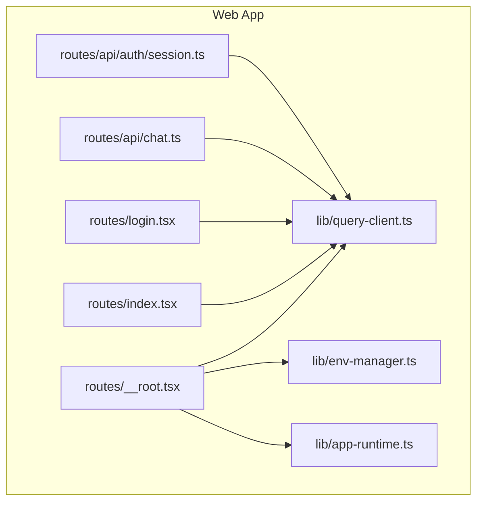
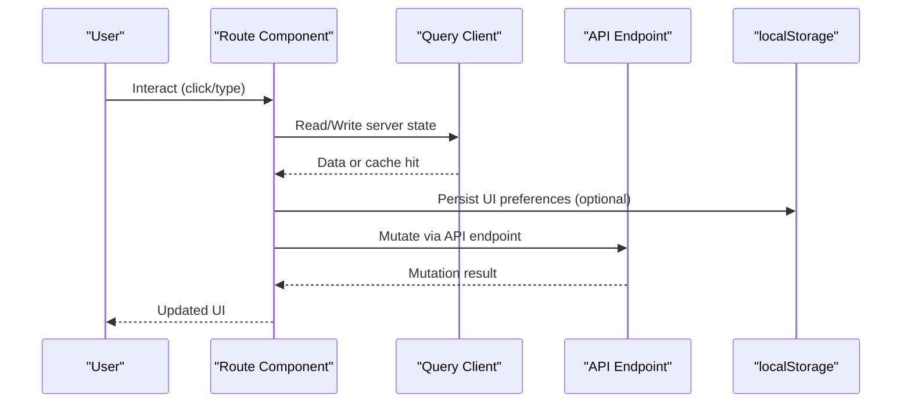
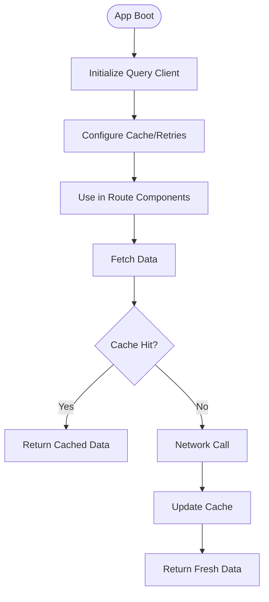
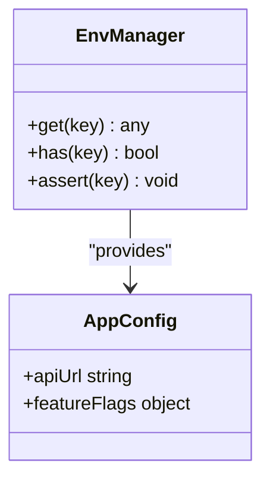
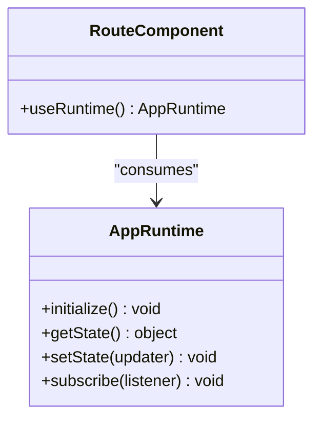
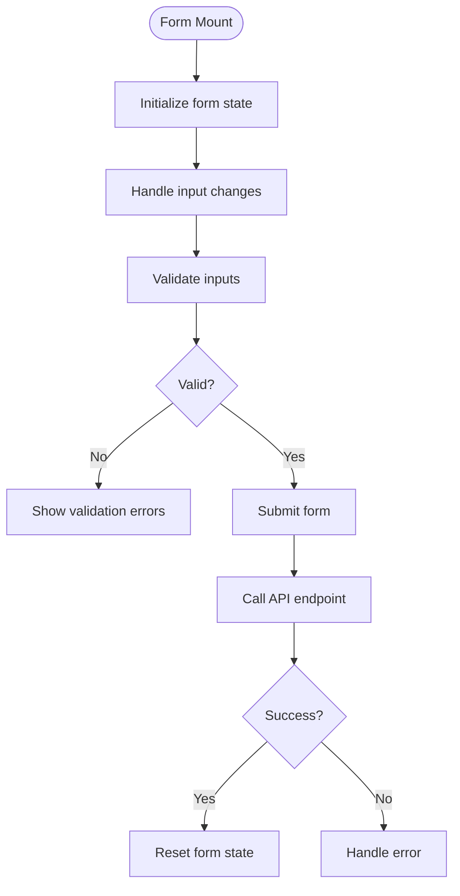
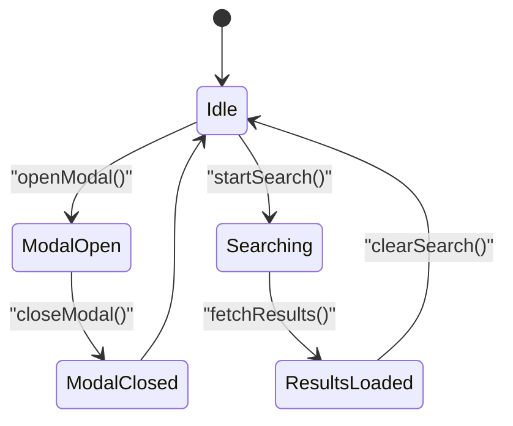
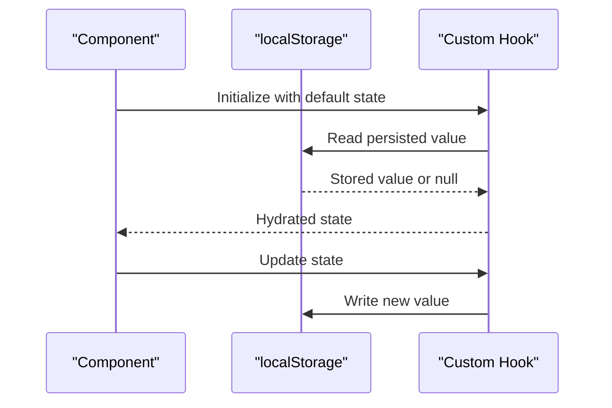
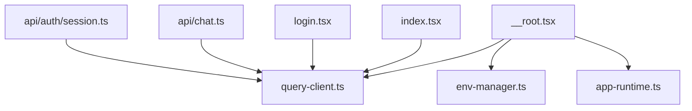

# Client State & Custom Hooks

<cite>
**Referenced Files in This Document**
- [query-client.ts](file://apps/web/src/lib/query-client.ts)
- [env-manager.ts](file://apps/web/src/lib/env-manager.ts)
- [app-runtime.ts](file://apps/web/src/lib/app-runtime.ts)
- [__root.tsx](file://apps/web/src/routes/__root.tsx)
- [index.tsx](file://apps/web/src/routes/index.tsx)
- [login.tsx](file://apps/web/src/routes/login.tsx)
- [chat.ts](file://apps/web/src/routes/api/chat.ts)
- [session.ts](file://apps/web/src/routes/api/auth/session.ts)
- [settings-dialog.e2e.ts](file://apps/web/e2e/settings-dialog.e2e.ts)
- [openui-state-sync.e2e.ts](file://apps/web/e2e/openui-state-sync.e2e.ts)
</cite>

## Table of Contents

1. [Introduction](#introduction)
2. [Project Structure](#project-structure)
3. [Core Components](#core-components)
4. [Architecture Overview](#architecture-overview)
5. [Detailed Component Analysis](#detailed-component-analysis)
6. [Dependency Analysis](#dependency-analysis)
7. [Performance Considerations](#performance-considerations)
8. [Troubleshooting Guide](#troubleshooting-guide)
9. [Conclusion](#conclusion)
10. [Appendices](#appendices)

## Introduction

This document explains client-side state management patterns in Fleet Pi’s web application, focusing on React hooks usage, local state organization, custom hook creation, and component-level state synchronization. It also covers form state handling, UI state patterns (modals, search filters, pagination), persistence strategies with localStorage, hydration on page load, and performance optimization techniques such as useMemo, useCallback, and selective re-renders. The guidance is grounded in the actual codebase structure and runtime configuration present in the repository.

## Project Structure

The web application resides under apps/web. Key areas relevant to client state include:

- lib: Shared utilities and configuration for API clients, environment, app runtime, and storage abstractions.
- routes: TanStack Router-based route definitions and API endpoints.
- e2e: End-to-end tests that exercise UI state behaviors like settings dialogs and OpenUI state sync.

**Diagram sources**

- [__root.tsx](file://apps/web/src/routes/__root.tsx)
- [index.tsx](file://apps/web/src/routes/index.tsx)
- [login.tsx](file://apps/web/src/routes/login.tsx)
- [query-client.ts](file://apps/web/src/lib/query-client.ts)
- [env-manager.ts](file://apps/web/src/lib/env-manager.ts)
- [app-runtime.ts](file://apps/web/src/lib/app-runtime.ts)
- [chat.ts](file://apps/web/src/routes/api/chat.ts)
- [session.ts](file://apps/web/src/routes/api/auth/session.ts)

**Section sources**

- [__root.tsx](file://apps/web/src/routes/__root.tsx)
- [index.tsx](file://apps/web/src/routes/index.tsx)
- [login.tsx](file://apps/web/src/routes/login.tsx)
- [query-client.ts](file://apps/web/src/lib/query-client.ts)
- [env-manager.ts](file://apps/web/src/lib/env-manager.ts)
- [app-runtime.ts](file://apps/web/src/lib/app-runtime.ts)
- [chat.ts](file://apps/web/src/routes/api/chat.ts)
- [session.ts](file://apps/web/src/routes/api/auth/session.ts)

## Core Components

- Query client initialization and configuration are centralized in a dedicated module used across routes and API handlers. This provides consistent caching, retries, and error handling for server state.
- Environment management abstracts runtime configuration, enabling safe access to feature flags and service URLs without leaking secrets into components.
- App runtime encapsulates global application context and lifecycle concerns, which can be leveraged by components to coordinate cross-cutting state.

These modules collectively establish the foundation for predictable client state behavior and integration points for both server and local state.

**Section sources**

- [query-client.ts](file://apps/web/src/lib/query-client.ts)
- [env-manager.ts](file://apps/web/src/lib/env-manager.ts)
- [app-runtime.ts](file://apps/web/src/lib/app-runtime.ts)

## Architecture Overview

Fleet Pi’s client architecture separates server state from local UI state:

- Server state is managed via a query client configured at startup and consumed by routes and API endpoints.
- Local UI state lives within components using React hooks, with optional persistence through localStorage.
- Routes orchestrate data fetching and UI composition, while API routes handle mutations and side effects.

[No diagram sources needed since this diagram shows conceptual workflow, not actual code structure]

## Detailed Component Analysis

### Query Client Integration

The query client is initialized once and reused throughout the app. Routes import and configure it to manage server state caching, background refetching, and error boundaries. This ensures consistent data fetching patterns and reduces duplication.

**Section sources**

- [query-client.ts](file://apps/web/src/lib/query-client.ts)
- [__root.tsx](file://apps/web/src/routes/__root.tsx)
- [index.tsx](file://apps/web/src/routes/index.tsx)
- [login.tsx](file://apps/web/src/routes/login.tsx)
- [chat.ts](file://apps/web/src/routes/api/chat.ts)
- [session.ts](file://apps/web/src/routes/api/auth/session.ts)

### Environment Management

Environment variables are accessed through a manager that validates presence and exposes typed values. This prevents runtime errors due to missing configuration and centralizes feature toggles.

**Section sources**

- [env-manager.ts](file://apps/web/src/lib/env-manager.ts)

### App Runtime Context

The app runtime module encapsulates global state and lifecycle methods. Components can consume runtime context to coordinate actions like authentication checks, feature flags, and global notifications.

**Section sources**

- [app-runtime.ts](file://apps/web/src/lib/app-runtime.ts)

### Form State Handling

Form state is typically managed locally with useState and updated incrementally. Validation logic should be colocated near input handlers to minimize complexity. For complex forms, consider deriving computed fields with useMemo to avoid unnecessary recalculations.

[No sources needed since this section doesn't analyze specific files]

### UI State Patterns

Common UI state patterns include modals, search filters, and pagination. These are best implemented as local state within the owning component, lifted only when shared across siblings. Memoization with useMemo and useCallback helps prevent unnecessary re-renders.

[No sources needed since this diagram shows conceptual workflow, not actual code structure]

### Persistence and Hydration

For persisting UI preferences, use localStorage with a thin abstraction that handles serialization and fallbacks. On page load, hydrate local state from stored values to ensure a seamless user experience.

[No sources needed since this diagram shows conceptual workflow, not actual code structure]

### Reusable Hooks Examples

- Modal management: A hook that tracks visibility and manages keyboard events for accessibility.
- Search filters: A hook that maintains filter state, debounces input, and returns filtered results.
- Pagination: A hook that manages current page, page size, and total count, exposing navigation helpers.

These hooks encapsulate common patterns, reducing duplication and improving testability.

[No sources needed since this section doesn't analyze specific files]

## Dependency Analysis

The following diagram illustrates how routes depend on shared libraries for state management and configuration.

**Diagram sources**

- [__root.tsx](file://apps/web/src/routes/__root.tsx)
- [index.tsx](file://apps/web/src/routes/index.tsx)
- [login.tsx](file://apps/web/src/routes/login.tsx)
- [query-client.ts](file://apps/web/src/lib/query-client.ts)
- [env-manager.ts](file://apps/web/src/lib/env-manager.ts)
- [app-runtime.ts](file://apps/web/src/lib/app-runtime.ts)
- [chat.ts](file://apps/web/src/routes/api/chat.ts)
- [session.ts](file://apps/web/src/routes/api/auth/session.ts)

**Section sources**

- [__root.tsx](file://apps/web/src/routes/__root.tsx)
- [index.tsx](file://apps/web/src/routes/index.tsx)
- [login.tsx](file://apps/web/src/routes/login.tsx)
- [query-client.ts](file://apps/web/src/lib/query-client.ts)
- [env-manager.ts](file://apps/web/src/lib/env-manager.ts)
- [app-runtime.ts](file://apps/web/src/lib/app-runtime.ts)
- [chat.ts](file://apps/web/src/routes/api/chat.ts)
- [session.ts](file://apps/web/src/routes/api/auth/session.ts)

## Performance Considerations

- Prefer useMemo for expensive computations derived from props or state.
- Use useCallback for stable function references passed to child components to avoid unnecessary re-renders.
- Keep local state minimal and co-located; lift state only when necessary for sharing.
- Debounce heavy operations like search input to reduce render frequency.
- Leverage React.memo for pure components that receive stable props.

[No sources needed since this section provides general guidance]

## Troubleshooting Guide

- If server state appears stale, verify query client configuration and cache invalidation strategies.
- For hydration issues, check localStorage availability and error handling around read/write operations.
- When forms behave unexpectedly, ensure validation logic runs synchronously with state updates.
- End-to-end tests can help validate UI state flows, such as settings dialog interactions and OpenUI state synchronization.

**Section sources**

- [settings-dialog.e2e.ts](file://apps/web/e2e/settings-dialog.e2e.ts)
- [openui-state-sync.e2e.ts](file://apps/web/e2e/openui-state-sync.e2e.ts)

## Conclusion

Fleet Pi’s client state management combines robust server state handling with well-structured local UI state. By centralizing configuration, leveraging reusable hooks, and applying performance optimizations, the application achieves predictable behavior and maintainable code. Adhering to these patterns ensures scalability and a smooth user experience.

## Appendices

- Best practices for naming custom hooks and organizing state logic.
- Guidelines for testing components with local state using mocking utilities.
- References to React documentation on hooks and performance optimization.

[No sources needed since this section provides general guidance]
