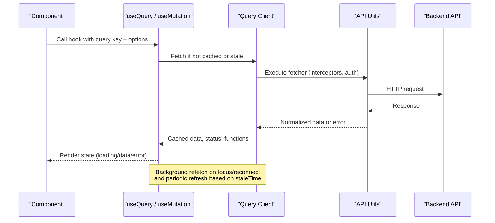
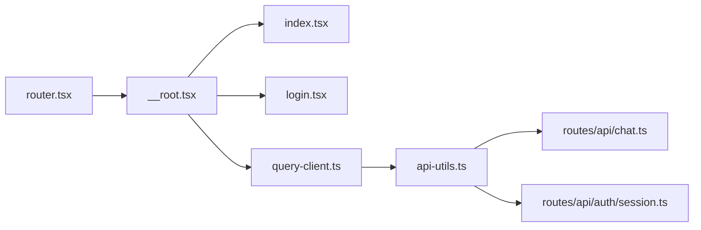

# React Query Server State

<cite>
**Referenced Files in This Document**
- [query-client.ts](file://apps/web/src/lib/query-client.ts)
- [api-utils.ts](file://apps/web/src/lib/api-utils.ts)
- [router.tsx](file://apps/web/src/router.tsx)
- [__root.tsx](file://apps/web/src/routes/__root.tsx)
- [index.tsx](file://apps/web/src/routes/index.tsx)
- [login.tsx](file://apps/web/src/routes/login.tsx)
- [chat.ts](file://apps/web/src/routes/api/chat.ts)
- [session.ts](file://apps/web/src/routes/api/auth/session.ts)
- [package.json](file://apps/web/package.json)
</cite>

## Table of Contents

1. [Introduction](#introduction)
2. [Project Structure](#project-structure)
3. [Core Components](#core-components)
4. [Architecture Overview](#architecture-overview)
5. [Detailed Component Analysis](#detailed-component-analysis)
6. [Dependency Analysis](#dependency-analysis)
7. [Performance Considerations](#performance-considerations)
8. [Troubleshooting Guide](#troubleshooting-guide)
9. [Conclusion](#conclusion)
10. [Appendices](#appendices)

## Introduction

This document explains how Fleet Pi uses React Query to manage server state across the web application. It covers the query client configuration, cache policies, data fetching patterns, mutations, error handling, retries, optimistic updates, and integration with authentication and request/response interceptors. The goal is to help developers understand where and how server state is fetched, cached, updated, and synchronized with the UI.

## Project Structure

Fleet Pi’s React Query setup lives primarily under apps/web/src/lib and is wired into the app via the router and root route. API endpoints are defined under apps/web/src/routes/api, while components consume queries and mutations through custom hooks and direct calls.

```mermaid
graph TB
subgraph "Web App"
Router["Router (router.tsx)"]
Root["Root Route (__root.tsx)"]
Index["Index Route (index.tsx)"]
Login["Login Route (login.tsx)"]
end
subgraph "Server State Layer"
QC["Query Client (query-client.ts)"]
APIUtils["API Utils (api-utils.ts)"]
end
subgraph "Backend APIs"
ChatAPI["Chat API (routes/api/chat.ts)"]
SessionAPI["Auth Session API (routes/api/auth/session.ts)")
end
Router --> Root
Root --> Index
Root --> Login
Root --> QC
QC --> APIUtils
APIUtils --> ChatAPI
APIUtils --> SessionAPI
```

**Diagram sources**

- [router.tsx](file://apps/web/src/router.tsx)
- [__root.tsx](file://apps/web/src/routes/__root.tsx)
- [index.tsx](file://apps/web/src/routes/index.tsx)
- [login.tsx](file://apps/web/src/routes/login.tsx)
- [query-client.ts](file://apps/web/src/lib/query-client.ts)
- [api-utils.ts](file://apps/web/src/lib/api-utils.ts)
- [chat.ts](file://apps/web/src/routes/api/chat.ts)
- [session.ts](file://apps/web/src/routes/api/auth/session.ts)

**Section sources**

- [router.tsx](file://apps/web/src/router.tsx)
- [__root.tsx](file://apps/web/src/routes/__root.tsx)
- [index.tsx](file://apps/web/src/routes/index.tsx)
- [login.tsx](file://apps/web/src/routes/login.tsx)
- [query-client.ts](file://apps/web/src/lib/query-client.ts)
- [api-utils.ts](file://apps/web/src/lib/api-utils.ts)

## Core Components

- Query Client: Central configuration for caching, retries, background refetching, and network behavior.
- API Utilities: Shared HTTP layer that may include interceptors, token injection, and response normalization.
- Routes: Consume queries/mutations via custom hooks or direct calls, presenting loading and error states to users.
- Backend APIs: Endpoints exposed by the web app’s server routes.

Key responsibilities:

- Configure default options such as staleTime, gcTime, retry, and network mode.
- Provide a consistent fetcher function used by useQuery/useMutation.
- Normalize errors and responses for uniform handling in components.

**Section sources**

- [query-client.ts](file://apps/web/src/lib/query-client.ts)
- [api-utils.ts](file://apps/web/src/lib/api-utils.ts)

## Architecture Overview

React Query manages server state independently from UI state. The query client is instantiated once and provided to the app. Components call hooks to fetch data; React Query handles caching, deduplication, background refetching, and synchronization. Mutations update server state and can invalidate related queries to keep caches consistent.



**Diagram sources**

- [query-client.ts](file://apps/web/src/lib/query-client.ts)
- [api-utils.ts](file://apps/web/src/lib/api-utils.ts)
- [chat.ts](file://apps/web/src/routes/api/chat.ts)
- [session.ts](file://apps/web/src/routes/api/auth/session.ts)

## Detailed Component Analysis

### Query Client Configuration

The query client defines global defaults for caching and network behavior. Typical settings include:

- staleTime: How long data is considered fresh before background refetch.
- gcTime (or cacheTime): How long unused cache entries remain in memory.
- retry: Number of retry attempts for failed requests.
- networkMode: Whether to refetch on reconnect or focus.
- Default fetcher: A wrapper around the HTTP client that injects headers, normalizes responses, and maps errors.

Best practices:

- Set sensible defaults for read-heavy endpoints (higher staleTime).
- Use mutation callbacks to invalidate dependent queries after writes.
- Keep gcTime reasonable to avoid memory growth.

**Section sources**

- [query-client.ts](file://apps/web/src/lib/query-client.ts)

### API Utilities and Interceptors

The API utilities layer centralizes HTTP concerns:

- Request interceptors: Attach authentication tokens, set content types, and add tracing IDs.
- Response interceptors: Normalize payloads, handle common error codes, and transform dates/IDs.
- Error mapping: Convert backend errors into consistent shapes for React Query to consume.

When integrating with authentication:

- Ensure tokens are refreshed before requests when needed.
- Handle 401/403 by redirecting to login or prompting re-authentication.

**Section sources**

- [api-utils.ts](file://apps/web/src/lib/api-utils.ts)

### Data Fetching Patterns with Queries

Common patterns:

- Simple list queries: useQuery with a stable key and optional pagination filters.
- Detail queries: useQuery keyed by an ID, with suspense or manual loading states.
- Dependent queries: fetch only when a prerequisite value exists.
- Infinite queries: paginate large datasets efficiently.

Caching strategies:

- Use staleTime to reduce network calls for frequently accessed data.
- Invalidate specific keys after mutations to ensure freshness.
- Prefetch critical data on navigation or hover to improve UX.

Error handling:

- Display user-friendly messages using error properties from the query result.
- Implement retry at the query level for transient failures.

**Section sources**

- [query-client.ts](file://apps/web/src/lib/query-client.ts)
- [api-utils.ts](file://apps/web/src/lib/api-utils.ts)

### Mutations and Cache Invalidation

Mutations perform writes and should:

- Update local cache optimistically when possible.
- Invalidate or refetch affected queries to keep UI in sync.
- Provide rollback logic for failed optimistic updates.

Typical flow:

- Trigger mutation from UI.
- Optimistically update cache with pending state.
- On success, finalize cache and clear pending flags.
- On error, revert optimistic changes and show error.

**Section sources**

- [query-client.ts](file://apps/web/src/lib/query-client.ts)
- [api-utils.ts](file://apps/web/src/lib/api-utils.ts)

### Authentication Integration

Authentication flows typically involve:

- Fetching session info via a dedicated endpoint.
- Attaching tokens to subsequent requests via interceptors.
- Redirecting unauthenticated users to login.
- Refreshing tokens silently when expired.

Example interactions:

- useQuery for session/status checks.
- useMutation for login/logout actions.
- Global guards in the router to protect routes.

**Section sources**

- [session.ts](file://apps/web/src/routes/api/auth/session.ts)
- [login.tsx](file://apps/web/src/routes/login.tsx)
- [api-utils.ts](file://apps/web/src/lib/api-utils.ts)

### Route-Level Usage Examples

- Root route sets up providers and global error boundaries.
- Index route demonstrates basic queries for dashboard data.
- Login route shows mutation-driven authentication and redirects.

These routes illustrate how to wire React Query into the app lifecycle and present loading/error states consistently.

**Section sources**

- [__root.tsx](file://apps/web/src/routes/__root.tsx)
- [index.tsx](file://apps/web/src/routes/index.tsx)
- [login.tsx](file://apps/web/src/routes/login.tsx)

### Backend API Endpoints

- Chat API: Handles chat-related operations like listing sessions, creating runs, and retrieving results.
- Auth Session API: Manages session retrieval and validation.

These endpoints are consumed by API utilities and exposed to React Query hooks.

**Section sources**

- [chat.ts](file://apps/web/src/routes/api/chat.ts)
- [session.ts](file://apps/web/src/routes/api/auth/session.ts)

## Dependency Analysis

React Query depends on the HTTP layer and the app’s routing/providers setup. The following diagram shows the runtime dependencies between modules.



**Diagram sources**

- [router.tsx](file://apps/web/src/router.tsx)
- [__root.tsx](file://apps/web/src/routes/__root.tsx)
- [index.tsx](file://apps/web/src/routes/index.tsx)
- [login.tsx](file://apps/web/src/routes/login.tsx)
- [query-client.ts](file://apps/web/src/lib/query-client.ts)
- [api-utils.ts](file://apps/web/src/lib/api-utils.ts)
- [chat.ts](file://apps/web/src/routes/api/chat.ts)
- [session.ts](file://apps/web/src/routes/api/auth/session.ts)

**Section sources**

- [package.json](file://apps/web/package.json)

## Performance Considerations

- Tune staleTime per query type: longer for static data, shorter for live dashboards.
- Use gcTime to prevent memory leaks from unused caches.
- Prefer infinite queries for paginated lists to avoid excessive cache entries.
- Leverage background refetch on window focus and reconnect to keep data fresh without blocking UI.
- Avoid unnecessary re-renders by memoizing query keys and selectors.

[No sources needed since this section provides general guidance]

## Troubleshooting Guide

Common issues and resolutions:

- Stale data persists after mutation: Ensure you invalidate or refetch the relevant query keys post-mutation.
- Excessive retries causing timeouts: Adjust retry count and backoff strategy in query defaults.
- Authentication failures: Verify token attachment in request interceptors and handle 401/403 gracefully.
- Memory growth: Review gcTime settings and prune unused caches.
- Network flakiness: Enable networkMode options to refetch on reconnect/focus.

**Section sources**

- [query-client.ts](file://apps/web/src/lib/query-client.ts)
- [api-utils.ts](file://apps/web/src/lib/api-utils.ts)

## Conclusion

Fleet Pi’s React Query implementation centralizes server state management through a well-configured query client and a robust API utilities layer. By applying consistent caching policies, error handling, and mutation strategies, the application achieves predictable performance and a smooth user experience. Following the patterns outlined here will help maintain consistency and scalability as new features are added.

[No sources needed since this section summarizes without analyzing specific files]

## Appendices

### Creating Custom Hooks for API Calls

- Encapsulate useQuery calls with stable keys and options.
- Include loading, error, and data fields in the hook return.
- For mutations, expose trigger functions and handle invalidations internally.

**Section sources**

- [query-client.ts](file://apps/web/src/lib/query-client.ts)
- [api-utils.ts](file://apps/web/src/lib/api-utils.ts)

### Handling Loading States

- Use isLoading/isFetching to differentiate initial load from background updates.
- Show skeletons or spinners during loading phases.
- Avoid blocking navigation; prefer non-blocking background updates.

**Section sources**

- [index.tsx](file://apps/web/src/routes/index.tsx)
- [login.tsx](file://apps/web/src/routes/login.tsx)

### Managing Complex Data Relationships

- Use normalized keys to relate entities (e.g., userId -> userPosts).
- Invalidate parent keys to cascade updates to children.
- Prefetch related resources on demand to improve perceived performance.

**Section sources**

- [query-client.ts](file://apps/web/src/lib/query-client.ts)
- [api-utils.ts](file://apps/web/src/lib/api-utils.ts)

### Integrating with Authentication

- Store tokens securely and attach them via interceptors.
- Refresh tokens transparently before requests.
- Guard routes and redirect to login when unauthorized.

**Section sources**

- [session.ts](file://apps/web/src/routes/api/auth/session.ts)
- [login.tsx](file://apps/web/src/routes/login.tsx)
- [api-utils.ts](file://apps/web/src/lib/api-utils.ts)

### Request Interceptors and Response Transformations

- Inject headers (Authorization, Content-Type) globally.
- Normalize response shapes to a consistent format.
- Map backend errors to user-friendly messages.

**Section sources**

- [api-utils.ts](file://apps/web/src/lib/api-utils.ts)
