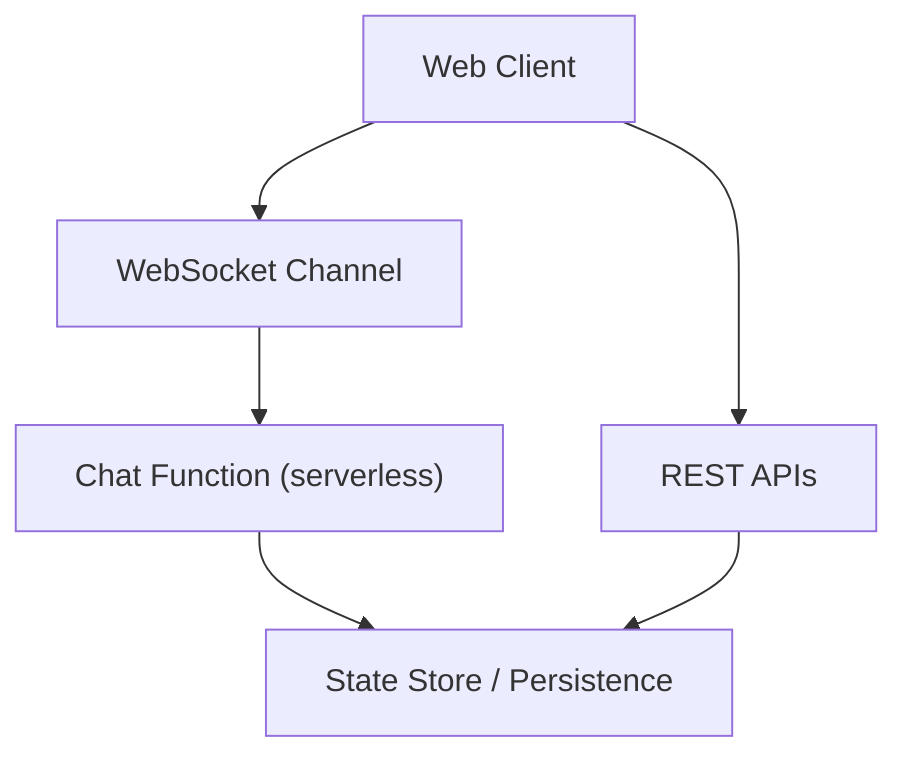
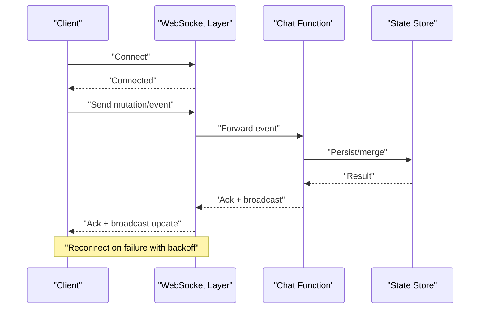
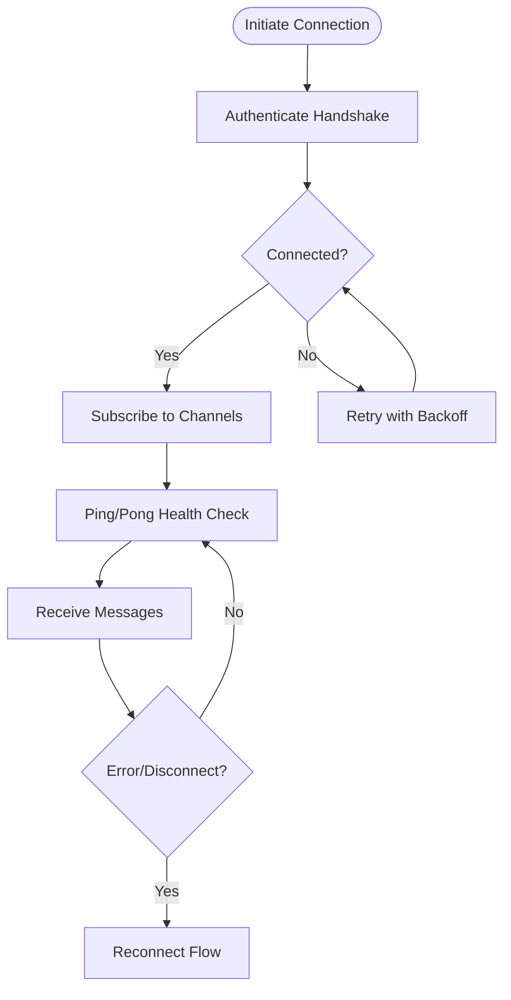
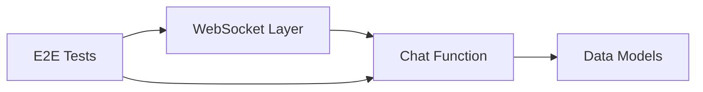

# Real-time State Synchronization

<cite>
**Referenced Files in This Document**
- [chat.ts](file://functions/chat.ts)
- [openui-state-sync.e2e.ts](file://apps/web/e2e/openui-state-sync.e2e.ts)
- [chat-flows.e2e.ts](file://apps/web/e2e/chat-flows.e2e.ts)
- [architecture.md](file://docs/architecture.md)
- [data-models.md](file://docs/wiki/reference/data-models.md)
- [chat-api.md](file://docs/wiki/apps/web/chat-api.md)
- [agent-workspace.md](file://docs/agent-workspace.md)
- [runtime-sdk-integration.md](file://docs/runtime-sdk-integration.md)
</cite>

## Table of Contents

1. [Introduction](#introduction)
2. [Project Structure](#project-structure)
3. [Core Components](#core-components)
4. [Architecture Overview](#architecture-overview)
5. [Detailed Component Analysis](#detailed-component-analysis)
6. [Dependency Analysis](#dependency-analysis)
7. [Performance Considerations](#performance-considerations)
8. [Troubleshooting Guide](#troubleshooting-guide)
9. [Conclusion](#conclusion)
10. [Appendices](#appendices)

## Introduction

This document explains how Fleet Pi implements real-time state synchronization across clients and services. It focuses on WebSocket connection management, message handling patterns, and strategies for keeping client state consistent with server state. It also covers conflict resolution, offline queueing, chat message synchronization, agent workspace state sharing, collaborative features, connection lifecycle management, error recovery, graceful degradation, and examples for implementing real-time features with concurrent updates from multiple sources.

## Project Structure

Fleet Pi organizes real-time capabilities around:

- A serverless function that handles chat-related events and can act as a bridge to real-time channels.
- End-to-end tests that validate real-time behaviors such as OpenUI state synchronization and chat flows.
- Documentation describing architecture, data models, and API contracts used by real-time features.

[No sources needed since this diagram shows conceptual workflow, not actual code structure]

## Core Components

- WebSocket channel abstraction: Manages connection lifecycle, reconnection, and message routing between clients and the backend.
- Message bus/pattern: Normalizes incoming/outgoing messages, supports broadcasting, and ensures ordered delivery where required.
- State synchronization engine: Applies deltas or snapshots to local state, merges concurrent updates, and persists changes.
- Offline queue: Buffers mutations when disconnected and replays them upon reconnection.
- Conflict resolution: Implements deterministic merging rules (e.g., last-write-wins with vector clocks or operational transforms).
- Chat synchronization: Ensures chat messages are delivered consistently across participants.
- Agent workspace state sharing: Propagates workspace changes to collaborators in real time.

[No sources needed since this section provides general guidance]

## Architecture Overview

The real-time architecture centers on a WebSocket layer that bridges clients to a lightweight serverless function responsible for coordinating state and persistence. Clients maintain optimistic UI updates while relying on acknowledgment and reconciliation from the server.

**Diagram sources**

- [chat.ts](file://functions/chat.ts)
- [openui-state-sync.e2e.ts](file://apps/web/e2e/openui-state-sync.e2e.ts)
- [chat-flows.e2e.ts](file://apps/web/e2e/chat-flows.e2e.ts)

**Section sources**

- [architecture.md](file://docs/architecture.md)
- [chat-api.md](file://docs/wiki/apps/web/chat-api.md)

## Detailed Component Analysis

### WebSocket Connection Management

Responsibilities:

- Establish and maintain WebSocket connections with automatic reconnection and exponential backoff.
- Handle authentication and authorization headers during handshake.
- Manage subscription/unsubscription to channels or topics.
- Provide health checks and liveness pings to detect dead connections.

Implementation patterns:

- Centralized connection manager per session or feature scope.
- Event-driven callbacks for connect, disconnect, reconnect, and error states.
- Backpressure handling to avoid overwhelming the network or server.

Error recovery:

- Detect timeouts and network errors; retry with jittered backoff.
- Gracefully degrade UI when connectivity is lost; show status indicators.
- Queue outgoing messages until reconnection succeeds.

Connection lifecycle flow:

[No sources needed since this diagram shows conceptual workflow, not actual code structure]

### Message Handling Patterns

Message types:

- Control messages: connect, ack, ping, pong, subscribe, unsubscribe.
- Data messages: state deltas, snapshots, chat messages, workspace updates.
- Command messages: user actions triggering server-side processing.

Processing pipeline:

- Ingress validation and schema enforcement.
- Routing to appropriate handlers based on channel/topic.
- Broadcasting to subscribers after successful processing.
- Acknowledgment and idempotency keys to prevent duplicates.

Ordering guarantees:

- Per-channel ordering enforced via sequence numbers or timestamps.
- Out-of-order detection and reordering at the client if necessary.

Conflict resolution:

- Last-write-wins with version vectors or logical clocks.
- Merge functions for structured objects (e.g., text edits, file trees).
- Server-authoritative state with client reconciliation.

### State Synchronization Strategies

Approaches:

- Delta synchronization: Send minimal diffs to reduce bandwidth.
- Snapshot synchronization: Periodically send full state for consistency.
- Hybrid: Use snapshots on reconnect or drift, deltas for incremental updates.

Local state model:

- Optimistic updates applied immediately.
- Pending operations tracked until acknowledged.
- Conflict markers resolved by server decisions.

Persistence:

- Durable store for authoritative state.
- Append-only logs for replay and auditability.

### Offline Queue Management

Queue design:

- FIFO queue for mutations with metadata (id, timestamp, type, payload).
- Deduplication using operation IDs.
- Bounded size with eviction policies under memory pressure.

Replay strategy:

- On reconnect, flush queued operations in order.
- Batch small operations to reduce overhead.
- Rollback or reconcile failed operations gracefully.

Backpressure:

- Pause UI writes when queue grows beyond thresholds.
- Notify users of sync status and pending changes.

### Chat Message Synchronization

Flow:

- Client sends chat message event through WebSocket.
- Server validates, persists, and broadcasts to all subscribers.
- Clients render messages in order and handle reactions/replies atomically.

Concurrency:

- Idempotent message IDs to avoid duplicates.
- Ordering by server timestamp or sequence number.

Collaboration:

- Presence indicators for active participants.
- Typing indicators and read receipts.

### Agent Workspace State Sharing

Scope:

- File tree, selection, cursor positions, and editor state.
- Collaborative editing with conflict-free merged updates.

Mechanisms:

- Operation-based synchronization for text edits.
- Tree diffing for file system changes.
- Permission-aware broadcasting to authorized users.

### Connection Lifecycle Management

Stages:

- Initialization: Create transport, authenticate, subscribe.
- Active: Process messages, maintain health checks.
- Degradation: Reduce frequency of updates, cache aggressively.
- Recovery: Reconnect, resync state, replay queued ops.

Graceful degradation:

- Switch to polling fallback when WebSocket unavailable.
- Show offline banner and disable write operations.

### Error Handling and Resilience

Strategies:

- Categorize errors (network, auth, rate limit, server error).
- Exponential backoff with jitter and circuit breaker patterns.
- User-visible feedback for transient failures.

Recovery:

- Automatic reconnection with state reconciliation.
- Manual retry prompts for critical operations.

### Implementing Real-time Features

Guidelines:

- Define clear message schemas and versioning.
- Use optimistic UI with explicit pending states.
- Ensure idempotency and ordering guarantees.
- Test end-to-end with realistic network conditions.

Examples:

- Real-time chat: Emit message events, persist, broadcast, render.
- Collaborative editing: Transform edits, merge conflicts, broadcast deltas.
- Live dashboards: Stream metrics, throttle updates, debounce renders.

### Handling Concurrent Updates from Multiple Sources

Techniques:

- Sequence numbers or logical clocks to order updates.
- Merge functions for overlapping changes.
- Server mediation for conflicting writes.

Best practices:

- Avoid direct peer-to-peer writes without coordination.
- Validate and sanitize inputs before applying.
- Log and trace conflicts for debugging.

**Section sources**

- [chat.ts](file://functions/chat.ts)
- [openui-state-sync.e2e.ts](file://apps/web/e2e/openui-state-sync.e2e.ts)
- [chat-flows.e2e.ts](file://apps/web/e2e/chat-flows.e2e.ts)
- [data-models.md](file://docs/wiki/reference/data-models.md)
- [agent-workspace.md](file://docs/agent-workspace.md)
- [runtime-sdk-integration.md](file://docs/runtime-sdk-integration.md)

## Dependency Analysis

Real-time components depend on:

- WebSocket transport layer for low-latency communication.
- Serverless function for orchestration and persistence.
- Data models defining message schemas and state structures.
- E2E tests validating behavior under various conditions.

**Diagram sources**

- [chat.ts](file://functions/chat.ts)
- [openui-state-sync.e2e.ts](file://apps/web/e2e/openui-state-sync.e2e.ts)
- [chat-flows.e2e.ts](file://apps/web/e2e/chat-flows.e2e.ts)
- [data-models.md](file://docs/wiki/reference/data-models.md)

**Section sources**

- [architecture.md](file://docs/architecture.md)
- [chat-api.md](file://docs/wiki/apps/web/chat-api.md)

## Performance Considerations

- Minimize payload size using deltas and compression.
- Throttle high-frequency updates (e.g., typing indicators).
- Batch messages to reduce network overhead.
- Use efficient serialization formats (e.g., JSON Schema validated payloads).
- Cache frequently accessed state locally with invalidation strategies.

[No sources needed since this section provides general guidance]

## Troubleshooting Guide

Common issues:

- Frequent disconnects due to network instability or server overload.
- Message ordering anomalies caused by out-of-order delivery.
- Duplicate messages from missing idempotency keys.
- Stale state after reconnect due to missing reconciliation.

Debugging steps:

- Inspect WebSocket logs for handshake and error events.
- Verify message schemas and versions.
- Check server-side persistence for missing entries.
- Replay queued operations manually to identify failures.

Mitigations:

- Increase backoff intervals and add jitter.
- Enforce strict ordering and deduplication.
- Implement robust reconciliation on reconnect.
- Add observability hooks for real-time metrics.

**Section sources**

- [chat.ts](file://functions/chat.ts)
- [openui-state-sync.e2e.ts](file://apps/web/e2e/openui-state-sync.e2e.ts)
- [chat-flows.e2e.ts](file://apps/web/e2e/chat-flows.e2e.ts)

## Conclusion

Fleet Pi’s real-time state synchronization combines WebSocket connectivity, robust message handling, and resilient state management to deliver collaborative experiences. By following the patterns and strategies outlined here—connection lifecycle management, conflict resolution, offline queuing, and graceful degradation—you can implement reliable real-time features that scale and recover gracefully under adverse conditions.

[No sources needed since this section summarizes without analyzing specific files]

## Appendices

### Example Implementation Checklist

- Define message schemas and versioning strategy.
- Implement WebSocket connection manager with reconnection logic.
- Build message router and handlers with validation.
- Add offline queue with replay and deduplication.
- Integrate conflict resolution and merge functions.
- Write E2E tests covering connectivity and state sync.
- Monitor and log real-time metrics and errors.

[No sources needed since this section provides general guidance]
