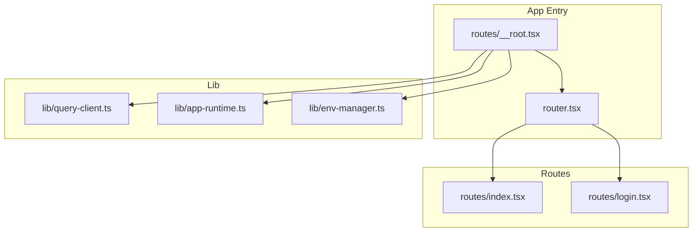
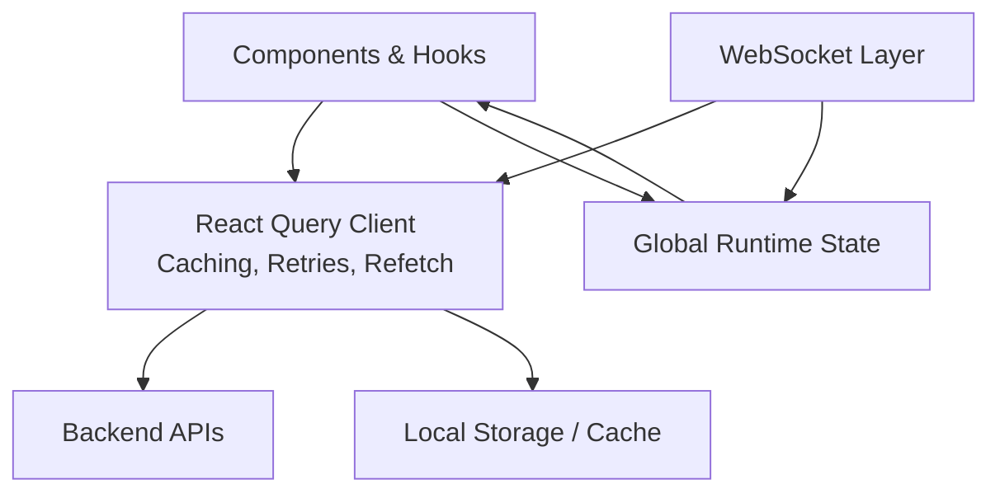
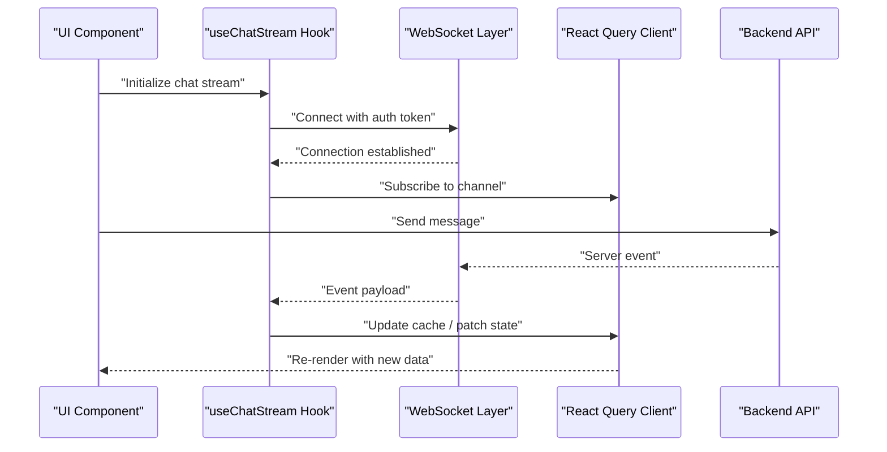
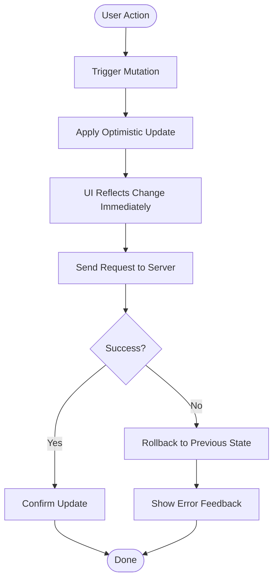
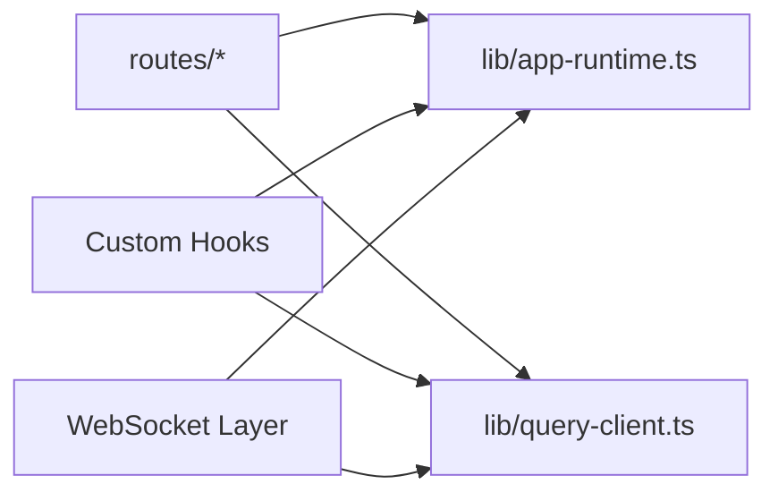

# State Management

<cite>
**Referenced Files in This Document**
- [query-client.ts](file://apps/web/src/lib/query-client.ts)
- [app-runtime.ts](file://apps/web/src/lib/app-runtime.ts)
- [env-manager.ts](file://apps/web/src/lib/env-manager.ts)
- [__root.tsx](file://apps/web/src/routes/__root.tsx)
- [router.tsx](file://apps/web/src/router.tsx)
- [index.tsx](file://apps/web/src/routes/index.tsx)
- [login.tsx](file://apps/web/src/routes/login.tsx)
- [chat-api.md](file://docs/wiki/apps/web/chat-api.md)
- [architecture.md](file://docs/overview/architecture.md)
</cite>

## Table of Contents

1. [Introduction](#introduction)
2. [Project Structure](#project-structure)
3. [Core Components](#core-components)
4. [Architecture Overview](#architecture-overview)
5. [Detailed Component Analysis](#detailed-component-analysis)
6. [Dependency Analysis](#dependency-analysis)
7. [Performance Considerations](#performance-considerations)
8. [Troubleshooting Guide](#troubleshooting-guide)
9. [Conclusion](#conclusion)

## Introduction

This document explains the state management architecture for the Fleet Pi web application with a focus on:

- Server state via React Query
- Local UI state using React hooks
- Global state patterns and persistence
- Data caching, optimistic updates, and error handling
- Authentication state persistence
- Real-time data synchronization and offline support
- Custom hook creation, complex state interactions, and re-render optimization
- WebSocket integration for real-time features

The goal is to provide both a conceptual overview and code-level guidance so that developers can implement consistent, performant, and resilient stateful behavior across the app.

## Project Structure

State-related logic in the web app is primarily organized under apps/web/src/lib and apps/web/src/routes:

- lib/query-client.ts configures the React Query client (cache, retries, background refresh, etc.)
- lib/app-runtime.ts provides runtime context and global state utilities
- lib/env-manager.ts centralizes environment configuration used by state layers
- routes manage authentication flows and route-scoped state
- docs contain architectural references and API usage patterns

**Diagram sources**

- [__root.tsx](file://apps/web/src/routes/__root.tsx)
- [router.tsx](file://apps/web/src/router.tsx)
- [query-client.ts](file://apps/web/src/lib/query-client.ts)
- [app-runtime.ts](file://apps/web/src/lib/app-runtime.ts)
- [env-manager.ts](file://apps/web/src/lib/env-manager.ts)
- [index.tsx](file://apps/web/src/routes/index.tsx)
- [login.tsx](file://apps/web/src/routes/login.tsx)

**Section sources**

- [__root.tsx](file://apps/web/src/routes/__root.tsx)
- [router.tsx](file://apps/web/src/router.tsx)
- [query-client.ts](file://apps/web/src/lib/query-client.ts)
- [app-runtime.ts](file://apps/web/src/lib/app-runtime.ts)
- [env-manager.ts](file://apps/web/src/lib/env-manager.ts)
- [index.tsx](file://apps/web/src/routes/index.tsx)
- [login.tsx](file://apps/web/src/routes/login.tsx)

## Core Components

- React Query Client: Centralized configuration for server state caching, retries, refetch policies, and online/offline behavior.
- App Runtime: Global runtime context exposing shared state and utilities consumed by components and hooks.
- Environment Manager: Provides environment-driven configuration that influences state behavior (e.g., feature flags, endpoints).
- Route-Level State: Authentication and session state managed within route boundaries, often persisted to storage.

Key responsibilities:

- query-client.ts: Configure cache lifetimes, retry strategies, and network mode.
- app-runtime.ts: Provide global state slices and actions; coordinate initialization.
- env-manager.ts: Supply runtime settings that affect caching and networking.
- Routes: Manage auth flow, redirect guards, and user-scoped state.

**Section sources**

- [query-client.ts](file://apps/web/src/lib/query-client.ts)
- [app-runtime.ts](file://apps/web/src/lib/app-runtime.ts)
- [env-manager.ts](file://apps/web/src/lib/env-manager.ts)
- [__root.tsx](file://apps/web/src/routes/__root.tsx)
- [login.tsx](file://apps/web/src/routes/login.tsx)

## Architecture Overview

The state architecture separates concerns into three layers:

- Server State (React Query): Caches API responses, handles retries, background refetching, and optimistic updates.
- Global State (App Runtime): Holds cross-cutting state such as theme, feature flags, and connection status.
- Local State (Hooks): Per-component UI state like form inputs, toggles, and transient selections.

Real-time and offline capabilities are layered on top:

- WebSocket connections feed live updates into React Query caches or local state.
- Offline-first patterns use cache persistence and queued mutations when connectivity is restored.

[No sources needed since this diagram shows conceptual workflow, not actual code structure]

## Detailed Component Analysis

### React Query Client Configuration

Responsibilities:

- Define default cache behavior (time-to-live, garbage collection, stale-while-revalidate).
- Configure retry attempts and backoff strategy.
- Enable network mode detection for online/offline behavior.
- Integrate with persistors if required.

Optimization tips:

- Use per-query overrides sparingly to avoid inconsistent caching.
- Prefer infinite queries for paginated lists.
- Leverage select to memoize derived data and reduce re-renders.

Error handling:

- Centralized error boundary around React Query provider.
- Consistent error messages surfaced to UI via toast or inline feedback.

**Section sources**

- [query-client.ts](file://apps/web/src/lib/query-client.ts)

### App Runtime and Global State

Responsibilities:

- Initialize global state at app bootstrap.
- Expose state slices and actions through context or store.
- Coordinate initialization order (auth, environment, analytics).

Patterns:

- Immutable updates via functional setState or Immer-like patterns.
- Selector-based subscriptions to minimize re-renders.

Persistence:

- Persist critical slices (e.g., preferences, feature flags) to localStorage/sessionStorage.
- Hydrate state on startup from storage.

**Section sources**

- [app-runtime.ts](file://apps/web/src/lib/app-runtime.ts)
- [env-manager.ts](file://apps/web/src/lib/env-manager.ts)

### Authentication State Persistence

Flow:

- On login, obtain token/session and persist securely.
- Guard protected routes based on auth state.
- Refresh tokens automatically when expired.
- Clear state on logout.

Integration points:

- React Query interceptors for attaching tokens to requests.
- WebSocket handshake using authenticated sessions.

**Section sources**

- [login.tsx](file://apps/web/src/routes/login.tsx)
- [__root.tsx](file://apps/web/src/routes/__root.tsx)

### Real-Time Data Synchronization

Approach:

- Establish WebSocket connection on app start or after authentication.
- Map incoming events to React Query cache updates or local state patches.
- Debounce high-frequency events to avoid excessive re-renders.

Offline considerations:

- Queue events locally and replay when reconnected.
- Merge conflicts deterministically (last-write-wins or server reconciliation).

**Section sources**

- [chat-api.md](file://docs/wiki/apps/web/chat-api.md)

### Offline Support

Strategies:

- Cache GET responses aggressively; invalidate on mutations.
- Defer non-critical writes until connectivity resumes.
- Show explicit offline indicators and queue visualizations.

Implementation hints:

- Use React Query’s network mode to pause/resume queries.
- Persist mutation queues to durable storage.

**Section sources**

- [query-client.ts](file://apps/web/src/lib/query-client.ts)

### Creating Custom Hooks

Guidelines:

- Encapsulate side effects and state transitions in custom hooks.
- Return stable interfaces (data, loading, error, mutate).
- Compose multiple hooks for complex workflows.

Examples:

- useAuth: encapsulates login/logout, token refresh, and persistence.
- useChatStream: manages WebSocket lifecycle and message buffering.
- useFeatureFlags: reads flags from global state and persists changes.

**Section sources**

- [app-runtime.ts](file://apps/web/src/lib/app-runtime.ts)
- [chat-api.md](file://docs/wiki/apps/web/chat-api.md)

### Managing Complex State Interactions

Patterns:

- Derive state from a single source of truth where possible.
- Normalize nested objects to reduce duplication.
- Use selectors to compute expensive values and prevent unnecessary renders.

Validation:

- Validate inputs early and surface errors close to the point of entry.
- Coalesce related mutations to maintain consistency.

**Section sources**

- [app-runtime.ts](file://apps/web/src/lib/app-runtime.ts)

### Optimizing Re-renders

Techniques:

- Memoize derived data with useMemo and useCallback.
- Split large components into smaller ones with focused state.
- Use React Query’s select to derive and memoize data.
- Avoid object/array recreation in render paths.

Monitoring:

- Profile with React DevTools to identify bottlenecks.
- Log frequent re-renders during development.

**Section sources**

- [query-client.ts](file://apps/web/src/lib/query-client.ts)
- [app-runtime.ts](file://apps/web/src/lib/app-runtime.ts)

### WebSocket Integration Sequence

**Diagram sources**

- [chat-api.md](file://docs/wiki/apps/web/chat-api.md)
- [query-client.ts](file://apps/web/src/lib/query-client.ts)

### Flowchart: Optimistic Update Pattern

[No sources needed since this diagram shows conceptual workflow, not actual code structure]

## Dependency Analysis

High-level dependencies among state modules:

- Routes depend on app-runtime for global state and on query-client for server state.
- Custom hooks may depend on app-runtime and query-client.
- WebSocket layer depends on app-runtime for auth and on query-client for cache updates.

**Diagram sources**

- [__root.tsx](file://apps/web/src/routes/__root.tsx)
- [router.tsx](file://apps/web/src/router.tsx)
- [app-runtime.ts](file://apps/web/src/lib/app-runtime.ts)
- [query-client.ts](file://apps/web/src/lib/query-client.ts)

**Section sources**

- [__root.tsx](file://apps/web/src/routes/__root.tsx)
- [router.tsx](file://apps/web/src/router.tsx)
- [app-runtime.ts](file://apps/web/src/lib/app-runtime.ts)
- [query-client.ts](file://apps/web/src/lib/query-client.ts)

## Performance Considerations

- Prefer React Query for server state to leverage built-in caching and deduplication.
- Use select to derive data and avoid recomputation.
- Batch state updates to reduce re-renders.
- Debounce rapid WebSocket events before updating the cache.
- Keep global state minimal; prefer localized state where possible.
- Monitor bundle size and lazy-load heavy modules.

[No sources needed since this section provides general guidance]

## Troubleshooting Guide

Common issues and resolutions:

- Stale data: Adjust staleTime and refetchOnWindowFocus; verify cache keys.
- Excessive re-renders: Add memoization; split components; use selectors.
- Auth failures: Inspect token refresh logic; ensure interceptors attach headers correctly.
- WebSocket disconnects: Implement reconnect with exponential backoff; queue messages.
- Offline behavior: Verify network mode detection; ensure mutation queue persists.

Debugging tips:

- Enable React Query devtools to inspect cache and queries.
- Log WebSocket events and payloads during development.
- Use performance profiling to identify render hotspots.

**Section sources**

- [query-client.ts](file://apps/web/src/lib/query-client.ts)
- [app-runtime.ts](file://apps/web/src/lib/app-runtime.ts)
- [chat-api.md](file://docs/wiki/apps/web/chat-api.md)

## Conclusion

Fleet Pi’s state management combines React Query for robust server state, a centralized app runtime for global state, and well-structured local state via hooks. By applying caching, optimistic updates, and disciplined error handling, the app delivers responsive and reliable experiences. Real-time features integrate cleanly through WebSocket updates into the cache, while offline support ensures resilience. Following the patterns and optimizations outlined here will help maintain performance and scalability as the application grows.

[No sources needed since this section summarizes without analyzing specific files]
