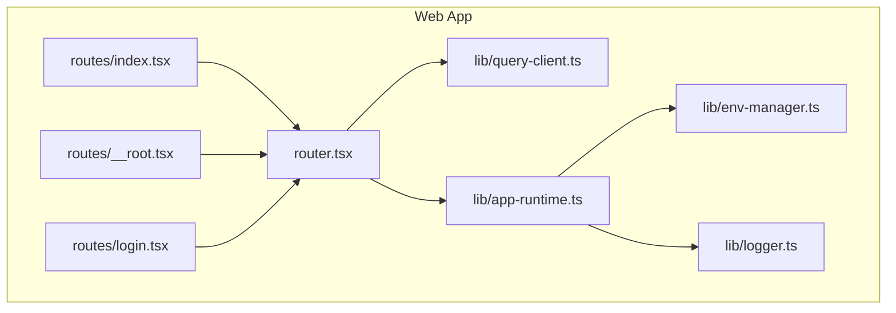
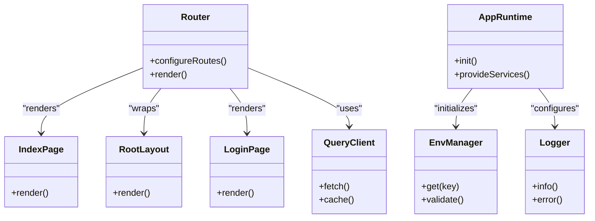
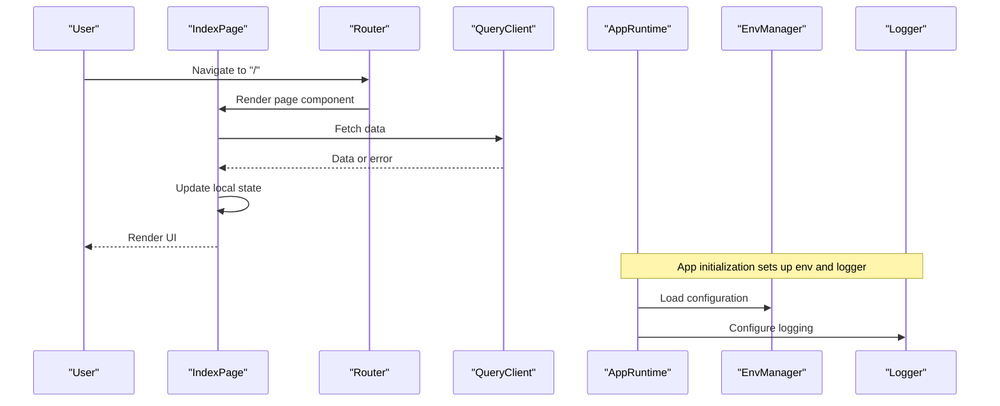
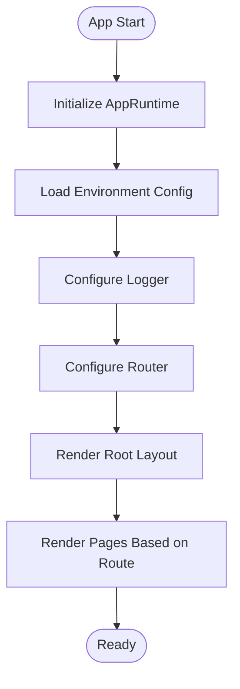
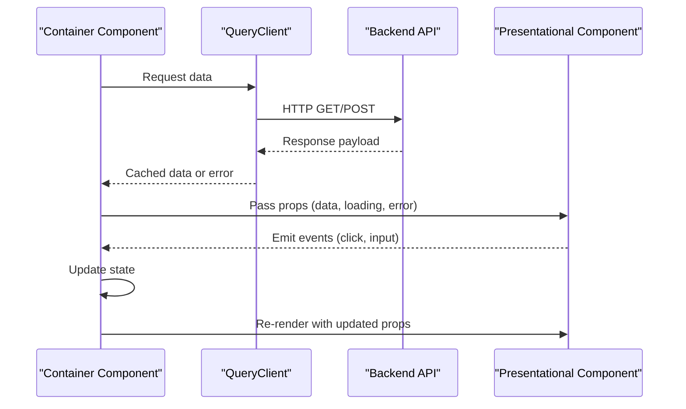
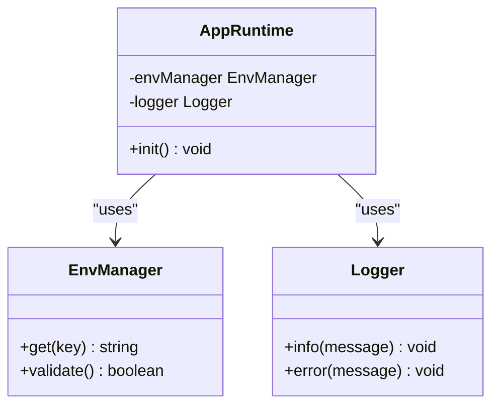
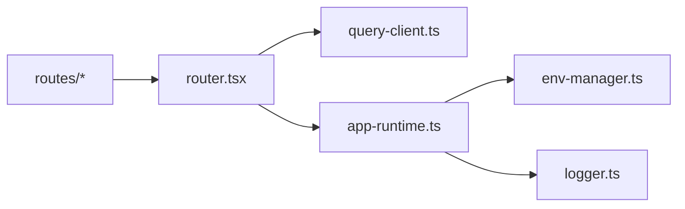

# Component Architecture & Patterns

<cite>
**Referenced Files in This Document**
- [README.md](file://README.md)
- [ARCHITECTURE.md](file://docs/architecture.md)
- [architecture.mmd](file://docs/architecture.mmd)
- [project-structure.md](file://docs/project-structure.md)
- [patterns-and-conventions.md](file://docs/wiki/how-to-contribute/patterns-and-conventions.md)
- [testing.md](file://docs/wiki/how-to-contribute/testing.md)
- [debugging.md](file://docs/wiki/how-to-contribute/debugging.md)
- [index.tsx](file://apps/web/src/routes/index.tsx)
- [__root.tsx](file://apps/web/src/routes/__root.tsx)
- [login.tsx](file://apps/web/src/routes/login.tsx)
- [router.tsx](file://apps/web/src/router.tsx)
- [query-client.ts](file://apps/web/src/lib/query-client.ts)
- [app-runtime.ts](file://apps/web/src/lib/app-runtime.ts)
- [env-manager.ts](file://apps/web/src/lib/env-manager.ts)
- [logger.ts](file://apps/web/src/lib/logger.ts)
- [chat-api.md](file://docs/wiki/apps/web/chat-api.md)
- [pi-integration.md](file://docs/wiki/apps/web/pi-integration.md)
- [package.json](file://apps/web/package.json)
- [vitest.config.ts](file://apps/web/vitest.config.ts)
- [playwright.config.ts](file://apps/web/playwright.config.ts)
</cite>

## Table of Contents

1. [Introduction](#introduction)
2. [Project Structure](#project-structure)
3. [Core Components](#core-components)
4. [Architecture Overview](#architecture-overview)
5. [Detailed Component Analysis](#detailed-component-analysis)
6. [Dependency Analysis](#dependency-analysis)
7. [Performance Considerations](#performance-considerations)
8. [Troubleshooting Guide](#troubleshooting-guide)
9. [Conclusion](#conclusion)
10. [Appendices](#appendices)

## Introduction

This document explains the Fleet Pi component architecture and design patterns, focusing on how components are organized, composed, and tested within the web application. It covers:

- Component hierarchy and composition strategies
- Separation of concerns between presentational and container components
- State management integration and data flow patterns
- Lifecycle management, prop validation, and event handling
- Testing approaches (unit, integration, visual regression)
- Guidelines for creating new components following established patterns

The goal is to make the architecture accessible to both technical and non-technical readers while providing concrete references to source files and configuration.

## Project Structure

The Fleet Pi web application is built with a modern frontend stack and follows a feature-oriented structure under apps/web/src. Key directories include:

- routes: Application entry points and page-level components
- lib: Shared libraries for API, auth, analytics, storage, environment, logging, and runtime utilities
- e2e: End-to-end tests using Playwright
- scripts: Build and utility scripts

**Diagram sources**

- [index.tsx](file://apps/web/src/routes/index.tsx)
- [__root.tsx](file://apps/web/src/routes/__root.tsx)
- [login.tsx](file://apps/web/src/routes/login.tsx)
- [router.tsx](file://apps/web/src/router.tsx)
- [query-client.ts](file://apps/web/src/lib/query-client.ts)
- [app-runtime.ts](file://apps/web/src/lib/app-runtime.ts)
- [env-manager.ts](file://apps/web/src/lib/env-manager.ts)
- [logger.ts](file://apps/web/src/lib/logger.ts)

**Section sources**

- [project-structure.md](file://docs/project-structure.md)
- [package.json](file://apps/web/package.json)

## Core Components

At a high level, the application uses route-based components as containers that orchestrate UI state and data fetching, while shared libraries encapsulate cross-cutting concerns like networking, environment configuration, and logging.

Key responsibilities:

- Route components manage page-level state and render presentational elements
- Router coordinates navigation and layout
- Query client centralizes data fetching and caching
- App runtime initializes core services and environment
- Environment manager provides typed access to configuration
- Logger standardizes diagnostics across the app

**Diagram sources**

- [router.tsx](file://apps/web/src/router.tsx)
- [index.tsx](file://apps/web/src/routes/index.tsx)
- [__root.tsx](file://apps/web/src/routes/__root.tsx)
- [login.tsx](file://apps/web/src/routes/login.tsx)
- [query-client.ts](file://apps/web/src/lib/query-client.ts)
- [app-runtime.ts](file://apps/web/src/lib/app-runtime.ts)
- [env-manager.ts](file://apps/web/src/lib/env-manager.ts)
- [logger.ts](file://apps/web/src/lib/logger.ts)

**Section sources**

- [router.tsx](file://apps/web/src/router.tsx)
- [index.tsx](file://apps/web/src/routes/index.tsx)
- [__root.tsx](file://apps/web/src/routes/__root.tsx)
- [login.tsx](file://apps/web/src/routes/login.tsx)
- [query-client.ts](file://apps/web/src/lib/query-client.ts)
- [app-runtime.ts](file://apps/web/src/lib/app-runtime.ts)
- [env-manager.ts](file://apps/web/src/lib/env-manager.ts)
- [logger.ts](file://apps/web/src/lib/logger.ts)

## Architecture Overview

Fleet Pi’s architecture emphasizes clear separation of concerns:

- Presentational components focus on rendering UI based on props
- Container components handle state, side effects, and data fetching
- Libraries provide reusable functionality (API calls, environment, logging)
- Router manages navigation and composes layouts and pages

Data flows from the query client through container components into presentational components via props. Events bubble up from presentational to container components for state updates.

**Diagram sources**

- [index.tsx](file://apps/web/src/routes/index.tsx)
- [router.tsx](file://apps/web/src/router.tsx)
- [query-client.ts](file://apps/web/src/lib/query-client.ts)
- [app-runtime.ts](file://apps/web/src/lib/app-runtime.ts)
- [env-manager.ts](file://apps/web/src/lib/env-manager.ts)
- [logger.ts](file://apps/web/src/lib/logger.ts)

**Section sources**

- [architecture.mmd](file://docs/architecture.mmd)
- [chat-api.md](file://docs/wiki/apps/web/chat-api.md)
- [pi-integration.md](file://docs/wiki/apps/web/pi-integration.md)

## Detailed Component Analysis

### Route Components and Layouts

Route components act as containers that coordinate user interactions and data loading. The root layout wraps all pages, ensuring consistent chrome and global state.

**Diagram sources**

- [__root.tsx](file://apps/web/src/routes/__root.tsx)
- [index.tsx](file://apps/web/src/routes/index.tsx)
- [login.tsx](file://apps/web/src/routes/login.tsx)
- [router.tsx](file://apps/web/src/router.tsx)
- [app-runtime.ts](file://apps/web/src/lib/app-runtime.ts)
- [env-manager.ts](file://apps/web/src/lib/env-manager.ts)
- [logger.ts](file://apps/web/src/lib/logger.ts)

**Section sources**

- [__root.tsx](file://apps/web/src/routes/__root.tsx)
- [index.tsx](file://apps/web/src/routes/index.tsx)
- [login.tsx](file://apps/web/src/routes/login.tsx)
- [router.tsx](file://apps/web/src/router.tsx)

### Data Flow and State Management

Data fetching is centralized through the query client, which handles caching, retries, and error states. Container components consume this data and pass it down to presentational components via props.

**Diagram sources**

- [query-client.ts](file://apps/web/src/lib/query-client.ts)
- [chat-api.md](file://docs/wiki/apps/web/chat-api.md)

**Section sources**

- [query-client.ts](file://apps/web/src/lib/query-client.ts)
- [chat-api.md](file://docs/wiki/apps/web/chat-api.md)

### Environment and Logging Integration

Environment configuration is validated and accessed through a typed manager, while logging is standardized across the application for consistent diagnostics.

**Diagram sources**

- [env-manager.ts](file://apps/web/src/lib/env-manager.ts)
- [logger.ts](file://apps/web/src/lib/logger.ts)
- [app-runtime.ts](file://apps/web/src/lib/app-runtime.ts)

**Section sources**

- [env-manager.ts](file://apps/web/src/lib/env-manager.ts)
- [logger.ts](file://apps/web/src/lib/logger.ts)
- [app-runtime.ts](file://apps/web/src/lib/app-runtime.ts)

## Dependency Analysis

The web application has clear dependencies between routing, state management, and shared libraries. Understanding these relationships helps maintain modularity and testability.

**Diagram sources**

- [index.tsx](file://apps/web/src/routes/index.tsx)
- [__root.tsx](file://apps/web/src/routes/__root.tsx)
- [login.tsx](file://apps/web/src/routes/login.tsx)
- [router.tsx](file://apps/web/src/router.tsx)
- [query-client.ts](file://apps/web/src/lib/query-client.ts)
- [app-runtime.ts](file://apps/web/src/lib/app-runtime.ts)
- [env-manager.ts](file://apps/web/src/lib/env-manager.ts)
- [logger.ts](file://apps/web/src/lib/logger.ts)

**Section sources**

- [router.tsx](file://apps/web/src/router.tsx)
- [query-client.ts](file://apps/web/src/lib/query-client.ts)
- [app-runtime.ts](file://apps/web/src/lib/app-runtime.ts)

## Performance Considerations

- Use memoization for expensive computations in presentational components
- Leverage query client caching to minimize network requests
- Implement lazy loading for route components where appropriate
- Avoid unnecessary re-renders by passing stable props and using context judiciously
- Profile critical paths during development to identify bottlenecks

[No sources needed since this section provides general guidance]

## Troubleshooting Guide

Common issues and debugging strategies:

- Environment misconfiguration: Validate environment variables using the environment manager
- Network errors: Check query client retry logic and error handling
- Logging inconsistencies: Ensure logger is properly configured during app initialization
- Navigation issues: Verify router configuration and route guards

For detailed debugging steps, refer to the debugging documentation.

**Section sources**

- [debugging.md](file://docs/wiki/how-to-contribute/debugging.md)
- [env-manager.ts](file://apps/web/src/lib/env-manager.ts)
- [logger.ts](file://apps/web/src/lib/logger.ts)

## Conclusion

Fleet Pi’s component architecture emphasizes clear separation of concerns, reusable patterns, and robust testing practices. By following the established conventions for presentational and container components, leveraging the query client for data management, and adhering to the testing guidelines, developers can create maintainable and scalable features.

[No sources needed since this section summarizes without analyzing specific files]

## Appendices

### Testing Approaches

- Unit tests: Use Vitest for component and utility testing
- Integration tests: Test component interactions and data flow
- Visual regression tests: Use Playwright for end-to-end scenarios
- E2E smoke tests: Validate critical user flows

**Section sources**

- [testing.md](file://docs/wiki/how-to-contribute/testing.md)
- [vitest.config.ts](file://apps/web/vitest.config.ts)
- [playwright.config.ts](file://apps/web/playwright.config.ts)

### Creating New Components

Follow these guidelines when adding new components:

- Separate presentational and container components
- Use props for data and callbacks
- Handle lifecycle events appropriately
- Validate props with TypeScript types
- Write unit tests for business logic
- Add integration tests for component interactions
- Follow naming conventions and file organization patterns

**Section sources**

- [patterns-and-conventions.md](file://docs/wiki/how-to-contribute/patterns-and-conventions.md)

### Additional References

- High-level architecture overview
- Web-specific documentation including chat API and Pi integration
- Project structure and setup instructions

**Section sources**

- [ARCHITECTURE.md](file://docs/architecture.md)
- [chat-api.md](file://docs/wiki/apps/web/chat-api.md)
- [pi-integration.md](file://docs/wiki/apps/web/pi-integration.md)
- [README.md](file://README.md)
