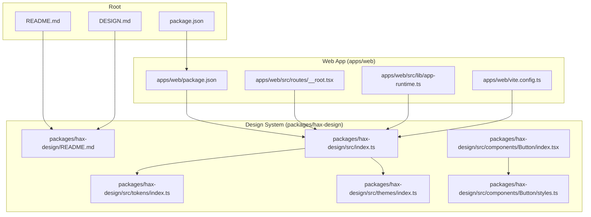
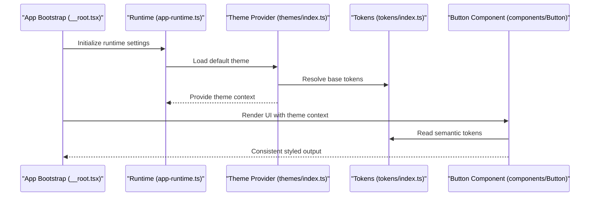
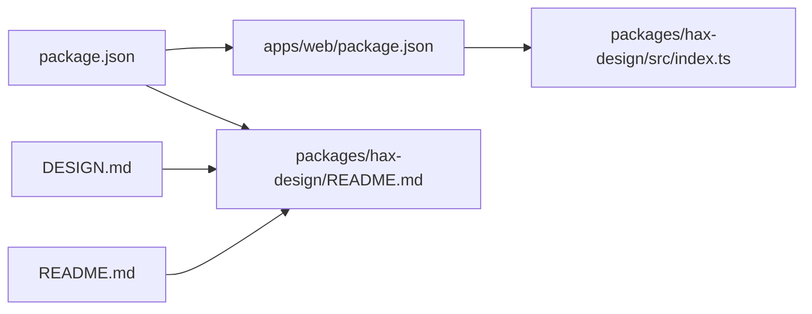

# Design System Integration

<cite>
**Referenced Files in This Document**
- [README.md](file://README.md)
- [DESIGN.md](file://DESIGN.md)
- [package.json](file://package.json)
- [apps/web/package.json](file://apps/web/package.json)
- [packages/hax-design/README.md](file://packages/hax-design/README.md)
- [packages/hax-design/src/index.ts](file://packages/hax-design/src/index.ts)
- [packages/hax-design/src/tokens/index.ts](file://packages/hax-design/src/tokens/index.ts)
- [packages/hax-design/src/themes/index.ts](file://packages/hax-design/src/themes/index.ts)
- [packages/hax-design/src/components/Button/index.tsx](file://packages/hax-design/src/components/Button/index.tsx)
- [packages/hax-design/src/components/Button/styles.ts](file://packages/hax-design/src/components/Button/styles.ts)
- [apps/web/src/lib/app-runtime.ts](file://apps/web/src/lib/app-runtime.ts)
- [apps/web/src/routes/__root.tsx](file://apps/web/src/routes/__root.tsx)
- [apps/web/vite.config.ts](file://apps/web/vite.config.ts)
- [docs/wiki/packages/hax-design/index.md](file://docs/wiki/packages/hax-design/index.md)
- [docs/wiki/reference/configuration.md](file://docs/wiki/reference/configuration.md)
</cite>

## Table of Contents

1. [Introduction](#introduction)
2. [Project Structure](#project-structure)
3. [Core Components](#core-components)
4. [Architecture Overview](#architecture-overview)
5. [Detailed Component Analysis](#detailed-component-analysis)
6. [Dependency Analysis](#dependency-analysis)
7. [Performance Considerations](#performance-considerations)
8. [Troubleshooting Guide](#troubleshooting-guide)
9. [Conclusion](#conclusion)
10. [Appendices](#appendices)

## Introduction

This document explains how to integrate and use the hax-design system within Fleet Pi. It covers design tokens, color palettes, typography scales, spacing systems, theme configuration, custom token creation, dynamic theme switching, extending components with consistent styles, accessibility considerations for WCAG compliance, and guidance for contributing new tokens and updating the shared design system.

The goal is to help you apply a unified visual language across Fleet Pi while maintaining consistency, accessibility, and performance.

## Project Structure

Fleet Pi organizes the design system as a dedicated package under packages/hax-design and consumes it from the web application under apps/web. The root-level documentation and design guidelines provide context on usage patterns and contribution workflows.

**Diagram sources**

- [README.md:1-200](file://README.md#L1-L200)
- [DESIGN.md:1-200](file://DESIGN.md#L1-L200)
- [package.json:1-100](file://package.json#L1-L100)
- [apps/web/package.json:1-100](file://apps/web/package.json#L1-L100)
- [packages/hax-design/README.md:1-200](file://packages/hax-design/README.md#L1-L200)
- [packages/hax-design/src/index.ts:1-200](file://packages/hax-design/src/index.ts#L1-L200)
- [packages/hax-design/src/tokens/index.ts:1-200](file://packages/hax-design/src/tokens/index.ts#L1-L200)
- [packages/hax-design/src/themes/index.ts:1-200](file://packages/hax-design/src/themes/index.ts#L1-L200)
- [packages/hax-design/src/components/Button/index.tsx:1-200](file://packages/hax-design/src/components/Button/index.tsx#L1-L200)
- [packages/hax-design/src/components/Button/styles.ts:1-200](file://packages/hax-design/src/components/Button/styles.ts#L1-L200)
- [apps/web/src/routes/__root.tsx:1-200](file://apps/web/src/routes/__root.tsx#L1-L200)
- [apps/web/src/lib/app-runtime.ts:1-200](file://apps/web/src/lib/app-runtime.ts#L1-L200)
- [apps/web/vite.config.ts:1-200](file://apps/web/vite.config.ts#L1-L200)

**Section sources**

- [README.md:1-200](file://README.md#L1-L200)
- [DESIGN.md:1-200](file://DESIGN.md#L1-L200)
- [package.json:1-100](file://package.json#L1-L100)
- [apps/web/package.json:1-100](file://apps/web/package.json#L1-L100)
- [packages/hax-design/README.md:1-200](file://packages/hax-design/README.md#L1-L200)
- [packages/hax-design/src/index.ts:1-200](file://packages/hax-design/src/index.ts#L1-L200)
- [packages/hax-design/src/tokens/index.ts:1-200](file://packages/hax-design/src/tokens/index.ts#L1-L200)
- [packages/hax-design/src/themes/index.ts:1-200](file://packages/hax-design/src/themes/index.ts#L1-L200)
- [packages/hax-design/src/components/Button/index.tsx:1-200](file://packages/hax-design/src/components/Button/index.tsx#L1-L200)
- [packages/hax-design/src/components/Button/styles.ts:1-200](file://packages/hax-design/src/components/Button/styles.ts#L1-L200)
- [apps/web/src/routes/__root.tsx:1-200](file://apps/web/src/routes/__root.tsx#L1-L200)
- [apps/web/src/lib/app-runtime.ts:1-200](file://apps/web/src/lib/app-runtime.ts#L1-L200)
- [apps/web/vite.config.ts:1-200](file://apps/web/vite.config.ts#L1-L200)

## Core Components

- Design tokens: Centralized definitions for colors, typography, spacing, shadows, and other visual primitives.
- Themes: Named configurations that map tokens to semantic values (e.g., light/dark modes).
- Components: Reusable UI elements built on top of tokens and themes, ensuring consistent behavior and appearance.
- Runtime integration: Application bootstrap code that loads the active theme and exposes tokens to components.

Key responsibilities:

- Token registry: Provides a single source of truth for all design values.
- Theme provider: Supplies the current theme context to the component tree.
- Component library: Implements accessible, theme-aware UI building blocks.

**Section sources**

- [packages/hax-design/src/index.ts:1-200](file://packages/hax-design/src/index.ts#L1-L200)
- [packages/hax-design/src/tokens/index.ts:1-200](file://packages/hax-design/src/tokens/index.ts#L1-L200)
- [packages/hax-design/src/themes/index.ts:1-200](file://packages/hax-design/src/themes/index.ts#L1-L200)
- [packages/hax-design/src/components/Button/index.tsx:1-200](file://packages/hax-design/src/components/Button/index.tsx#L1-L200)
- [packages/hax-design/src/components/Button/styles.ts:1-200](file://packages/hax-design/src/components/Button/styles.ts#L1-L200)
- [apps/web/src/lib/app-runtime.ts:1-200](file://apps/web/src/lib/app-runtime.ts#L1-L200)
- [apps/web/src/routes/__root.tsx:1-200](file://apps/web/src/routes/__root.tsx#L1-L200)

## Architecture Overview

The design system integrates into Fleet Pi through a clear separation of concerns:

- Tokens define atomic values.
- Themes compose tokens into semantic sets.
- Components consume themes via a provider or hooks.
- The app bootstraps the theme at startup and persists user preferences.

**Diagram sources**

- [apps/web/src/routes/__root.tsx:1-200](file://apps/web/src/routes/__root.tsx#L1-L200)
- [apps/web/src/lib/app-runtime.ts:1-200](file://apps/web/src/lib/app-runtime.ts#L1-L200)
- [packages/hax-design/src/themes/index.ts:1-200](file://packages/hax-design/src/themes/index.ts#L1-L200)
- [packages/hax-design/src/tokens/index.ts:1-200](file://packages/hax-design/src/tokens/index.ts#L1-L200)
- [packages/hax-design/src/components/Button/index.tsx:1-200](file://packages/hax-design/src/components/Button/index.tsx#L1-L200)

## Detailed Component Analysis

### Design Tokens

- Purpose: Define atomic values such as colors, typography scales, spacing units, and motion parameters.
- Organization: Centralized index exports grouped by category (colors, typography, spacing).
- Usage: Components and themes reference tokens by name to ensure consistency.

Best practices:

- Use semantic names for derived values (e.g., text-primary, surface-default).
- Keep base tokens minimal and composable.
- Avoid hardcoding raw values in components.

Token categories typically include:

- Colors: palette, semantic roles, states
- Typography: font families, sizes, weights, line heights
- Spacing: scale units, layout gaps
- Shadows and borders: elevation, radii

**Section sources**

- [packages/hax-design/src/tokens/index.ts:1-200](file://packages/hax-design/src/tokens/index.ts#L1-L200)
- [packages/hax-design/README.md:1-200](file://packages/hax-design/README.md#L1-L200)

### Themes and Theme Configuration

- Purpose: Map tokens to semantic values per theme (e.g., light/dark).
- Configuration: Central theme registry with defaults and overrides.
- Dynamic switching: Runtime updates to the active theme without full reloads.

Configuration steps:

- Register base tokens once.
- Define theme objects that assign tokens to semantic keys.
- Provide the theme context at the app root.
- Persist user preference and apply on initialization.

Dynamic switching flow:

- User toggles theme preference.
- Runtime updates the active theme.
- Theme provider re-renders affected components.
- Tokens resolve to updated semantic values.

**Section sources**

- [packages/hax-design/src/themes/index.ts:1-200](file://packages/hax-design/src/themes/index.ts#L1-L200)
- [apps/web/src/lib/app-runtime.ts:1-200](file://apps/web/src/lib/app-runtime.ts#L1-L200)
- [apps/web/src/routes/__root.tsx:1-200](file://apps/web/src/routes/__root.tsx#L1-L200)

### Typography Scale

- Purpose: Standardize font sizes, weights, and line heights across the app.
- Implementation: Typographic tokens define modular scales; components consume them via semantic keys.
- Accessibility: Ensure sufficient contrast and scalable text for readability.

Guidelines:

- Use relative units for scalability.
- Maintain consistent hierarchy levels.
- Test with different screen sizes and zoom levels.

**Section sources**

- [packages/hax-design/src/tokens/index.ts:1-200](file://packages/hax-design/src/tokens/index.ts#L1-L200)
- [packages/hax-design/README.md:1-200](file://packages/hax-design/README.md#L1-L200)

### Color Palettes

- Purpose: Provide consistent color semantics for backgrounds, text, borders, and states.
- Implementation: Palette tokens define base hues; semantic tokens define roles (primary, success, warning, error).
- Accessibility: Enforce contrast ratios against background tokens.

Usage tips:

- Prefer semantic tokens over raw palette values.
- Validate contrast for interactive elements.
- Use state tokens for focus, hover, and disabled states.

**Section sources**

- [packages/hax-design/src/tokens/index.ts:1-200](file://packages/hax-design/src/tokens/index.ts#L1-L200)
- [packages/hax-design/README.md:1-200](file://packages/hax-design/README.md#L1-L200)

### Spacing System

- Purpose: Standardize margins, paddings, and layout gaps.
- Implementation: Spacing tokens define a modular scale; components use semantic spacing keys.
- Consistency: Align spacing with grid and layout principles.

Recommendations:

- Use spacing tokens for all layout dimensions.
- Avoid ad-hoc pixel values.
- Maintain rhythm across components.

**Section sources**

- [packages/hax-design/src/tokens/index.ts:1-200](file://packages/hax-design/src/tokens/index.ts#L1-L200)
- [packages/hax-design/README.md:1-200](file://packages/hax-design/README.md#L1-L200)

### Extending Components with Custom Styles

- Approach: Extend existing components by composing tokens and overriding style layers.
- Strategy: Create variant props or wrapper components that adjust semantic tokens.
- Consistency: Ensure overrides still respect theme boundaries and accessibility rules.

Example pattern:

- Add a variant prop to a component.
- Map variants to token-based style rules.
- Preserve core behaviors like focus states and keyboard navigation.

**Section sources**

- [packages/hax-design/src/components/Button/index.tsx:1-200](file://packages/hax-design/src/components/Button/index.tsx#L1-L200)
- [packages/hax-design/src/components/Button/styles.ts:1-200](file://packages/hax-design/src/components/Button/styles.ts#L1-L200)

### Accessibility and WCAG Compliance

- Contrast: Verify color pairs meet WCAG AA/AAA thresholds.
- Focus management: Ensure visible focus indicators and logical tab order.
- Semantics: Use proper ARIA attributes and native HTML semantics.
- Motion: Respect reduced motion preferences.
- Testing: Include automated checks and manual audits.

Implementation checklist:

- Validate contrast using tokens.
- Provide alt text and labels.
- Support keyboard interactions.
- Test with screen readers.

**Section sources**

- [packages/hax-design/README.md:1-200](file://packages/hax-design/README.md#L1-L200)
- [DESIGN.md:1-200](file://DESIGN.md#L1-L200)

### Contributing New Design Tokens and Updating the Shared System

- Process:
  - Propose new tokens with rationale and usage examples.
  - Update token registry with base and semantic values.
  - Adjust themes if needed.
  - Update component documentation and examples.
  - Run accessibility and visual regression checks.
- Governance:
  - Follow naming conventions.
  - Maintain backward compatibility where possible.
  - Document breaking changes.

**Section sources**

- [packages/hax-design/README.md:1-200](file://packages/hax-design/README.md#L1-L200)
- [docs/wiki/packages/hax-design/index.md:1-200](file://docs/wiki/packages/hax-design/index.md#L1-L200)
- [DESIGN.md:1-200](file://DESIGN.md#L1-L200)

## Dependency Analysis

The web app depends on the hax-design package for tokens, themes, and components. The build toolchain ensures bundling and optimization.

**Diagram sources**

- [apps/web/package.json:1-100](file://apps/web/package.json#L1-L100)
- [package.json:1-100](file://package.json#L1-L100)
- [packages/hax-design/src/index.ts:1-200](file://packages/hax-design/src/index.ts#L1-L200)
- [packages/hax-design/README.md:1-200](file://packages/hax-design/README.md#L1-L200)
- [DESIGN.md:1-200](file://DESIGN.md#L1-L200)
- [README.md:1-200](file://README.md#L1-L200)

**Section sources**

- [apps/web/package.json:1-100](file://apps/web/package.json#L1-L100)
- [package.json:1-100](file://package.json#L1-L100)
- [packages/hax-design/src/index.ts:1-200](file://packages/hax-design/src/index.ts#L1-L200)
- [packages/hax-design/README.md:1-200](file://packages/hax-design/README.md#L1-L200)
- [DESIGN.md:1-200](file://DESIGN.md#L1-L200)
- [README.md:1-200](file://README.md#L1-L200)

## Performance Considerations

- Token resolution: Keep token lookups efficient; avoid heavy computations during render.
- Theme switching: Minimize re-renders by scoping updates to necessary components.
- Bundle size: Tree-shake unused tokens and components; prefer importing only what is needed.
- CSS generation: Use optimized styling approaches to reduce runtime overhead.

[No sources needed since this section provides general guidance]

## Troubleshooting Guide

Common issues and resolutions:

- Theme not applied: Ensure the theme provider wraps the app root and that runtime initializes before rendering components.
- Incorrect colors or spacing: Verify semantic token mappings and check for hardcoded values.
- Accessibility failures: Run contrast checks and validate ARIA attributes; test with assistive technologies.
- Build errors: Confirm dependencies are correctly declared and imports match package exports.

Debugging steps:

- Inspect theme context at runtime.
- Log token resolution paths.
- Use browser dev tools to verify computed styles.
- Review linting and type errors related to tokens.

**Section sources**

- [apps/web/src/lib/app-runtime.ts:1-200](file://apps/web/src/lib/app-runtime.ts#L1-L200)
- [apps/web/src/routes/__root.tsx:1-200](file://apps/web/src/routes/__root.tsx#L1-L200)
- [packages/hax-design/README.md:1-200](file://packages/hax-design/README.md#L1-L200)

## Conclusion

Integrating the hax-design system in Fleet Pi establishes a robust foundation for consistent, accessible, and maintainable UI development. By centralizing tokens, standardizing themes, and building reusable components, teams can deliver cohesive experiences while enabling dynamic customization and easy contributions. Adhering to the outlined practices ensures long-term design quality and developer productivity.

[No sources needed since this section summarizes without analyzing specific files]

## Appendices

### Quick Start Checklist

- Install and import hax-design in the web app.
- Configure the theme provider at the app root.
- Use semantic tokens in components instead of raw values.
- Implement dynamic theme switching via runtime settings.
- Validate accessibility with automated and manual tests.

**Section sources**

- [apps/web/package.json:1-100](file://apps/web/package.json#L1-L100)
- [apps/web/src/routes/__root.tsx:1-200](file://apps/web/src/routes/__root.tsx#L1-L200)
- [apps/web/src/lib/app-runtime.ts:1-200](file://apps/web/src/lib/app-runtime.ts#L1-L200)
- [packages/hax-design/README.md:1-200](file://packages/hax-design/README.md#L1-L200)

### Reference Links

- Package documentation: [packages/hax-design/README.md](file://packages/hax-design/README.md)
- Wiki overview: [docs/wiki/packages/hax-design/index.md](file://docs/wiki/packages/hax-design/index.md)
- Configuration guide: [docs/wiki/reference/configuration.md](file://docs/wiki/reference/configuration.md)
- Design guidelines: [DESIGN.md](file://DESIGN.md)
- Project overview: [README.md](file://README.md)

**Section sources**

- [packages/hax-design/README.md:1-200](file://packages/hax-design/README.md#L1-L200)
- [docs/wiki/packages/hax-design/index.md:1-200](file://docs/wiki/packages/hax-design/index.md#L1-L200)
- [docs/wiki/reference/configuration.md:1-200](file://docs/wiki/reference/configuration.md#L1-L200)
- [DESIGN.md:1-200](file://DESIGN.md#L1-L200)
- [README.md:1-200](file://README.md#L1-L200)
