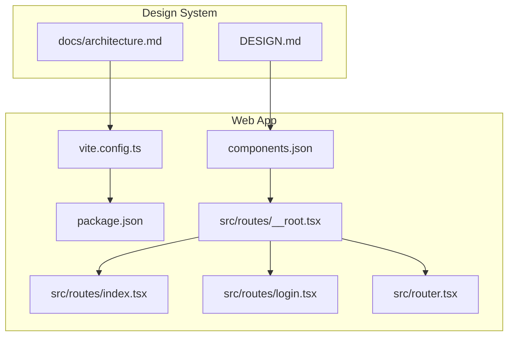
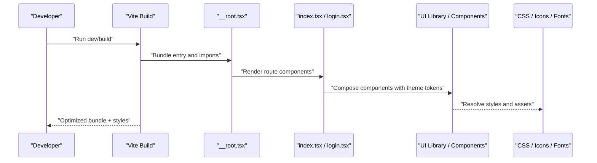
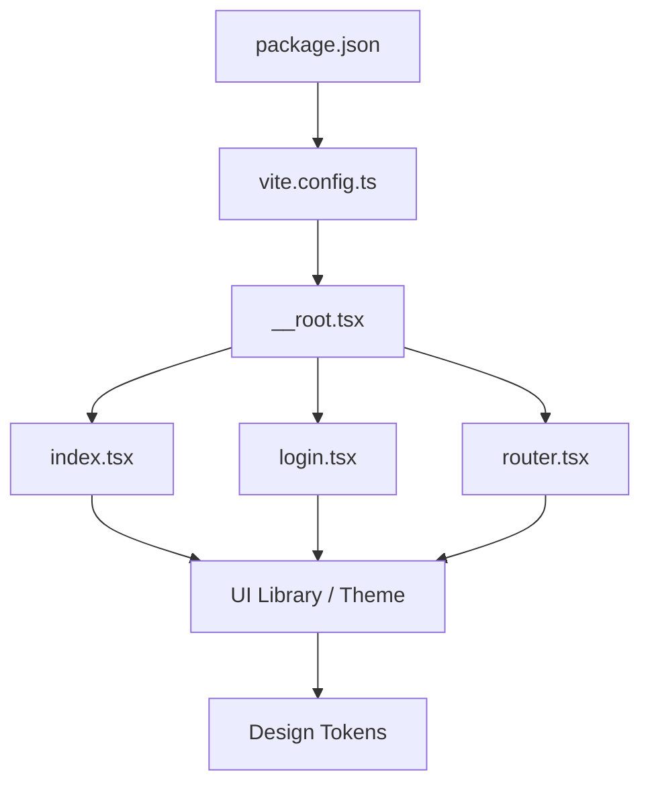

# Styling Approaches & CSS Architecture

<cite>
**Referenced Files in This Document**
- [package.json](file://apps/web/package.json)
- [vite.config.ts](file://apps/web/vite.config.ts)
- [components.json](file://apps/web/components.json)
- [index.tsx](file://apps/web/src/routes/index.tsx)
- [login.tsx](file://apps/web/src/routes/login.tsx)
- [__root.tsx](file://apps/web/src/routes/__root.tsx)
- [router.tsx](file://apps/web/src/router.tsx)
- [DESIGN.md](file://DESIGN.md)
- [ARCHITECTURE.md](file://docs/architecture.md)
</cite>

## Table of Contents

1. [Introduction](#introduction)
2. [Project Structure](#project-structure)
3. [Core Components](#core-components)
4. [Architecture Overview](#architecture-overview)
5. [Detailed Component Analysis](#detailed-component-analysis)
6. [Dependency Analysis](#dependency-analysis)
7. [Performance Considerations](#performance-considerations)
8. [Troubleshooting Guide](#troubleshooting-guide)
9. [Conclusion](#conclusion)
10. [Appendices](#appendices)

## Introduction

This document explains the styling approaches and CSS architecture used in Fleet Pi’s web application. It covers how styles are organized, processed at build time, and applied across components. It also provides guidance for responsive design, dark mode, animations, accessibility, cross-browser compatibility, and performance optimization. The goal is to help contributors implement consistent, maintainable, and performant styles across the app.

## Project Structure

The web application is built with Vite and uses a component-driven approach. Styling-related configuration and assets live under apps/web, while shared design tokens and patterns may be referenced from higher-level documentation or packages.

Key locations:

- Build and bundling configuration: apps/web/vite.config.ts
- Package dependencies and scripts: apps/web/package.json
- Component registry and UI library settings: apps/web/components.json
- Entry routes that render the application shell: apps/web/src/routes/__root.tsx, apps/web/src/routes/index.tsx, apps/web/src/routes/login.tsx
- Router setup: apps/web/src/router.tsx
- Design system and conventions: DESIGN.md (root), docs/architecture.md

**Diagram sources**

- [vite.config.ts](file://apps/web/vite.config.ts)
- [package.json](file://apps/web/package.json)
- [components.json](file://apps/web/components.json)
- [__root.tsx](file://apps/web/src/routes/__root.tsx)
- [index.tsx](file://apps/web/src/routes/index.tsx)
- [login.tsx](file://apps/web/src/routes/login.tsx)
- [router.tsx](file://apps/web/src/router.tsx)
- [DESIGN.md](file://DESIGN.md)
- [ARCHITECTURE.md](file://docs/architecture.md)

**Section sources**

- [package.json](file://apps/web/package.json)
- [vite.config.ts](file://apps/web/vite.config.ts)
- [components.json](file://apps/web/components.json)
- [__root.tsx](file://apps/web/src/routes/__root.tsx)
- [index.tsx](file://apps/web/src/routes/index.tsx)
- [login.tsx](file://apps/web/src/routes/login.tsx)
- [router.tsx](file://apps/web/src/router.tsx)
- [DESIGN.md](file://DESIGN.md)
- [ARCHITECTURE.md](file://docs/architecture.md)

## Core Components

Styling in Fleet Pi follows a component-centric model driven by the UI framework and tooling configured in the web package. The following aspects define how styles are authored and consumed:

- CSS-in-JS patterns: Styles are typically composed within components using the UI library’s primitives and theme APIs. This keeps styles co-located with behavior and ensures encapsulation.
- Utility-first CSS usage: Where appropriate, utility classes are used for rapid layout and spacing, especially when supported by the UI library or integrated utilities.
- Component-scoped styling: Each component owns its visual rules via theme tokens, variants, and composition APIs, minimizing global style leakage.
- Theme and tokens: Centralized tokens (colors, typography, spacing, radii) are provided by the design system and consumed consistently across components.

Implementation anchors:

- Component registry and UI library configuration: [components.json](file://apps/web/components.json)
- Application shell and route rendering: [__root.tsx](file://apps/web/src/routes/__root.tsx), [index.tsx](file://apps/web/src/routes/index.tsx), [login.tsx](file://apps/web/src/routes/login.tsx)
- Router wiring: [router.tsx](file://apps/web/src/router.tsx)

**Section sources**

- [components.json](file://apps/web/components.json)
- [__root.tsx](file://apps/web/src/routes/__root.tsx)
- [index.tsx](file://apps/web/src/routes/index.tsx)
- [login.tsx](file://apps/web/src/routes/login.tsx)
- [router.tsx](file://apps/web/src/router.tsx)

## Architecture Overview

At build time, Vite processes TypeScript/JSX, imports styles through the UI library, and optimizes assets. The application shell sets up routing and renders pages, which compose UI primitives and apply styles via theme tokens and component APIs.

**Diagram sources**

- [vite.config.ts](file://apps/web/vite.config.ts)
- [__root.tsx](file://apps/web/src/routes/__root.tsx)
- [index.tsx](file://apps/web/src/routes/index.tsx)
- [login.tsx](file://apps/web/src/routes/login.tsx)

**Section sources**

- [vite.config.ts](file://apps/web/vite.config.ts)
- [__root.tsx](file://apps/web/src/routes/__root.tsx)
- [index.tsx](file://apps/web/src/routes/index.tsx)
- [login.tsx](file://apps/web/src/routes/login.tsx)

## Detailed Component Analysis

### Build Configuration for CSS Processing and Asset Optimization

Vite is the core build tool. It handles module resolution, transforms, and asset optimization. Key responsibilities include:

- Processing TS/JSX and importing styles via the UI library
- Optimizing CSS output (minification, extraction where applicable)
- Managing static assets (icons, fonts, images) under public and src directories
- Enabling environment variables and plugins for enhanced workflows

Configuration anchors:

- Vite config: [vite.config.ts](file://apps/web/vite.config.ts)
- Dependencies and scripts: [package.json](file://apps/web/package.json)

Practical implications:

- Use the UI library’s theme API to keep styles scoped and token-driven
- Prefer dynamic imports for heavy components to reduce initial bundle size
- Keep static assets in public for root-level access; otherwise, import them into modules for tree-shaking

**Section sources**

- [vite.config.ts](file://apps/web/vite.config.ts)
- [package.json](file://apps/web/package.json)

### Responsive Design Implementation

Responsive behavior is achieved through:

- Fluid typography and spacing based on tokens
- Breakpoints defined in the theme or UI library
- Container queries and flexible layouts where supported
- Mobile-first patterns in component composition

Guidelines:

- Start with mobile layouts and progressively enhance for larger screens
- Use relative units and tokens instead of fixed pixel values
- Test across common breakpoints and device sizes

[No sources needed since this section provides general guidance]

### Dark Mode Strategy

Dark mode is implemented via theme toggles and semantic color tokens:

- Define light and dark palettes in the theme
- Apply theme context at the application shell level
- Compose components with semantic tokens rather than hardcoded colors
- Ensure sufficient contrast ratios for accessibility

Implementation anchors:

- Application shell and theme provider setup: [__root.tsx](file://apps/web/src/routes/__root.tsx)
- Route-level components consuming theme: [index.tsx](file://apps/web/src/routes/index.tsx), [login.tsx](file://apps/web/src/routes/login.tsx)

**Section sources**

- [__root.tsx](file://apps/web/src/routes/__root.tsx)
- [index.tsx](file://apps/web/src/routes/index.tsx)
- [login.tsx](file://apps/web/src/routes/login.tsx)

### Custom Animations

Animations should be:

- Declarative and composable via the UI library’s animation APIs
- Performance-friendly (use transform and opacity)
- Respectful of user preferences (prefers-reduced-motion)

Guidelines:

- Encapsulate animations in reusable components or hooks
- Avoid layout-triggering properties during animations
- Provide motion alternatives for users who prefer reduced motion

[No sources needed since this section provides general guidance]

### Accessibility Considerations in Styling

- Maintain WCAG-compliant contrast ratios in both light and dark themes
- Ensure focus states are visible and consistent
- Use semantic HTML and ARIA attributes where necessary
- Support keyboard navigation and screen readers

[No sources needed since this section provides general guidance]

### Cross-Browser Compatibility

- Rely on the UI library’s polyfills and normalized styles
- Validate critical layouts across major browsers
- Avoid experimental features unless guarded with feature detection

[No sources needed since this section provides general guidance]

### Organizing CSS Files and Naming Conventions

- Prefer component-scoped styles via the UI library and theme tokens
- If custom CSS is required, colocate it near the component and use clear naming
- Avoid global styles except for base resets and tokens
- Use consistent naming patterns aligned with the UI library’s conventions

[No sources needed since this section provides general guidance]

## Dependency Analysis

Styling dependencies flow from the UI library and theme configuration into components and routes. Vite orchestrates the build and optimization.

**Diagram sources**

- [package.json](file://apps/web/package.json)
- [vite.config.ts](file://apps/web/vite.config.ts)
- [__root.tsx](file://apps/web/src/routes/__root.tsx)
- [index.tsx](file://apps/web/src/routes/index.tsx)
- [login.tsx](file://apps/web/src/routes/login.tsx)
- [router.tsx](file://apps/web/src/router.tsx)

**Section sources**

- [package.json](file://apps/web/package.json)
- [vite.config.ts](file://apps/web/vite.config.ts)
- [__root.tsx](file://apps/web/src/routes/__root.tsx)
- [index.tsx](file://apps/web/src/routes/index.tsx)
- [login.tsx](file://apps/web/src/routes/login.tsx)
- [router.tsx](file://apps/web/src/router.tsx)

## Performance Considerations

- Minimize CSS payload by leveraging the UI library’s atomic or token-based styles
- Code-split routes and components to defer non-critical styles
- Preload critical fonts and icons; lazy-load others
- Avoid expensive animations and ensure they respect reduced motion preferences
- Monitor bundle size and runtime performance with profiling tools

[No sources needed since this section provides general guidance]

## Troubleshooting Guide

Common issues and resolutions:

- Theme not applying: Verify theme provider is mounted in the application shell and that components consume tokens correctly.
- Dark mode flicker: Ensure server-side or initial render respects the preferred theme to avoid flash.
- Missing styles after build: Confirm imports and asset paths; check Vite configuration for aliases and plugins.
- Accessibility regressions: Run automated contrast checks and manual keyboard/screen reader tests.

[No sources needed since this section provides general guidance]

## Conclusion

Fleet Pi’s styling architecture emphasizes component-scoped styles, theme-driven tokens, and a Vite-powered build pipeline. By adhering to these patterns, teams can maintain consistency, improve performance, and deliver accessible, responsive experiences across devices and browsers.

[No sources needed since this section summarizes without analyzing specific files]

## Appendices

### Appendix A: Build and Tooling Anchors

- Vite configuration: [vite.config.ts](file://apps/web/vite.config.ts)
- Package dependencies and scripts: [package.json](file://apps/web/package.json)
- Component registry and UI settings: [components.json](file://apps/web/components.json)

**Section sources**

- [vite.config.ts](file://apps/web/vite.config.ts)
- [package.json](file://apps/web/package.json)
- [components.json](file://apps/web/components.json)

### Appendix B: Design System References

- Design guidelines and conventions: [DESIGN.md](file://DESIGN.md)
- Architecture overview and decisions: [ARCHITECTURE.md](file://docs/architecture.md)

**Section sources**

- [DESIGN.md](file://DESIGN.md)
- [ARCHITECTURE.md](file://docs/architecture.md)
