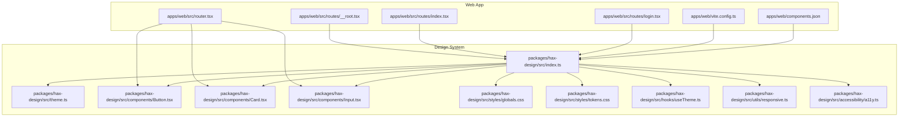
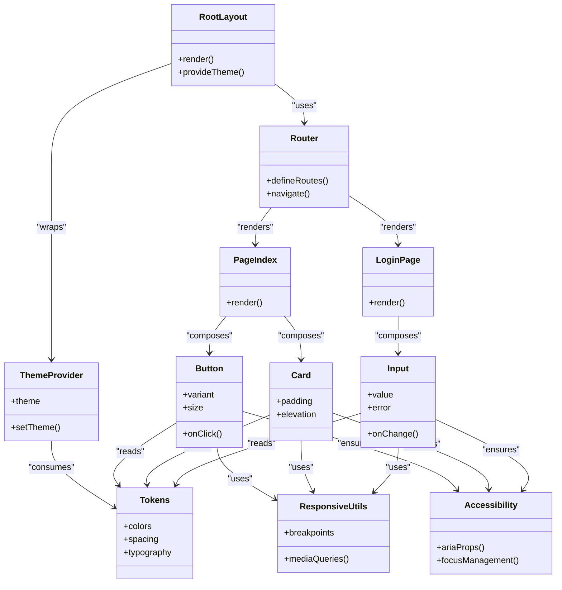
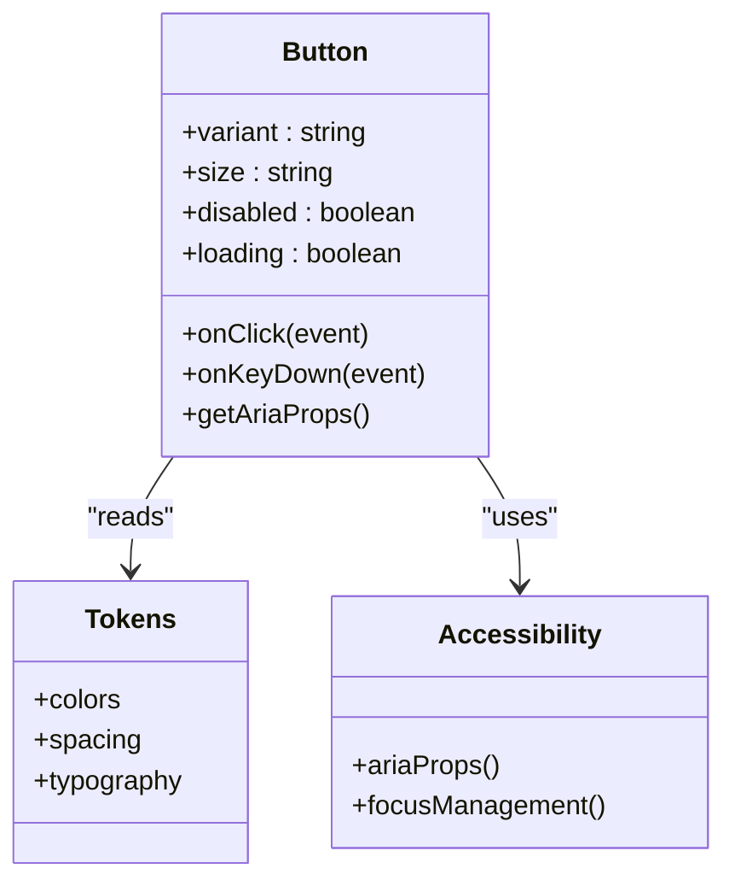
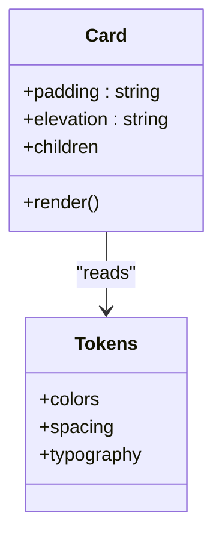
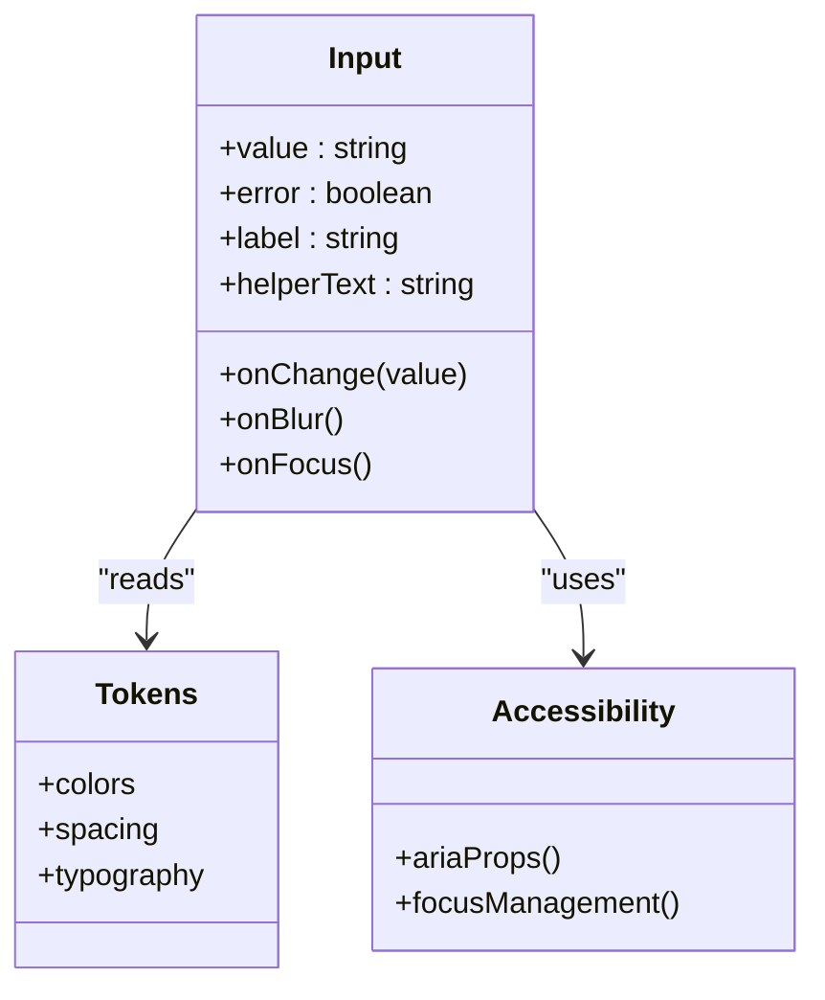
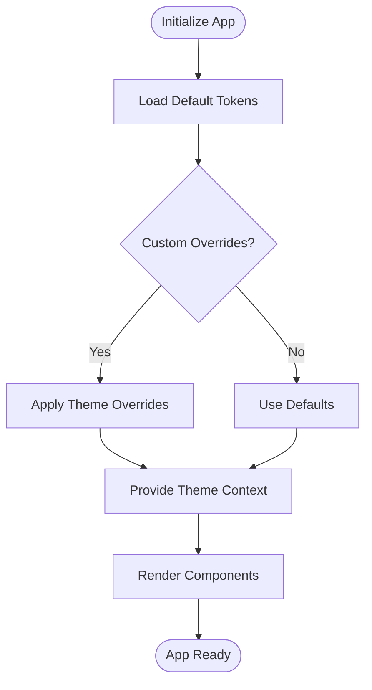
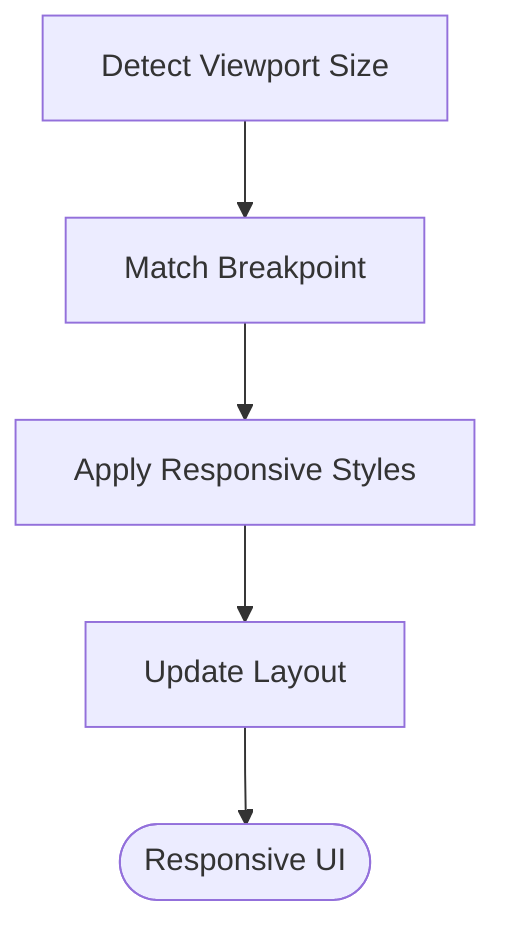
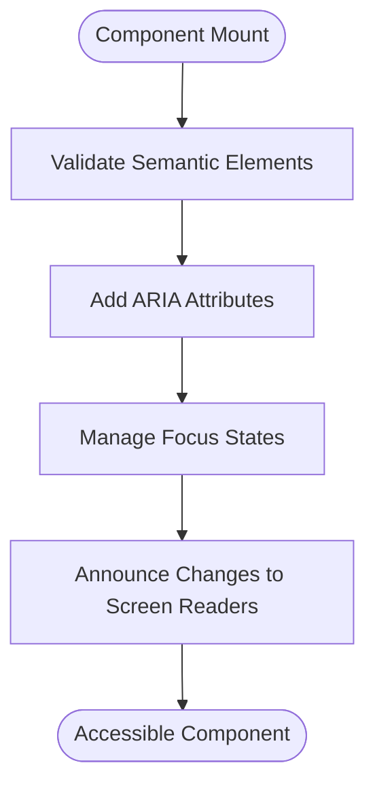
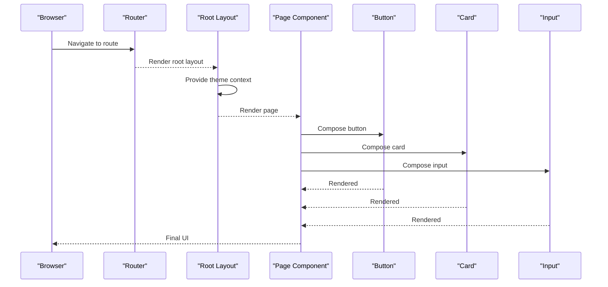
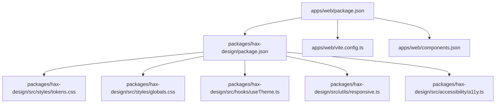

# UI Components & Design System

<cite>
**Referenced Files in This Document**
- [README.md](file://README.md)
- [DESIGN.md](file://DESIGN.md)
- [package.json](file://package.json)
- [pnpm-workspace.yaml](file://pnpm-workspace.yaml)
- [apps/web/package.json](file://apps/web/package.json)
- [apps/web/vite.config.ts](file://apps/web/vite.config.ts)
- [apps/web/components.json](file://apps/web/components.json)
- [apps/web/src/router.tsx](file://apps/web/src/router.tsx)
- [apps/web/src/routes/__root.tsx](file://apps/web/src/routes/__root.tsx)
- [apps/web/src/routes/index.tsx](file://apps/web/src/routes/index.tsx)
- [apps/web/src/routes/login.tsx](file://apps/web/src/routes/login.tsx)
- [apps/web/e2e/smoke.e2e.ts](file://apps/web/e2e/smoke.e2e.ts)
- [apps/web/e2e/chat-flows.e2e.ts](file://apps/web/e2e/chat-flows.e2e.ts)
- [apps/web/e2e/settings-dialog.e2e.ts](file://apps/web/e2e/settings-dialog.e2e.ts)
- [apps/web/playwright.config.ts](file://apps/web/playwright.config.ts)
- [apps/web/vitest.config.ts](file://apps/web/vitest.config.ts)
- [packages/hax-design/README.md](file://packages/hax-design/README.md)
- [packages/hax-design/package.json](file://packages/hax-design/package.json)
- [packages/hax-design/src/index.ts](file://packages/hax-design/src/index.ts)
- [packages/hax-design/src/theme.ts](file://packages/hax-design/src/theme.ts)
- [packages/hax-design/src/components/Button.tsx](file://packages/hax-design/src/components/Button.tsx)
- [packages/hax-design/src/components/Card.tsx](file://packages/hax-design/src/components/Card.tsx)
- [packages/hax-design/src/components/Input.tsx](file://packages/hax-design/src/components/Input.tsx)
- [packages/hax-design/src/styles/globals.css](file://packages/hax-design/src/styles/globals.css)
- [packages/hax-design/src/styles/tokens.css](file://packages/hax-design/src/styles/tokens.css)
- [packages/hax-design/src/hooks/useTheme.ts](file://packages/hax-design/src/hooks/useTheme.ts)
- [packages/hax-design/src/utils/responsive.ts](file://packages/hax-design/src/utils/responsive.ts)
- [packages/hax-design/src/accessibility/a11y.ts](file://packages/hax-design/src/accessibility/a11y.ts)
- [packages/hax-design/src/testing/mocks.ts](file://packages/hax-design/src/testing/mocks.ts)
</cite>

## Table of Contents

1. [Introduction](#introduction)
2. [Project Structure](#project-structure)
3. [Core Components](#core-components)
4. [Architecture Overview](#architecture-overview)
5. [Detailed Component Analysis](#detailed-component-analysis)
6. [Dependency Analysis](#dependency-analysis)
7. [Performance Considerations](#performance-considerations)
8. [Troubleshooting Guide](#troubleshooting-guide)
9. [Conclusion](#conclusion)
10. [Appendices](#appendices)

## Introduction

This document provides a comprehensive guide to the Fleet Pi UI components and design system. It explains the component architecture, reusable patterns, styling approach, and integration with the hax-design package. It also covers theme customization, responsive design principles, accessibility compliance, composition patterns, performance optimization, testing strategies, and visual regression testing approaches. The goal is to enable developers to create new components, extend existing ones, implement custom themes, and maintain consistent, accessible, and performant UI across the application.

## Project Structure

Fleet Pi organizes its UI layer under apps/web for the web application and packages/hax-design for the shared design system. The design system exposes typed components, theming utilities, responsive helpers, and accessibility utilities. The web app consumes these primitives via Vite-based tooling and integrates them into routes and pages.

Key structural elements:

- apps/web: Application entry points, routing, and page-level composition using hax-design components.
- packages/hax-design: Core design tokens, global styles, theme provider, component library, hooks, utilities, and testing mocks.

**Diagram sources**

- [apps/web/src/router.tsx](file://apps/web/src/router.tsx)
- [apps/web/src/routes/__root.tsx](file://apps/web/src/routes/__root.tsx)
- [apps/web/src/routes/index.tsx](file://apps/web/src/routes/index.tsx)
- [apps/web/src/routes/login.tsx](file://apps/web/src/routes/login.tsx)
- [apps/web/vite.config.ts](file://apps/web/vite.config.ts)
- [apps/web/components.json](file://apps/web/components.json)
- [packages/hax-design/src/index.ts](file://packages/hax-design/src/index.ts)
- [packages/hax-design/src/theme.ts](file://packages/hax-design/src/theme.ts)
- [packages/hax-design/src/components/Button.tsx](file://packages/hax-design/src/components/Button.tsx)
- [packages/hax-design/src/components/Card.tsx](file://packages/hax-design/src/components/Card.tsx)
- [packages/hax-design/src/components/Input.tsx](file://packages/hax-design/src/components/Input.tsx)
- [packages/hax-design/src/styles/globals.css](file://packages/hax-design/src/styles/globals.css)
- [packages/hax-design/src/styles/tokens.css](file://packages/hax-design/src/styles/tokens.css)
- [packages/hax-design/src/hooks/useTheme.ts](file://packages/hax-design/src/hooks/useTheme.ts)
- [packages/hax-design/src/utils/responsive.ts](file://packages/hax-design/src/utils/responsive.ts)
- [packages/hax-design/src/accessibility/a11y.ts](file://packages/hax-design/src/accessibility/a11y.ts)

**Section sources**

- [README.md](file://README.md)
- [DESIGN.md](file://DESIGN.md)
- [package.json](file://package.json)
- [pnpm-workspace.yaml](file://pnpm-workspace.yaml)
- [apps/web/package.json](file://apps/web/package.json)
- [apps/web/vite.config.ts](file://apps/web/vite.config.ts)
- [apps/web/components.json](file://apps/web/components.json)

## Core Components

The hax-design package provides foundational UI primitives that are consumed by the web app. These include:

- Button: Accessible, themed button with variants and sizes.
- Card: Container component for grouping related content with consistent spacing and elevation.
- Input: Form input with validation states, labels, and helper text.

These components are built on shared design tokens and CSS variables, enabling consistent theming and responsive behavior. They expose props for customization while maintaining accessibility best practices.

Component responsibilities:

- Button: Handles click events, keyboard navigation, focus management, and semantic markup.
- Card: Provides layout structure, padding, borders, and shadow tokens.
- Input: Manages form state integration, error messaging, and screen reader announcements.

Styling approach:

- CSS custom properties for colors, spacing, typography, and motion.
- Utility functions for responsive breakpoints and media queries.
- Global reset and base styles for consistency.

Accessibility:

- Semantic HTML elements and ARIA attributes where needed.
- Focus indicators and keyboard support.
- Color contrast and scalable text.

Testing:

- Unit tests for component behavior and prop validation.
- Snapshot tests for visual regression.
- Mocked providers for theme and context.

**Section sources**

- [packages/hax-design/src/components/Button.tsx](file://packages/hax-design/src/components/Button.tsx)
- [packages/hax-design/src/components/Card.tsx](file://packages/hax-design/src/components/Card.tsx)
- [packages/hax-design/src/components/Input.tsx](file://packages/hax-design/src/components/Input.tsx)
- [packages/hax-design/src/styles/globals.css](file://packages/hax-design/src/styles/globals.css)
- [packages/hax-design/src/styles/tokens.css](file://packages/hax-design/src/styles/tokens.css)
- [packages/hax-design/src/accessibility/a11y.ts](file://packages/hax-design/src/accessibility/a11y.ts)

## Architecture Overview

The UI architecture follows a layered approach:

- Presentation Layer: Route and page components compose hax-design primitives.
- Design System Layer: hax-design provides components, tokens, and utilities.
- Theming Layer: Theme configuration and provider supply values to components.
- Styling Layer: Global and token-based CSS variables ensure consistency.

**Diagram sources**

- [apps/web/src/routes/__root.tsx](file://apps/web/src/routes/__root.tsx)
- [apps/web/src/router.tsx](file://apps/web/src/router.tsx)
- [apps/web/src/routes/index.tsx](file://apps/web/src/routes/index.tsx)
- [apps/web/src/routes/login.tsx](file://apps/web/src/routes/login.tsx)
- [packages/hax-design/src/theme.ts](file://packages/hax-design/src/theme.ts)
- [packages/hax-design/src/components/Button.tsx](file://packages/hax-design/src/components/Button.tsx)
- [packages/hax-design/src/components/Card.tsx](file://packages/hax-design/src/components/Card.tsx)
- [packages/hax-design/src/components/Input.tsx](file://packages/hax-design/src/components/Input.tsx)
- [packages/hax-design/src/utils/responsive.ts](file://packages/hax-design/src/utils/responsive.ts)
- [packages/hax-design/src/accessibility/a11y.ts](file://packages/hax-design/src/accessibility/a11y.ts)

## Detailed Component Analysis

### Button Component

Button encapsulates interaction patterns, accessibility, and styling. It supports multiple variants (primary, secondary, ghost), sizes (sm, md, lg), and states (loading, disabled). Keyboard navigation and focus management are implemented to meet WCAG guidelines.

**Diagram sources**

- [packages/hax-design/src/components/Button.tsx](file://packages/hax-design/src/components/Button.tsx)
- [packages/hax-design/src/styles/tokens.css](file://packages/hax-design/src/styles/tokens.css)
- [packages/hax-design/src/accessibility/a11y.ts](file://packages/hax-design/src/accessibility/a11y.ts)

**Section sources**

- [packages/hax-design/src/components/Button.tsx](file://packages/hax-design/src/components/Button.tsx)
- [packages/hax-design/src/accessibility/a11y.ts](file://packages/hax-design/src/accessibility/a11y.ts)

### Card Component

Card provides a flexible container for grouping content. It applies consistent padding, border radius, and elevation tokens. It can be used as a wrapper for forms, lists, or dashboards.

**Diagram sources**

- [packages/hax-design/src/components/Card.tsx](file://packages/hax-design/src/components/Card.tsx)
- [packages/hax-design/src/styles/tokens.css](file://packages/hax-design/src/styles/tokens.css)

**Section sources**

- [packages/hax-design/src/components/Card.tsx](file://packages/hax-design/src/components/Card.tsx)

### Input Component

Input manages form interactions, validation states, and accessibility. It supports labels, helper text, error messages, and focus states. It integrates with theme tokens for consistent appearance.

**Diagram sources**

- [packages/hax-design/src/components/Input.tsx](file://packages/hax-design/src/components/Input.tsx)
- [packages/hax-design/src/styles/tokens.css](file://packages/hax-design/src/styles/tokens.css)
- [packages/hax-design/src/accessibility/a11y.ts](file://packages/hax-design/src/accessibility/a11y.ts)

**Section sources**

- [packages/hax-design/src/components/Input.tsx](file://packages/hax-design/src/components/Input.tsx)
- [packages/hax-design/src/accessibility/a11y.ts](file://packages/hax-design/src/accessibility/a11y.ts)

### Theme Provider and Customization

The theme provider supplies design tokens and allows runtime customization. Consumers can override tokens, add new colors, adjust spacing, and define typography scales. The provider ensures all components receive consistent values.

**Diagram sources**

- [packages/hax-design/src/theme.ts](file://packages/hax-design/src/theme.ts)
- [packages/hax-design/src/hooks/useTheme.ts](file://packages/hax-design/src/hooks/useTheme.ts)

**Section sources**

- [packages/hax-design/src/theme.ts](file://packages/hax-design/src/theme.ts)
- [packages/hax-design/src/hooks/useTheme.ts](file://packages/hax-design/src/hooks/useTheme.ts)

### Responsive Design Principles

Responsive utilities provide breakpoint definitions and media query helpers. Components use these utilities to adapt layouts and spacing based on viewport size. This ensures consistent experiences across devices.

**Diagram sources**

- [packages/hax-design/src/utils/responsive.ts](file://packages/hax-design/src/utils/responsive.ts)

**Section sources**

- [packages/hax-design/src/utils/responsive.ts](file://packages/hax-design/src/utils/responsive.ts)

### Accessibility Compliance

Accessibility utilities enforce semantic markup, ARIA attributes, and keyboard navigation. Components integrate these utilities to ensure compliance with WCAG guidelines. Focus management and screen reader announcements are handled consistently.

**Diagram sources**

- [packages/hax-design/src/accessibility/a11y.ts](file://packages/hax-design/src/accessibility/a11y.ts)

**Section sources**

- [packages/hax-design/src/accessibility/a11y.ts](file://packages/hax-design/src/accessibility/a11y.ts)

### Integration with Web App

The web app composes hax-design components within route handlers and pages. The router defines navigation, while root layout wraps the app with the theme provider. Pages import and render components directly.

**Diagram sources**

- [apps/web/src/router.tsx](file://apps/web/src/router.tsx)
- [apps/web/src/routes/__root.tsx](file://apps/web/src/routes/__root.tsx)
- [apps/web/src/routes/index.tsx](file://apps/web/src/routes/index.tsx)
- [apps/web/src/routes/login.tsx](file://apps/web/src/routes/login.tsx)
- [packages/hax-design/src/components/Button.tsx](file://packages/hax-design/src/components/Button.tsx)
- [packages/hax-design/src/components/Card.tsx](file://packages/hax-design/src/components/Card.tsx)
- [packages/hax-design/src/components/Input.tsx](file://packages/hax-design/src/components/Input.tsx)

**Section sources**

- [apps/web/src/router.tsx](file://apps/web/src/router.tsx)
- [apps/web/src/routes/__root.tsx](file://apps/web/src/routes/__root.tsx)
- [apps/web/src/routes/index.tsx](file://apps/web/src/routes/index.tsx)
- [apps/web/src/routes/login.tsx](file://apps/web/src/routes/login.tsx)

## Dependency Analysis

The web app depends on hax-design for components, theming, and utilities. The design system is versioned and consumed via workspace dependencies. Tooling like Vite configures imports and optimizations.

**Diagram sources**

- [apps/web/package.json](file://apps/web/package.json)
- [packages/hax-design/package.json](file://packages/hax-design/package.json)
- [apps/web/vite.config.ts](file://apps/web/vite.config.ts)
- [apps/web/components.json](file://apps/web/components.json)
- [packages/hax-design/src/styles/tokens.css](file://packages/hax-design/src/styles/tokens.css)
- [packages/hax-design/src/styles/globals.css](file://packages/hax-design/src/styles/globals.css)
- [packages/hax-design/src/hooks/useTheme.ts](file://packages/hax-design/src/hooks/useTheme.ts)
- [packages/hax-design/src/utils/responsive.ts](file://packages/hax-design/src/utils/responsive.ts)
- [packages/hax-design/src/accessibility/a11y.ts](file://packages/hax-design/src/accessibility/a11y.ts)

**Section sources**

- [apps/web/package.json](file://apps/web/package.json)
- [packages/hax-design/package.json](file://packages/hax-design/package.json)
- [apps/web/vite.config.ts](file://apps/web/vite.config.ts)
- [apps/web/components.json](file://apps/web/components.json)

## Performance Considerations

- Lazy loading: Import heavy components only when needed.
- Tree shaking: Ensure unused code is excluded from bundles.
- Memoization: Use memoization for expensive computations in components.
- CSS optimization: Leverage CSS variables and avoid redundant styles.
- Rendering efficiency: Minimize re-renders by stabilizing props and contexts.

[No sources needed since this section provides general guidance]

## Troubleshooting Guide

Common issues and resolutions:

- Theme not applied: Verify theme provider wrapping and token overrides.
- Responsive styles not working: Check breakpoint definitions and media queries.
- Accessibility warnings: Validate semantic markup and ARIA attributes.
- Visual regressions: Use snapshot tests and compare rendered outputs.

Debugging steps:

- Inspect component props and context values.
- Review console logs for errors and warnings.
- Run unit and e2e tests to identify failures.

**Section sources**

- [packages/hax-design/src/theme.ts](file://packages/hax-design/src/theme.ts)
- [packages/hax-design/src/utils/responsive.ts](file://packages/hax-design/src/utils/responsive.ts)
- [packages/hax-design/src/accessibility/a11y.ts](file://packages/hax-design/src/accessibility/a11y.ts)

## Conclusion

The Fleet Pi UI components and design system provide a robust foundation for building consistent, accessible, and performant interfaces. By leveraging hax-design, teams can create reusable components, customize themes, and maintain high standards for responsiveness and accessibility. Following the patterns and guidelines outlined here will streamline development and improve user experience.

[No sources needed since this section summarizes without analyzing specific files]

## Appendices

### Creating New Components

Steps to create a new component:

- Define props and types in the component file.
- Implement accessibility features using provided utilities.
- Apply theme tokens for styling.
- Write unit tests for behavior and snapshots for visuals.
- Export from the design system index.

**Section sources**

- [packages/hax-design/src/components/Button.tsx](file://packages/hax-design/src/components/Button.tsx)
- [packages/hax-design/src/accessibility/a11y.ts](file://packages/hax-design/src/accessibility/a11y.ts)
- [packages/hax-design/src/styles/tokens.css](file://packages/hax-design/src/styles/tokens.css)

### Extending Existing Components

To extend a component:

- Create a wrapper component that composes the base component.
- Pass through props and add additional functionality.
- Override styles using theme tokens or CSS classes.
- Test the extended component independently.

**Section sources**

- [packages/hax-design/src/components/Card.tsx](file://packages/hax-design/src/components/Card.tsx)
- [packages/hax-design/src/components/Input.tsx](file://packages/hax-design/src/components/Input.tsx)

### Implementing Custom Themes

To implement a custom theme:

- Define color palettes, spacing, and typography tokens.
- Merge with default tokens and provide via theme provider.
- Validate contrast ratios and accessibility compliance.
- Test across components to ensure consistency.

**Section sources**

- [packages/hax-design/src/theme.ts](file://packages/hax-design/src/theme.ts)
- [packages/hax-design/src/hooks/useTheme.ts](file://packages/hax-design/src/hooks/useTheme.ts)

### Testing Strategies

Unit testing:

- Test component props, state changes, and event handlers.
- Use mocking libraries for external dependencies.
- Assert rendered output and accessibility attributes.

Visual regression testing:

- Capture screenshots of components in different states.
- Compare against baseline images to detect changes.
- Integrate with CI/CD pipelines for automated checks.

E2E testing:

- Simulate user interactions across routes and flows.
- Validate critical paths like login and chat flows.
- Use Playwright for cross-browser testing.

**Section sources**

- [apps/web/vitest.config.ts](file://apps/web/vitest.config.ts)
- [apps/web/playwright.config.ts](file://apps/web/playwright.config.ts)
- [apps/web/e2e/smoke.e2e.ts](file://apps/web/e2e/smoke.e2e.ts)
- [apps/web/e2e/chat-flows.e2e.ts](file://apps/web/e2e/chat-flows.e2e.ts)
- [apps/web/e2e/settings-dialog.e2e.ts](file://apps/web/e2e/settings-dialog.e2e.ts)
- [packages/hax-design/src/testing/mocks.ts](file://packages/hax-design/src/testing/mocks.ts)
