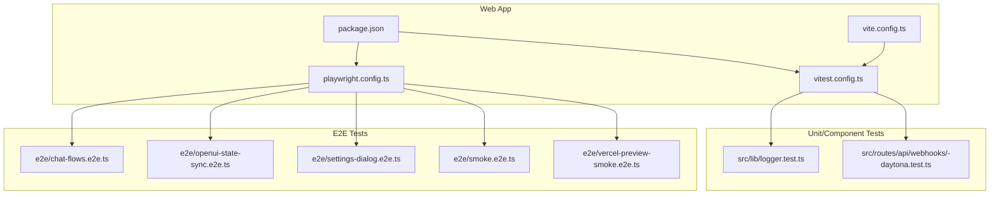
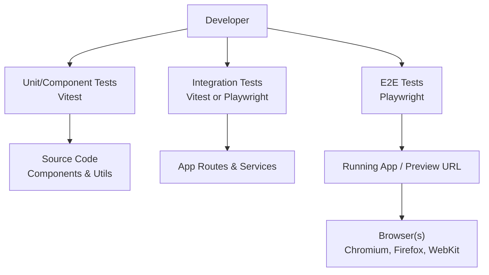
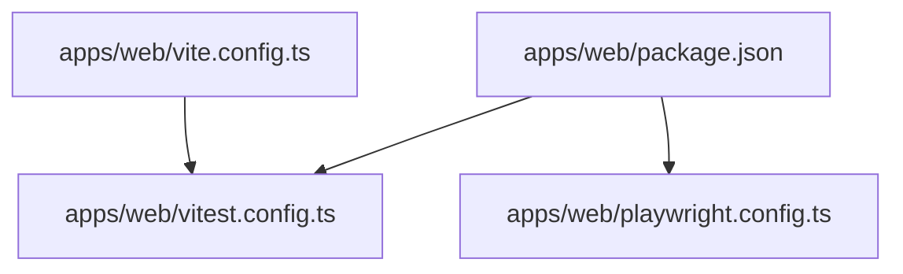

# UI Testing Strategies

<cite>
**Referenced Files in This Document**
- [package.json](file://apps/web/package.json)
- [vitest.config.ts](file://apps/web/vitest.config.ts)
- [playwright.config.ts](file://apps/web/playwright.config.ts)
- [chat-flows.e2e.ts](file://apps/web/e2e/chat-flows.e2e.ts)
- [openui-state-sync.e2e.ts](file://apps/web/e2e/openui-state-sync.e2e.ts)
- [settings-dialog.e2e.ts](file://apps/web/e2e/settings-dialog.e2e.ts)
- [smoke.e2e.ts](file://apps/web/e2e/smoke.e2e.ts)
- [vercel-preview-smoke.e2e.ts](file://apps/web/e2e/vercel-preview-smoke.e2e.ts)
- [logger.test.ts](file://apps/web/src/lib/logger.test.ts)
- [-daytona.test.ts](file://apps/web/src/routes/api/webhooks/-daytona.test.ts)
- [.circleci/config.yml](file://.circleci/config.yml)
- [vite.config.ts](file://apps/web/vite.config.ts)
</cite>

## Table of Contents

1. [Introduction](#introduction)
2. [Project Structure](#project-structure)
3. [Core Components](#core-components)
4. [Architecture Overview](#architecture-overview)
5. [Detailed Component Analysis](#detailed-component-analysis)
6. [Dependency Analysis](#dependency-analysis)
7. [Performance Considerations](#performance-considerations)
8. [Troubleshooting Guide](#troubleshooting-guide)
9. [Conclusion](#conclusion)
10. [Appendices](#appendices)

## Introduction

This document explains the UI testing strategies for Fleet Pi with a focus on the testing pyramid: unit tests for components and utilities, integration tests for user flows, and end-to-end (E2E) tests for critical paths. It covers setup and usage of Vitest for component/unit testing, Playwright for E2E testing, and guidance for visual regression testing. It also includes examples of testing component interactions, form validations, asynchronous operations, mocking strategies for APIs and third-party integrations, test data management, and continuous integration setup for automated UI testing.

## Project Structure

Fleet Pi’s web application is located under apps/web. The testing-related configuration and scripts are centralized there:

- Unit/component tests live alongside source files or in dedicated test files using Vitest conventions.
- E2E tests are organized under apps/web/e2e using Playwright.
- Configuration files define how tests run, including environment variables, base URLs, and browser settings.

**Diagram sources**

- [vite.config.ts](file://apps/web/vite.config.ts)
- [vitest.config.ts](file://apps/web/vitest.config.ts)
- [playwright.config.ts](file://apps/web/playwright.config.ts)
- [package.json](file://apps/web/package.json)
- [logger.test.ts](file://apps/web/src/lib/logger.test.ts)
- [-daytona.test.ts](file://apps/web/src/routes/api/webhooks/-daytona.test.ts)
- [chat-flows.e2e.ts](file://apps/web/e2e/chat-flows.e2e.ts)
- [openui-state-sync.e2e.ts](file://apps/web/e2e/openui-state-sync.e2e.ts)
- [settings-dialog.e2e.ts](file://apps/web/e2e/settings-dialog.e2e.ts)
- [smoke.e2e.ts](file://apps/web/e2e/smoke.e2e.ts)
- [vercel-preview-smoke.e2e.ts](file://apps/web/e2e/vercel-preview-smoke.e2e.ts)

**Section sources**

- [package.json](file://apps/web/package.json)
- [vitest.config.ts](file://apps/web/vitest.config.ts)
- [playwright.config.ts](file://apps/web/playwright.config.ts)
- [vite.config.ts](file://apps/web/vite.config.ts)

## Core Components

- Vitest: Used for unit and component tests. It runs in Node and can be configured to work with Vite’s module resolution and environment setup.
- Playwright: Used for E2E tests across browsers. It supports headless execution, fixtures, and robust selectors.
- Visual Regression: Not explicitly present in the repository; recommended tools include Playwright’s built-in screenshot comparisons or Percy/Applitools if adopted later.

Key responsibilities:

- Unit tests validate pure logic, utility functions, and small components in isolation.
- Integration tests verify multi-step user flows within the app context.
- E2E tests assert critical paths from the user’s perspective in real browsers.

**Section sources**

- [vitest.config.ts](file://apps/web/vitest.config.ts)
- [playwright.config.ts](file://apps/web/playwright.config.ts)

## Architecture Overview

The testing architecture follows a layered approach:

- Unit/Component layer (Vitest): Fast feedback on isolated code paths.
- Integration layer (optional within Vitest or Playwright): Validates interactions between modules and routes.
- E2E layer (Playwright): Validates complete user journeys in realistic environments.

[No sources needed since this diagram shows conceptual workflow, not actual code structure]

## Detailed Component Analysis

### Vitest Setup and Usage

- Configuration file defines test environment, globals, and matchers.
- Test files follow .test.ts naming convention and use standard assertion libraries.
- Useful patterns:
  - Mocking fetch or API clients for unit tests.
  - Wrapping components with necessary providers for rendering.
  - Using timers and fake async helpers for asynchronous operations.

Example references:

- Logger unit test demonstrates assertions on logging behavior.
- Webhook route test demonstrates mocking external services and asserting responses.

**Section sources**

- [vitest.config.ts](file://apps/web/vitest.config.ts)
- [logger.test.ts](file://apps/web/src/lib/logger.test.ts)
- [-daytona.test.ts](file://apps/web/src/routes/api/webhooks/-daytona.test.ts)

### Playwright E2E Setup and Usage

- Configuration file sets base URL, global timeouts, retries, and browser contexts.
- E2E tests cover key user flows such as chat sessions, state synchronization, and settings dialogs.
- Best practices:
  - Use stable selectors (data-testid) where possible.
  - Implement fixtures for common setup (auth, navigation).
  - Handle network requests via request interception when needed.

Example references:

- Chat flow E2E test validates message sending and response handling.
- OpenUI state sync E2E test ensures consistent state across views.
- Settings dialog E2E test verifies modal interactions and persistence.
- Smoke tests ensure basic app health and routing.

**Section sources**

- [playwright.config.ts](file://apps/web/playwright.config.ts)
- [chat-flows.e2e.ts](file://apps/web/e2e/chat-flows.e2e.ts)
- [openui-state-sync.e2e.ts](file://apps/web/e2e/openui-state-sync.e2e.ts)
- [settings-dialog.e2e.ts](file://apps/web/e2e/settings-dialog.e2e.ts)
- [smoke.e2e.ts](file://apps/web/e2e/smoke.e2e.ts)
- [vercel-preview-smoke.e2e.ts](file://apps/web/e2e/vercel-preview-smoke.e2e.ts)

### Visual Regression Testing

- Not currently implemented in the repository.
- Recommended approaches:
  - Playwright screenshots comparison with baseline images.
  - Third-party services like Percy or Applitools for cloud-based visual checks.
- Guidelines:
  - Stabilize layout by fixing fonts, viewport sizes, and dynamic content.
  - Maintain baselines per feature branch and merge carefully.
  - Use ignore regions for non-deterministic elements (ads, timestamps).

[No sources needed since this section provides general guidance]

### Testing Component Interactions

- Render components with required providers (e.g., query client, auth context).
- Simulate user actions (clicks, typing) and assert DOM changes.
- Validate side effects (state updates, API calls) via spies/mocks.

Example references:

- Component tests can mirror patterns seen in logger and webhook tests for assertions and mocking.

**Section sources**

- [logger.test.ts](file://apps/web/src/lib/logger.test.ts)
- [-daytona.test.ts](file://apps/web/src/routes/api/webhooks/-daytona.test.ts)

### Form Validations

- Assert initial validation states and error messages.
- Simulate input changes and blur events to trigger validation.
- Verify success paths and submission behavior.

Guidance:

- Use controlled inputs in tests to avoid flakiness.
- Stub asynchronous validators and network calls.

[No sources needed since this section provides general guidance]

### Asynchronous Operations

- Use timers and fake async utilities to control time-sensitive code.
- Await promises and network responses before assertions.
- Ensure proper cleanup to prevent test interference.

Guidance:

- Prefer deterministic waits over arbitrary delays.
- Use retry mechanisms sparingly and only when necessary.

[No sources needed since this section provides general guidance]

### Mocking Strategies

- API Calls:
  - Intercept fetch or HTTP clients at the network layer in E2E tests.
  - Replace service methods with mocks in unit tests.
- State Management:
  - Provide mock stores or query clients in component tests.
- Third-Party Integrations:
  - Stub SDKs or external libraries to isolate behavior.

Example references:

- Webhook test demonstrates mocking external services and asserting outcomes.

**Section sources**

- [-daytona.test.ts](file://apps/web/src/routes/api/webhooks/-daytona.test.ts)

### Test Data Management

- Centralize fixtures and factories for reusable test data.
- Keep test data close to the feature it tests.
- Avoid shared mutable state; reset between tests.

Guidance:

- Use seed data for E2E tests that require specific records.
- Randomize IDs to prevent collisions.

[No sources needed since this section provides general guidance]

### Continuous Integration Setup

- CircleCI configuration orchestrates test execution in CI pipelines.
- Typical steps:
  - Install dependencies.
  - Build the app.
  - Run unit/component tests.
  - Start the server or preview URL.
  - Execute E2E tests against the running instance.

Example reference:

- CircleCI config defines jobs and steps for automated testing.

**Section sources**

- [.circleci/config.yml](file://.circleci/config.yml)

## Dependency Analysis

Testing dependencies are declared in the web package manifest and referenced by configuration files:

- Vitest dependencies drive unit/component test execution.
- Playwright dependencies enable cross-browser E2E testing.
- Vite configuration influences module resolution and environment setup for tests.

**Diagram sources**

- [package.json](file://apps/web/package.json)
- [vitest.config.ts](file://apps/web/vitest.config.ts)
- [playwright.config.ts](file://apps/web/playwright.config.ts)
- [vite.config.ts](file://apps/web/vite.config.ts)

**Section sources**

- [package.json](file://apps/web/package.json)
- [vitest.config.ts](file://apps/web/vitest.config.ts)
- [playwright.config.ts](file://apps/web/playwright.config.ts)
- [vite.config.ts](file://apps/web/vite.config.ts)

## Performance Considerations

- Keep unit tests fast and isolated; avoid heavy I/O.
- Parallelize E2E tests across browsers where feasible.
- Use selective test runs (changed files) in local development.
- Minimize flaky waits; prefer explicit conditions and assertions.
- Cache dependencies and artifacts in CI to speed up pipelines.

[No sources needed since this section provides general guidance]

## Troubleshooting Guide

Common issues and resolutions:

- Flaky E2E tests:
  - Add explicit waits for network idle or element visibility.
  - Increase timeouts cautiously; investigate root causes first.
- Browser inconsistencies:
  - Pin browser versions in CI and locally.
  - Normalize viewport and device settings.
- Network failures:
  - Mock unstable endpoints; record responses for determinism.
- Environment variables:
  - Ensure required env vars are set in CI and local configs.

[No sources needed since this section provides general guidance]

## Conclusion

Fleet Pi’s UI testing strategy leverages Vitest for fast unit/component tests and Playwright for robust E2E coverage of critical user flows. By following the testing pyramid, adopting strong mocking strategies, and integrating tests into CI, the team can maintain high confidence in UI behavior while keeping feedback loops short. Adopting visual regression testing can further safeguard UI stability as the application evolves.

[No sources needed since this section summarizes without analyzing specific files]

## Appendices

### Example Test Scenarios

- Component Interaction:
  - Click buttons, fill forms, and assert rendered output and state changes.
- Form Validation:
  - Trigger validation on input changes and blur; assert error messages and success states.
- Asynchronous Operations:
  - Wait for network responses and update UI accordingly; assert final state.

[No sources needed since this section provides general guidance]

### CI Pipeline Overview

- Steps typically include dependency installation, build, unit tests, starting the app, and running E2E tests.
- Artifacts (screenshots, logs) should be uploaded for debugging.

**Section sources**

- [.circleci/config.yml](file://.circleci/config.yml)
