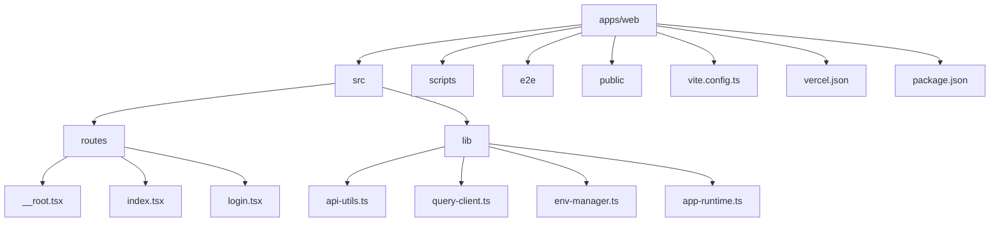
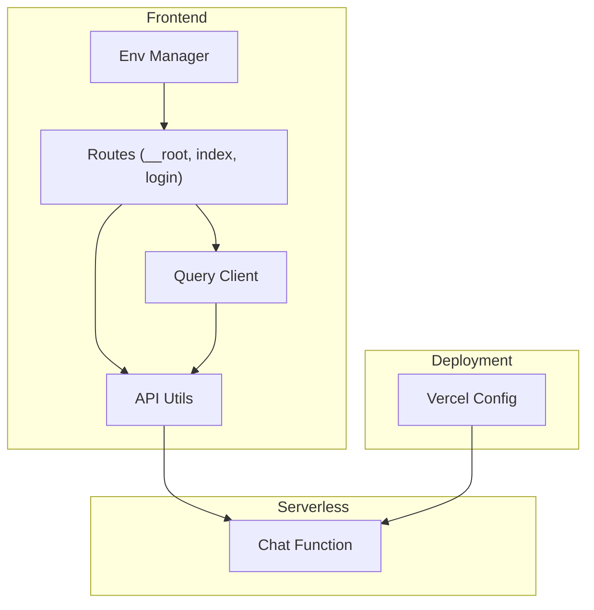
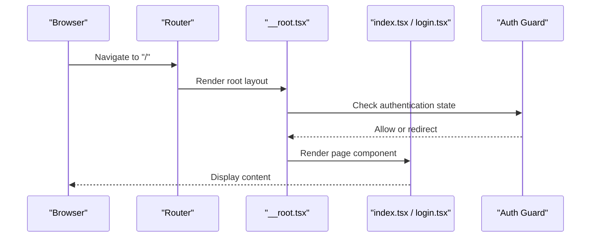
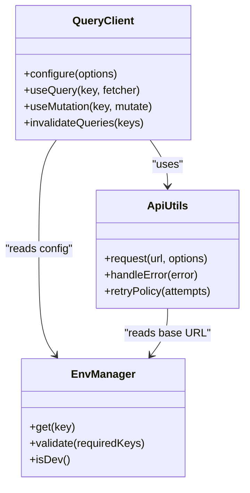
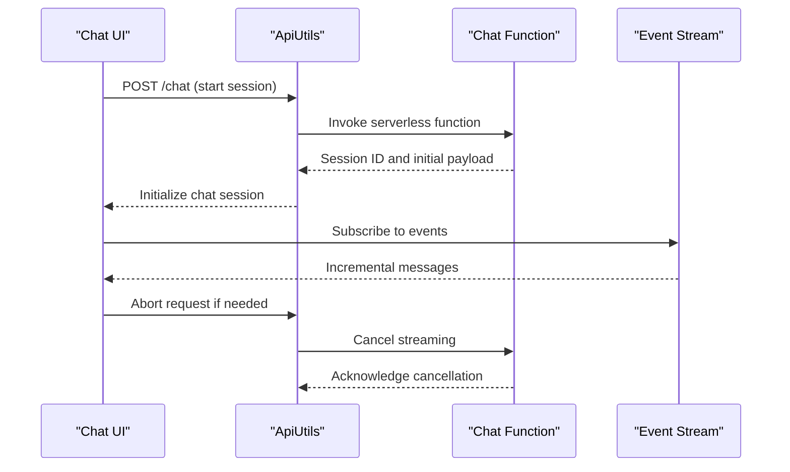
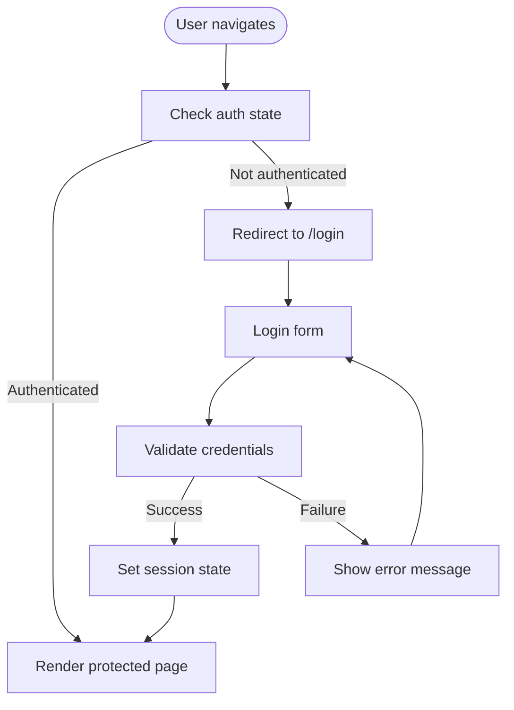
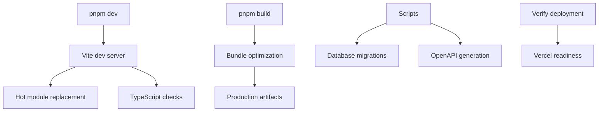
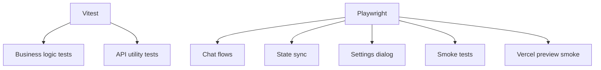
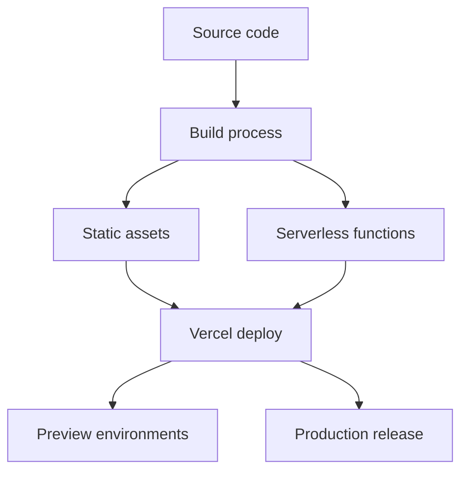
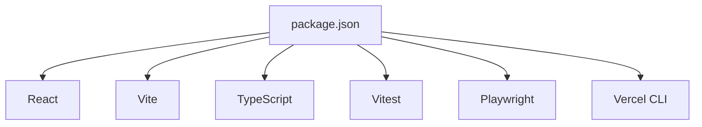

# Web Application

<cite>
**Referenced Files in This Document**
- [package.json](file://apps/web/package.json)
- [vite.config.ts](file://apps/web/vite.config.ts)
- [router.tsx](file://apps/web/src/router.tsx)
- [routeTree.gen.ts](file://apps/web/src/routeTree.gen.ts)
- [__root.tsx](file://apps/web/src/routes/__root.tsx)
- [index.tsx](file://apps/web/src/routes/index.tsx)
- [login.tsx](file://apps/web/src/routes/login.tsx)
- [query-client.ts](file://apps/web/src/lib/query-client.ts)
- [api-utils.ts](file://apps/web/src/lib/api-utils.ts)
- [env-manager.ts](file://apps/web/src/lib/env-manager.ts)
- [app-runtime.ts](file://apps/web/src/lib/app-runtime.ts)
- [chat.ts](file://functions/chat.ts)
- [vercel.json](file://apps/web/vercel.json)
- [playwright.config.ts](file://apps/web/playwright.config.ts)
- [vitest.config.ts](file://apps/web/vitest.config.ts)
- [auth-post-migrate.ts](file://apps/web/scripts/auth-post-migrate.ts)
- [generate-openapi.ts](file://apps/web/scripts/generate-openapi.ts)
- [build-vercel-output.mjs](file://apps/web/scripts/build-vercel-output.mjs)
- [verify-deployment-readiness.ts](file://apps/web/scripts/verify-deployment-readiness.ts)
- [chat-flows.e2e.ts](file://apps/web/e2e/chat-flows.e2e.ts)
- [openui-state-sync.e2e.ts](file://apps/web/e2e/openui-state-sync.e2e.ts)
- [settings-dialog.e2e.ts](file://apps/web/e2e/settings-dialog.e2e.ts)
- [smoke.e2e.ts](file://apps/web/e2e/smoke.e2e.ts)
- [vercel-preview-smoke.e2e.ts](file://apps/web/e2e/vercel-preview-smoke.e2e.ts)
</cite>

## Table of Contents

1. [Introduction](#introduction)
2. [Project Structure](#project-structure)
3. [Core Components](#core-components)
4. [Architecture Overview](#architecture-overview)
5. [Detailed Component Analysis](#detailed-component-analysis)
6. [Dependency Analysis](#dependency-analysis)
7. [Performance Considerations](#performance-considerations)
8. [Troubleshooting Guide](#troubleshooting-guide)
9. [Conclusion](#conclusion)
10. [Appendices](#appendices)

## Introduction

This document provides comprehensive documentation for the Fleet Pi web application, a modern React-based frontend built with Vite and integrated with serverless functions and external services. It covers routing structure, component architecture, state management patterns, API integration layers, real-time features, authentication flow, UI components, build configuration, development workflow, testing strategies, and deployment pipelines. Guidance is included for extending the application by adding new routes and implementing custom features following established patterns.

## Project Structure

The web application resides under apps/web and follows a feature-oriented organization:

- src/routes: Route definitions and page components
- src/lib: Shared libraries including API utilities, environment management, runtime configuration, and data fetching
- scripts: Build, migration, and verification utilities
- e2e: End-to-end tests using Playwright
- public: Static assets and manifest files
- Configuration files: Vite, TypeScript, ESLint, Vitest, Playwright, and Vercel deployment settings

**Diagram sources**

- [package.json](file://apps/web/package.json)
- [vite.config.ts](file://apps/web/vite.config.ts)
- [router.tsx](file://apps/web/src/router.tsx)
- [routeTree.gen.ts](file://apps/web/src/routeTree.gen.ts)
- [__root.tsx](file://apps/web/src/routes/__root.tsx)
- [index.tsx](file://apps/web/src/routes/index.tsx)
- [login.tsx](file://apps/web/src/routes/login.tsx)
- [api-utils.ts](file://apps/web/src/lib/api-utils.ts)
- [query-client.ts](file://apps/web/src/lib/query-client.ts)
- [env-manager.ts](file://apps/web/src/lib/env-manager.ts)
- [app-runtime.ts](file://apps/web/src/lib/app-runtime.ts)
- [vercel.json](file://apps/web/vercel.json)

**Section sources**

- [package.json](file://apps/web/package.json)
- [vite.config.ts](file://apps/web/vite.config.ts)
- [router.tsx](file://apps/web/src/router.tsx)
- [routeTree.gen.ts](file://apps/web/src/routeTree.gen.ts)

## Core Components

Key building blocks include:

- Routing: Generated route tree and root layout handling navigation and global state
- Data layer: Query client configuration and API utilities for consistent HTTP interactions
- Environment and runtime: Centralized environment variable management and app runtime initialization
- Real-time and serverless: Chat function integration via serverless endpoints

These components are designed to be modular and testable, enabling easy extension and maintenance.

**Section sources**

- [router.tsx](file://apps/web/src/router.tsx)
- [routeTree.gen.ts](file://apps/web/src/routeTree.gen.ts)
- [__root.tsx](file://apps/web/src/routes/__root.tsx)
- [index.tsx](file://apps/web/src/routes/index.tsx)
- [login.tsx](file://apps/web/src/routes/login.tsx)
- [query-client.ts](file://apps/web/src/lib/query-client.ts)
- [api-utils.ts](file://apps/web/src/lib/api-utils.ts)
- [env-manager.ts](file://apps/web/src/lib/env-manager.ts)
- [app-runtime.ts](file://apps/web/src/lib/app-runtime.ts)

## Architecture Overview

The application uses a layered architecture:

- Presentation layer: React components organized by routes
- State management: Client-side caching and synchronization via a query client
- API integration: Centralized utilities for HTTP requests and error handling
- Serverless functions: Backend endpoints for chat and other operations
- Deployment: Vercel configuration for serverless hosting and preview environments

**Diagram sources**

- [__root.tsx](file://apps/web/src/routes/__root.tsx)
- [index.tsx](file://apps/web/src/routes/index.tsx)
- [login.tsx](file://apps/web/src/routes/login.tsx)
- [query-client.ts](file://apps/web/src/lib/query-client.ts)
- [api-utils.ts](file://apps/web/src/lib/api-utils.ts)
- [env-manager.ts](file://apps/web/src/lib/env-manager.ts)
- [chat.ts](file://functions/chat.ts)
- [vercel.json](file://apps/web/vercel.json)

## Detailed Component Analysis

### Routing and Layout

The routing system is generated and managed through a central router configuration and route tree. The root layout handles global UI concerns such as authentication guards, theme, and analytics. Pages like index and login define user-facing entry points.

**Diagram sources**

- [router.tsx](file://apps/web/src/router.tsx)
- [routeTree.gen.ts](file://apps/web/src/routeTree.gen.ts)
- [__root.tsx](file://apps/web/src/routes/__root.tsx)
- [index.tsx](file://apps/web/src/routes/index.tsx)
- [login.tsx](file://apps/web/src/routes/login.tsx)

**Section sources**

- [router.tsx](file://apps/web/src/router.tsx)
- [routeTree.gen.ts](file://apps/web/src/routeTree.gen.ts)
- [__root.tsx](file://apps/web/src/routes/__root.tsx)
- [index.tsx](file://apps/web/src/routes/index.tsx)
- [login.tsx](file://apps/web/src/routes/login.tsx)

### Data Layer and State Management

The data layer leverages a query client for caching, background refetching, and optimistic updates. API utilities standardize request/response handling, error mapping, and retries. Environment variables are centralized to avoid leaks and ensure consistency across environments.

**Diagram sources**

- [query-client.ts](file://apps/web/src/lib/query-client.ts)
- [api-utils.ts](file://apps/web/src/lib/api-utils.ts)
- [env-manager.ts](file://apps/web/src/lib/env-manager.ts)

**Section sources**

- [query-client.ts](file://apps/web/src/lib/query-client.ts)
- [api-utils.ts](file://apps/web/src/lib/api-utils.ts)
- [env-manager.ts](file://apps/web/src/lib/env-manager.ts)

### Real-Time Features and Chat Integration

Real-time chat functionality integrates with a serverless function that streams responses. The frontend subscribes to events, manages session state, and updates the UI incrementally.

**Diagram sources**

- [api-utils.ts](file://apps/web/src/lib/api-utils.ts)
- [chat.ts](file://functions/chat.ts)

**Section sources**

- [api-utils.ts](file://apps/web/src/lib/api-utils.ts)
- [chat.ts](file://functions/chat.ts)

### Authentication Flow

Authentication is handled at the route level with guards protecting sensitive pages. Login redirects unauthenticated users and persists session state securely.

**Diagram sources**

- [__root.tsx](file://apps/web/src/routes/__root.tsx)
- [login.tsx](file://apps/web/src/routes/login.tsx)
- [api-utils.ts](file://apps/web/src/lib/api-utils.ts)

**Section sources**

- [__root.tsx](file://apps/web/src/routes/__root.tsx)
- [login.tsx](file://apps/web/src/routes/login.tsx)
- [api-utils.ts](file://apps/web/src/lib/api-utils.ts)

### Build Configuration and Development Workflow

Vite config defines build targets, plugins, and optimization settings. Scripts support migrations, OpenAPI generation, and deployment readiness checks. The development workflow includes hot reloading, linting, and type checking.

**Diagram sources**

- [vite.config.ts](file://apps/web/vite.config.ts)
- [auth-post-migrate.ts](file://apps/web/scripts/auth-post-migrate.ts)
- [generate-openapi.ts](file://apps/web/scripts/generate-openapi.ts)
- [verify-deployment-readiness.ts](file://apps/web/scripts/verify-deployment-readiness.ts)

**Section sources**

- [vite.config.ts](file://apps/web/vite.config.ts)
- [auth-post-migrate.ts](file://apps/web/scripts/auth-post-migrate.ts)
- [generate-openapi.ts](file://apps/web/scripts/generate-openapi.ts)
- [verify-deployment-readiness.ts](file://apps/web/scripts/verify-deployment-readiness.ts)

### Testing Strategies

Unit and integration tests use Vitest, while end-to-end scenarios are covered by Playwright. Tests validate chat flows, state synchronization, settings dialogs, and smoke tests for deployments.

**Diagram sources**

- [vitest.config.ts](file://apps/web/vitest.config.ts)
- [playwright.config.ts](file://apps/web/playwright.config.ts)
- [chat-flows.e2e.ts](file://apps/web/e2e/chat-flows.e2e.ts)
- [openui-state-sync.e2e.ts](file://apps/web/e2e/openui-state-sync.e2e.ts)
- [settings-dialog.e2e.ts](file://apps/web/e2e/settings-dialog.e2e.ts)
- [smoke.e2e.ts](file://apps/web/e2e/smoke.e2e.ts)
- [vercel-preview-smoke.e2e.ts](file://apps/web/e2e/vercel-preview-smoke.e2e.ts)

**Section sources**

- [vitest.config.ts](file://apps/web/vitest.config.ts)
- [playwright.config.ts](file://apps/web/playwright.config.ts)
- [chat-flows.e2e.ts](file://apps/web/e2e/chat-flows.e2e.ts)
- [openui-state-sync.e2e.ts](file://apps/web/e2e/openui-state-sync.e2e.ts)
- [settings-dialog.e2e.ts](file://apps/web/e2e/settings-dialog.e2e.ts)
- [smoke.e2e.ts](file://apps/web/e2e/smoke.e2e.ts)
- [vercel-preview-smoke.e2e.ts](file://apps/web/e2e/vercel-preview-smoke.e2e.ts)

### Deployment and External Services

Vercel configuration defines serverless functions, environment variables, and preview deployments. The build script prepares outputs compatible with Vercel’s platform.

**Diagram sources**

- [vercel.json](file://apps/web/vercel.json)
- [build-vercel-output.mjs](file://apps/web/scripts/build-vercel-output.mjs)
- [chat.ts](file://functions/chat.ts)

**Section sources**

- [vercel.json](file://apps/web/vercel.json)
- [build-vercel-output.mjs](file://apps/web/scripts/build-vercel-output.mjs)
- [chat.ts](file://functions/chat.ts)

## Dependency Analysis

The application’s dependencies are managed through package.json and workspace configurations. Key modules include React, Vite, TypeScript, testing frameworks, and deployment tooling.

**Diagram sources**

- [package.json](file://apps/web/package.json)

**Section sources**

- [package.json](file://apps/web/package.json)

## Performance Considerations

- Use lazy loading for routes to reduce initial bundle size
- Implement efficient caching strategies with the query client
- Minimize re-renders by memoizing components and selectors
- Optimize images and static assets through Vite’s build pipeline
- Monitor network requests and streaming performance for real-time features

[No sources needed since this section provides general guidance]

## Troubleshooting Guide

Common issues and resolutions:

- Authentication failures: Verify session state and token validity
- API errors: Check environment variables and endpoint availability
- Build failures: Ensure all dependencies are installed and types are correct
- Deployment issues: Validate Vercel configuration and function permissions

**Section sources**

- [api-utils.ts](file://apps/web/src/lib/api-utils.ts)
- [env-manager.ts](file://apps/web/src/lib/env-manager.ts)
- [verify-deployment-readiness.ts](file://apps/web/scripts/verify-deployment-readiness.ts)

## Conclusion

The Fleet Pi web application is structured around modular components, robust state management, and seamless integration with serverless functions. Its architecture supports scalability, maintainability, and rapid iteration. Following the documented patterns ensures consistent extensions and reliable deployments.

[No sources needed since this section summarizes without analyzing specific files]

## Appendices

- Extending Routes: Add new route files under src/routes and update the generated route tree
- Custom Features: Implement features within src/lib and integrate via API utilities
- Testing New Features: Write unit tests with Vitest and E2E scenarios with Playwright
- Deployment Checklist: Verify environment variables, build outputs, and function permissions

[No sources needed since this section provides general guidance]
