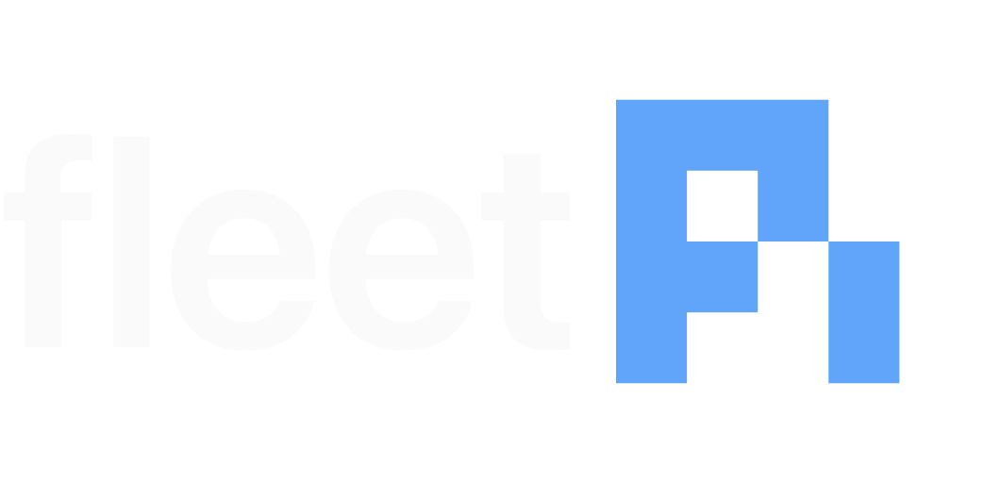

# Fleet Pi

<div align="center">
  
</div>

<div align="center">

[](LICENSE)
[](https://github.com/Qredence/fleet-pi/actions/workflows/ci.yml)
[](https://nodejs.org/)
[](https://pnpm.io/)

**A local browser workspace for Pi-powered coding agents, with durable plans, memory, and repo-scoped tools in Git.**

</div>

<!-- screenshot: capture from http://localhost:3000 and commit to docs/assets/ before publishing -->

---

## ✨ Why Fleet Pi?

Most coding-agent tools keep plans, memory, and session state locked away in the cloud or in ephemeral logs. Fleet Pi takes the opposite approach:

- **Reviewable agent state** — memory, plans, skills, and artifacts live in `agent-workspace/` and show up in normal Git diffs
- **Safe exploration before execution** — Plan mode lets the agent inspect your repo, produce numbered execution plans, and keep those plan cards resumable across refresh/resume without touching files
- **Local-first with your own credentials** — runs entirely on your machine using standard AWS Bedrock credentials; no hosted SaaS account required
- **Composable with your Pi resources** — project-local skills, prompts, and extensions load automatically from `.pi/` and `agent-workspace/pi/`

## ⚡ Quick Start

```zsh
git clone https://github.com/Qredence/fleet-pi.git
cd fleet-pi
pnpm install
cp .env.example .env
pnpm dev
```

Then open [http://localhost:3000](http://localhost:3000) and verify the health
endpoint:

```zsh
# in a second terminal
curl http://localhost:3000/api/health
```

Full setup instructions:

- [docs/README.md](docs/README.md) for the docs hub and recommended reading
  order
- [docs/quickstart.md](docs/quickstart.md) for standalone and Pi/Codex setup
- [docs/codex.md](docs/codex.md) for the advanced Codex local environment
- [docs/adaptive-workspace.md](docs/adaptive-workspace.md) for the accepted
  canonical workspace contract

## 🚀 Features

| Category        | Capability                                                                                           |
| --------------- | ---------------------------------------------------------------------------------------------------- |
| 💬 Chat         | Persistent Pi sessions, streaming responses, session resume after refresh                            |
| 🛠 Tools        | Repo-scoped `read`, `write`, `edit`, and `bash` in Agent mode                                        |
| 🗺 Planning     | Read-only Plan mode with structured execution plans, follow-up questions, and resumable plan actions |
| 🧠 Memory       | `agent-workspace/` keeps memory, plans, evals, and artifacts in Git                                  |
| 🔌 Resources    | Browser for project-local Pi skills, prompts, and extensions                                         |
| 🏗 Architecture | TanStack Start app + Nitro backend + React 19 UI                                                     |

## 📋 Prerequisites

Before you start, make sure you have:

- **Node.js >=22** — [nodejs.org](https://nodejs.org/)
- **pnpm 10.33.3** via [Corepack](https://nodejs.org/api/corepack.html): `corepack enable && corepack prepare pnpm@10.33.3 --activate`
- **AWS account with Bedrock access** — Claude models must be enabled in your region
- **AWS credentials configured** — `~/.aws/credentials`, environment variables, or an IAM role
- `AWS_REGION` defaults to `us-east-1` if not set

## 🛠 Setup Paths

### Standalone

Run Fleet Pi locally as a web app with Pi-backed chat. You need Bedrock access
and AWS credentials, but no Codex app or multi-agent operator setup.

### Pi / Codex

Use Fleet Pi's shared Codex local environment and worktree bootstrap flow.
Fleet Pi ships `.codex/environments/environment.toml` and
`.codex/workspace-bootstrap.zsh` for that path.

## 🧠 Key Concepts

### Agent mode and Plan mode

- **Agent mode** enables repo-scoped coding tools (`read`, `write`, `edit`,
  `bash`) plus approved external Pi tools.
- **Plan mode** is read-only. The agent inspects the repo, asks focused
  follow-up questions, and produces numbered execution plans. Structured plan
  cards keep execute / stay / refine actions visible after refresh or session
  resume, while legacy text parsing remains as a compatibility fallback.

### `agent-workspace/`

`agent-workspace/` is Fleet Pi's durable adaptive layer and the canonical
durable adaptive state.

- Human-facing docs live under [`docs/`](docs/).
- Agent-facing memory, plans, skills, evals, artifacts, and scratch space live
  under [`agent-workspace/`](agent-workspace/).
- Workspace-installed Pi resources live under `agent-workspace/pi/`, while root
  `.pi/settings.json` stays a small compatibility bridge.
- `agent-workspace/indexes/` is reserved for non-canonical projection storage.

Read more in [docs/adaptive-workspace.md](docs/adaptive-workspace.md).

### Project-local Pi resources

Fleet Pi loads committed project resources from `.pi/` and surfaces them in the
chat resources browser. Chat-driven installs go into `agent-workspace/pi/`, and
the UI distinguishes active, staged, and reload-required workspace resources so
they stay discoverable and reviewable.

## ✅ Validation

```zsh
# from repo root
pnpm lint
pnpm typecheck
pnpm --filter web test
pnpm validate-agents-md
```

Useful extra checks:

```zsh
pnpm build
pnpm e2e
pnpm syncpack
pnpm generate:docs
```

## 📚 Docs

| Document                                                 | Description                                          |
| -------------------------------------------------------- | ---------------------------------------------------- |
| [docs/README.md](docs/README.md)                         | Docs hub and recommended reading order               |
| [docs/quickstart.md](docs/quickstart.md)                 | Recommended setup paths                              |
| [docs/agent-workspace.md](docs/agent-workspace.md)       | Human guide to the durable workspace model           |
| [docs/adaptive-workspace.md](docs/adaptive-workspace.md) | Canonical workspace contract and projection boundary |
| [docs/codex.md](docs/codex.md)                           | Advanced Codex environment and action setup          |
| [docs/runbooks.md](docs/runbooks.md)                     | Operator runbooks for runtime issues                 |
| [docs/architecture.md](docs/architecture.md)             | Generated architecture reference                     |
| [docs/api.md](docs/api.md)                               | Generated API reference                              |
| [docs/project-structure.md](docs/project-structure.md)   | Generated repo map                                   |

## 🤝 Contributing

Contributions are welcome! Please read the relevant guides before opening a PR:

- [CONTRIBUTING.md](CONTRIBUTING.md) — how to contribute code and open issues
- [CODE_OF_CONDUCT.md](CODE_OF_CONDUCT.md) — community standards
- [SECURITY.md](SECURITY.md) — how to report vulnerabilities responsibly
- [GitHub Issues](https://github.com/Qredence/fleet-pi/issues) — bug reports and feature requests

**Development notes:**

- `apps/web` is the TanStack Start app and `/api/chat` backend
- `packages/ui` contains the shared React UI and agent-elements integration
- `apps/web/src/routeTree.gen.ts` is generated — do not edit by hand

## 📄 License

[](LICENSE)

Fleet Pi is released under the [Apache 2.0 License](LICENSE).
