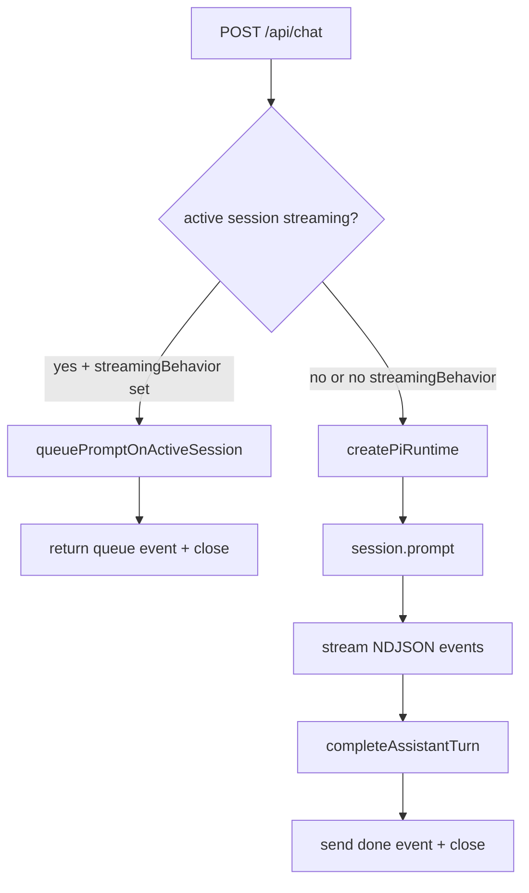
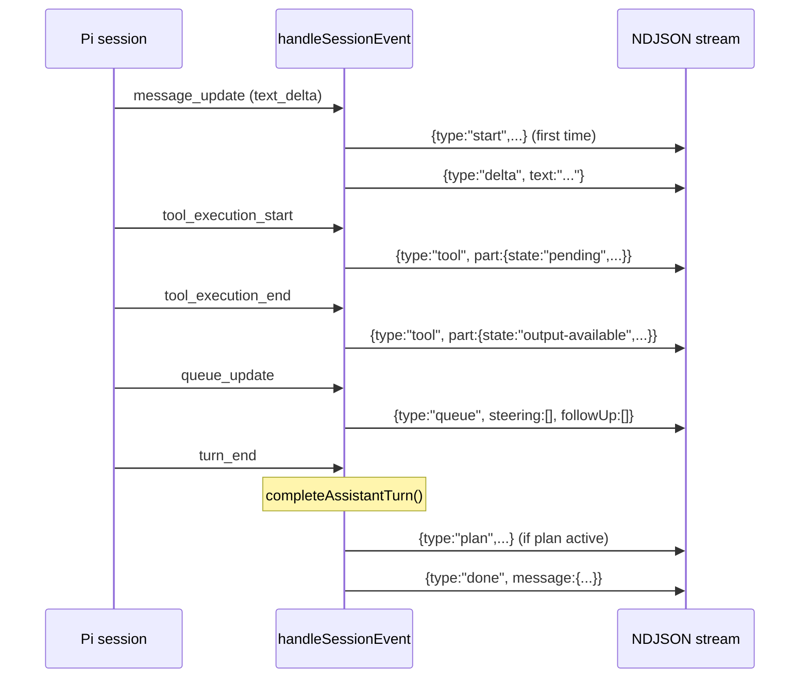
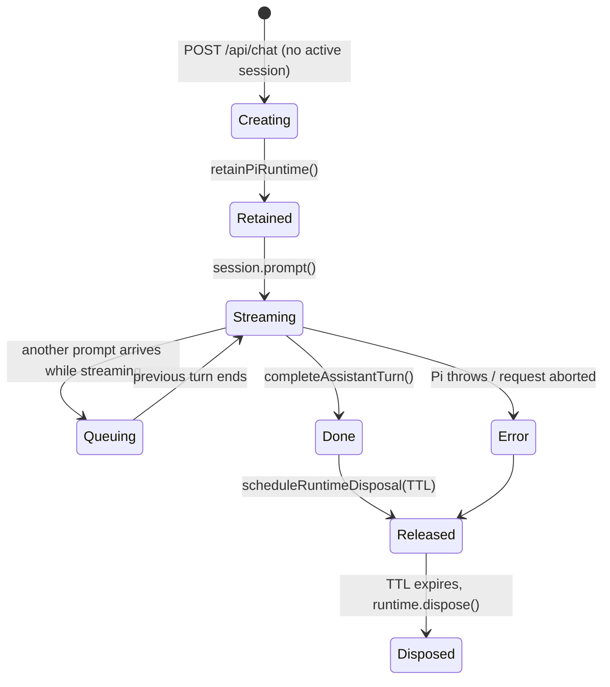

# Chat API and streaming

The chat API is the server-side backbone of Fleet Pi. It accepts a user message, streams the Pi agent's response as newline-delimited JSON events, and manages the lifecycle of `AgentSessionRuntime` instances in memory.

Related pages:

- [Web app overview](./index.md)
- [Pi server integration](./pi-integration.md)
- [Full API endpoint reference](../../api/endpoints.md)
- [Chat feature overview](../../features/chat.md)

---

## POST /api/chat

**File:** `apps/web/src/routes/api/chat.ts`

The primary endpoint. Accepts a JSON body, creates or resumes a Pi runtime, streams events back as `application/x-ndjson`.

### Request body (`ChatRequest`)

```ts
type ChatRequest = {
  message: string // Required. User's prompt.
  sessionFile?: string // Resume by file path.
  sessionId?: string // Resume by session ID.
  model?: ChatModelSelection // Override model for this turn.
  mode?: "agent" | "plan" | "harness"
  planAction?: "execute" | "refine"
  streamingBehavior?: "steer" | "followUp" // Queue instead of block.
  userId?: string // Injected from auth session.
  userEmail?: string
}
```

Defined in `packages/pi-protocol/src/chat-protocol.ts`, validated at runtime with the Zod schema in `packages/pi-protocol/src/chat-protocol.zod.ts`.

### Follow-up queuing

If `streamingBehavior` is set and there is already an active streaming session for the same `sessionId`, the prompt is queued on the live session rather than waiting for a new connection. The endpoint returns a `queue` event immediately and closes.



### Authentication

If Better Auth is configured (`FLEET_PI_BETTER_AUTH_*`), the auth session is resolved from request headers and `userId` / `userEmail` are attached to the request body before processing.

---

## NDJSON event types

Each line in the response body is a JSON-encoded `ChatStreamEvent`. The client reads with a streaming fetch and parses each line.

| `type`       | When emitted                         | Key fields                                                                   |
| ------------ | ------------------------------------ | ---------------------------------------------------------------------------- |
| `start`      | Start of each assistant turn         | `id`, `runId`, `sessionId`, `sessionFile`, `sessionReset?`, `diagnostics?`   |
| `delta`      | Each text chunk from the model       | `text`, `messageId?`                                                         |
| `thinking`   | Extended thinking delta              | `text`, `messageId?`                                                         |
| `tool`       | Tool state change (start/update/end) | `part: ChatToolPart`, `messageId?`                                           |
| `plan`       | Plan state snapshot                  | `mode`, `executing`, `completed`, `total`, `state`                           |
| `state`      | Agent lifecycle signal               | `state.name` (agent_start/end, turn_start/end, …)                            |
| `queue`      | Prompt queued on active session      | `steering[]`, `followUp[]`                                                   |
| `compaction` | Context compaction start/end         | `phase`, `reason`, `aborted?`, `willRetry?`                                  |
| `retry`      | Auto-retry start/end                 | `phase`, `attempt`, `maxAttempts`, `delayMs`, `errorMessage`                 |
| `done`       | Turn complete                        | `runId`, `message: ChatMessage`, `sessionId`, `sessionFile`, `sessionReset?` |
| `error`      | Fatal or turn error                  | `message`, `runId?`                                                          |

Types are defined in `packages/pi-protocol/src/chat-protocol.ts`.

---

## Event normalization

**File:** `apps/web/src/lib/pi/server-chat-stream.ts`

The raw `AgentSessionEvent` stream from `pi-coding-agent` is converted into `ChatStreamEvent` objects inside `handleSessionEvent()`.

Key responsibilities:

- **Text deltas** → `delta` events, accumulated into `parts[]` on the in-progress `AssistantTurnState`.
- **Thinking deltas** → `thinking` events, upserted as a thinking part.
- **Tool execution events** (`tool_execution_start`, `tool_execution_update`, `tool_execution_end`) → `tool` events via `toToolPart()`. Tool inputs are cached in a `Map<toolCallId, input>` so updates carry the full input forward.
- **Queue/compaction/retry events** → buffered until the first assistant turn begins, then flushed. This avoids sending buffered events before the `start` event.
- **`message_end` with `stopReason: "error"`** → `error` event.
- **Turn finalization** → `finalizePlanTurn()` is called to extract plan state and emit a `plan` event + `tool-PlanWrite` part if applicable. Then `done` is emitted.



### AssistantTurnState

```ts
type AssistantTurnState = {
  assistantId: string // UUID, used as message ID
  hadError: boolean
  parts: Array<ChatMessagePart> // Accumulated message parts
  runId: string
  thinkingText: string
  toolInputs: Map<string, Record<string, unknown>>
}
```

---

## Supporting endpoints

All under `apps/web/src/routes/api/chat/`.

### GET /api/chat/session

Returns session metadata + hydrated messages from the JSONL session file. Validates that `sessionFile` is inside the configured session directory before opening.

**File:** `apps/web/src/routes/api/chat/session.ts`
**Logic:** `apps/web/src/lib/pi/server-sessions.ts` → `hydrateChatSession()`

### GET /api/chat/sessions

Lists all Pi sessions under the project's session directory, ordered by modification time.

**File:** `apps/web/src/routes/api/chat/sessions.ts`

### POST /api/chat/new

Creates a new empty Pi session and returns its metadata.

**File:** `apps/web/src/routes/api/chat/new.ts`

### POST /api/chat/resume

Hydrates a session by `sessionFile` or `sessionId`. Equivalent to a GET /api/chat/session but via POST with a JSON body.

**File:** `apps/web/src/routes/api/chat/resume.ts`

### POST /api/chat/abort

Aborts the currently active stream for a session. Calls `session.abortBash()`, `session.abortRetry()`, `session.abortCompaction()`, then `session.abort()`.

**File:** `apps/web/src/routes/api/chat/abort.ts`
**Logic:** `apps/web/src/lib/pi/server-runtime.ts` → `abortActiveSession()`

### POST /api/chat/question

Delivers a user's answer to an in-progress `questionnaire` tool call or a plan-mode decision. The tool's `Promise` is resolved and the Pi session continues streaming.

**File:** `apps/web/src/routes/api/chat/question.ts`
**Logic:** `apps/web/src/lib/pi/server-runtime.ts` → `answerChatQuestion()`

### GET /api/chat/models

Returns available models from Pi's `ModelRegistry`, the selected model key, and any diagnostics.

**File:** `apps/web/src/routes/api/chat/models.ts`
**Logic:** `apps/web/src/lib/pi/runtime/model-catalog.ts` → `loadChatModels()`

### GET /api/chat/resources

Returns loaded skills, prompts, extensions, themes, and diagnostics from Pi's `ResourceLoader` merged with workspace-local resources.

**File:** `apps/web/src/routes/api/chat/resources.ts`
**Logic:** `apps/web/src/lib/pi/runtime/resource-catalog.ts` → `loadChatResources()`

### GET /api/chat/settings (+ PUT)

GET returns current effective Pi settings (from `.pi/settings.json`) and project-level overrides. PUT applies a partial update to `.pi/settings.json`.

**File:** `apps/web/src/routes/api/chat/settings.ts`
**Logic:** `apps/web/src/lib/pi/server-settings.ts`

### GET /api/chat/provenance (run.ts, runs.ts)

Returns run provenance records stored during streaming. Used to inspect which tools were called during a run.

**Files:** `apps/web/src/routes/api/chat/provenance.ts`, `run.ts`, `runs.ts`

---

## Session lifecycle



### Runtime cache

**File:** `apps/web/src/lib/pi/server-runtime.ts`

In-process `Map<sessionId, ActiveSessionRecord>`:

```ts
type ActiveSessionRecord = {
  runtime: AgentSessionRuntime
  sessionFile?: string
  sessionId: string
  userId?: string
  lastUsedAt: number
  disposeTimer?: ReturnType<typeof setTimeout>
}
```

- `retainPiRuntime()` — clears any pending disposal timer, returns a release function.
- `scheduleRuntimeDisposal()` — sets a `setTimeout` for `RUNTIME_TTL_MS` (default 10 minutes, overridden by `FLEET_PI_RUNTIME_TTL_MS`). If the session is still streaming when the timer fires, the disposal is rescheduled.
- On disposal: `clearPlanModeSession()`, `runtimeRecords.delete()`, `releaseUserSandbox()` if the user has no other active runtimes, `runtime.dispose()`.

### Session matching

`findRuntimeRecord()` matches on `sessionFile` (realpath-resolved) or `sessionId`, and optionally checks `userId` to prevent cross-user access.

---

## Circuit breaker

**File:** `apps/web/src/lib/pi/circuit-breaker.ts`

Uses the `opossum` library to wrap `createAgentSessionFromServices` (the Bedrock API call).

```ts
const BEDROCK_CIRCUIT_BREAKER_OPTIONS = {
  errorThresholdPercentage: 50, // open after 50% failures
  resetTimeout: 30_000, // try again after 30 s
  volumeThreshold: 5, // need at least 5 calls before tripping
  timeout: 30_000, // 30 s per request
  name: "bedrock-api",
}
```

When the breaker is open, requests immediately get a `"Bedrock API is temporarily unavailable"` error rather than waiting. The breaker resets after 30 seconds.

---

## Neon session mirror

When `FLEET_PI_CHAT_DATABASE_URL` is set, `syncPiSessionMirrorSafely()` is called fire-and-forget after each stream completes. It mirrors Pi session entries, run events, tool executions, and file mutations into Neon Postgres tables prefixed with `pi_`. The JSONL file remains the source of truth; mirror failures are swallowed and must not affect streaming.

**File:** `apps/web/src/lib/db/pi-session-mirror.ts`
