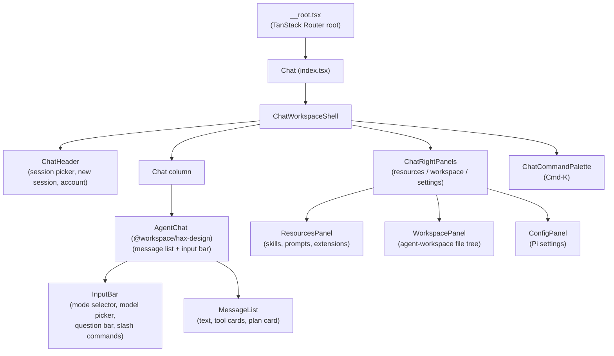

# apps/web — Web application

`apps/web` is the browser-facing half of Fleet Pi. It is a [TanStack Start](https://tanstack.com/start) app (React 19 + Vite + Nitro) that serves a streaming chat UI backed by the Pi coding agent. Users type a message, it streams back text and tool cards, and optionally switches into Plan mode for safe read-only exploration.

Related pages:

- [System architecture](../../overview/architecture.md)
- [Chat feature overview](../../features/chat.md)
- [Agent elements UI library](../../packages/hax-design/agent-elements.md)
- [Full API endpoint reference](../../api/endpoints.md)
- [Daytona sandbox](../../features/daytona-sandbox.md)

---

## What it does

- Streams chat responses from Pi via `POST /api/chat` (newline-delimited JSON).
- Renders tool calls (read, write, edit, bash, questionnaire, …) as interactive cards.
- Manages persistent Pi sessions: users can switch sessions, start new ones, and resume after page reload.
- Exposes a right-side panel for Pi resources, workspace file browser, and Pi settings.
- Supports two chat modes: **Agent** (full tools, writes files) and **Plan** (read-only, produces a numbered plan).
- Optionally mirrors sessions to Neon Postgres and runs Pi tools inside Daytona sandboxes per user.

---

## Directory layout

```
apps/web/
├── src/
│   ├── routes/                  # TanStack Router file routes
│   │   ├── __root.tsx           # Root layout (theme, auth context)
│   │   ├── index.tsx            # Main chat page — ChatWorkspaceShell
│   │   ├── login.tsx            # Login page (Better Auth)
│   │   └── api/                 # Server-only API handlers
│   │       ├── chat.ts          # POST /api/chat — streaming chat
│   │       ├── chat/
│   │       │   ├── abort.ts     # POST /api/chat/abort
│   │       │   ├── models.ts    # GET  /api/chat/models
│   │       │   ├── new.ts       # POST /api/chat/new
│   │       │   ├── question.ts  # POST /api/chat/question
│   │       │   ├── resources.ts # GET  /api/chat/resources
│   │       │   ├── resume.ts    # POST /api/chat/resume
│   │       │   ├── session.ts   # GET  /api/chat/session
│   │       │   ├── sessions.ts  # GET  /api/chat/sessions
│   │       │   ├── settings.ts  # GET/PUT /api/chat/settings
│   │       │   ├── provenance.ts# GET  /api/chat/provenance
│   │       │   ├── run.ts       # GET  /api/chat/run/:id
│   │       │   └── runs.ts      # GET  /api/chat/runs
│   │       ├── workspace/       # /api/workspace/tree, /api/workspace/file
│   │       ├── sandbox/         # /api/sandbox/* (Daytona)
│   │       ├── auth/            # Better Auth catch-all
│   │       ├── health.ts        # GET /api/health
│   │       └── webhooks/
│   └── lib/
│       ├── pi/                  # Pi client + server integration
│       │   ├── chat-protocol.ts         # Re-exported from @workspace/hax-design
│       │   ├── server-runtime.ts        # Runtime cache, session lifecycle
│       │   ├── server-chat-stream.ts    # Event normalization
│       │   ├── server-sessions.ts       # Session creation & hydration
│       │   ├── server-catalog.ts        # Model & resource loading
│       │   ├── server-shared.ts         # Session services helpers
│       │   ├── server-settings.ts       # Settings read/write
│       │   ├── server.ts                # Re-exports for server handlers
│       │   ├── plan-mode.ts             # Plan mode logic & extension
│       │   ├── plan-state.ts            # Plan state machine
│       │   ├── plan-parser.ts           # Plan: / [DONE:n] parsing
│       │   ├── plan-questionnaire.ts    # questionnaire tool registration
│       │   ├── command-policy.ts        # Bash allowlist for Plan mode
│       │   ├── circuit-breaker.ts       # Bedrock circuit breaker
│       │   ├── use-pi-chat.ts           # React hook — chat state
│       │   ├── use-chat-shell-state.ts  # React hook — shell state
│       │   ├── use-chat-view.ts         # React hooks — session labels, suggestions
│       │   ├── use-pending-question-bar.ts
│       │   ├── chat-queries.ts          # TanStack Query wrappers
│       │   └── chat-helpers.ts
│       ├── auth/                # Better Auth setup
│       ├── daytona/             # Daytona sandbox integration
│       ├── workspace/           # agent-workspace file access
│       ├── db/                  # Neon Postgres session mirror
│       └── app-runtime.ts       # AppRuntimeContext resolution
├── package.json
└── vite.config.ts
```

---

## Tech stack

| Layer                | Choice                                                                   |
| -------------------- | ------------------------------------------------------------------------ |
| Framework            | TanStack Start (file-based SSR + API routes via Nitro)                   |
| UI                   | React 19                                                                 |
| Bundler              | Vite                                                                     |
| Routing              | TanStack Router (auto-generated `routeTree.gen.ts`)                      |
| Styling              | Tailwind CSS v4 (config in `packages/hax-design/src/styles/globals.css`) |
| Server runtime       | Nitro (Node adapter)                                                     |
| LLM integration      | `@earendil-works/pi-coding-agent` + Amazon Bedrock                       |
| Auth                 | Better Auth                                                              |
| Database (optional)  | Neon Postgres (`FLEET_PI_CHAT_DATABASE_URL`)                             |
| Sandboxes (optional) | Daytona (`FLEET_PI_DAYTONA_*`)                                           |
| Data fetching        | TanStack Query                                                           |
| Component library    | `@workspace/hax-design` (packages/hax-design)                            |

---

## Entry points

**Browser entry:** `apps/web/src/routes/index.tsx` — exports `Chat` component wrapped in `ChatWorkspaceShell`.

**Server API entry:** `apps/web/src/routes/api/chat.ts` — the main streaming endpoint.

**App root:** `apps/web/src/routes/__root.tsx` — TanStack Router root layout. Sets up auth context and theme.

---

## Component hierarchy



---

## Data flow

```mermaid
sequenceDiagram
    participant Browser
    participant index.tsx
    participant /api/chat
    participant server-runtime
    participant Pi

    Browser->>index.tsx: user types message, clicks send
    index.tsx->>index.tsx: usePiChat hook builds ChatRequest
    index.tsx->>/api/chat: POST {message, sessionId, mode, model}
    /api/chat->>server-runtime: createPiRuntime()
    server-runtime->>Pi: createAgentSessionRuntime / resume
    Pi-->>server-runtime: AgentSessionRuntime
    /api/chat->>Pi: session.prompt(message)
    Pi-->>server-runtime: AgentSessionEvent stream
    server-runtime-->>Browser: NDJSON events (start, delta, tool, done)
    Browser->>index.tsx: handleSessionEvent() updates React state
    index.tsx->>Browser: re-render message list with streamed content
```

---

## Key hooks

- **`usePiChat`** (`apps/web/src/lib/pi/use-pi-chat.ts`) — the central chat hook. Manages messages, session metadata, streaming status, queue, and plan state. Sends to `/api/chat`, processes NDJSON events.
- **`useChatShellState`** (`apps/web/src/lib/pi/use-chat-shell-state.ts`) — shell-level state: right panel, mode, model, theme preference, resource canvas width.
- **`usePendingQuestionBar`** (`apps/web/src/lib/pi/use-pending-question-bar.ts`) — detects unanswered `tool-Question` parts in the last message and renders the InputBar question bar.
- **`useChatModels` / `useChatResources` / `useChatSettings`** (`apps/web/src/lib/pi/chat-queries.ts`) — TanStack Query wrappers for the supporting REST endpoints.

---

## Sub-pages

- [Chat API and streaming](./chat-api.md)
- [Pi server integration](./pi-integration.md)
- [Plan mode](./plan-mode.md)
