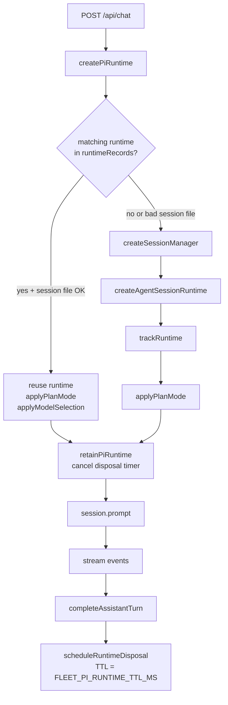

# Pi server integration

Fleet Pi uses `@earendil-works/pi-coding-agent` as its server-side LLM agent framework. This page explains how the web app creates, manages, and tears down Pi `AgentSessionRuntime` instances, how tools and extensions are wired in, how models are selected, and how Pi JSONL sessions persist across page reloads.

Related pages:

- [Web app overview](./index.md)
- [Chat API and streaming](./chat-api.md)
- [Plan mode](./plan-mode.md)

---

## Package overview

| Package                           | Role                                                                                 |
| --------------------------------- | ------------------------------------------------------------------------------------ |
| `@earendil-works/pi-coding-agent` | Primary facade. Session runtime, tools, resource loading, session manager, services. |
| `@earendil-works/pi-ai`           | Low-level model abstraction (`Model`, `ModelRegistry`).                              |
| `@earendil-works/pi-agent-core`   | Core agent message types (`AgentMessage`, etc.).                                     |

The web app imports almost exclusively from `pi-coding-agent`. Direct use of `pi-ai` or `pi-agent-core` types is limited to specific places where model or message-level details are needed.

---

## AppRuntimeContext

**File:** `apps/web/src/lib/app-runtime.ts`

All server handlers start with `resolveAppRuntimeContext()`:

```ts
type AppRuntimeContext = {
  projectRoot: string // Repo root (FLEET_PI_REPO_ROOT or cwd)
  workspaceRoot: string // <projectRoot>/agent-workspace
  workspaceBootstrap?: Promise<WorkspaceHealthResponse>
  workspaceFS?: WorkspaceFS // Injected for Daytona (sandbox FS)
}
```

`projectRoot` controls where Pi looks for `.pi/settings.json`, skill/prompt/extension resources, and where session JSONL files are stored. It defaults to `process.cwd()` and can be overridden with `FLEET_PI_REPO_ROOT`.

---

## AgentSessionServices

**File:** `apps/web/src/lib/pi/server-shared.ts` → `createSessionServices()`

Every request that needs Pi creates session services:

```ts
const services = await createAgentSessionServices({
  cwd: context.projectRoot,
  agentDir: process.env.PI_AGENT_DIR ?? getAgentDir(),
  ...overrides,
})
```

Services include:

- **`modelRegistry`** — discovers available Bedrock models.
- **`settingsManager`** — reads `.pi/settings.json`, project-scoped overrides, and environment variables.
- **`resourceLoader`** — loads skills, prompts, extensions, themes, and AGENTS.md files from the configured resource paths.
- **`diagnostics`** — array of startup warnings (missing credentials, misconfigured resources, etc.).

`createSessionServices()` also runs `bootstrapAgentWorkspace()` in the background to seed `agent-workspace/` if it does not exist, and attaches any bootstrap warnings as diagnostics.

---

## AgentSessionRuntime lifecycle

**File:** `apps/web/src/lib/pi/server-runtime.ts`



### createPiRuntime

1. If Daytona is enabled for this user (`isDaytonaEnabled`), acquires or creates a Daytona sandbox and sets `context.workspaceFS` and `context.workspaceRoot` before continuing.
2. Calls `createSessionServices()` to build session services.
3. Calls `getSessionDir()` to resolve the JSONL session directory.
4. Checks `findRuntimeRecord()` — if a live runtime exists for this session, it is reused (model/plan mode updated).
5. If no live runtime, calls `createSessionManager()` to open or create the session JSONL file, then calls `createAgentSessionRuntime()` with a factory function.

### createAgentSessionRuntime factory

The factory is invoked by `pi-coding-agent` with `cwd`, `agentDir`, `sessionManager`, and `sessionStartEvent`. Inside:

1. Creates a fresh `AgentSessionServices` with the plan mode extension included:
   ```ts
   resourceLoaderOptions: {
     extensionFactories: [createPlanModeExtension()],
   }
   ```
2. Resolves the model and thinking level via `resolveModelSelection()`.
3. If Daytona is enabled, builds `customTools` — sandbox-scoped versions of `bash`, `read`, `write`, `edit`, `grep`, `find`, `ls`.
4. Fires through the **session creation circuit breaker** (`sessionCircuitBreaker.fire(...)`) which wraps `createAgentSessionFromServices`.

### Tool allowlist

`CHAT_TOOL_ALLOWLIST` in `apps/web/src/lib/pi/plan-mode.ts` is passed as the `tools` parameter to every new session. It is the union of all mode-specific tool sets:

```
read, bash, edit, write, workspace_write, resource_install, questionnaire,
web_fetch, grep, find, ls,
project_inventory, workspace_index,
autocontext_*, autoresearch_*, subagent,
daytona_*, web_search, code_search, get_search_content, fetch_content
```

The active subset is then narrowed per-turn by `session.setActiveToolsByName()` based on mode (agent / plan / harness). See [Plan mode](./plan-mode.md) for the per-mode allowlists.

---

## Session management

**File:** `apps/web/src/lib/pi/server-sessions.ts`

Pi sessions are JSONL files stored under `.fleet/sessions/` (or the path from `settingsManager.getSessionDir()`).

### SessionManager

`SessionManager` (from `pi-coding-agent`) owns the JSONL file:

- `SessionManager.create(repoRoot, sessionDir)` — creates a new empty session.
- `SessionManager.open(sessionFile, sessionDir, repoRoot)` — opens an existing session; throws if corrupt.
- `SessionManager.list(repoRoot, sessionDir)` — lists sessions with metadata.

### isUsableSessionFile

Before opening a session, `isUsableSessionFile(sessionFile, sessionDir)` checks:

1. The file exists on disk.
2. The realpath of the file is inside the realpath of `sessionDir`.

This prevents path traversal via symlinks or relative paths.

### hydrateChatSession

Called by `GET /api/chat/session`. Opens the session JSONL, converts entries to `ChatMessage[]` via `sessionEntriesToChatMessages()`, restores any persisted plan state, and returns session metadata + messages.

### Session reset

If the requested `sessionFile`/`sessionId` does not resolve to a usable file, a fresh session is created and `sessionReset: true` is included in the response so the browser can update its stored metadata.

---

## Model selection and catalog

**File:** `apps/web/src/lib/pi/server-catalog.ts`

### loadChatModels

- Reads models from `services.modelRegistry.getAvailable()`.
- Maps to `ChatModelInfo` (key, provider, id, name, reasoning, contextWindow, etc.).
- Resolves the default provider/model from `settingsManager`.
- Returns `ChatModelsResponse` including `selectedModelKey`.

### resolveModelSelection

Translates a `ChatModelSelection` (either a `"provider/model"` string or a structured `{provider, id, thinkingLevel}` object) into a `Model` instance from the registry. Handles Amazon Bedrock cross-region prefixes (`us.`, `eu.`, `au.`, `global.`) and inference profile suffixes.

### applyModelSelection

Called when reusing an existing runtime. Calls `session.setModel()` and `session.setThinkingLevel()` if the selection differs from the current session model.

---

## Resource loading

**File:** `apps/web/src/lib/pi/server-catalog.ts` → `loadChatResources()`

Pi's `ResourceLoader` (inside `AgentSessionServices`) discovers resources from:

- Project-local `.pi/skills/`, `.pi/prompts/`, `.pi/extensions/`, `.pi/themes/`
- `agent-workspace/pi/skills/`, etc. (via settings `skills`, `prompts` arrays in `.pi/settings.json`)
- npm packages listed under `packages` in `.pi/settings.json`

`loadChatResources()` calls the loader's `getSkills()`, `getPrompts()`, `getExtensions()`, `getThemes()`, and `getAgentsFiles()` methods, then merges results with workspace-local resource catalog data (managed by `apps/web/src/lib/pi/workspace-resource-catalog.ts`).

Diagnostics from all sources are merged and deduplicated before being returned.

---

## Pi extensions

**Directory:** `.pi/extensions/`

Extensions hook into Pi's event bus via the `ExtensionAPI`. The web app registers extensions at session service creation time:

| Extension         | File                                                             | Purpose                                                                      |
| ----------------- | ---------------------------------------------------------------- | ---------------------------------------------------------------------------- |
| Plan mode         | `apps/web/src/lib/pi/plan-mode.ts` → `createPlanModeExtension()` | Tool filtering, bash policy, mode context injection                          |
| project_inventory | `.pi/extensions/project-inventory.ts`                            | Read-only project inventory tool                                             |
| workspace_index   | `.pi/extensions/workspace-index.ts`                              | Read-only workspace index tool                                               |
| filechanges       | `.pi/extensions/vendor/filechanges/`                             | `/filechanges`, `/filechanges-accept`, `/filechanges-decline` slash commands |
| subagents         | `.pi/extensions/vendor/subagents/`                               | `subagent` tool                                                              |

The plan mode extension is the only one injected programmatically via `extensionFactories`. The others are loaded from disk by the resource loader.

### Extension event hooks (plan mode extension)

| Hook                 | Behavior                                                                                 |
| -------------------- | ---------------------------------------------------------------------------------------- |
| `before_agent_start` | Injects mode context message (plan/harness/agent/execution)                              |
| `tool_call`          | Blocks unsafe bash commands in plan/harness mode; blocks `edit`/`write` in harness mode  |
| `context`            | Filters out stale mode context messages (keeps only the most recent for the active mode) |
| `turn_end`           | Updates plan execution progress (marks steps done via `[DONE:n]` tags)                   |

---

## Pi JSONL sessions

Pi sessions are stored as append-only JSONL files. Each line is a session entry (user message, assistant message, tool call, custom entry, etc.).

The web app uses custom entries to persist:

- **`plan-mode`** — serialized `PlanModeState`, used to restore plan state after page reload.
- **`chat-message-id-map`** — maps Pi's internal message IDs to the web app's UUID-based chat message IDs, enabling stable React keys across hydration.

On reload, `hydrateChatSession()` reads the JSONL file, converts entries to messages, and attaches the restored plan state as a `tool-PlanWrite` part on the last assistant message.

---

## Daytona integration

**Directory:** `apps/web/src/lib/daytona/`

When `isDaytonaEnabled(userId)` returns true (based on env vars), `createPiRuntime()`:

1. Calls `getUserSandbox({ userId, userEmail })` to acquire or create a Daytona sandbox.
2. Sets `context.workspaceFS` to a sandbox-backed filesystem.
3. Sets `context.workspaceRoot` to `/home/daytona/fleet-pi/agent-workspace`.
4. Builds `customTools` — thin wrappers around Daytona sandbox operations — to replace the default file system tools. This means Pi's `read`, `write`, `edit`, `bash`, `grep`, `find`, `ls` operations execute inside the sandbox rather than the host.

The sandbox is released (`releaseUserSandbox`) when all runtimes for a user are disposed.

See [Daytona sandbox](../../features/daytona-sandbox.md) for the full feature description.

---

## Settings persistence

**File:** `apps/web/src/lib/pi/server-settings.ts`

`GET /api/chat/settings` returns:

- `effective` — merged settings (defaults + global Pi config + project `.pi/settings.json`).
- `project` — the project-scoped overrides only.
- `projectPath` — absolute path of `.pi/settings.json`.
- `diagnostics` — any settings-load warnings.
- `updateImpact` — whether a new session is recommended or a resource reload is required after the update.

`PUT /api/chat/settings` (via `updateChatSettings`) applies a partial `ChatPiSettingsUpdate` to `.pi/settings.json`. Provider credentials are never stored here; they belong in environment/Pi auth configuration.
