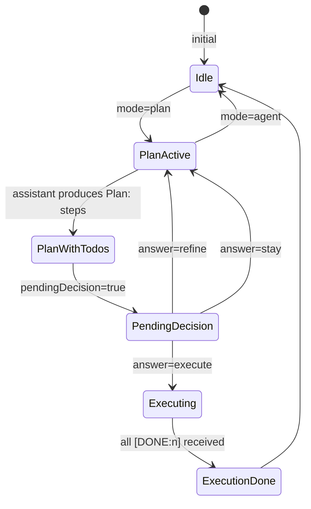

# Plan mode

Plan mode is a read-only chat mode where Pi explores a codebase, produces a numbered plan, and then asks the user whether to execute it, refine it, or stay in plan mode. No files are written and no unsafe commands run until the user explicitly chooses to execute.

Related pages:

- [Web app overview](./index.md)
- [Pi server integration](./pi-integration.md)
- [Chat API and streaming](./chat-api.md)

---

## What plan mode does

When a user selects **Plan** in the mode selector, the next message is handled differently:

1. Pi is restricted to a read-only tool subset.
2. Pi is instructed to produce a response with a `Plan:` header followed by numbered steps.
3. The server extracts the numbered steps, stores them as a `PlanModeState`, and emits a `tool-PlanWrite` tool card in the chat.
4. The tool card presents three choices: **Execute**, **Refine**, or **Stay in plan mode**.
5. The user's choice is delivered to the server via `POST /api/chat/question`. The server resolves the pending promise inside the `questionnaire` tool and the Pi session continues.

---

## Key files

| File                                        | Purpose                                                                                                 |
| ------------------------------------------- | ------------------------------------------------------------------------------------------------------- |
| `apps/web/src/lib/pi/plan-mode.ts`          | Plan mode extension, tool allowlists, mode context injection, `applyPlanMode()`, `answerPlanDecision()` |
| `apps/web/src/lib/pi/plan-state.ts`         | `PlanModeState` type, state machine transitions, serialization                                          |
| `apps/web/src/lib/pi/plan-parser.ts`        | Extract `Plan:` steps from assistant text, track `[DONE:n]` tags                                        |
| `apps/web/src/lib/pi/plan-questionnaire.ts` | `questionnaire` tool registration and pending-question resolution                                       |
| `apps/web/src/lib/pi/command-policy.ts`     | Bash command allowlist for plan/harness modes                                                           |

---

## Tool allowlists by mode

`apps/web/src/lib/pi/plan-mode.ts` defines per-mode tool sets. The active set is applied to the session via `session.setActiveToolsByName()`.

| Mode        | Allowed tools                                                                                                                                                                                                                               |
| ----------- | ------------------------------------------------------------------------------------------------------------------------------------------------------------------------------------------------------------------------------------------- |
| **Plan**    | `read`, `bash` (read-only), `grep`, `find`, `ls`, `questionnaire`, `project_inventory`, `workspace_index`, `autocontext_status`, `autocontext_scenarios`, `autocontext_runtime_snapshot`, `web_search`, `code_search`, `get_search_content` |
| **Harness** | Adds `workspace_write`, `resource_install`, `web_fetch`, plus Daytona sandbox tools and full web access. Excludes `edit` and `write`.                                                                                                       |
| **Agent**   | Full set — adds `edit`, `write`, `autocontext_judge`, `autocontext_improve`, `autocontext_queue`, `init_experiment`, `run_experiment`, `log_experiment`, `subagent`, `fetch_content`.                                                       |

The `CHAT_TOOL_ALLOWLIST` (union of all modes) is the master list passed to `createAgentSessionFromServices`. The active subset is narrowed by `setActiveToolsByName` at turn time.

---

## Bash command policy

**File:** `apps/web/src/lib/pi/command-policy.ts`

In plan and harness modes, the plan mode extension intercepts every `bash` tool call and evaluates it with `evaluatePlanCommand()`. Blocked:

- **Command separators**: `;`, `&&`, `||`
- **Shell syntax**: `$()`, backticks, redirects (`>`, `>>`), process substitution, `bash -c`, `node -e`, `python -c`
- **Mutating commands**: `rm`, `mv`, `cp`, `mkdir`, `touch`, `chmod`, `chown`, `ln`, `kill`, `sudo`, …
- **Network commands**: `curl`, `wget`, `nc`, `ssh`, `rsync`, …
- **`git` write operations**: only `status`, `log`, `diff`, `show`, `branch`, `remote`, `ls-files`, `ls-tree`, and `config --get` are allowed.
- **Package manager installs**: only `list`/`ls`/`why` subcommands pass.
- **Control characters** (except tab/newline/CR) and commands longer than 10,000 characters.
- **`awk system(...)`** and `sed` without `-n`.

Allowed read-only commands include: `cat`, `head`, `tail`, `grep`, `find`, `ls`, `pwd`, `echo`, `wc`, `sort`, `uniq`, `diff`, `stat`, `du`, `df`, `tree`, `which`, `env`, `ps`, `jq`, `rg`, `fd`, `bat`, `eza`, and similar.

A blocked bash call is returned to Pi as a tool error with a clear reason, so Pi can adjust its approach without the user seeing a crash.

---

## Plan state machine

**File:** `apps/web/src/lib/pi/plan-state.ts`

```ts
type PlanModeState = {
  enabled: boolean // true while in plan mode
  executing: boolean // true after user chose Execute
  todos: Array<TodoItem> // extracted plan steps
  pendingDecision?: boolean // waiting for execute/refine/stay
  pendingDecisionToolCallId?: string
}
```

State transitions via `applyPlanModeSelection()`:



**Persistence:** Each state transition is appended as a custom entry to the Pi JSONL session file (`customType: "plan-mode"`). On page reload, `hydrateChatSession()` reads the last `plan-mode` entry and restores the state. This means the plan card is reconstructed after refresh.

---

## Plan step extraction

**File:** `apps/web/src/lib/pi/plan-parser.ts`

`extractTodoItems(text)` looks for a `Plan:` header (case-insensitive, with optional bold markers) and then matches numbered items:

```
Plan:
1. First step description
2. Second step description
```

Each item is cleaned by `cleanStepText()`:

- Strips bold and code formatting.
- Trims common action words from the start (`Use`, `Run`, `Execute`, etc.).
- Capitalizes and truncates to 50 characters.

Execution progress is tracked by `markCompletedSteps()`, which looks for `[DONE:n]` tags anywhere in the assistant's response text and marks the matching todo item as completed.

---

## Plan decision flow

After Pi produces a plan, `finalizePlanTurn()` in `apps/web/src/lib/pi/plan-mode.ts` is called at turn end. It:

1. Calls `updatePlanFromAssistantText()` to extract todos and set `pendingDecision: true`.
2. Calls `bindPendingPlanDecisionToolCallId()` to assign a stable `toolCallId` (`plan-mode-decision-<assistantId>`) so the answer can be routed back.
3. Returns a `tool-PlanWrite` part that the browser renders as a plan card.
4. Sends a `plan` event with the current state.

```mermaid
sequenceDiagram
    participant Browser
    participant /api/chat
    participant plan-mode
    participant /api/chat/question

    Browser->>/api/chat: POST {message, mode:"plan"}
    /api/chat->>plan-mode: applyPlanMode(mode="plan")
    Note over plan-mode: sets enabled=true\napplies PLAN_MODE_TOOLS
    /api/chat-->>Browser: streaming delta events
    /api/chat-->>Browser: tool-PlanWrite card (pendingDecision=true)
    /api/chat-->>Browser: plan event
    /api/chat-->>Browser: done event

    Browser->>/api/chat/question: POST {toolCallId, answer:{selectedIds:["execute"]}}
    /api/chat/question->>plan-mode: answerPlanDecision
    Note over plan-mode: sets executing=true\nenabled=false\napplies NORMAL_MODE_TOOLS
    /api/chat/question-->>Browser: {ok:true, mode:"agent", planAction:"execute"}
    Browser->>/api/chat: POST {message:"Execute the plan", mode:"agent", planAction:"execute"}
```

The three decision answers and their effects:

| Answer            | `selectedIds`                 | Result                                                                               |
| ----------------- | ----------------------------- | ------------------------------------------------------------------------------------ |
| Execute           | `["execute"]`                 | `enabled=false`, `executing=true`, mode switches to `agent`, `planAction: "execute"` |
| Refine            | `["refine"]` or text provided | `enabled=true`, `executing=false`, returns the refinement text as a new prompt       |
| Stay in plan mode | (no selection)                | `enabled=true`, `executing=false`, no new prompt                                     |

---

## Questionnaire tool

**File:** `apps/web/src/lib/pi/plan-questionnaire.ts`

The `questionnaire` tool is registered as a Pi extension tool. It is used both by plan mode (for the execute/refine/stay decision) and by Agent mode (for general clarifying questions).

When Pi calls `questionnaire`, the tool execution:

1. Creates a `PendingQuestion` with a `Promise` keyed by `toolCallId`.
2. Stores it in `pendingQuestions: Map<string, PendingQuestion>`.
3. Awaits the promise.

The browser's `usePendingQuestionBar` hook detects unanswered `tool-Question` parts in the last message and renders a compact question bar in the InputBar. When the user submits an answer, the browser calls `POST /api/chat/question` with `{toolCallId, answer}`.

`resolveQuestionnaireAnswer(toolCallId, answer)` in `plan-questionnaire.ts` finds the pending question, removes it from the map, and resolves the promise. The Pi session resumes streaming.

```mermaid
sequenceDiagram
    participant Pi
    participant questionnaire as questionnaire tool
    participant pendingQuestions as pendingQuestions Map
    participant Browser
    participant /api/chat/question

    Pi->>questionnaire: execute(toolCallId, params)
    questionnaire->>pendingQuestions: set(toolCallId, {resolve, reject})
    questionnaire-->>Browser: tool-Question card (pending)
    Note over Browser: InputBar question bar appears

    Browser->>/api/chat/question: POST {toolCallId, answer}
    /api/chat/question->>pendingQuestions: resolveQuestionnaireAnswer
    pendingQuestions->>questionnaire: resolve(answer)
    questionnaire-->>Pi: tool result
    Pi->>Browser: continues streaming
```

---

## Mode context injection

The plan mode extension listens to `before_agent_start` and injects an invisible system message describing the active mode. This message is injected at the start of every agent turn so Pi always knows its current constraints, even across turns.

Four context message types:

- `plan-mode-context` — injected when `enabled=true`. Lists PLAN_MODE_TOOLS, explains the Plan: format.
- `plan-execution-context` — injected when `executing=true`. Lists remaining todos, instructs Pi to emit `[DONE:n]` tags.
- `harness-mode-context` — injected for harness mode. Explains agent-workspace architecture constraints.
- `agent-mode-context` — injected for normal agent mode. Minimal, just references agent-workspace/AGENTS.md.

The `context` hook filters the message history so only the most recent message of the active type is kept. This avoids stacking up stale mode context messages over long sessions.

---

## Execution progress tracking

During plan execution (`planAction: "execute"`), the `turn_end` extension hook fires after each assistant turn. It calls `derivePlanExecutionProgress()` (via `updatePlanExecutionProgress`), which scans the assistant's full response text for `[DONE:n]` patterns and marks matching todos as completed.

When all todos are marked complete:

- `executing` is set to `false`.
- A `plan-mode` custom entry is appended to the JSONL.
- A `plan` event is emitted to update the browser's plan card.
