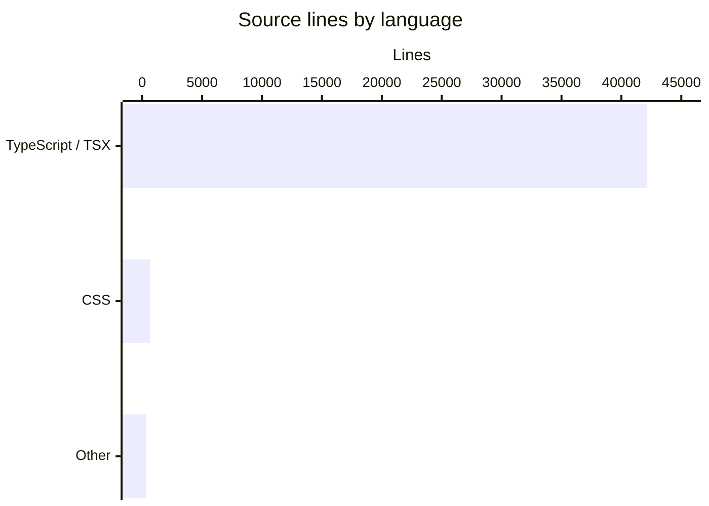

# By the Numbers

Data collected on 2026-05-22.

---

## Size

| Metric                  | Value                         |
| ----------------------- | ----------------------------- |
| TypeScript / TSX lines  | 42,168                        |
| CSS lines               | ~663                          |
| Source files (non-test) | 178                           |
| Test files              | 52                            |
| Workspace packages      | 2 (`apps/web`, `packages/ui`) |

### Language breakdown

The codebase is overwhelmingly TypeScript and TSX. CSS is minimal because Tailwind v4 handles almost all styling declaratively via utility classes; the ~663 CSS lines are concentrated in `packages/ui/src/styles/globals.css` where design tokens and Tailwind configuration live.

---

## Activity

The repository was created in April 2026. As of the data collection date it is roughly **2 months old** with **130 commits** on `main`.

All commits originate from April–May 2026. There are no pre-history imports or squashed mega-commits — the log represents real incremental development from the initial `git init`.

### Most active directories (by file count)

| Directory                                          | Approximate file count |
| -------------------------------------------------- | ---------------------- |
| `apps/web/src/lib/pi/`                             | ~40 files              |
| `packages/ui/src/components/agent-elements/`       | ~40 files              |
| `apps/web/src/routes/`                             | ~20 files              |
| `apps/web/src/lib/` (non-pi)                       | ~15 files              |
| `packages/ui/src/components/` (non-agent-elements) | ~15 files              |

`apps/web/src/lib/pi/` is the most complex subsystem — it owns Pi session management, plan mode, model discovery, server-side event normalization, and the Neon Postgres mirror integration.

---

## Bot-attributed commits

**18 commits** in the log are attributed to `copilot-swe-agent[bot]`, representing roughly **14% of the 130 total commits**.

This is a lower bound on AI-assisted work. Commits where AI suggestions were accepted but committed under a human author are not captured here. The 14% figure reflects only commits where the bot was the recorded Git author.

---

## Complexity

The two directories with the highest file counts are also the ones with the deepest internal cross-references:

- **`apps/web/src/lib/pi/`** — ~40 files covering server-side session lifecycle, plan mode logic, Bedrock model wiring, Neon mirror, and streaming event normalization. Changes in one file frequently require coordinated updates in several others.
- **`packages/ui/src/components/agent-elements/`** — ~40 files comprising the self-contained AI chat UI library: `AgentChat`, `MessageList`, `InputBar`, `ToolRegistry`, `ToolRenderer`, streaming markdown, and 30+ individual tool renderer components.

These two directories together account for roughly half of all source files in the repository.
