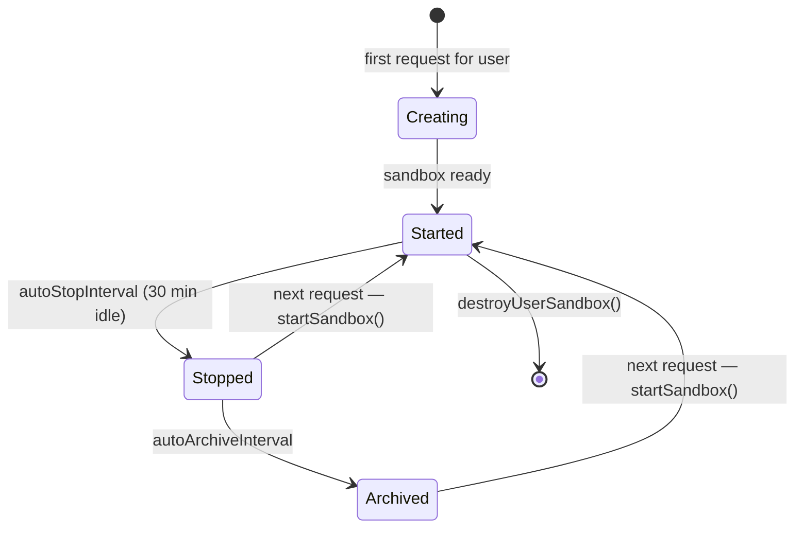

# Daytona sandbox

Fleet Pi can proxy Pi tool calls into an isolated container rather than running them on the host. Each logged-in user gets one sandbox in **their** Daytona account via BYOK (`daytona` provider secret). On Vercel, org `DAYTONA_API_KEY` alone does not enable Daytona.

## What a sandbox provides

A Daytona sandbox is a microVM-backed container managed by the [Daytona](https://daytona.io) platform. For each user:

- Tool calls (bash, file read/write/edit, grep, find, ls) run inside the container via the Fleet adapter (`.pi/extensions/daytona-sandbox`).
- The container mounts a persistent volume at `/home/daytona/agent-workspace` so the agent workspace survives restarts.
- There is **no** full-repo clone and **no** sandbox `.fleet` session volume — Pi sessions stay on the host / Neon.
- On first launch (empty volume), `agent-workspace/` is sparse-seeded from `FLEET_PI_REPOSITORY_URL`.

## Activation

```
# Deployed: user stores Daytona key as provider "daytona" in Settings
DAYTONA_API_KEY      Optional local/dev fallback only
DAYTONA_API_URL      Optional — overrides the default Daytona API endpoint
DAYTONA_TARGET       Optional — Daytona target region/provider
FLEET_PI_REPOSITORY_URL  Optional — HTTPS URL to sparse-seed agent-workspace
DAYTONA_WEBHOOK_SECRET     Required for sandbox event webhooks to take effect
```

`isDaytonaEnabled(userId, resolvedKey)` returns true when `userId` is set and a resolved API key is present. On Vercel, env `DAYTONA_API_KEY` alone is not enough.

## Sandbox lifecycle



`getUserSandbox(config)` is the single entry point. It:

1. Checks an in-memory cache keyed by `userId` and verifies the cached sandbox is still in `started` state.
2. If the cache misses, looks up an existing Daytona sandbox by name (`fleet-pi-user-<userId>`).
3. If a sandbox exists but is `stopped` or `archived`, calls `startSandbox()` to wake it.
4. If no sandbox exists, creates one with volume mount at `/home/daytona/agent-workspace` and optional `fleet-pi-v*` snapshot.
5. Sparse-seeds the volume when `manifest.json` is missing.
6. Stores the result in the in-memory map and returns a `UserSandboxHandle`.

Concurrent requests for the same user are deduplicated via a `userSandboxRequests` Map of in-flight Promises.

## Tool operation proxies

Ops live in `apps/web/src/lib/daytona/sandbox-operations.ts`. The Fleet adapter registers Pi SDK tools with those ops on `session_start` (not `customTools` in `server-runtime`).

| Pi tool | Sandbox implementation                                                          |
| ------- | ------------------------------------------------------------------------------- |
| `read`  | `createSandboxReadOperations` — `downloadFile` + directory listing for `access` |
| `write` | `createSandboxWriteOperations` — `uploadFile`, `executeCommand mkdir -p`        |
| `edit`  | `createSandboxEditOperations` — download + upload cycle                         |
| `bash`  | `createSandboxBashOperations` — `executeCommand` with cwd and timeout           |
| `grep`  | `createSandboxGrepOperations` — directory detection + file download             |
| `find`  | `createSandboxFindOperations` — listing-based `exists` + `find` shell command   |
| `ls`    | `createSandboxLsOperations` — listing-based `stat` and `readdir`                |

Management tools (Agent/Harness only): `daytona_get_status`, `preview_url`.

Stock `npm:@daytona/pi` is for local CLI (`pi --daytona`) and is excluded from the web resource loader.

## Volume mounts

| Mount path                      | Volume name pattern    | When   |
| ------------------------------- | ---------------------- | ------ |
| `/home/daytona/agent-workspace` | `fleet-pi-ws-<userId>` | Always |

Volume paths are validated by `createVolumeMount`.

## Sandbox identity and safety

Sandboxes are labelled at creation time with `managedBy: "fleet-pi"` and `userId: <id>`. When `getUserSandbox` finds an existing sandbox by name it confirms both labels match.

## Webhook

Daytona can POST sandbox lifecycle events to `/api/webhooks/daytona`. See `docs/daytona.md` for the full runbook.
