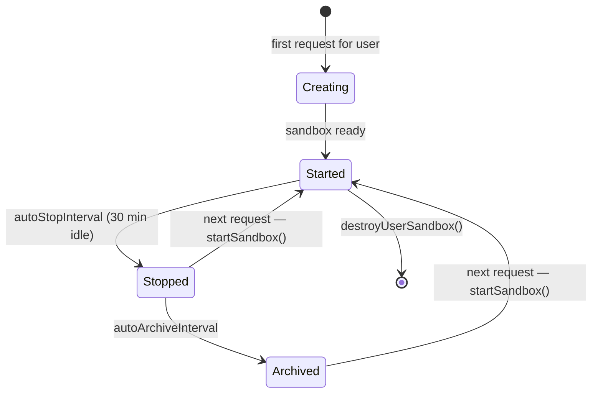

# Daytona sandbox

Fleet Pi can proxy all Pi tool calls into an isolated Debian container rather than running them directly on the host. Each user gets their own container. The feature is opt-in: it activates only when `DAYTONA_API_KEY` is present in the server environment.

## What a sandbox provides

A Daytona sandbox is a microVM-backed Debian 12 container managed by the [Daytona](https://daytona.io) platform. For each user:

- Tool calls (bash, file read/write/edit, grep, find, ls) run inside the container.
- The container mounts a persistent volume at `/home/daytona/fleet-pi/agent-workspace` so the agent workspace survives container restarts.
- An optional second volume at `/home/daytona/fleet-pi/.fleet` persists Pi sessions when `FLEET_PI_PERSIST_SESSIONS=true`.
- On first launch, the repository is cloned from `FLEET_PI_REPOSITORY_URL` (defaults to the public GitHub mirror) into `/home/daytona/fleet-pi`.

## Activation

```
DAYTONA_API_KEY      Required — enables Daytona mode
DAYTONA_API_URL      Optional — overrides the default Daytona API endpoint
DAYTONA_TARGET       Optional — Daytona target region/provider
FLEET_PI_REPOSITORY_URL  Optional — HTTPS URL to clone into new sandboxes
FLEET_PI_PERSIST_SESSIONS  Set to "true" to mount a sessions volume
DAYTONA_WEBHOOK_SECRET     Required for sandbox event webhooks to take effect
```

The helper `isDaytonaEnabled(userId)` in `apps/web/src/lib/daytona/user-sandbox.ts` returns `true` only when both a `userId` and `DAYTONA_API_KEY` are present.

## Sandbox lifecycle



`getUserSandbox(config)` is the single entry point. It:

1. Checks an in-memory cache keyed by `userId` and verifies the cached sandbox is still in `started` state.
2. If the cache misses, looks up an existing Daytona sandbox by name (`fleet-pi-user-<userId>`).
3. If a sandbox exists but is `stopped` or `archived`, calls `startSandbox()` to wake it.
4. If no sandbox exists, calls `createSandbox()` with a `fleet-pi-v*` snapshot if one is available, or falls back to `debian:12.9`.
5. Ensures the repository is checked out inside the container (`ensureRepositoryCheckout`).
6. Stores the result in the in-memory map and returns a `UserSandboxHandle`.

Concurrent requests for the same user are deduplicated via a `userSandboxRequests` Map of in-flight Promises.

**Default lifecycle intervals** (set at creation time):

| Interval              | Default          | Environment variable            |
| --------------------- | ---------------- | ------------------------------- |
| `autoStopInterval`    | 30 min           | hardcoded in `user-sandbox.ts`  |
| `autoArchiveInterval` | platform default | configurable in `SandboxConfig` |
| `autoDeleteInterval`  | platform default | configurable in `SandboxConfig` |

## Snapshots

When creating a sandbox, the code first tries to find a pre-built snapshot whose name starts with `fleet-pi-v` and whose state is `active`. The most recent such snapshot (by `createdAt`) is used. If no snapshot is found the container starts from the base Debian 12 image and installs git on first run.

Snapshot lookup is implemented in `apps/web/src/lib/daytona/snapshot-config.ts`.

## Tool operation proxies

Every Pi tool operation has a sandbox equivalent defined in `apps/web/src/lib/daytona/sandbox-operations.ts`. When a sandbox is active, the chat route passes these sandbox-backed implementations to the Pi agent instead of the default local filesystem implementations.

| Pi tool | Sandbox implementation                                                          |
| ------- | ------------------------------------------------------------------------------- |
| `read`  | `createSandboxReadOperations` — `downloadFile` + directory listing for `access` |
| `write` | `createSandboxWriteOperations` — `uploadFile`, `executeCommand mkdir -p`        |
| `edit`  | `createSandboxEditOperations` — download + upload cycle                         |
| `bash`  | `createSandboxBashOperations` — `executeCommand` with cwd and timeout           |
| `grep`  | `createSandboxGrepOperations` — directory detection + file download             |
| `find`  | `createSandboxFindOperations` — listing-based `exists` + `find` shell command   |
| `ls`    | `createSandboxLsOperations` — listing-based `stat` and `readdir`                |

Each factory function returns a typed operations interface from `@earendil-works/pi-coding-agent`, so Pi itself is unaware it is talking to a remote container.

## Volume mounts

Each sandbox gets one or two persistent volumes:

| Mount path                               | Volume name pattern          | When                             |
| ---------------------------------------- | ---------------------------- | -------------------------------- |
| `/home/daytona/fleet-pi/agent-workspace` | `fleet-pi-ws-<userId>`       | Always                           |
| `/home/daytona/fleet-pi/.fleet`          | `fleet-pi-sessions-<userId>` | `FLEET_PI_PERSIST_SESSIONS=true` |

Volume paths are validated by `createVolumeMount` — it rejects system paths (`/proc`, `/sys`, `/dev`, `/bin`, etc.), paths with traversal sequences, and the root `/` path.

## Sandbox identity and safety

Sandboxes are labelled at creation time with `managedBy: "fleet-pi"` and `userId: <id>`. When `getUserSandbox` finds an existing sandbox by name it calls `isManagedSandboxForUser` to confirm both labels are present and match. If they do not match, the request is rejected with an error rather than reusing an unmanaged container.

## Webhook

Daytona can POST sandbox lifecycle events to `/api/webhooks/daytona`. The handler:

1. Reads the `x-daytona-signature` header and does a constant-time comparison against `DAYTONA_WEBHOOK_SECRET`.
2. If the signature is valid and the event signals `state: "error"` or `event: "sandbox.error"`, it clears the in-memory sandbox cache for that user so the next request creates a fresh container.
3. Returns `{ received: true }` for all payloads (whether acted on or not) to avoid leaking information.

If `DAYTONA_WEBHOOK_SECRET` is not set, side effects are skipped and a warning is logged.

## Key source files

| File                                             | Role                                                                                           |
| ------------------------------------------------ | ---------------------------------------------------------------------------------------------- |
| `apps/web/src/lib/daytona/client.ts`             | Daytona SDK wrapper: create/start/stop/delete sandbox, file upload/download, command execution |
| `apps/web/src/lib/daytona/sandbox-operations.ts` | Pi tool operation bridges (bash, read, write, edit, grep, find, ls)                            |
| `apps/web/src/lib/daytona/user-sandbox.ts`       | Per-user sandbox lifecycle: resolve, cache, release, destroy                                   |
| `apps/web/src/lib/daytona/snapshot-config.ts`    | Finds the latest `fleet-pi-v*` snapshot                                                        |
| `apps/web/src/routes/api/webhooks/daytona.ts`    | Webhook handler for sandbox lifecycle events                                                   |

## Related pages

- [Chat](./chat.md)
- [Chat API](../apps/web/chat-api.md)
