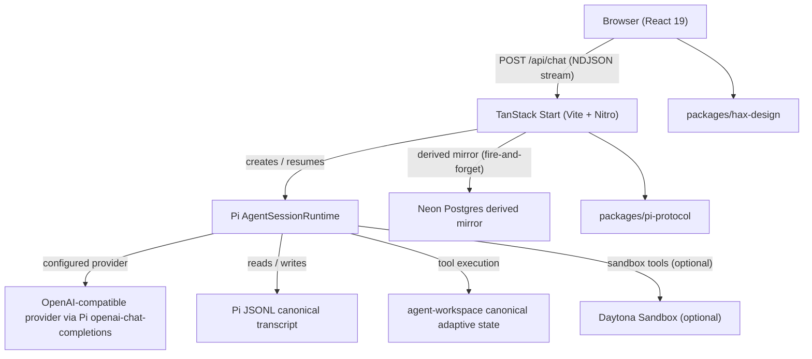
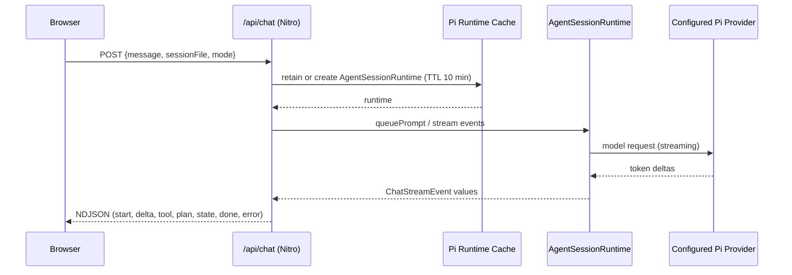

# Architecture

Fleet Pi is a Turborepo monorepo with a single deployable web application and shared UI and protocol packages. The backend runs as a Nitro server embedded in the TanStack Start build; there is no separate backend process.

## High-level components



The canonical adaptive-state boundary (`agent-workspace/`) and the canonical
transcript boundary (Pi JSONL) are independent. Neon is a derived mirror and
owner-scoped recovery source for ephemeral transcript copies; it is not a second
canonical transcript.

## Monorepo packages

| Package                  | Path                    | Description                                                                                                    |
| ------------------------ | ----------------------- | -------------------------------------------------------------------------------------------------------------- |
| `web`                    | `apps/web/`             | TanStack Start full-stack app: routes, server runtime, auth, Daytona, workspace APIs, and chat client hooks.   |
| `@workspace/pi-protocol` | `packages/pi-protocol/` | Browser-safe chat wire types, Zod schemas, model patterns, provider IDs, and OpenUI prompt helpers.            |
| `@workspace/hax-design`  | `packages/hax-design/`  | Shared React component library containing the Fleet Pi shell, agent-elements, primitives, and OpenUI renderer. |

## `apps/web` internal structure

```
apps/web/src/
├── routes/                  File-based page and API routes
│   ├── api/chat/            Chat, session, model, resource, and settings endpoints
│   ├── api/workspace/       Agent-workspace tree and file endpoints
│   └── api/auth/            Better Auth handler
└── lib/
    ├── pi/                  Pi server integration, plan mode, and chat hooks
    ├── auth/                Better Auth server and client setup
    ├── daytona/             Daytona SDK wrapper and sandbox operations
    ├── db/                  Neon schema, mirror, ownership, and provenance
    ├── workspace/           Agent-workspace bootstrap and file access
    ├── pii/                 PII sanitizer for logs
    └── app-runtime.ts       Resolves project root and workspace root
```

UI components live in `packages/hax-design`; routes compose those exports rather
than defining app-local React components.

## Request lifecycle



## Data stores

| Store                         | Purpose                                                           | When active                                |
| ----------------------------- | ----------------------------------------------------------------- | ------------------------------------------ |
| Pi JSONL session files        | Canonical transcript for conversations                            | Always                                     |
| `agent-workspace/` files      | Canonical adaptive state                                          | Always                                     |
| SQLite (`.fleet/auth.sqlite`) | Better Auth user/session tables                                   | When `FLEET_PI_AUTH_DATABASE_URL` is unset |
| Neon Postgres                 | Auth plus derived session mirror, workspace index, and provenance | When `FLEET_PI_CHAT_DATABASE_URL` is set   |
| Daytona                       | Per-user isolated code-execution sandbox workspace                | When Daytona is enabled                    |

## Key dependencies

| Dependency                        | Role                                                      |
| --------------------------------- | --------------------------------------------------------- |
| `@earendil-works/pi-coding-agent` | Pi agent runtime, session management, built-in tools      |
| `@earendil-works/pi-ai`           | Pi model/provider abstraction                             |
| `@workspace/pi-protocol`          | Chat wire types, Zod schemas, provider IDs, OpenUI prompt |
| `@workspace/hax-design`           | Fleet Pi UI shell, agent-elements, and OpenUI renderer    |
| `@tanstack/react-start`           | Full-stack React framework with file-based routing        |
| `better-auth`                     | Authentication and auth sessions                          |
| `@daytonaio/sdk`                  | Daytona sandbox provisioning and operations               |
| `@neondatabase/serverless`        | Neon Postgres client                                      |
| `@openuidev/react-lang`           | OpenUI language support                                   |

Google Gemini and Amazon Bedrock remain supported provider-specific integrations.
The current project configuration defaults to the OpenAI-compatible
`openai-chat-completions` provider with model `deepseek-v4-flash-free`.
