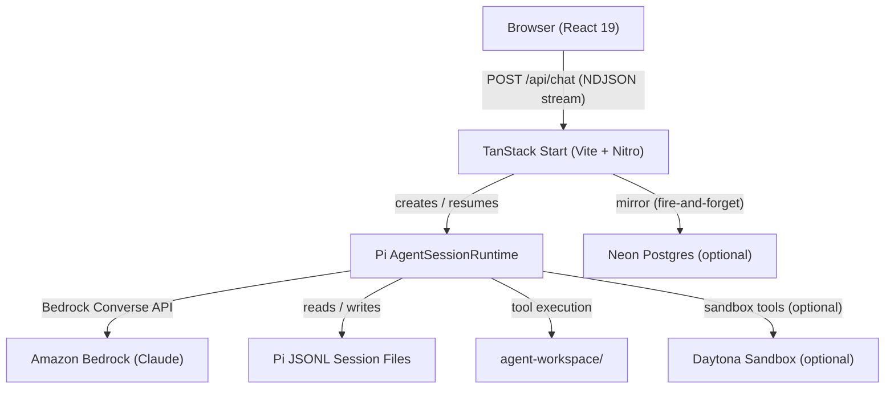
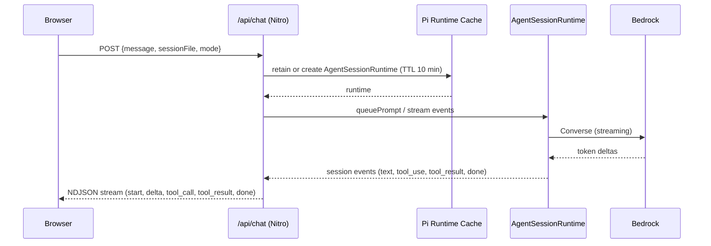

# Architecture

Fleet Pi is a Turborepo monorepo with a single deployable web application and a shared UI library. The backend runs as a Nitro server embedded in the TanStack Start build; there is no separate backend process.

## High-level components



## Monorepo packages

| Package         | Path           | Description                                                                                         |
| --------------- | -------------- | --------------------------------------------------------------------------------------------------- |
| `web`           | `apps/web/`    | TanStack Start full-stack app. Serves the chat UI and all API routes.                               |
| `@workspace/ui` | `packages/ui/` | Shared React component library. Contains `agent-elements`, shadcn primitives, and Tailwind globals. |

## `apps/web` internal structure

```
apps/web/src/
├── routes/
│   ├── __root.tsx          Root layout (theme, query client, auth)
│   ├── index.tsx           Main chat page
│   ├── login.tsx           Login page (Better Auth)
│   └── api/
│       ├── chat.ts         POST — streams Pi response
│       ├── chat/           Supporting chat endpoints (models, sessions, abort, …)
│       ├── auth/           Better Auth wildcard handler
│       ├── sandbox/        Daytona preview proxy
│       └── workspace/      Workspace file tree and file endpoints
├── components/
│   ├── pi/                 Pi-specific panels (resources, workspace, config, tool renderers)
│   ├── openui/             OpenUI inline renderer
│   └── chat-right-panels.tsx  Right-panel orchestrator
└── lib/
    ├── pi/                 Pi server integration, plan mode, chat client hooks
    ├── auth/               Better Auth server + client setup
    ├── daytona/            Daytona SDK wrapper and sandbox operations
    ├── db/                 Neon Postgres schema and session mirror
    ├── workspace/          Agent workspace bootstrap and file access
    ├── pii/                PII sanitizer for logs
    └── app-runtime.ts      Resolves project root and workspace root
```

## Request lifecycle



## Data stores

| Store                         | Purpose                                  | When active                                |
| ----------------------------- | ---------------------------------------- | ------------------------------------------ |
| Pi JSONL session files        | Source of truth for all conversations    | Always                                     |
| SQLite (`.fleet/auth.sqlite`) | Better Auth user/session tables          | When `FLEET_PI_AUTH_DATABASE_URL` is unset |
| Neon Postgres                 | Auth + session mirror + workspace index  | When `FLEET_PI_CHAT_DATABASE_URL` is set   |
| Daytona                       | Per-user isolated code execution sandbox | When `DAYTONA_API_KEY` is set              |

## Key dependencies

| Dependency                        | Role                                                 |
| --------------------------------- | ---------------------------------------------------- |
| `@earendil-works/pi-coding-agent` | Pi agent runtime, session management, built-in tools |
| `@earendil-works/pi-ai`           | LLM provider abstraction (Bedrock)                   |
| `@tanstack/react-start`           | Full-stack React framework with file-based routing   |
| `better-auth`                     | Authentication (email/password, optional OAuth)      |
| `@daytonaio/sdk`                  | Daytona sandbox provisioning and operations          |
| `@neondatabase/serverless`        | Neon Postgres client (auth + session mirror)         |
| `@openuidev/react-lang`           | OpenUI component rendering                           |
