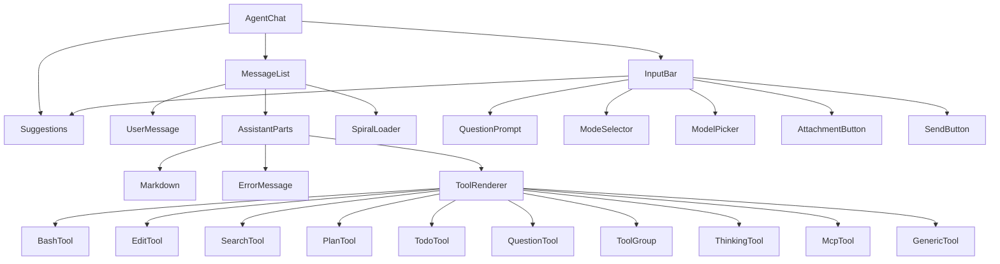

# Agent elements UI kit

`agent-elements` is a self-contained AI chat UI library that lives inside `packages/ui`. It provides every visible piece of the Fleet Pi chat interface: the message list, the input bar, tool call cards, streaming markdown, and question prompts. All components are exported individually so they can be composed freely, but `<AgentChat>` is the standard drop-in that wires them together.

**Contributors:** Zachary BENSALEM

---

## Component tree



---

## `<AgentChat>` — drop-in component

`packages/ui/src/components/agent-elements/agent-chat.tsx`

`AgentChat` is the top-level component. Pass it a list of messages, a status, and an `onSend` callback and it handles layout, empty-state positioning, suggestion pills, and question-tool injection.

```tsx
import { AgentChat } from "@workspace/ui/components/agent-elements/agent-chat"

;<AgentChat
  messages={messages}
  status={status} // "ready" | "submitted" | "streaming" | "error"
  onSend={handleSend}
  onStop={handleStop}
  error={error}
  suggestions={[{ id: "s1", label: "What can you do?" }]}
  questionTool={{
    onAnswer: handleAnswer,
    submitLabel: "Submit",
    allowSkip: true,
  }}
/>
```

**Key props:**

| Prop                   | Type                        | Notes                                         |
| ---------------------- | --------------------------- | --------------------------------------------- |
| `messages`             | `ChatMessage[]`             | Full conversation history                     |
| `status`               | `ChatStatus`                | Controls loading indicators and input locking |
| `onSend`               | `(msg) => void`             | Called when the user submits a message        |
| `onStop`               | `() => void`                | Called when the user hits the stop button     |
| `slots.InputBar`       | component                   | Override the default InputBar                 |
| `slots.ToolRenderer`   | component                   | Override the default ToolRenderer             |
| `toolRenderers`        | `Record<string, Component>` | Per-tool-name custom MCP renderers            |
| `questionTool`         | object                      | Callbacks for `tool-Question` parts           |
| `suppressQuestionTool` | boolean                     | Hide question tool cards (default `false`)    |
| `emptyStatePosition`   | `"default"` \| `"center"`   | Vertically centers the input when no messages |

---

## `<MessageList>`

`packages/ui/src/components/agent-elements/message-list.tsx`

Renders the scrollable message history. Handles:

- **Auto-scroll**: stays pinned to the bottom during streaming, snaps back if the user scrolls up, and re-pins on a new user message.
- **Turn grouping**: groups a user message together with the following assistant messages into a single turn block so copy/timestamp toolbars work correctly.
- **Part rendering**: for each assistant message, iterates the `parts` array — text chunks are batched and fed to `<Markdown>`, tool parts are dispatched to `<ToolRenderer>`, error parts go to `<ErrorMessage>`.
- **"Processing…" indicator**: shows a `<SpiralLoader>` row while the assistant has not yet produced any output.
- **Slots**: `UserMessage`, `ToolRenderer`, and `TextRenderer` can be replaced via the `slots` prop.

---

## `<InputBar>`

`packages/ui/src/components/agent-elements/input-bar.tsx`

The text input area. Supports:

- **Auto-resizing textarea** (up to 120 px, then scrollable)
- **File and image attachments** — thumbnail or chip previews, per-item removal
- **Suggestion pills** — rendered above the input as a popover overlay; slash-command filtering with `/` prefix
- **Question bar** — appears above the textarea when `questionBar` is provided; shows the active question and prev/next navigation for multi-question sets
- **Info bar** — a dismissible notice strip that can appear at the top or bottom of the input area
- **Typing animation** — simulates the assistant typing a prompt into the box
- **`leftActions` / `rightActions`** — arbitrary node slots in the toolbar row (where `ModeSelector` and `ModelPicker` plug in from the app layer)

---

## `<ModeSelector>`

`packages/ui/src/components/agent-elements/input/mode-selector.tsx`

A toolbar button that opens a popover listing configured modes. Fully controlled or uncontrolled. Used in `apps/web` to switch between Agent and Plan modes. Accepts an array of `{ id, label, icon?, description? }` objects.

---

## `<ModelPicker>`

`packages/ui/src/components/agent-elements/input/model-picker.tsx`

A toolbar button that opens a searchable model list popover. Accepts `{ id, name, version? }` model objects. `<ModelBadge>` is a read-only variant for contexts where switching is not allowed.

---

## Tool registry

`packages/ui/src/components/agent-elements/tools/tool-registry.ts`

A plain object (`toolRegistry`) that maps tool type strings to display metadata:

```ts
type ToolMeta = {
  icon: React.ComponentType<{ className?: string }>
  title: (part: any) => string
  subtitle?: (part: any) => string
  variant: "simple" | "collapsible"
}
```

**Registered tool types** (30+ entries):

| Tool type                  | Icon         | Notes                                                   |
| -------------------------- | ------------ | ------------------------------------------------------- |
| `tool-Task` / `tool-Agent` | Sparkles     | Subagent runs; nested tools rendered inside `ToolGroup` |
| `tool-Skill`               | Sparkles     | Skill invocation                                        |
| `tool-Grep`                | Search       | Shows match count                                       |
| `tool-Glob`                | FolderSearch | Shows file count                                        |
| `tool-Read`                | Eye          | Shows filename                                          |
| `tool-Edit`                | FileCode2    | Shows `+N -N` diff stats                                |
| `tool-Write`               | FilePlus     | Shows filename ("Create")                               |
| `tool-Bash`                | Terminal     | Shows normalized command                                |
| `tool-WebFetch`            | Globe        | Shows hostname                                          |
| `tool-WebSearch`           | Search       | Collapsible; shows query                                |
| `tool-TodoWrite`           | ListTodo     | Shows item count                                        |
| `tool-PlanWrite`           | Sparkles     | Shows plan status                                       |
| `tool-ExitPlanMode`        | LogOut       | "Plan complete"                                         |
| `tool-NotebookEdit`        | FileCode2    | Shows filename                                          |
| `tool-BashOutput`          | Terminal     | Shows output or command                                 |
| `tool-KillShell`           | XCircle      | Shows pid                                               |
| `tool-cloning`             | GitBranch    | Shows repo                                              |
| `tool-Thinking`            | Sparkles     | Collapsible; shows thinking text                        |

For MCP tools, `parseMcpToolType` extracts the server name and tool name from the `tool-mcp__<server>__<tool>` pattern and falls back to a title-cased display name.

---

## Tool renderer dispatch

`packages/ui/src/components/agent-elements/tools/tool-renderer.tsx`

`<ToolRenderer>` is the single dispatch point. It receives a `part` object and routes it to the right specialized component:

1. **Switch on `part.type`** for tools with dedicated components (`BashTool`, `EditTool`, `SearchTool`, `PlanTool`, `TodoTool`, `QuestionTool`, `ToolGroup` for task/agent, `ThinkingTool`).
2. **MCP tools**: parsed via `parseMcpToolType`; checks `toolRenderers` for a custom override, otherwise renders `<McpTool>`.
3. **Registry tools**: looks up `toolRegistry[partType]` and renders `<GenericTool>` with the computed title/subtitle.
4. **Fallback**: renders `<GenericTool>` with the raw tool name.

### Specialized tool components

| File                         | Handles                                    |
| ---------------------------- | ------------------------------------------ |
| `tools/bash-tool.tsx`        | Terminal command + output                  |
| `tools/edit-tool.tsx`        | Unified diff view for Write and Edit       |
| `tools/search-tool.tsx`      | Web search, Grep, Glob results             |
| `tools/plan-tool.tsx`        | Plan write / approve flow                  |
| `tools/todo-tool.tsx`        | Todo list display                          |
| `tools/thinking-tool.tsx`    | Collapsible thinking block                 |
| `tools/tool-group.tsx`       | Task/Agent container with nested tool list |
| `tools/mcp-tool.tsx`         | Generic MCP tool card                      |
| `tools/generic-tool.tsx`     | Fallback for registry-based tools          |
| `question/question-tool.tsx` | Inline question card in message list       |

---

## Streaming markdown

`packages/ui/src/components/agent-elements/markdown.tsx`

`<Markdown>` wraps the `Streamdown` component from the `streamdown` package. It is designed for incremental rendering: partial markdown is safe to pass while the assistant is still generating.

Two pre-processing steps run before `Streamdown` receives the text:

- **`fixNumberedListBreaks`** — collapses blank lines inside numbered lists so incremental chunks don't break list rendering.
- **`normalizeCodeFenceLanguages`** — maps language identifiers to those supported by the `@streamdown/code` syntax highlighter (github-light / github-dark themes); unknown languages fall back to `text`.

Custom element renderers are provided for all standard Markdown elements using Tailwind classes prefixed with `an-md-*`.

---

## Question / questionnaire prompts

Two layers handle user questions from the AI:

- **`question/question-tool.tsx`** — renders an inline question card inside the `MessageList` when the assistant emits a `tool-Question` part (visible during streaming).
- **`InputBar` question bar** — the `questionBar` prop on `InputBar` shows the question above the textarea with prev/next navigation for multi-question flows. `AgentChat` injects `onSubmitAnswer` callbacks into `tool-Question` parts before passing messages to `MessageList`.

`question/question-prompt.tsx` contains the shared form logic (free text, single choice, multi-choice, scale) used by both surfaces.

---

## Type hierarchy

`packages/ui/src/components/agent-elements/chat-types.ts`

```
ChatMessage
├── id: string
├── role: "user" | "assistant"
├── parts: ChatMessagePart[]
│   ├── ChatTextPart      { type: "text", text: string }
│   ├── ChatErrorPart     { type: "error", title?, message }
│   └── ChatToolPart      { type: string, toolCallId?, state?, input?, output?, ... }
└── experimental_attachments?: { contentType?, url? }[]

ChatStatus = "ready" | "submitted" | "streaming" | "error"
```

Tool parts follow the convention `type: "tool-<Name>"`. The `state` field drives pending vs. completed display:

- `"input-streaming"` — tool call is still being constructed
- `"output-available"` — call succeeded
- `"output-error"` — call failed

---

## Key source files

| File                                                                     | Purpose                                             |
| ------------------------------------------------------------------------ | --------------------------------------------------- |
| `packages/ui/src/components/agent-elements/agent-chat.tsx`               | Top-level drop-in component                         |
| `packages/ui/src/components/agent-elements/message-list.tsx`             | Scrollable message history                          |
| `packages/ui/src/components/agent-elements/input-bar.tsx`                | Chat input with attachments, questions, suggestions |
| `packages/ui/src/components/agent-elements/chat-types.ts`                | `ChatMessage`, `ChatStatus` type definitions        |
| `packages/ui/src/components/agent-elements/markdown.tsx`                 | Streaming markdown via Streamdown                   |
| `packages/ui/src/components/agent-elements/tools/tool-registry.ts`       | Icon + title metadata for 30+ tool types            |
| `packages/ui/src/components/agent-elements/tools/tool-renderer.tsx`      | Tool dispatch logic                                 |
| `packages/ui/src/components/agent-elements/tools/bash-tool.tsx`          | Bash command + output card                          |
| `packages/ui/src/components/agent-elements/tools/edit-tool.tsx`          | Write / Edit diff card                              |
| `packages/ui/src/components/agent-elements/tools/search-tool.tsx`        | Search / Grep / Glob card                           |
| `packages/ui/src/components/agent-elements/tools/plan-tool.tsx`          | Plan write / approve card                           |
| `packages/ui/src/components/agent-elements/tools/tool-group.tsx`         | Task / Agent container                              |
| `packages/ui/src/components/agent-elements/input/mode-selector.tsx`      | Agent / Plan mode toggle                            |
| `packages/ui/src/components/agent-elements/input/model-picker.tsx`       | Model selection dropdown                            |
| `packages/ui/src/components/agent-elements/question/question-prompt.tsx` | Question form (text, choice, scale)                 |
| `packages/ui/src/components/agent-elements/agent-ui.css`                 | Agent UI CSS layer (design tokens)                  |

---

## Related pages

- [@workspace/ui overview](index.md) — package structure, exports, dependencies
- [Web app](../../apps/web/index.md) — how agent-elements is wired into the TanStack Start app
- [Chat feature](../../features/chat.md) — server-side chat protocol and session management
